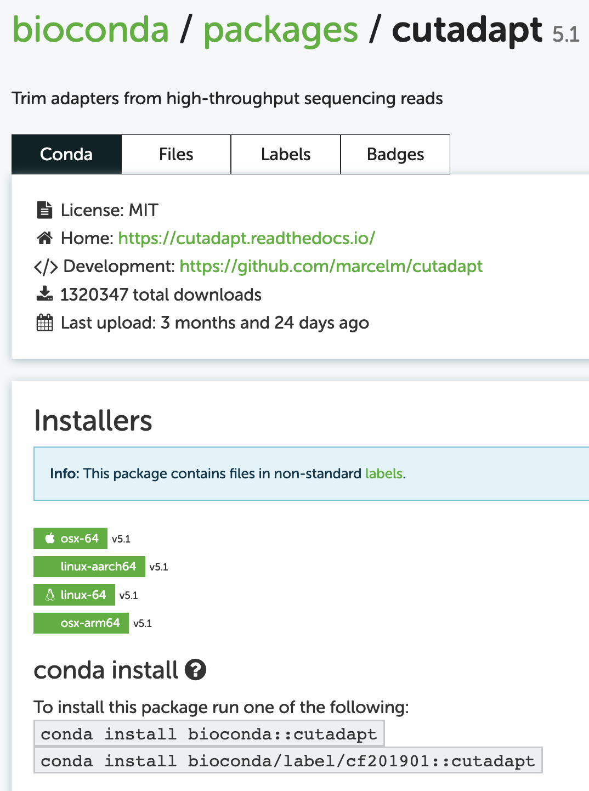

----------------------------------------------------------------------------------------------------

<br>

## Conda basics

Conda can create so-called **environments** in which you can install
one or more software packages.

As you'll learn below, as long as a program is available in one of the online Conda
repositories (and this is nearly always the case for open-source bioinformatics programs),
then installing it:

- Is quite straightforward
- Is very uniform, i.e. done with a procedure that is nearly identical regardless
  of the program you are installing
- Doesn't require adminastrative privileges

Under the hood,
a Conda environment is "merely" a directory that includes the executable (binary)
files for the program or programs in question.
When you activate a Conda environment,
that directory will be added to the collection of locations that the computer
checks when you try to run a program by entering a command (the `$PATH`). 

Like Lmod modules, Conda has a main command (`conda`) and several sub-commands
(`deactivate`, `create`, `install`, `update`).
For example, to activate an environment, you would use `conda activate`.
But before you can do so, you need to create an environment.

## Creating Conda environments and installing software

### Loading the Conda module

Before you can use Conda in any way,
you always need to load OSC's Miniconda module first:
      
```bash
module load miniconda3/24.1.2-py310
```

### One-time Conda configuration

Before you can create our own environments,
you should first do some one-time configuration[^6].
The configuration will set the **Conda "channels"** (basically, software repositories)
you want to use when installing programs.
It will also set the relative priorities among channels,
since one program may be available from multiple channels.

[^6]: That is, these settings will be saved somewhere in your OSC Home directory,
      and you never have to set them again unless you need to make changes.

We can do this configuration with the `config` sub-command ---
run the following in your shell:

```bash
conda config --add channels defaults     # Added first => lowest priority
conda config --add channels bioconda
conda config --add channels conda-forge  # Added last => highest priority
```

Check whether the configuration was successfully saved:

```bash
conda config --get channels
```
``` {.bash-out}
--add channels 'defaults'   # lowest priority
--add channels 'bioconda'
--add channels 'conda-forge'   # highest priority
```

### Example: Creating an environment for TrimGalore

You will create a Conda environment for the program TrimGalore,
which can trim and filter FASTQ files, 
and does not have a system-wide installation at OSC.

Here is the command to all at once create a new Conda environment
and install TrimGalore into that environment:

```bash
# [Don't run this - we'll modify this a bit below]
conda create -y -n trim_galore bioconda::trim-galore
```

Let's break that command down:

- **`create`** is the Conda sub-command to create a new environment.
- When adding **`-y`**, Conda will not ask us for confirmation to install.
- Following the **`-n`** option, you can specify the _name_ you would like the
  environment to have: we used `trim-galore`.
  You can use whatever name you like for the environment,
  but a descriptive yet concise name is a good idea.
  For single-program environments, it makes sense to simply name it after the program.
- With **`bioconda::trim-galore`** we indicate that we want to install the program
  `trim-galore` from the `bioconda` channel.

By default, Conda will install the **latest available version** of a program.
If you create an entirely new environment for a program, like we're doing here,
that default should always apply.
But if you're installing into an environment that already contains other programs,
it's _possible_ that due to compatibility issues, it will install a different version. 

If you want to be explicit about the version you want to install,
add the version number after **`=`** following the package name,
and you may then also want to include that version number in
the Conda environment's name -- try this:

```bash
conda create -y -n trim_galore-0.6.10 bioconda::trim-galore=0.6.10
```
```{.bash-out}
Retrieving notices: ...working... done
Channels:
 - conda-forge
 - bioconda
 - defaults
Platform: linux-64
Collecting package metadata (repodata.json): done
Solving environment: done

## Package Plan ##
# [...truncated...]
```

There should be a lot of output, with many packages that are being downloaded
(these are all "dependencies" of TrimGalore), but if it works, you should see
this before you get your prompt back:

```bash-out-solo
Downloading and Extracting Packages

Preparing transaction: done
Verifying transaction: done
Executing transaction: done                                                                                                                   
#                        
# To activate this environment, use                          
#
#     $ conda activate trim-galore-0.6.10                          
#
# To deactivate an active environment, use
#
#     $ conda deactivate
```

## Creating environments for any available program

### Finding Conda installation info online

Minor variations on the `conda create` command above can be used to install
almost any program for which a Conda package is available,
which is the vast majority of open-source bioinformatics programs!

However, you may wonder how you would know:

- Whether the program is available and what the name of its Conda package is
- Which Conda channel we should use
- Which versions are available

To find this out, a good strategy is to simply Google the program name together with
"conda", e.g. "cutadapt conda" if I wanted to install the Cutadapt program.
Let's see that in action:

{fig-align="center" width="80%" fig-alt="A screenshot of Google searh results for 'conda cutadapt'" .lightbox}

Click on that first link (in my experience, it is always the first Google hit):

{fig-align="center" width="65%" fig-alt="A screenshot of the Conda page for Cutadapt" .lightbox}

### Building the installation command from the online info

When you're "building" you installation command, 
you can take as a template the first of the two example installation we saw above.
In this case, that was: `conda install bioconda::cutadapt`.

You may notice the `install` subcommand, which we didn't see yet.
This command would install Cutadapt into _the currently activated Conda environment_.
Since our strategy here is to create a separate environment for each program,
installing a program into whatever environment is currently active is not a great idea.

You _can_ use the `install` command with a new environment,
but then you would first have to create an "empty" environment,
and _then_ run the install command.
However, we saw above that we can do all of this in a single command.

To build this create-plus-install command, all we need to do is replace `install`
in the example command on the Conda website by `create -y -n <env-name>`.
Then, your full command (without version specification) will be:

```bash
# [Don't run this - example command]
conda create -y -n cutadapt bioconda::cutadapt
```

To see which **version** of the software will be installed by default,
and to see which older versions are available:

{fig-align="center" width="70%" fig-alt="An annotated screenshot of version options on the Conda website" .lightbox}

For almost any other program,
you can use the exact same procedure to find the Conda package and install it!

## Activating Conda environments

As mentioned above, these environments are (de)activated much like with the Lmod system.
But while the term "load" is used for Lmod modules,
the term and command **`activate`** is used for Conda environments ---
it means the same thing.

Now, you should be able to activate the environment
(using just its name -- see the box below):

```bash
conda activate trim_galore-0.6.10
```
```{.bash-out}
(trim_galore-0.6.10) [jelmer@p0085 jelmer]$
```

:::{.callout-tip appearance="simple"}
When you have an active Conda environment,
its name is displayed in front of your prompt, as shown above!
:::

After you have activated the _trimgalore_ environment,
you should be able to use the program.
To test this, simply run the `trim_galore` command with the `--help` option:

```bash
trim_galore --help
```
```{.bash-out}
 USAGE:

trim_galore [options] <filename(s)>

-h/--help               Print this help message and exits.
# [...truncated...]
```

Unlike Lmod / `module load`,
Conda will by default only keep **a single environment active**.
Therefore, when you have environment A active and then activate environment B,
the program(s) in environment A will no longer be available.

::: {.callout-note collapse="true"}
#### The `--stack` option does enable you having multiple Conda environments active _(Click to expand)_

If you want to have multiple Conda environments active at the same time,
you can do so with the `--stack` option:

1. Activate the TrimGalore environment, if it isn't already active:

   ```bash
   conda activate trim_galore-0.6.10
   ```

2. "Stack" a MultiQC environment of mine:

   ```bash
   conda activate --stack /fs/ess/PAS0471/jelmer/conda/multiqc
   ```

3. Check that you can use both programs --- output not shown,
   but both should successfully print help info:

   ```bash
   multiqc --help
  
   trim_galore --help
   ```
:::

## Managing your Conda environments

### Practical environment management

You may have noticed that above,
we merely gave the environment we created a _name_
(`trim_galore` or `trim_galore-0.6.10`),
and did not tell Conda _where_ to put this environment.
Similarly, we were able to activate the environment with just its name.
Conda assigns a **personal default directory for its environments**,
typically `~/.conda` or `~/miniconda`.

To use a different location for individual environments,
you can use the `-p` (instead of `-n`) option -- for example:
  
```bash
# [Don't run this]
conda create -y -p /fs/scratch/PAS2880/$USER/conda/trim-galore bioconda::trim-galore
```

When you do this, you will in most cases have to use `-p <path>` also when you
_activate_ the environment.

::: {.callout-tip appearance="simple"}  
When you want to load someone else's Conda environments
(this is possible as long as you have read-access to that dir!),
you'll always have to specify the full path to environment's dir.
:::

::: {.callout-tip appearance="simple"} 
If you want to change the default location for your Conda environments,
see [this page](https://docs.conda.io/projects/conda/en/stable/user-guide/configuration/use-condarc.html).
:::

To see which Conda environments you have, run `conda env list`:

```bash
conda env list
```
```bash-out
trim_galore-0.6.10       /users/PAS0471/jelmer/.conda/envs/trim_galore-0.6.10
```

To remove a Conda environment, use `conda env remove`:

```bash
conda env remove -n trim_galore-0.6.10
```
  
::: {.callout-note collapse="true"}
#### More Conda commands to manage your environments _(Click to expand)_

- List all packages (programs) installed in an environment ---
  due to dependencies, this can be a long list,
  even if you only actively installed one program:

  ```bash
  conda list -p /fs/ess/PAS0471/jelmer/conda/multiqc
  ```
  
- Export a plain-text "YAML" file that contains the instructions to recreate
  your currently-active environment (useful for reproducibility!)  

  ```bash
  conda env export > my_env.yml
  ```

  And you can use the following to create a Conda environment from such a YAML file:

  ```bash
  conda env create -n my_env --force --file my_env.yml
  ```
:::

### One environment for each ...?

There are two reasonable ways to organize your Conda environments:

- **Have one environment for each program**
  - Easier to keep an overview of what you have installed
  - No need to reinstall the same program across different projects
  - Less risk of running into problems with your environment due to mutually
    incompatible software and complicated dependency situations

- **Have one environment for each research project**
  - You just need to activate that one environment when you're working on
    your project.
  - Easier when you need to share your entire project with someone else
    (or yourself) on a different (super)computer.

Even though it might seem easier, a third alternative,
to simply install all programs across all projects in one single environment,
is _not_ recommended. This doesn't benefit reproducibility,
and your environment is likely to stop functioning properly sooner or later.
