--------------------------------------------------------------------------------

<br>

## Introduction

This page contains optional self-study material if you want to dig deeper into Git.
Some of it may also be useful as a reference in case you run into problems while
trying to use Git.

- Collaboration with Git: multi-user remote workflows
- Contributing to repositories: Forking & Pull Requests
- Undoing (& viewing) changes that have been committed
- Branching & merging
- Miscellaneous Git

## Collaboration with Git: multi-user remote workflows

In a multi-user workflow, your collaborator can make changes to the repository
(committing to local, then pushing to remote),
and you need to make sure that you stay up-to-date with these changes.

Synchronization between your and your collaborator's repository happens via the remote,
so now you will need a way to _download_ changes from the remote that your collaborator made.
This happens with the **`git pull`** command.

::: columns
::: {.column width="48%"}
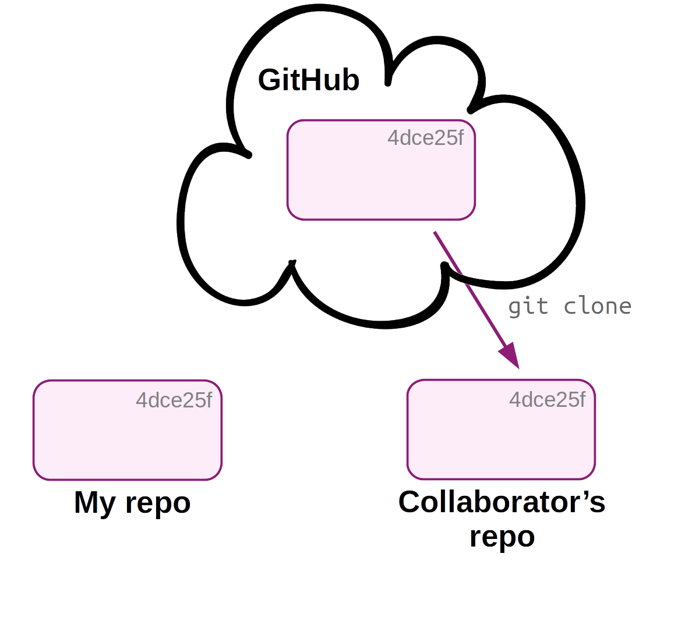{fig-align="center" width="100%" fig-alt="A diagram showing a multi-user Git and Github workflow in 4 steps: step 1" .lightbox}
:::
::: {.column width="4%"}
:::
::: {.column width="48%"}
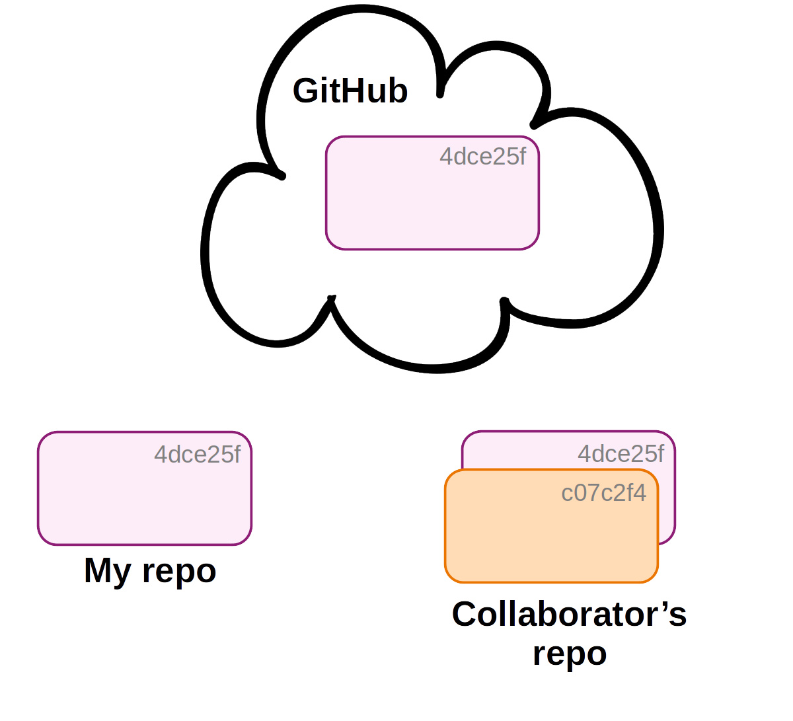{fig-align="center" width="100%" fig-alt="A diagram showing a multi-user Git and Github workflow in 4 steps: step 2" .lightbox}
:::
:::

------

::: columns
::: {.column width="48%"}
{fig-align="center" width="100%" fig-alt="A diagram showing a multi-user Git and Github workflow in 4 steps: step 3" .lightbox}
:::
::: {.column width="4%"}
:::
::: {.column width="48%"}
{fig-align="center" width="100%" fig-alt="A diagram showing a multi-user Git and Github workflow in 4 steps: step 4" .lightbox}
:::
:::

In a multi-user workflow,
changes made by different users are **shared via the online copy of the repo**.
But syncing is not automatic:

- Changes to your local repo remain local-only until you **push** to remote.
- Someone else's changes to the remote repo do not make it into your
  local repo until you **pull** from remote.

However, when your collaborator has made changes, Git _will_ tell you about "divergence"
between your local repository and the remote when you run `git status`:

```bash
# (Don't run this)
git status
```
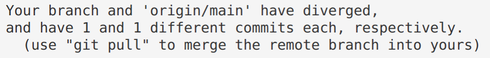{fig-align="left" width="60%"}

In a multi-user workflow, you should use use `git pull` often,
since staying up-to-date with your collaborator's changes will reduce the chances of
*[merge conflicts](#merge-conflicts)*.

### Add a collaborator in GitHub

You can add a collaborator to a repository on GitHub as follows:

1. Go to the repository's settings:

{fig-align="center" width="30%" fig-alt="A screenshot of the repository Settings button on GitHub." .lightbox}

2. Find and click `Manage access`:

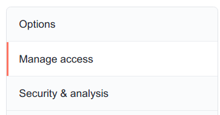{fig-align="center" width="30%" fig-alt="A screenshot of the 'Manage access' button in the GitHub repository settings." .lightbox}

3. Click `Invite a collaborator`:

{fig-align="center" width="30%" fig-alt="A screenshot of the 'Invite a collaborator' button on GitHub repository setttings." .lightbox}

### Merge conflicts

A so-called **merge conflict** means that Git is not able to automatically merge
two branches, which occurs when all three of the following conditions are met:

- You try to merge two branches
  (including when pulling from remote: a pull includes a merge)
- One or more file changes have been committed on **_both_** of these
  branches since their divergence.
- Some of these changes were made in the same part(s) of file(s).

When this occurs, Git has no way of knowing which changes to keep,
and it will report a merge conflict as follows:

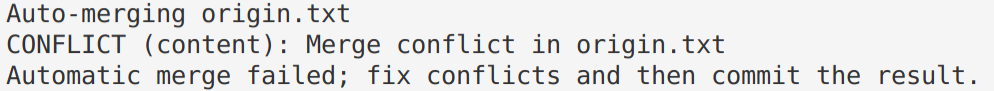{fig-align="center" width="70%" fig-alt="A screenshot of Git repoting a Merge Conflict." .lightbox}

#### Resolving a merge conflict

When Git reports a merge conflict, follow these steps:

1. Use **`git status`** to find the conflicting file(s).

{fig-align="center" width="70%" fig-alt="A screenshot showing how you can see which file contains a Conflict." .lightbox}

2. **Open and edit those file(s) manually** to a version that fixes the conflict (!).
   
   Note below that Git will have changed these file(s) to add the conflicting lines from both versions
   of the file, and to add marks that indicate which lines conflict.
   
   You have to manually change the contents in your text editor to keep the
   conflicting content that you want, and to remove the indicator marks that Git made.

   ```bash-out-solo
   On the Origin of Species       # Line preceding conflicting line
   <<<<<<< HEAD                   # GIT MARK 1: Next line = current branch
   Line 2 - from main             # Conflict line: current branch
   =======                        # GIT MARK 2: Dividing line
   Line 2 - from conflict-branch  # Conflict line: incoming branch
   >>>>>>> conflict-branch        # GIT MARK 3: Prev line = incoming branch
  ```

3. Use `git add` to tell Git you've resolved the conflict in a particular file:
  
   ```sh
   git add origin.txt
   ```

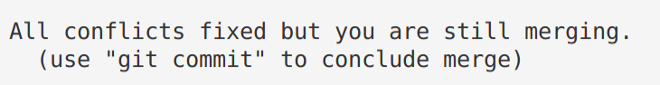{fig-align="center" width="50%" fig-alt="A screenshot showing Git output when the conflicts have been fixed." .lightbox}

4. Once all conflicts are resolved, use `git status` to check that all changes
   have been staged.
   Then, use `git commit` to finish the merge commit:

   ```sh
   git commit -m "Solved the merge conflict"
   ```

::: callout-tip
#### VS Code functionality for resolving Merge Conflicts

VS Code has some nice functionality to make Step 2 (resolving the conflict) easier:

```sh
code <conflicting-file>  # Open the file in VS Code
```

{fig-align="center" width="70%" fig-alt="A screenshot of how VS Code shows conflicting lines in a file causing a Merge Conflict." .lightbox}

If you click on "*Accept Current Change*" or "*Accept Incoming Change*", etc.,
it will keep the desired lines and remove the Git indicator marks.
Then, save and exit.
:::

## Contributing to repositories: Forking & Pull Requests

### What can you do with someone else's GitHub repository?

In some cases, you may be interested in working in some way with someone else's
repository that you found on GitHub.
If you do not have rights to push, you can:
  
- **Clone** the repo and make changes locally. When you do this,
  you can also periodically pull to remain up-to-date with changes in the original repo. 
- **Fork** the repository on GitHub and develop it independently.
  Forking creates *a new personal GitHub repo*, to which you can push.
- Using a forked repo, you can also submit a **Pull Request** with proposed
  changes to the original repo:
  for example, if you've fixed a bug in someone else's program.

If you're actually collaborating on a project, though,
you should ask your collaborator to give you admin rights for the repo,
which makes things a lot easier than working via Pull Requests.

::: callout-tip
#### Forking, Pull Requests, and Issues are GitHub functionality, and not part of Git.
:::

#### Forking a GitHub repository

You can follow along by e.g. forking [my `originspecies` repo](https://github.com/jelmerp/originspecies).

- Go to a GitHub repository, and click the "**_Fork_**" button in the top-right:

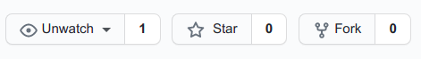{fig-align="center" width="50%" fig-alt="A screenshot of the 'Fork' button on GitHub." .lightbox}

- You may be asked which account to fork to: select your account.
- Now, you have your own version of the repository, and it is labeled explicitly as a fork:

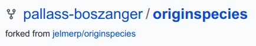{fig-align="center" width="50%" fig-alt="A screenshot of GitHub showing that your repo is a fork." .lightbox}

#### Forking workflow

You can't directly modify the *original repository*, but you can:

- First, **modify your fork** (with local edits and pushing).
- Then, **submit a so-called Pull Request** to the owner of the original repo
  to pull in your changes.
- Also, you can also easily **keep your fork up-to-date** with changes to the
  original repository.

](../img/fork-triangle-happy.png){fig-align="center" width="70%" fig-alt="A diagram of the fork-and-pull request workflow." .lightbox}

#### Editing the forked repository

To clone your forked GitHub repository to a dir at OSC,
start by creating a dir there --- for example:

```bash
mkdir /fs/ess/PAS2880/users/$USER/week03/fork_test
cd /fs/ess/PAS2880/users/$USER/week03/fork_test
```

Then, find the URL for your forked GitHub repository by clicking the green `Code` button.
Make sure you get the SSH URL (rather than the HTTPS URL),
and click the clipboard button next to the URL to copy it:

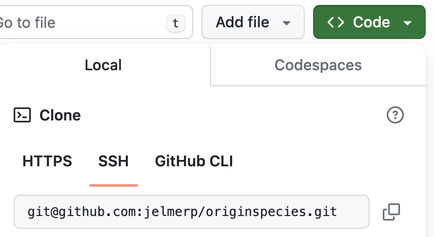{fig-align="center" width="50%" fig-alt="A screenshot showing where to find the SSH URL to a repository." .lightbox}

Then, type `git clone` and a space, and paste the URL, e.g.:

```sh
git clone git@github.com:jelmerp/originspecies.git
```
```bash-out
Cloning into 'originspecies'...
remote: Enumerating objects: 31, done.
remote: Counting objects: 100% (31/31), done.
remote: Compressing objects: 100% (19/19), done.
remote: Total 31 (delta 4), reused 30 (delta 3), pack-reused 0
Receiving objects: 100% (31/31), done.
Resolving deltas: 100% (4/4), done.
```

Now, you can make changes to the repository in the familiar way, for example:

```sh
echo "# Chapter 1. Variation under domestication" > origin.txt
git add origin.txt
git commit -m "Suggested title for first chapter."
```

And note that you can push without any setup ---
because you cloned the repository, the remote setup is already done
(and you have permission to push because its your own repo on GitHub and you
have set up GitHub authentication):

```bash
git push
```

#### Creating a Pull Request

If you then go back to GitHub, you'll see that your forked repo is "*x commit(s) ahead*"
of the original repo:

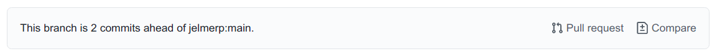{fig-align="center" width="90%" fig-alt="A screenshot of GitHub indicating that a forked repo is ahead of the original repo." .lightbox}

Click `Pull request`, and check whether the right repositories and branches
are being compared
(and here you can also see the changes that were made in the commits):

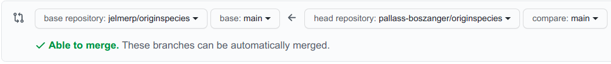{fig-align="center" width="90%" fig-alt="A screenshot of GitHub indicating that two repos can be merged." .lightbox}

If it looks good, click the green `Create Pull Request` button:

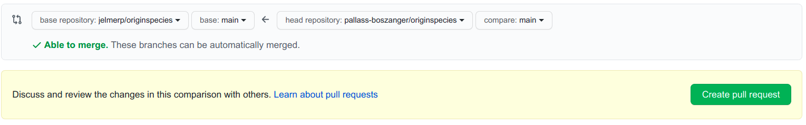{fig-align="center" width="90%" fig-alt="A screenshot of the 'Create pull request' button on GitHub." .lightbox}

Give your Pull Request a title, and write a brief description of your changes:

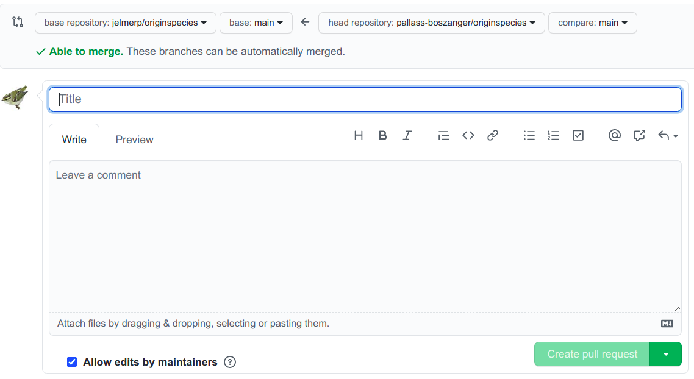{fig-align="center" width="85%" fig-alt="A screenshot of the 'Pull  Request' dialogue box." .lightbox}

#### Keeping your fork up-to-date

As you saw, you can't directly *push* to original repo but instead have to submit
a Pull Request (yes, this terminology is confusing!).
  
But, you *can* create an ongoing connection to the original repo,
which you can use to periodically *pull* to keep your fork up-to-date.
This works similarly to connecting your own GitHub repo,
but you should give the remote a different nickname than `origin` --- the convention
is `upstream`:
  
```bash
# Add the "upstream" connection
git remote add upstream git@github.com:jelmerp/originspecies.git

# List the remotes:
git remote -v
```
```bash-out
origin   git@github.com:pallass-boszanger/originspecies.git  (fetch)
origin   git@github.com:pallass-boszanger/originspecies.git  (push)
upstream   git@github.com:jelmerp/originspecies.git  (fetch)
upstream   git@github.com:jelmerp/originspecies.git  (push)
```

```bash
# Pull from the upstream repository:
git pull upstream main
```

::: {.callout-tip appearance="simple"}
"*Upstream*" is an arbitrary but convential name --
compare with this "origin" which is used for your *own* version of the online repo. 
:::

## Undoing (& viewing) changes that have been committed

Whereas in [the first Git session](../week04/w4a_git.qmd),
we learned about undoing changes that have _not_ been committed,
here you'll see how you can undo changes that have been committed.
We'll start with some concepts that are helpful in this context. 

### The three trees of Git

These three states correspond to the three "trees" of Git:

- **HEAD**: State of the project in the most recent commit (on the current branch).
- **Index** (*Stage*): State of the project ready to be committed.
- **Working directory** (_Working Tree_): State of the project as currently on your computer.

<hr style="height:1pt; visibility:hidden;" />

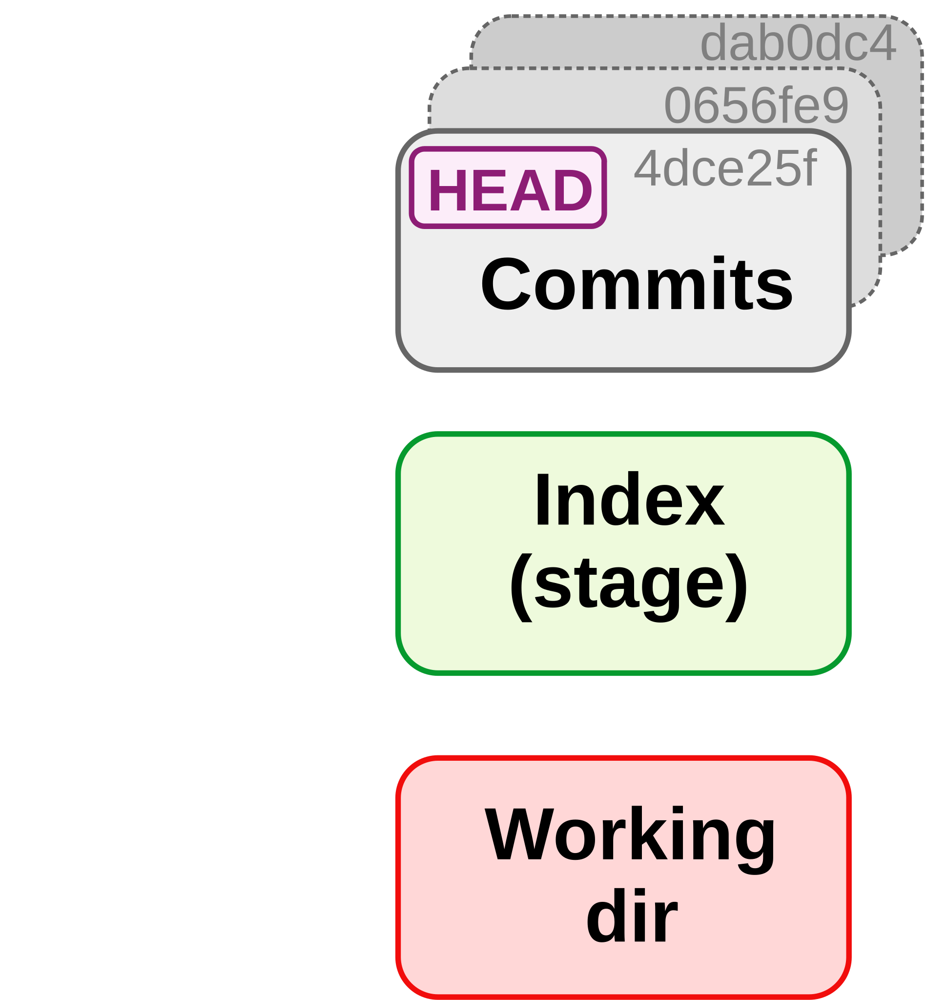{fig-align="center" width="40%" fig-alt="A diagram illustrating the concept of the three trees of Git." .lightbox}

<hr style="height:1pt; visibility:hidden;" />

Or consider this table for a hypothetical example in which HEAD, the Index,
and the working dir all differ with regards to the the version of file 1,
and there also is an untracked file in the working dir:

| File state    | Version         | Which tree  |
|---------------|-----------------|-------------|
| **Committed** | file 1 version X                     | HEAD        |
| **Staged**    | [**file 1 version Y**]{style="color:green"} | Index (stage)       |
| **Modified**  | [**file 1 version Z**]{style="color:red"}   | Working dir |
| **Untracked** | [**file 2 version X**]{style="color:red"}   | Working dir |

: {.striped .hover}

### Ways to refer to past commits

To refer to specific past commits, you can:

- Using the hexadecimal checksum (either the full ID or the 7-character abbreviation)
- Use ***HEAD*** notation: HEAD is the most recent commit,
  and there are two ways of indicating ancestors of HEAD:

<hr style="height:1pt; visibility:hidden;" />

{fig-align="center" width="70%" fig-alt="A diagram showing how to refer to past commits." .lightbox}

For example, using `git diff` to compare your repo or individual files between
any two arbitrary commits:

```bash
# Last commit vs second-to-last commit - full repo:
git diff HEAD HEAD^

# Last commit vs a specified commit - specific file: 
git diff HEAD d715c54 todo.txt 
```
  
### Viewing past versions of the repository

Before undoing committed changes, you may want to look at earlier states of your repo,
e.g. to know what to revert to:

- First, print an overview of past commits and their messages:

  ```sh
  # (NOTE: example code in this and the next few boxes - don't run as-is)
  git log --oneline
  ```

- Find a commit you want to go back to, and look around in the past:

  ```sh
  git checkout <sha-id> # Replace <sha-id> by an actual hash
  
  less myfile.txt       # Etc. ...
  ```

- Then, you can go back to where you were originally as follows:

  ```sh
  git checkout main
  ```

The next section will talk about strategies to move your repo back to an earlier
state that you found this way.

::: callout-tip
#### Just need to retrieve an older version of a single file?
If you just want to retrieve/restore an older version of a **single file**
that you found while browsing around in the past, then a quick way can be:
simply copy the file to a location outside of your repo, move yourself back to the "present",
and move the file back into your repo, now in the present.
:::

{fig-align="center" width="90%" fig-alt="An diagram visualizing the `git checkout` command." .lightbox}

::: callout-warning
### The multiple uses of `git checkout`
Note the confusing re-use of `git checkout`! We have now seen `git checkout` being used to:

- Move between branches
- Move to previous commits to explore (**figure below**)
:::

### Undoing entire commits

To undo commits, i.e. move the state of your repository back to how it was
before the commit you want to undo, there are two main commands:
  
- `git revert`: Undo the changes made by commits by reverting them in a new commit.
- `git reset`: Delete commits as if they were never made.

#### Undoing commits with `git revert`

A couple of examples of creating a new commit that will revert all changes made in the specified commit:
  
```sh
# Undo changes by the most recent commit:
git revert HEAD
  
# Undo changes by the second-to-last commit:
git revert HEAD^

# Undo changes by a commit identified by its checksum:
git revert e1c5739
```

#### Undoing commits with `git reset`

`git reset` is quite complicated as it has three modes
(`--hard`, `--mixed` (default), and `--soft`)
*and* can act either on individual files and on entire commits.
**To undo a commit, and:**

- Stage all changes made by that commit:

  ```sh
  # Resetting to the 2nd-to-last commit (HEAD^) => undoing the last commit
  git reset --soft HEAD^
  ```

- Put all changes made by that commit as uncomitted working-dir changes:

  ```sh
  # Note that '--mixed' is the default, so you could omit that
  git reset --mixed HEAD^
  ```

- Completely **discard** all changes made by that commit:

  ```sh
  git reset --hard HEAD^ 
  ```

::: callout-warning
### `git reset` erases history
Undoing with `git revert` is much safer than with `git reset`,
because `git revert` does not erase any history.

For this reason, some argue you should not use `git reset` on commits altogether.
At any rate, you should **never** use `git reset` for commits that have already 
been pushed online.
:::

### Viewing & reverting to earlier versions of files

Above, you learned to undo at a project/commit-wide level.
But you can also undo things for specific files:

1. Get a specific version of a file from a past commit:

   ```sh
   # Retrieve the version of README.md from the second-to-last commit
   git checkout HEAD^^ -- README.md
   ```
  
   ```bash
   # Or: Retrieve the version of README.md from a commit IDed by the checksum
   git checkout e1c5739 -- README.md
   ```
  
2. Now, your have the old version in the working dir & staged, which you can
   optionally check with:

   ```sh
   # Optional: check the file at the earlier state
   cat README.md
   git status
   ```

3. You can go on to commit this version from the past,
   or go back to the current version, as we will do below:

   ```sh
   git checkout HEAD -- README.md
   ```

::: callout-warning
#### Be careful with `git checkout`
Be careful with `git checkout`: any uncommitted changes to this file
would be overwritten by the past version you retrieve!
:::

An **alternative method** to view and revert to older versions of specific files
is to use `git show`.

- View a file from any commit as follows:

  ```bash
  # Retrieve the version of README.md from the last commit
  git show HEAD:README.md
  ```
  
  ```bash
  # Or: Retrieve the version of README.md from a commit IDed by the checksum
  git show ad4ca74:README.md
  ```

- Revert a file to a previous version:
  
  ```sh
  git show ad4ca74:README.md > README.md
  ```

## Branching & merging

In this section, you'll learn about using so-called "branches" in Git.
Branches are basically parallel versions of your repository,
which allow you or your collaborators to experiment or create variants without
affecting existing functionality or others' work.

### A repo with a couple of commits

First, you'll create a dummy repo with a few commits by running a script:
  
```sh
cd /fs/ess/PAS2880/users/$USER
git clone https://github.com/CSB-book/CSB.git
cd CSB/git/sandbox
```

Take a look at the script you will run to create your repo:

```bash
cat ../data/create_repository.sh
```
```bash-out
#!/bin/bash

# function of the script:
# sets up a repository and
# immitates workflow of
# creating and commiting two text files

mkdir branching_example
cd branching_example
git init
echo "Some great code here" > code.txt
git add .
git commit -m "Code ready"
echo "If everything would be that easy!" > manuscript.txt 
git add .
git commit -m "Drafted paper"
```

Run the script:

```bash
bash ../data/create_repository.sh
```
```bash-out
Initialized empty Git repository in /fs/ess/PAS2880/users/jelmer/CSB/git/sandbox/branching_example/.git/
[main (root-commit) 3c59d8a] Code ready
 1 file changed, 1 insertion(+)
 create mode 100644 code.txt
[main 7ba8ca4] Drafted paper
 1 file changed, 1 insertion(+)
 create mode 100644 manuscript.txt
```

And move into the repository's dir:

```bash
cd branching_example
```

Let's see what has been done in this repo:
  
```sh
git log --oneline
```
```bash-out
7ba8ca4 (HEAD -> main) Drafted paper
3c59d8a Code ready
```
We will later modify the file `code.txt` --- let's see what it contains now:  
  
```sh
cat code.txt
```
```bash-out
Some great code here
```

### Using branches in Git

You now want to improve the code, but these changes are *experimental,*
and you want to retain your previous version that you know works.
This is where ***branching*** comes in.
With a new branch, you can make changes that don't affect the `main` branch,
and can also keep working on the `main` branch:

{fig-align="center" width="75%" fig-alt="A diagram showing how Git branches work." .lightbox}

#### Creating a new branch

First, create a new branch as follows, naming it `fastercode`:
  
```sh
git branch fastercode
```

List the branches:

```sh
# Without args, git branch will list the branches
git branch
```
```bash-out
  fastercode
* main
```

It turns out that you created a new branch *but are still on the main branch*,
as the **`*`** indicates.

You can **switch branches** with `git checkout`:
  
```sh
git checkout fastercode
```
```bash-out
Switched to branch 'fastercode'
```

And confirm your switch with `git branch`:

```bash
git branch
```
```bash-out
* fastercode
  main
```

Note that you can also tell from the `git status` output on which branch you are:

```bash
git status
```
```bash-out
On branch fastercode
nothing to commit, working tree clean
```

#### Making experimental changes on the new branch

You edit the code, stage and commit the changes:
  
```sh
echo "Yeah, faster code" >> code.txt
cat code.txt
```
```bash-out
Some great code here
Yeah, faster code
```

```bash
git add code.txt
git commit -m "Managed to make code faster"
```
```bash-out
[fastercode 21f1828] Managed to make code faster
 1 file changed, 1 insertion(+)
```

Let's check the log again, which tells you that the last commit was made on the
`fastercode` branch:
  
```sh
git log --oneline
```
```bash-out
21f1828 (HEAD -> fastercode) Managed to make code faster
7ba8ca4 (main) Drafted paper
3c59d8a Code ready
```

#### Moving back to the `main` branch

You need to switch gears and add references to the paper draft.
Since this has nothing to do with your attempt at faster code,
you should make these changes **back on the `main` branch**:
  
```sh
# Move back to the 'main' branch
git checkout main
```
```bash-out
Switched to branch 'main'
```

What does `code.txt`, which we edited on `fastercode`, now look like?
  
```sh
cat code.txt
```
```bash-out
Some great code here
```

So, by switching between branches, your working dir contents has changed!

Now, while still on the `main` branch, add the reference, stage and commit:

```sh
echo "Marra et al. 2014" > references.txt
git add references.txt
git commit -m "Fixed the references"
```
```bash-out
[main 1bf123f] Fixed the references
 1 file changed, 1 insertion(+)
 create mode 100644 references.txt
```

Now that you've made changes to both branches,
let's see the log in "graph" format with `--graph`,
also listing all branches with `--all`
--- note how it tries to depict these branches:
  
```sh
git log --oneline --graph --all
```
```bash-out
* 1bf123f (HEAD -> main) Fixed the references
| * 21f1828 (fastercode) Managed to make code faster
|/  
* 7ba8ca4 Drafted paper
* 3c59d8a Code ready
```

#### Finishing up on the experimental branch

Earlier, you finished speeding up the code in the `fastercode` branch,
but you still need to document your changes. So, you go back:
  
```sh
git checkout fastercode
```
```bash-out
Switched to branch 'fastercode'
```

Do you still have the `references.txt` file from the `main` branch?
  
```sh
ls
```
```bash-out
code.txt  manuscript.txt
```
 
Nope, your working dir has changed again.

Then, add the "documentation" to the code, and stage and commit:

```sh
echo "# My documentation" >> code.txt
git add code.txt
git commit -m "Added comments to the code"
```
```bash-out
[fastercode d09f611] Added comments to the code
 1 file changed, 1 insertion(+)
```

Check the log graph:  

```sh
git log --oneline --all --graph
```
```bash-out
* d09f611 (HEAD -> fastercode) Added comments to the code
* 21f1828 Managed to make code faster
| * 1bf123f (main) Fixed the references
|/  
* 7ba8ca4 Drafted paper
* 3c59d8a Code ready
```

#### Merging the branches

You're happy with the changes to the code, and want to make the `fastercode`
version *the default version of the code*.
This means you should merge the `fastercode` branch back into `main`.
To do so, you first have to move back to `main`:
  
```sh
git checkout main
```
```bash-out
Switched to branch 'main'
```

Now you are ready to merge with the `git merge` command.
You'll also have to provide a commit message,
*because a merge is always accompanied by a commit*:
  
```sh
git merge fastercode -m "Much faster version of code"
```
```bash-out
Merge made by the 'ort' strategy.
 code.txt | 2 ++
 1 file changed, 2 insertions(+)
```

Once again, check the log graph, which depicts the branches coming back together:

```sh
git log --oneline --all --graph
```
```bash-out
*   5bb84cd (HEAD -> main) Much faster version of code
|\  
| * d09f611 (fastercode) Added comments to the code
| * 21f1828 Managed to make code faster
* | 1bf123f Fixed the references
|/  
* 7ba8ca4 Drafted paper
* 3c59d8a Code ready
```

#### Cleaning up

You no longer need the `fastercode` branch, so you can delete it as follows:

```sh
git branch -d fastercode
```
```bash-out
Deleted branch fastercode (was d09f611).
```

### Branching and merging -- Workflow summary

{fig-align="center" width="90%" fig-alt="A diagram with a summary of the Git branching and merging workflow." .lightbox}

#### Overview of commands used in the branching workflow 

```sh
# (NOTE: Don't run this)

# Create a new branch:
git branch mybranch

# Move to new branch:
git checkout mybranch

# Add and commit changes:
git add --all
git commit -m "my message"

# Done with branch - move back to main trunk and merge
git checkout main
git merge mybranch -m "Message for merge"

# And [optionally] delete the branch:
git -d mybranch
```

::: exercise
####  Exercise (CSB Intermezzo 2.2)

- **(a)** Move to the directory `CSB/git/sandbox`.

<details><summary>Solution</summary>
```sh
cd /fs/ess/PAS2880/users/$USER/CSB/git/sandbox
```
</details>

- **(b)** Create a directory `thesis` and turn it into a Git repository.

<details><summary>Solution</summary>
```sh
mkdir thesis
cd thesis
git init
```
</details>

- **(c)** Create the file `introduction.txt` with the line *"Best introduction ever."*

<details><summary>Solution</summary>
```sh
echo "The best introduction ever" > introduction.txt
```
</details>

- **(d)** Stage `introduction.txt` and commit with the message *"Started introduction."*

<details><summary>Solution</summary>
```sh
git add introduction.txt
git commit -m "Started introduction"
```
</details>

----

- **(e)** Create the branch `newintro` and change into it.

<details><summary>Solution</summary>
```sh
git branch newintro
git checkout newintro
```
</details>

- **(f)** Overwrite the contents of `introduction.txt`,
  create a new file  `methods.txt`, stage, and commit.

<details><summary>Solution</summary>
```sh
echo "A much better introduction" > introduction.txt
touch methods.txt
git add --all
git commit -m "A new introduction and methods file"
```
</details>

- **(g)** Move back to `main`. What does your working directory look like now?

<details><summary>Solution</summary>
```sh
git checkout main
ls     # Changes made on the other branch are not visible here!
cat introduction.txt
```
</details>

- **(h)** Merge in the `newintro` branch, and confirm that the changes you
          made there are now in your working dir.

<details><summary>Solution</summary>
```sh
git merge newintro -m "New introduction"
ls
cat introduction.txt
```
</details>

- **(i)** *Bonus:* Delete the branch `newintro`.

<details><summary>Solution</summary>
```sh
git branch -d newintro
```
</details>
:::

## Miscellaneous Git

### Amending commits

Let's say you forgot to add a file to a commit,
or notice a silly typo in something we just committed.
Creating a separate commit for this seems "wasteful" or even confusing,
and including these changes along with others in a next commit is also likely
to be inappropriate.
In such cases, you can **_amend_ the previous commit**.

First, stage the forgotten or fixed file: 

```sh
# (NOTE: don't run this)
git add myfile.txt
```

Then, amend the commit,
adding `--no-edit` to indicate that you do not want change the commit message:
  
```sh
# (NOTE: don't run this)
git commit --amend --no-edit
```

::: callout-warning
#### Amending commits is a way of "changing history"
Because amending a commit "changes history", some recommend avoiding this altogether.
For sure, do **not** amend commits that have been published in (*pushed to*)
the online counterpart of the repo.
:::

### `git stash`

Git stash can be useful when you need to _pull from the remote_,
but have changes in your working dir that:
  
- Are not appropriate for a separate commit
- Are not worth starting a new branch for

Here is an example of the sequence of commands you can use in such cases.

1. Stash changes to tracked files with `git stash`:

   ```sh
   # (Note: add option '-u' if you need to include untracked files) 
   git stash
   ```

2. Pull from the remote repository:

   ```bash
   git pull
   ```

3. "Apply" (recover) the stashed changes back to your working dir:

   ```bash
   git stash apply
   ```

### Tags

If you have a repo with general scripts, which you continue to develop and use in multiple projects,
and you publish a paper in which you use these scripts,
it is a good idea to add a "**_tag_**" to a commit to mark the version of the
scripts used in your analysis:
 
```sh
git tag -a v1.2.0 -m "Clever release title"
git push --follow-tags
```

### A few more tips

- Git will not pay attention to *empty* directories in your working dir.
- You can create a new branch and move to it in one go using:
  
  ```sh
  git checkout -b <new-branch-name>
  ```

- To show commits in which a specific file was changed, you can simply use:

  ```sh
  git log <filename>
  ```

- "*Aliases*" (command shortcuts) can be useful with Git,
  and can be added in two ways:
  
  - By adding lines like the below to the `~/.gitconfig` file:
  
    ```bash-out
    [alias]
      hist = log --graph --pretty=format:'%h %ad | %s%d [%an]' --date=short
      last = log -1 HEAD  # Just show the last commit
    ```
  
  - With the `git config` command:
  
    ```sh
    git config --global alias.last "log -1 HEAD"
    ```
