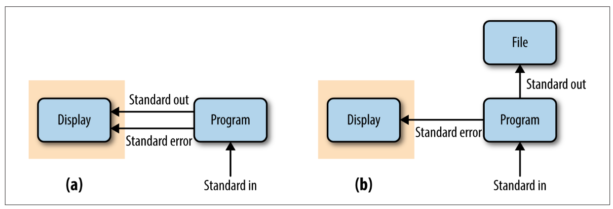

----------------------------------------------------------------------------------------------------

<br>

## Conditionals

With conditionals like `if` statements,
you can **run one or more commands only when a condition is met**.
You can additionally run a different set of commands when the condition is _not_ met.

These features are especially useful in shell scripts.
You may, for instance, want to check that all inputs are correct,
and exit with an informative error if that's not the case.
While doing this adds complexity to your shell script,
it can be worth it because:

- The sooner you stop a script from running when there are such problems,
  the better.
- If you pass erroneous input to the program that your script runs,
  you may get confusing errors or even worse,
  failure bot no clear error messages at all.
 
### Basic syntax

This is the basic syntax of an `if` statement in Bash:

```sh
if <test>; then
    # Command(s) to run if the condition is true
fi
```

The `fi` ending (equivalent to `done` in `for` loops) may seem peculiar but
can be read either as short for "finish" or "if" in reverse order.

To run alternative command(s) when the condition is not met,
add an `else` clause:

```sh
if <test>; then
    # Command(s) to run if the condition is true
else
    # Commands(s) to run if the condition is false
fi
```

In this example, you check the file type of an input file,
and exit the script if it's not of the correct type:

```sh
# [Hypothetical example - don't run this]
# Say we have a variable $filetype that contains a file's type
if [[ "$filetype" == "fastq" ]]; then
    echo "Processing FASTQ file..."
    # [Commands to process the FASTQ file...]
else
    echo "Error: unknown filetype!"
    exit 1
fi
```

In the code above, note that:

- The double square brackets `[[ ]]` represent a *test statement*^[
  You can also use single square brackets `[ ]` but the double brackets have more functionality
  and I would recommend to always use these.].
- The spaces bordering the brackets on the inside are necessary:
  `[["$filetype" == "fastq"]]` would fail!
- Double equals signs (`==`) are common in programming to _test for equality_ ---
  this is to contrast it with a single `=`, which is used for variable assignment.
- When used inside a script, the `exit` command will stop the execution of the script.
  With `exit 1`, the *exit status* of our script is 1:
  an exit status of 0 means success --- any other integer, including 1, means failure.  

### String comparisons

The above test, `"$filetype" == "fastq"`, was an example of a string comparison,
where "string" is basically another term for "text" that is common in programming contexts,
and mostly serves to distinguish this from numeric data.
The two main string comparisons you can make are:

| String comparison            | Evaluates to true (condition is met) if
|-------|----------------|
| `str1 == str2` | Strings `str1` and `str2` are identical^[A single `=` also works but `==` is clearer.]
| `str1 != str2` | Strings `str1` and `str2` are different

: {.striped .hover}

### Integer (number) comparisons

| Integer comparisons           | Evaluates to true if
|-------|----------------|
| `int1 -eq int2`   | Integers `int1` and `int2` are equal
| `int1 -ne int2`   | Integers `int1` and `int2` are not equal
| `int1 -lt int2`   | Integer `int1` is less than `int2` (`-le` for less than or equal to)
| `int1 -gt int2`   | Integer `int1` is greater than `int2` (`-ge` for greater than or equal to)

: {.striped .hover}

It can be a good idea to test at the beginning of a script whether the correct
number of arguments were passed to it, and simply exit if that's not the case.
The `$#` variable will automatically contain the number of arguments that were
passed to a script:

```bash
# [Hypothetical example - don't run this]
if [[ ! "$#" -eq 2 ]]; then
    echo "Error: wrong number of arguments"
    echo "You provided $# arguments, while 2 are required."
    echo "Usage: printname.sh <first-name> <last-name>"
    exit 1
fi
```

::: {.callout-tip collapse="true"}
#### Another integer comparison example _(Click to expand)_
Say you want to run a program but the specifics of running it (e.g., some settings)
depend on how many samples samples you run the program with.

With the number of samples determined from the number of lines in a hypothetical file
`samples.txt` and stored in a variable `$n_samples`,
you can test if the number is greater than 9 as follows:

```sh
# [Hypothetical example - don't run this]
# Store the number of samples in variable $n_samples:
n_samples=$(cat samples.txt | wc -l)

# With '-gt 9', the if statement tests whether the number of samples is greater than 9:
if [[ "$n_samples" -gt 9 ]]; then
    # Commands to run if nr of samples >9:
    echo "Processing files with algorithm A"
else
    # Commands to run if nr of samples is <=9:
    echo "Processing files with algorithm B..."
fi
```
:::

### File tests

Finally, you can test whether files or dirs exist:

| File/dir test | Evaluates to true if |
|---------|---------------------|
| `-f file`       | `file` exists and is a regular file (not a dir or link) |
| `-d dir`        | `dir` exists and is a directory &nbsp; &nbsp; &nbsp; &nbsp; &nbsp; |

: {.striped .hover}

For example,
the code below tests whether an input file exists using the file test **`-f`**
and if it does _not_ (hence the **`!`**), it will stop the execution of the script:

```sh
# [Hypothetical example - don't run this]
# '-f' is true if the file exists, so '! -f' is true if the file doesn't exist
if [[ ! -f "$fastq_file" ]]; then
    echo "Error: Input file $fastq_file not found!"
    exit 1
fi
```

::: {.callout-note collapse="true"}
#### Testing for multiple conditions at once with `&&` and `||` _(Click to expand)_
To test for multiple conditions at once,
use the `&&` ("and") and `||` ("or") shell operators --- for example:

- If the number of samples is less than 100 **and** at least 50 (i.e. 50-99):

  ```sh
  if [[ "$n_samples" -lt 100 && "$n_samples" -ge 50 ]]; then
      # Commands to run if the number of samples is 50-99
  fi
  ```
  
- If either one of two FASTQ files don't exist:

  ```sh
  if [[ ! -f "$fastq_R1" || ! -f "$fastq_R2" ]]; then
      # Commands to run if either file doesn't exist - probably report error & exit
  fi
  ```
:::

::: exercise
####  Exercise: Number of arguments

In your `printname.sh` script,
add the `if` statement from above that tests whether the correct number of arguments
were passed to the script.
Then, try running the script consecutively with 1, 2, and 3 arguments. 

<details><summary>Start with this `printname.sh` script we wrote above.</summary>
```bash
#!/bin/bash
set -euo pipefail

first_name=$1
last_name=$2

echo "This script will print a first and a last name"
echo "First name: $first_name"
echo "Last name: $last_name"
```
</details>

<details><summary>Click for the solution</summary>

Note that the `if` statement should come before you copy the variables to
`first_name` and `last_name`,
otherwise you get the "unbound variable error" before your descriptive custom error,
when you pass 0 or 1 arguments to the script.

The final script:

```bash
#!/bin/bash
set -euo pipefail

if [[ ! "$#" -eq 2 ]]; then
    echo "Error: wrong number of arguments"
    echo "You provided $# arguments, while 2 are required."
    echo "Usage: printname.sh <first-name> <last-name>"
    exit 1
fi

first_name=$1
last_name=$2

echo "This script will print a first and a last name"
echo "First name: $first_name"
echo "Last name: $last_name"
```

Run it with different numbers of arguments:

```bash
bash scripts/printname.sh Jelmer
```
```bash-out
Error: wrong number of arguments
You provided 1 arguments, while 2 are required.
Usage: printname.sh <first-name> <last-name>
```
```bash
bash scripts/printname.sh Jelmer Poelstra
```
```bash-out
First name: Jelmer
Last name: Poelstra
```
```bash
bash scripts/printname.sh Jelmer Wijtze Poelstra
```
```bash-out
Error: wrong number of arguments
You provided 3 arguments, while 2 are required.
Usage: printname.sh <first-name> <last-name>
```

</details>
:::

::: exercise
####  Exercise: Conditionals II

In your Markdown notes file,
write an `if` statement that tests whether the script `scripts/printname.sh` exists
and is a regular file, and:

- If it is (`then` block), report the outcome with `echo` (e.g. "The file is found").
- If it is not (`else` block), also report that outcome with `echo` (e.g. "The file is not found").

Then:

1. Run your `if` statement --- it should report that the file is found. 
2. Introduce a typo in the file name in the `if` statement, and run it again,
   to check that the file is not indeed not found.

<details><summary>Click for the solution</summary>
```sh
# Note: you need single quotes when using exclamation marks with echo!
if [[ -f scripts/printname.sh ]]; then
    echo 'Phew! The file is found.'
else
    echo 'Oh no! The file is not found!'
fi
```
```bash-out
Phew! The file is found.
```

After introducing a typo:

```sh
if [[ -f scripts/printnames.sh ]]; then
    echo 'Phew! The file is found.'
else
    echo 'Oh no! The file is not found!'
fi
```
```bash-out
Oh no! The file is not found!
```
</details>
:::

## While loops

In bash, `while` loops are mostly useful in combination with the `read` command,
**to loop over each line in a file**.
If you use `while` loops, you'll very rarely need Bash _arrays_ (next section),
and conversely, if you like to use arrays, you may not need `while` loops much.

`while` loops will run as long as a condition is true.
Such a condition can include constructs like `read -r`,
which will read input line-by-line,
and be true as long as there is a line left to be read from the file.

In the example below,
`while read -r` will be true as long as lines are being read from a file `fastq_files.txt` ---
and in each iteration of the loop, the variable `$fastq_file` contains one line from the file:

```sh
# [ Don't run this - hypothetical example]
cat fastq_files.txt
```
```bash-out
seq/zmaysA_R1.fastq
seq/zmaysA_R2.fastq
seq/zmaysB_R1.fastq
```

```sh
# [ Don't run this - hypothetical example]
cat fastq_files.txt | while read -r fastq_file; do
    echo "Processing file: $fastq_file"
    # More processing...
done
```
```bash-out
Processing file: seq/zmaysA_R1.fastq
Processing file: seq/zmaysA_R2.fastq
Processing file: seq/zmaysB_R1.fastq
```

A more elegant but perhaps not as intuitive syntax variant uses input redirection
instead of `cat`-ing the file:

```sh
# [ Don't run this - hypothetical example]
while read -r fastq_file; do
    echo "Processing file: $fastq_file"
    # More processing...
done < fastq_files.txt
```
```bash-out
Processing file: seq/zmaysA_R1.fastq
Processing file: seq/zmaysA_R2.fastq
Processing file: seq/zmaysB_R1.fastq
```

We can also process each line of the file inside the `while` loop,
like when we need to select a specific column:

```sh
# [ Don't run this - hypothetical example]
head -n 2 samples.txt
```
```bash-out
zmaysA  R1      seq/zmaysA_R1.fastq
zmaysA  R2      seq/zmaysA_R2.fastq
```

```sh
# [ Don't run this - hypothetical example]
while read -r my_line; do
    echo "Have read line: $my_line"
    fastq_file=$(echo "$my_line" | cut -f 3)
    echo "Processing file: $fastq_file"
    # More processing...
done < samples.txt
```
```bash-out
Have read line: zmaysA  R1      seq/zmaysA_R1.fastq
Processing file: seq/zmaysA_R1.fastq
Have read line: zmaysA  R2      seq/zmaysA_R2.fastq
Processing file: seq/zmaysA_R2.fastq
```

Alternatively, you can operate on file contents before inputting it into the loop:

```bash
# [ Don't run this - hypothetical example]
while read -r fastq_file; do
    echo "Processing file: $fastq_file"
    # More processing...
done < <(cut -f 3 samples.txt)
```

Finally, you can extract columns directly as follows:

```sh
# [ Don't run this - hypothetical example]
while read -r sample_name readpair_member fastq_file; do
    echo "Processing file: $fastq_file"
    # More processing...
done < samples.txt
```
```bash-out
Processing file: seq/zmaysA_R1.fastq
Processing file: seq/zmaysA_R2.fastq
Processing file: seq/zmaysB_R1.fastq
```

## Miscellaneous

### More on the `&&` and `||` operators

Above, we saw that we can combine tests in `if` statements with `&&` and `||`.
But these shell operators can be used to chain commands together in a more general way,
as shown below.

- Only if the first command *succeeds*, also run the second:

  ```sh
  # Move into the data dir and if that succeeds, then list the files there:
  cd data && ls data
  ```
  ```sh
  # Stage all changes => commit them => push the commit to remote:
  git add --all && git commit -m "Add README" && git push
  ```

- Only if the first command *fails*, also run the second:

  ```sh
  # Exit the script if you can't change into the output dir:
  cd "$outdir" || exit 1
  ```
  ```sh
  # Only create the directory if it doesn't already exist:
  [[ -d "$outdir" ]] || mkdir "$outdir"
  ```

### Parameter expansion to provide default values

In scripts, it may be useful to have *optional arguments* that have a default
value if they are not specified on the command line.
You can use the following "parameter expansion" syntax for this.

- Assign the value of `$1` to `number_of_lines` unless `$1` doesn't exist:
  in that case, set it to a default value of `10`:
  
  ```sh
  number_of_lines=${1:-10}
  ```

- Set `true` as the default value for `$3`:
  
  ```bash
  remove_unpaired=${3:-true}
  ```

As a more worked out example,
say that your script takes an input dir and an output dir as arguments.
But if the output dir is not specified, you want it to be the same as the input dir.
You can do that like so:
  
```sh
input_dir=$1
output_dir=${2:-$input_dir}
```

Now you can call the script with or without the second argument, the output dir:

```sh
# Call the script with 2 args: input and output dir
sort_bam.sh results/bam results/bam
```
```sh
# Call the script with 1 arg: input dir (which will then also be the output dir)
sort_bam.sh results/bam
```

### Standard output and standard error

As you've seen, when commands run into errors, they will print error messages.
Error messages are **not** part of "standard out",
but represent a separate output stream: **"standard error"**.

We can see this when we try to list a non-existing directory and try to redirect
the output of the `ls` command to a file:

```sh
ls -lhr solutions/ > solution_files.txt 
```
```bash-out
ls: cannot access solutions.txt: No such file or directory
```

Evidently, the error was printed to screen rather than redirected to the output file.
This is because `>` only redirects standard out, and not standard error.
Was anything at all printed to the file?

```sh
cat solution_files.txt
```
```bash-out
# We just get our prompt back - the file is empty
```

No, because there were no files to list, only an error to report.

The figure below draws the in- and output streams without redirection **(a)**
versus with **`>`** redirection **(b)**:

{fig-align="center" width="70%"}

To *redirect* the standard error, use **`2>`** ^[
Note that `1>` is the full notation to redirect standard out,
and the `>` we've been using is merely a shortcut for that.]:

```sh
ls -lhr solutions/ > solution_files.txt 2> errors.txt
```

To *combine* standard out and standard error, use **`&>`**:

```sh
# (&> is a bash shortcut for 2>&1)
ls -lhr solutions/ &> out.txt
```

```bash
cat out.txt
```
```bash-out
ls: cannot access solutions.txt: No such file or directory
```

Finally, if you want to "manually" designate an `echo` statement to represent
standard error instead of standard out in a script, use **`>&2`**:
  
```sh
echo "Error: Invalid line number" >&2
exit 1
```

## Shell script options (vs. arguments)

It is also possible to make your shell script accept _options_.
The example below uses both long and short options (e.g. `-o | --outdir`).
It also uses a mix of "flag"-type options that turn functionality on/off
(e.g. `--no_gcbias`) and options that accept arguments (e.g. `--infile`).

```bash
# Process command-line options
while [ "$1" != "" ]; do
    case "$1" in
        -o | --outdir )     shift && outdir=$1 ;;
        -i | --infile )     shift && infile=$1 ;;
        --transcripts )     shift && transcripts=$1 ;;
        --no_gcbias )       gcbias=false ;;
        --dl_container )    dl_container=true ;;
        -h | --help )       script_help; exit 0 ;;
        -v | --version )    echo "Version 2025-10-01" && exit 0 ;;
        * )                 echo "Invalid option $1" && exit 1 ;;
    esac
    shift
done
```
  
Such a script could for example be run like so:
  
```bash
sbatch scripts/salmon.sh -i my.bam -o results/salmon --no_gcbias
```
  
That's more readable less error-prone than "anonymous" positional arguments.
It also makes it possible to add several/many settings that have _defaults_.
In contrast, when a script only takes positional arguments,
all of them always need to be provided.

### `-z` and `-n`

| String comparison            | Evaluates to true if
|-------|----------------|
| `-z str`          | String `str` is null/empty (useful with variables)

## Arrays

Bash "arrays" are basically lists of items, such as a list of file names or samples IDs.
If you're familiar with R, they are like R vectors^[
Or if you're familiar with Python, they are like Python lists.].

Arrays are mainly used with `for` loops:
you create an array and then loop over the individual items in the array.
This usage represents an alternative to looping over files with a glob.
Looping over files with a glob is generally easier and preferable,
but sometimes this is not the case; or you are looping e.g. over samples and not files.

#### Creating arrays

You can create an array "manually" by typing a space-delimited list of items
between parentheses:

```bash
# The array will contain 3 items: 'zmaysA', 'zmaysB', and 'zmaysC'
sample_names=(zmaysA zmaysB zmaysC)
```

More commonly, you would populate an array from a file, in which case you
also need command substitution:

- Simply reading in an array from a file with `cat` will only work if the file
  simply contains a list of items:
  
  ```bash
  sample_files=($(cat fastq_files.txt))
  ```

- For tabular files, you can include e.g. a `cut` command to extract the focal column:

  ```bash
  sample_files=($(cut -f 3 samples.txt))
  ```

#### Accessing elements in arrays

First off, it is useful to realize that arrays are closely related to regular variables,
and to  recall that the "full" notation to refer to a variable includes curly braces: `${myvar}`.
When referencing arrays, the curly braces are always needed.

- Using `[@]`, you can access all elements in the array
  (and arrays are best quoted, like regular variables):

  ```sh
  echo "${sample_names[@]}"
  ```
  ```bash-out
  zmaysA zmaysB zmaysC
  ```

- You can also use the `[@]` notation to loop over the elements in an array:

  ```sh
  for sample_name in "${sample_names[@]}"; do
      echo "Processing sample: $sample_name"
  done
  ```
  ```bash-out
  Processing sample: zmaysA
  Processing sample: zmaysB
  Processing sample: zmaysC
  ```

::: {.callout-note collapse="true"}
#### Other array operations _(Click to expand)_

- Extract specific elements (note: Bash arrays are 0-indexed!):

  ```sh
  # Extract the first item
  echo ${sample_names[0]}
  ```
  ```bash-out
  zmaysA
  ```
    
  ```bash
  # Extract the third item
  echo ${sample_names[2]}
  ```
  ```bash-out
  zmaysC
  ```

- Count the number of elements in the array:

  ```sh
  echo ${#sample_names[@]}
  ```
  ```bash-out
  3
  ```
:::

#### Arrays and filenames with spaces

The file `files.txt` contains a short list of file names,
the last of which has a space in it:

```sh
cat files.txt
```
```bash-out
file_A
file_B
file_C
file D
```

What will happen if we read this list into an array, and then loop over the array?

```sh
# Populate an array with the list of files from 'files.txt'
all_files=($(cat files.txt))

# Loop over the array:
for file in "${all_files[@]}"; do
    echo "Current file: $file"
done
```
```bash-out
Current file: file_A
Current file: file_B
Current file: file_C
Current file: file
Current file: D
```

Uh-oh! The file name with the space in it was split into two items!
And note that we did quote the array in `"${all_files[@]}"`, so clearly,
this doesn't solve that problem.

For this reason, it's best not to use arrays to loop over filenames with spaces
(though there are workarounds).
*Direct globbing* and `while` loops with the `read` function (`while read ...`,
see below) are easier choices for problematic file names.

Also, this example once again demonstrates you should not have spaces in your file names!

::: exercise
####  Exercise: Bash arrays

1. Create an array with the first three file names (lines) listed in `samples.txt`.
2. Loop over the contents of the array with a `for` loop.  
   Inside the loop, create (`touch`) the file listed in the current array element.
3. Check whether you created your files.

<details><summary>_Click here for the solutions_</summary>

1. Create an array with the first three file names (lines) listed in `samples.txt`.

  ```bash
  good_files=($(head -n 3 files.txt))
  ```

2. Loop over the contents of the array with a `for` loop.  
   Inside the loop, create (`touch`) the file listed in the current array element.
   
   ```bash
   for good_file in "${good_files[@]}"; do
       touch "$good_file"
   done
   ```

3. Check whether you created your files.
   
   ```bash
   ls
   ```
   ```bash-out
   file_A  file_B  file_C
   ```
</details>
:::
