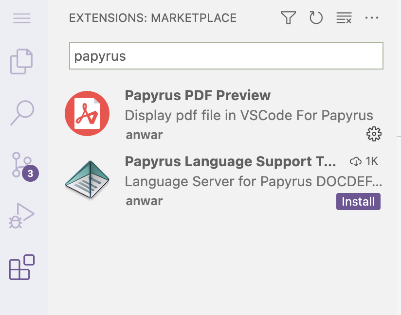

------

<hr style="height:1pt; visibility:hidden;" />

## Part A: Setting up

4. _Initialize and use a Git repository throughout the assignment._

   ```bash
   # Initialize a repo
   git init
  
   # For the first commit, may create a Gitignore file:
   echo "results/" > .gitignore
   echo "data/" >> .gitignore
   git add .gitignore
   git commit -m "Add a Gitignore file"
   
   # After Part B:
   git add scripts/* README.md
   git commit -m "Part B"
   
   # After Part C:
   git add scripts/printline.sh README.md
   git commit -m "Part C"
   
   # After Part D
   git add README.md
   git commit -m "Part D"
   
   # After part E:
   git add README.md
   git commit -m "Part E"
   ```

## Part B: Running two scripts

5. _Run `scripts/echo.sh` in 3 ways:_

   ```bash
   # This passes 2 instead of the required 3 arguments to the script, making it fail -
   # note that "Finished" is not printed because the script has stopped by then:
   bash scripts/echo.sh Oct07 Oct08
   ```
   ```bash-out
   Oct07
   Oct08
   echo.sh: line 6: $3: unbound variable
   ```
   
   ```bash
   # The passes 4 arguments - the 4th argument shouldn't be there,
   # but the script doesn't care and will simply ignore its presence for your purposes:
   bash scripts/echo.sh Oct07 Oct08 Oct09 Oct10
   ```
   ```bash-out
   Oct07
   Oct08
   Oct09
   Finished
   ```
   
   ```bash
   # This correctly passes 3 arguments because "Oct09 Oct10" is quoted and
   # therefore processed as a single argument:
   bash scripts/echo.sh Oct07 Oct08 "Oct09 Oct10"
   ```
   ```bash-out
   Oct07
   Oct08
   Oct09 Oct10
   Finished
   ```

6. _Run `scripts/concat.sh` to concatenate the two FASTQ files you copied to `data/` earlier._

   ```bash
   # It may seem like the below is passing 2 arguments only,
   # but 'data/ERR10802863*' will be expanded into 2 arguments!
   bash scripts/concat.sh data/ERR10802863* results/ERR10802863.fastq.gz
   
   # Alternatively, type out the input file names:
   # bash scripts/concat.sh data/ERR10802863_R1.fastq.gz data/ERR10802863_R2.fastq.gz results/ERR10802863.fastq.gz
   ```
   ```bash-out
   -rw-rw----+ 1 jelmer PAS0471 21M Oct  5 14:32 data/ERR10802863_R1.fastq.gz
   -rw-rw----+ 1 jelmer PAS0471 22M Oct  5 14:32 data/ERR10802863_R2.fastq.gz
   -rw-rw----+ 1 jelmer PAS0471 42M Oct  5 14:34 results/ERR10802863.fastq.gz
   ```
   
## Part C: A shell script that prints a specific line

07. _Write a shell script `scripts/printline.sh` that accepts two arguments,_
    _a file path and a line number,_
    _in order to print (not store in a file) the requested line from the specified file._
    
    ```bash
    #!/bin/bash
    set -euo pipefail
    
    file="$1"
    line_nr="$2"
    
    # Use 'head' to print up until the desired line, then 'tail' to get the last line:
    head -n "$line_nr" "$file" | tail -n 1
    ```

08. _Test your script twice by making it print two different lines from `data/metadata.tsv`._
    
    ```bash
    # First test - no redirection:
    bash scripts/printline.sh data/metadata.tsv 4
    ```
    ```bash-out
    ERR10802879     10dpi   cathemerium
    ```
    ```bash
    # First test - redirection:
    bash scripts/printline.sh data/metadata.tsv 7 > results/meta_line7.tsv
    
    # No output will be printed, but you should have created a file:
    cat results/meta_line7.tsv
    ```
    ```bash-out
    ERR10802884     10dpi   control
    ```
    
09. _Run a final test, but use variables:_
   
    ```bash
    file_name=metadata.tsv
    line_nr=2
    bash scripts/printline.sh data/"$file_name" "$line_nr" > results/"$file_name"_"$line_nr"
    
    # Check the output file:
    ls -lh results/"$file_name"_"$line_nr"
    ```
    ```bash-out
    -rw-rw----+ 1 jelmer PAS0471 30 Oct  5 14:36 results/metadata.tsv_2
    ```
    ```bash
    cat results/"$file_name"_"$line_nr"
    ```
    ```bash-out
    ERR10802882     10dpi   cathemerium
    ```

## Part D: Containers

The program "Trim-Galore",
which you'll use in the next few weeks of the course,
trims and filters FASTQ files to remove adapters,
poor quality bases, and short reads.
Here, you'll find and test-run containers with two different versions of this program.
 
10. _Go to <https://seqera.io/containers> and find a container image for the program_
    _(default, i.e. latest, version)._
    _Back in VS Code, test-run the container with the command `trim_galore -v`._
    
    ```bash
    apptainer exec oras://community.wave.seqera.io/library/trim-galore:0.6.10--bc38c9238980c80e \
        trim_galore -v
    ```
    ```bash-out
    INFO:    Downloading oras image
    465.8MiB / 465.8MiB [=============================================================================================================================] 100 % 56.2 MiB/s 0s
    INFO:    gocryptfs not found, will not be able to use gocryptfs
    
                            Quality-/Adapter-/RRBS-/Speciality-Trimming
                                    [powered by Cutadapt]
                                      version 0.6.10
    
                                   Last update: 02 02 2023
    ```

11. _Find a container for Trim-Galore version 0.5.0 and test-run it with the_
    _same command as above._
    _Are the versions printed in both cases as expected?_

    ```bash
    apptainer exec oras://community.wave.seqera.io/library/trim-galore:0.5.0--16bd677ee493f6cd \
        trim_galore -v
    ```
    ```bash-out
    INFO:    Downloading oras image
    409.7MiB / 409.7MiB [===================================================================================================================] 100 % 83.7 MiB/s 0s
    INFO:    gocryptfs not found, will not be able to use gocryptfs
    
                            Quality-/Adapter-/RRBS-/Hard-Trimming
                                    (powered by Cutadapt)
                                      version 0.5.0
    
                                   Last update: 28 06 2018
    ```
    
    Yes, the versions reported by `trim_galore -v` in both cases matched what
    we expected.
    
## Part E: Modules and Pandoc

You'll practice with OSC software modules and the program Pandoc,
which can render Markdown files to HTML and PDF.

12. _See if Pandoc is available at OSC prior to loading anything,_
    _and if so, which version, by running `pandoc -v`._
    _Then, search the internet to check if that Pandoc version is the most recent one._
    
    - Yes, it is available without loading anything and as of October 2025
      on Pitzer, the default version is `2.14.0.3`:
  
      ```bash
      pandoc -v
      ```
      ```bash-out
      pandoc 2.14.0.3
      Compiled with pandoc-types 1.22.1, texmath 0.12.3.3, skylighting 0.10.5.2,
      citeproc 0.4.0.1, ipynb 0.1.0.1
      User data directory: /users/PAS0471/jelmer/.local/share/pandoc
      Copyright (C) 2006-2021 John MacFarlane. Web:  https://pandoc.org
      This is free software; see the source for copying conditions. There is no
      warranty, not even for merchantability or fitness for a particular purpose.
      ```
     
    - That is [not nearly the most recent version](https://pandoc.org/releases.html),
      which is 3.8.1 as of October 2025.

13. _Check what other versions of Pandoc are available in OSC Lmod modules,_
    _and load the module with the most recent available Pandoc version._

    - Check which versions are available:
    
      ```bash
      module spider pandoc
      ```
      ```bash-out
      --------------------------------------------------------------------------------
        pandoc:
      --------------------------------------------------------------------------------
          Versions:
              pandoc/2.19.2
              pandoc/3.6.4
      ```
    
    - Version `3.6.4` is the most recent one, so let's load that:
    
      ```bash
      module load pandoc/3.6.4
      pandoc -v
      ```
      ```bash-out
      pandoc 3.6.4
      Features: +server +lua
      Scripting engine: Lua 5.4
      User data directory: /users/PAS0471/jelmer/.local/share/pandoc
      Copyright (C) 2006-2024 John MacFarlane. Web: https://pandoc.org
      This is free software; see the source for copying conditions. There is no
      warranty, not even for merchantability or fitness for a particular purpose.
      ```

14. _Use Pandoc to create a PDF of your `README.md`,_
    _and check whether the PDF file is there._
   
    ```bash
    #If all went well, Pandoc did not print anything to screen,
    # but the PDF file should be there:
    ls
    ```
    ```bash-out
    data    README.md   README.pdf    results    scripts
    ```
   
15. _Install the extension "_Papyrus PDF Preview_", and take a look at your PDF._
    _Then, download the PDF file to your computer and also take a look at it there._

    1. Click on the Extensions icon in the narrow side bar to open 
       the Extensions panel in the wide side bar.
    2. Search for "papyrus" (or similar) and the extension should pop up:
    
    {width="60%" fig-align="center" fig-alt="A screenshot of the search result for the Papyrus PDF Preview VS Code extension."}
    
    3. Click "Install".
    4. After installation, you should be able to open the PDF file e.g. by simply
       clicking on it in the VS Code file explorer.
    4. Right-click on the PDF file in VS Code's file explorer
       and select "Download..." to download a file to your computer.
      
## Part F: Publish your repo on Github 

17. _Create a repository on GitHub, connect it to your local repo,_
    _and push your local repo to GitHub._
    
    ```bash
    # After creating the repo on the GitHub website, connect it, e.g.:
    git remote add <URL>
    # Then push the local repo to the remote:
    git push -u origin main
    ```
