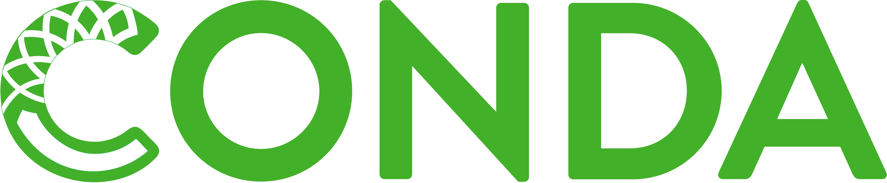

# Personal introductions {background-color="dimgray"}

## Introductions: Jelmer (instructor)

**Lead of the CFAES Bioinformatics and Microscopy cores**

- Part of what was until recently called the Molecular & Cellular Imaging Center (MCIC)
- We are now under **CFAES Analytical Resources**,
  a set of core facilities that provide services in molecular biology,
  high-throughput sequencing, bioinformatics, microscopy, and soil analyses.

. . .

**What I work on**

- The majority of my time is spent providing research assistance,\
  working with grad students and postdocs on omics data

- Teaching, such as this course, workshops, Code Club (<https://osu-codeclub.github.io>)

. . .

**Otherwise**

- Research background in animal evolutionary genomics & speciation

- In my free time, I enjoy bird watching -- locally & all across the world

## Introductions: TA / co-instructor

TBA

## Introductions: You

- Name

- Lab and Department

- Research interests and/or current research topics

- Something about you that is *not* work-related, such as a hobby or fun fact

# Course goals and background {background-color="dimgray"}

## The core goals of this course

This course's core goals are to teach you skills that will enable you to:

- Do your research more **reproducibly** and **efficiently** (e.g. by using **code**)

- Work with large-scale "**omics**" datasets and do **applied bioinformatics**

 

. . .

To do so, this course will focus primarily on what we may call
"**foundational computational skills**" rather than on specific applications.
For example, you will learn to:

- Code in the Unix shell and R
- Organize, document, manage, and share your research data, code, and results
- Work with a remote supercomputer
- Write automated analysis pipelines

## Course background I: Reproducibility

Two related ideas:

1.  Getting same results with an independent experiment (*replicable*)
2.  Getting same results given the same data (*reproducible*)

Our focus is on #2.

------------------------------------------------------------------------

## Course background I: Reproducibility (cont.)

> *"The most basic principle for reproducible research is: Do everything via code."*\
> —Karl Broman, University of Madison

Also important for reproducibility are, for example:

- Project documentation and file organization (*week 2*)
- Managing and sharing your code and data (*week 4 & 6*)
- Using open-source software and properly managing it (*week 6*)
- Reporting a clear protocol (*week 7*) or even better creating an automated
  pipeline to rerun your analyses (*weeks 9-10*)

. . . 

::: callout-tip
##### Another motivator: working reproducibly will benefit future you!

See [Markowetz 2015's](https://link.springer.com/article/10.1186/s13059-015-0850-7)
"Five selfish reasons to work reproducibly" in this week's readings.
:::

## Course background II: Efficiency and automation

Using code enables you to work more efficiently and automatically —\
particularly useful when having to:

  - Do repetitive tasks
  - Recreate a figure or redo an analysis after adding a sample
  - Redo a project after uncovering a mistake in the first data processing step.

## Course background III: Omics data

Omics data is increasingly important in biology,
and most notably includes the study of:

- DNA at the (near) whole-genome level: Genomics
- Expressed RNA at the (near) whole-transcriptome level: Transcriptomics
- Expressed protein at the  (near) whole-proteome level: Proteomics

::: callout-tip
#### The next lecture will introduce omics data in more detail.
:::

## Course background III: Omics data (cont.)

Examples in the course will involve the analyses of nucleotide sequencing-based
data (genomics and transcriptomics),
which in many cases can be divided into two subsequent stages:

1. **Algorithmic/bioinformatic data processing**
   - For example: alignment of reads to a genome
   - This is typically done in a **Unix shell** environment using a **supercomputer**
   - These steps are often relatively standardized, automatable, and "non-interactive"

. . . 

2. **Biostatistical downstream analysis**
   - For example: comparing expression levels of genes between treatments 
   - This is typically done in **R** and can be done on a laptop
   - This is often highly interactive and iterative,
     and less standardized and automatable than the previous stage.

## Course background III: Omics data (cont.)

::: callout-warning
## What this course does and does not focus on 

- While we'll be using some example omics datasets,
  this course will *not* comprehensively cover how to do specific omics analyses,
  or its underlying methods ---
  our focus is much primarily on foundational computational skills.

- To learn more about specific omics analysis, I highly recommended the follow-up course
  **Genome Analytics** (HCS 7004) by Jonathan Fresnedo-Ramirez
:::

## Course background IV: Applied bioinformatics

Also: computational biology

TBA

# Course topics {background-color="dimgray"}

## The Unix shell & shell scripts

The Unix shell (or the "Terminal") is a command-line interface to computers.

Being able to use the Unix shell is a fundamental skill when working with omics data,
for example because many of the specialized analysis software must be run
using the shell.

- You'll spend a lot of time with the Unix shell, starting next week.
- You'll also write shell *scripts*,
  and will use an editor called VS Code for this and other purposes.

::::::: columns
:::: column
{fig-align="center" width="40%"}

::: legend2
Bash (shell language)
:::
::::

:::: column
{fig-align="center" width="40%"}

::: legend2
VS Code
:::
::::
:::::::

## Project file organization & documentation {.nostretch}

Good research project organization & documentation is a necessary starting point
for reproducible research.

- You'll learn best practices for project file organization

- You'll learn how to manage your data and software

- To document and report what you are doing, you'll use *Markdown* files.

 

{fig-align="center" width="32%"}

::: legend2
Markdown
:::

## Version control with Git and GitHub

Using version control, you can more effectively keep track of project progress,
collaborate, share code, revisit earlier versions, and undo.

- *Git* is the version control software we will use,\
  and *GitHub* is the website that hosts Git projects (repositories).

- You'll also use Git + GitHub to hand in your graded assignments.

 

::::: columns
::: {.column width="50%"}

{fig-align="center" width="55%"}
:::
::: {.column width="50%"}
{fig-align="center"}
:::
:::::

## High-performance computing with OSC

Thanks to supercomputer resources,
you can work with **very large datasets at speed** ---
running up to 100s of analyses in parallel,
and using much larger amounts of memory and storage space than a personal computer has.

. . .

- We will use the **Ohio Supercomputer Center (OSC)** throughout the course,
  and you'll get a brief intro to it this week
- In week 5, you'll learn how to manage data and software at OSC
- In week 6, you'll learn to submit shell scripts at OSC as "batch jobs"

 

:::::: columns
::: {.column width="38%"}
 
{fig-align="center" width="100%"}
:::
::: {.column width="31%"}
  
{fig-align="center" width="95%"}
:::
::: {.column width="31%"}
{fig-align="center" width="75%"}
:::
::::::

## Automated workflow management {.nostretch}

Omics data analyses typically consist of many consecutive steps.

Using a workflow written with a workflow manager,
you can run and rerun an entire analysis pipeline with a single command
(and much more).

- You'll use the workflow language *Nextflow* to build your pipelines
- You will also learn how to use comprehensive,
  best-practice omics data Nextflow pipelines produced by the *nf-core* initiative

 

:::::: columns
::: {.column width="45%"}
{fig-align="center" width="95%"}
:::
::: {.column width="7%"}
:::
::: {.column width="40%"}
{fig-align="center" width="95%"}
:::
::::::

## The R language {.nostretch}

While the Unix shell, and software that is run through the Unix shell,
is best used for the initial (algorithmic) processing steps of omics data,
R is probably the most prominent language in the more "downstream" and 
often statistical analysis and visualization of omics data.

In this course, you will learn the basics of R, how to visualize data in R,
and how you can use specialized packages for omics data analyis.

::::: columns
::: {.column width="35%"}
{fig-align="center" width="65%"}
:::
::: {.column width="35%"}
 
{fig-align="center" width="90%"}
:::
::: {.column width="25%"}
{fig-align="center" width="65%"}
:::
:::::

. . .

::: callout-tip
#### R vs. Python
Python is also commonly used but I believe that altogether,
R is a far better choice for this course.
On the other hand,
Python is a great follow-up language for those seeking to specialize in bioinformatics.
:::

## Using generative AI to help with coding

- TBA

 

# Course practicalities {background-color="dimgray"}

## Zoom

- Be muted by default, but feel free to unmute yourself to ask questions any time.

- Questions can also be asked in the chat.

- Having your camera turned on as much as possible is appreciated!

## Participatory live coding

TBA

- It will often be important to simultaneously see the Zoom window where I will share my
  screen, and one or more windows on your own computer. 
  If you have access to large and/or multiple monitors,
  I would highly recommend using those.

- You should always be ready to share your screen for troubleshooting purposes.

## Course websites

- Info about CarmenCanvas website TBA

. . .

- This "GitHub website" (<https://mcic-osu.github.io/pracs-au25>) contains:
  - Overviews of each week & readings
  - Slide decks and lecture pages
  - Assignments
  - Exercises

. . .

- I am only using slides for this course intro and for the next lecture.
  Other material will be presented via "regular" pages on the GitHub website,
  as this works better for the interactive live coding we'll be doing.

## Quick tour of the GitHub website

TBA

## Office hours

TBA

## Computer requirements

TBA

# Homework and grading {background-color="dimgray"}

## What your grade is made up of

You can earn a total of 100 points across 6 assignments and 4 final project checkpoints.

## Graded assignments

These are due on Mondays and are worth 10 points each:

1.  Shell basics (due week 3)
2.  Markdown & Git (due week 5)
3.  Shell scripting (due week 6)
4.  OSC batch jobs (due week 8)
5.  Nextflow (due week 11)
6.  R (due week 15)

The first one is submitted through CarmenCanvas,
while all others are submitted via GitHub so you can get more practice with that.

## Final project

Plan and implement a small computational project, with the following checkpoints:

-   I: **Proposal** (due week 13 -- 5 points)

-   II: **Draft** (due week 15 -- 5 points)

-   III: **Oral presentations** on Zoom (week 16 -- 10 points)

-   IV: **Final submission** (due Dec 15 -- 20 points)

  

. . .

::: callout-tip
#### Data sets for the final project

It is ideal if you have/develop your own idea for a data set and analysis ---
for example, that way you may do something that's directly useful for your own
research.

If not, I can provide you with this.

More information about the final project will follow later in the course.
:::

## Using generative AI for graded assignments

TBA

## Ungraded homework

- Weekly readings

- Weekly exercises — I recommend doing these on Fridays after the week's session.

- Miscellaneous small assignments such as surveys and account setup.

## Readings

- In a few of the weeks, you will have 1 or 2 papers as required reading.

- Most weeks have as optional readings chapters from the following two books:
  - Computing Skills for Biologists ("CSB"; Allesina & Wilmes 2019)
  - Bioinformatics Data Skills ("Buffalo"; Buffalo 2015)
 

::: callout-important
Most weeks, readings from books or papers are _optional_.
This is because, instead:

- You are _always_ expected to reread and practice more with the material that we
  go through in class
  (if you don't do this, you will not be able to learn the material well enough).

- Anything on a given lecture page that we do not manage to cover in class
  _automatically turns into required self-study material_.
:::

## Weekly recitation on Monday

We will have an optional but highly recommended weekly recitation meeting on Mondays,
during which we go over the exercises for the preceding week.

 

::: callout-caution
## Practice is key!

This course is intended to be highly practical,
and if you don't practice the skills we will focus on by yourself,
you will not get much out of it.
:::

 

Please indicate your availability here: TBA

## Rest of this week

- Introduction to omics data

- Introduction to the Ohio Supercomputer Center (OSC)

- **Homework**:
  - TBA

# Questions? {background-color="dimgray"}

    

[(Back to the site)](/index.qmd)
