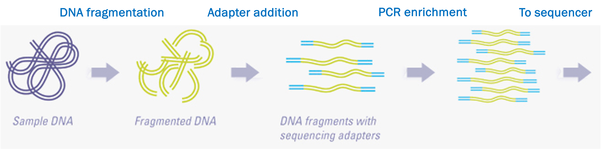
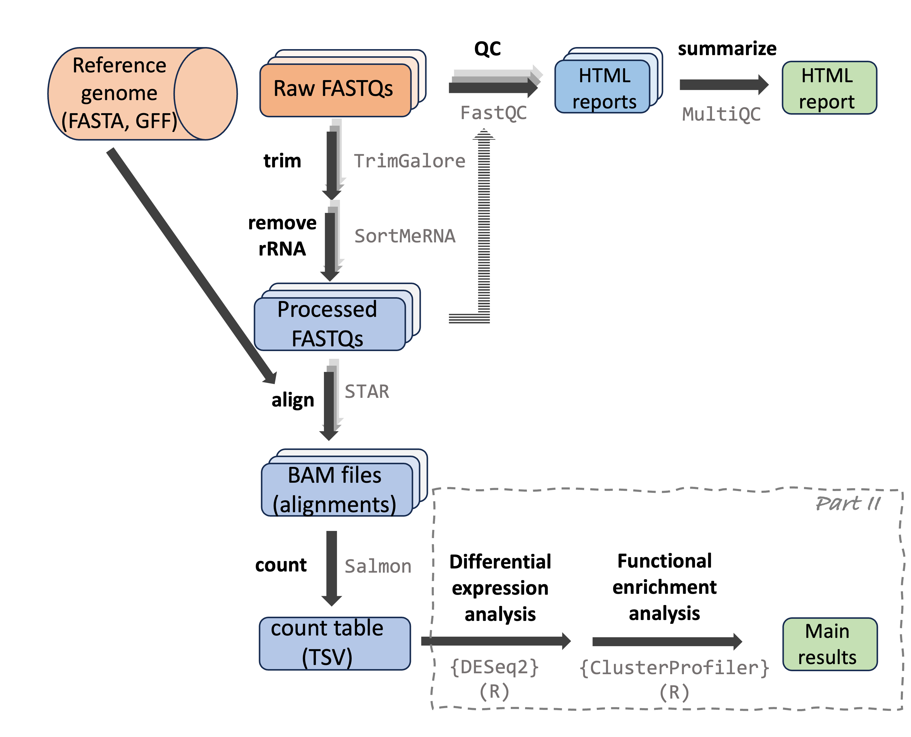

# An overview of omics data {background-color="dimgray"}

## The main omics data types

{fig-align="center" width="70%"}

::: legend2
Copyright [ThermoFisher](https://www.thermofisher.com/us/en/home/brands/thermo-scientific/molecular-biology/molecular-biology-learning-center/molecular-biology-resource-library/spotlight-articles/supporting-multi-omics-approaches.html)
:::

## The main omics data types

- Genomics (including metagenomics) --- _DNA_
- Epigenomics --- _DNA modifications_
- Transcriptomics --- _RNA_
- Proteomics --- _Proteins_
- Metabolomics --- _Metabolites_

:::callout-note
#### -omics?
The "omics" suffix indicates the involvement of large-scale datasets ---
in the sense that, for example, "genomics" data typically spans much or all 
of the genome.
While the boundaries can be fuzzy,
merely sequencing a single gene in a single organism is not genomics,
and merely doing qPCR on a handful of genes is not transcriptomics.
:::

. . .

<hr style="height:1pt; visibility:hidden;" />

Genomics, epigenomics, and transcriptomics data are produced by
**high-throughput sequencing** technologies.

That will be the focus of this lecture and will be used in examples throughout the course.

# High-throughput sequencing (HTS) {background-color="dimgray"}

## What does *sequencing* refer to?

The shorthand sequencing, like in "high-throughput sequencing",
generally refers to **determining the nucleotide sequence of fragments of DNA**.

. . .

<br>

::: callout-note
#### What about RNA or proteins?

- **RNA** is usually reverse transcribed to DNA (cDNA) prior to sequencing, as in nearly all "RNA-seq".
  *Direct RNA sequencing* is possible with one of the sequencing technologies we'll discuss,
  but this is under development and not yet widely used.

- **Protein** sequencing requires different technology altogether,
  such as mass spectrometry, and is not further discussed in this lecture.
:::

## Sequencing technologies: overview

**Sanger sequencing (since 1977)**\
Sequences a single, typically PCR-amplified, short-ish (≤900 bp) DNA fragment at a time

. . .

<br>

**High-throughput sequencing (HTS, since 2005)**\
Sequences hundreds of thousands to billions DNA fragments at a time,
and these are usually randomly selected

<br>

::: callout-tip
#### Sequenced DNA fragments are referred to as "reads".
::::

## Sequencing cost through time


## Examples of HTS applications

-   **Whole-genome assembly**

. . .

-   **Variant analysis** (for population genetics/genomics, molecular evolution, GWAS, etc.):

    -   Whole-genome "resequencing"

    -   Reduced-representation libraries (e.g. RADseq, GBS)

. . .

-   **RNA-seq** (transcriptome analysis)

. . .

-   Other "functional" sequencing methods like **methylation sequencing, ChIP-seq,** etc.

. . .

-   **Microbial community characterization**

    -   Metabarcoding

    -   Shotgun metagenomics

## HTS applications (cont.)

{fig-align="center" width="73%"}

## Examples of HTS data analyses

**Stage I: The algorithmic/bioinformatics part**

- Read quality control (QC)
- Read trimming
- Read alignment to a reference genome
- Read taxonomic classification against a reference database
- Read assembly into a genome or transcriptome
- Variant (SNP etc.) calling

<hr style="height:1pt; visibility:hidden;" />

. . .

**Stage II: The biostatistical part**

- Differential abundance of gene (RNA-Seq) or taxon (metabarcoding) counts
  among groups
- Clustering/ordination and network analyses
- Genome-wide Association Studies (GWAS)
- Statistical enrichment of functional categories (e.g. Gene Ontology)

## The main HTS technologies

| | Short-read HTS   | Long-read HTS
|---|-------|-------|
Summary | Produces up to billions of short highly accurate reads | Produces longer but fewer, less accurate, and more costly reads
Read length | 50-300 bp | PacBio: 10-50 kbp / ONT: 10-100+ kbp
Error rates | Mostly <0.1% | 1-10% (ONT) / <0.1-10% (PacBio)
Main companies   | Illumina | Oxford Nanopore Technologies (ONT) and Pacific Biosciences (PacBio)
Timeline    | Since 2005 — technology fairly stable | Since 2011 — remains under rapid development
Usage | More common | Less common
AKA | Next-Generation Sequencing (NGS) |

## The main HTS technologies (cont.)

::: callout-note
## Short videos explaining the technology (90 s - 5 m each)

- Illumina: <https://www.youtube.com/watch?v=fCd6B5HRaZ8>
- Nanopore: <https://www.youtube.com/watch?v=RcP85JHLmnI>
- PacBio: <https://www.youtube.com/watch?v=_lD8JyAbwEo>
:::

## More on read lengths and error rates

- Choosing between short-read and long-read technology has often involved a
  trade-off between **accuracy** and **read-length**.

- But: error rates of long-read technologies are rapidly decreasing.
  **Per-base costs** are still much higher for long-read sequencing.

<br>

. . .

<details><summary>**Can you think of applications where longer reads are useful?**</summary>

- Genome assembly
- Haplotype and large structural variant calling
- Transcript isoform identification
- Taxonomic identification of single reads (microbial metabarcoding)
</details>

. . .

<hr style="height:1pt; visibility:hidden;" />

<details><summary>**Can you think of applications where read length may not matter much?**</summary>

- SNP variant analysis
- Read-as-a-tag: the goal is just to know a read's origin in a reference genome,
  like in counting applications such as RNA-seq
</details>

# Illumina libraries and sequencing {background-color="dimgray"}

## Libraries and library prep

We will talk a bit about Illumina library prep because it's the most common
type of HTS and we'll use Illumina read files as examples throughout the course.

In a sequencing context,
a "**library**" is a collection of nucleic acid fragments ready for sequencing.

. . .

<hr style="height:1pt; visibility:hidden;" />

In Illumina and other HTS libraries,
these fragments **number in the millions or billions** and are
**often** **randomly generated** from input such as genomic DNA:

. . .

{fig-align="center"}

::: legend2
An overview of the **library prep** procedure.
This is typically done for you by a sequencing facility or company.
:::

## A closer look at the processed DNA fragments

As shown in the previous slide, after library prep,
each DNA fragment is flanked by several types of short sequences that together
make up the "**adapters**":

<br>

{fig-align="center"}

<hr style="height:1pt; visibility:hidden;" />

::: callout-note
#### Multiplexing!
Using so-called "indices" or "barcodes" that make up part of the adapters,
up to 96 samples can be combined ("multiplexed") into a single library,
i.e. into a single tube.
:::

## Paired-end vs. single-end sequencing

DNA fragments can be sequenced from both ends as shown below —   
this is called **"paired-end" (PE) sequencing**:

{fig-align="center"}

. . .

<hr style="height:1pt; visibility:hidden;" />

When sequencing is instead **single-end (SE)**, no reverse read is produced:

{fig-align="center"}

## Insert size variation

The size of the DNA fragment (the "**insert size**" ) can vary --
both by design and because of limited precision in size selection.
In some cases, it is:

- Shorter than the *combined* read length, leading to **overlapping reads** (this can be useful):

{fig-align="center" width="70%"}

. . .

- Shorter than the *single* read length, leading to "**adapter read-through**"
  (i.e., the ends of the resulting reads will consist of adapter sequence, which should be removed):

{fig-align="center" width="58%"}

# Reference genomes {background-color="dimgray"}

## Genomes

Many HTS applications either **require a "reference genome"** **or involve its production.**

. . .

<hr style="height:1pt; visibility:hidden;" />

What exactly does "reference genome" refer to? It usually includes:

- **An assembly**\
  A representation of most or all of the genome DNA sequence: the genome assembly

- **An annotation**\
  This provides, for example, the *locations of genes and other genomic features*
  in the corresponding genome assembly,
  as well as functional information on these features

. . .

<hr style="height:1pt; visibility:hidden;" />

:::callout-tip
#### Taxonomic identity

Reference genomes are typically needed and used at the **species level**.
E.g., if you work with maize, you want a _Zea mays_ reference genome. But:

- If needed, it is often possible to work with reference genomes of closely related species
- Conversely, multiple reference genomes may exist, e.g. for different subspecies
:::

# Sequence file types {background-color="dimgray"}

## Overview

Sequences and annotations are mostly stored in **plain-text** formats.
Some of the most common types, which we will see in the course, are:

- **FASTA**\
  Simple sequence files, where each entry contains a header and a DNA/AA sequence.\
  Versatile: may contain a few short sequences, entire genome assemblies, proteomes, ...

<hr style="height:1pt; visibility:hidden;" />

. . .

- **FASTQ**\
  The standard format for **HTS reads** — has a quality score for each nucleotide.

<hr style="height:1pt; visibility:hidden;" />

- **SAM/BAM**\ _[(not further discussed today)]{style="color:#969696"}_  
  An alignment format for **HTS reads**.
  E.g. produced when you align reads to a genome.
    
. . .

<hr style="height:1pt; visibility:hidden;" />

. . .

- **GTF**/**GFF**\
  A **genome annotation** format:
  tables with information such as coordinates of genes and exons.

## FASTA files

FASTA files contain one or more DNA or amino acid sequences,
with no limits on the number of sequences or the sequence lengths.

The following example FASTA file contains two entries:

``` bash
>unique_sequence_ID Optional description
ATTCATTAAAGCAGTTTATTGGCTTAATGTACATCAGTGAAATCATAAATGCTAAAAA
>unique_sequence_ID2
ATTCATTAAAGCAGTTTATTGGCTTAATGTACATCAGTGAAATCATAAATGCTAAATG
```

. . .

<hr style="height:1pt; visibility:hidden;" />

Each entry contains a **header** and the **sequence** itself, where:

- Header lines start with a `>` and provide identifying information for the sequence
- The sequence is often spread across multiple lines with a fixed width

## FASTQ files

FASTQ is the standard format for HTS reads.
**Each** **read forms** **one FASTQ entry** and is represented by four lines,
which contain, respectively:

. . .

1.  A **header** that starts with `@` and e.g. uniquely identifies the read
2.  The **sequence** itself
3.  A **`+`** (plus sign)
4.  One-character **quality scores** for each base (hence FASTQ as in "Q" for "quality")

{fig-align="center" width="100%"}

## FASTQ quality scores

The quality scores we saw in the read on the previous slide represent an estimate of the error probability of the base call.

Specifically, they correspond to a numeric "Phred" quality score (`Q`), which is a function of the estimated probability that a base call is erroneous (`P`):

> **Q = -10 \* log10(P)**

. . .

<hr style="height:1pt; visibility:hidden;" />

For some specific probabilities and their rough qualitative interpretation for Illumina data:

| Phred quality score | Error probability | Rough interpretation |
|---------------------|-------------------|----------------------|
| **10**              | 1 in 10           | terrible             |
| **20**              | 1 in 100          | bad                  |
| **30**              | 1 in 1,000        | good                 |
| **40**              | 1 in 10,000       | excellent            |

## FASTQ quality scores (cont.)

To make things a little more complicated:
the numeric Phred quality score is represented in FASTQ files
*not by the number itself*,
but by a corresponding "ASCII character".

This is simply to allow for a single-character representation of each possible score —
because of this,
**each quality score character can conveniently correspond to (& line up with) a base character**
in the read.

. . .

For example:

| Phred quality score | Error probability | ASCII character |
|---------------------|-------------------|-----------------|
| **10**              | 1 in 10           | `+`             |
| **20**              | 1 in 100          | `5`             |
| **30**              | 1 in 1,000        | `?`             |
| **40**              | 1 in 10,000       | `I`             |

## FASTQ (cont.)

FASTQ files have no size limit, but in paired-end (PE) sequencing,
forward and reverse reads are **split into two files**:

- Forward reads are in files with `R1` in their name
- Reverse reads are in files with `R2` in their name

For example, having paired-end FASTQ files for 2 samples could look like this:

``` bash
# A listing of (unusually simple) file names:
sample1_R1.fastq.gz
sample1_R2.fastq.gz
sample2_R1.fastq.gz
sample2_R2.fastq.gz
```

## GTF/GFF files

The very similar GTF and GFF formats are _tabular_ genome annotation files with:

- One row for each annotated "**genomic feature**" (gene, exon, intron, etc.)
- Columns with information like the genomic coordinates of the features

After a header with metadata, the tabular part looks like this
(column names are not present in actual GTF/GFF but have been added for clarity):

```{.bash-out-solo}
seqname       source  feature     start   end     score  strand  frame    attributes
NC_068937.1   Gnomon  gene        2046    110808  .       +       .       gene_id "LOC120427725"; transcript_id ""; db_xref "GeneID:120427725"; description "homeotic protein deformed"; gbkey "Gene"; gene "LOC120427725"; gene_biotype "protein_coding"; 
NC_068937.1   Gnomon  transcript  2046    110808  .       +       .       gene_id "LOC120427725"; transcript_id "XM_052707445.1"; db_xref "GeneID:120427725"; gbkey "mRNA"; gene "LOC120427725"; model_evidence "Supporting evidence includes similarity to: 25 Proteins"; product "homeotic protein deformed, transcript variant X3"; transcript_biotype "mRNA"; 
NC_068937.1   Gnomon  exon        2046    2531    .       +       .       gene_id "LOC120427725"; transcript_id "XM_052707445.1"; db_xref "GeneID:120427725"; gene "LOC120427725"; model_evidence "Supporting evidence includes similarity to: 25 Proteins"; product "homeotic protein deformed, transcript variant X3"; transcript_biotype "mRNA"; exon_number "1"; 
NC_068937.1   Gnomon  exon        52113   52136   .       +       .       gene_id "LOC120427725"; transcript_id "XM_052707445.1"; db_xref "GeneID:120427725"; gene "LOC120427725"; model_evidence "Supporting evidence includes similarity to: 25 Proteins"; product "homeotic protein deformed, transcript variant X3"; transcript_biotype "mRNA"; exon_number "2"; 
```

<hr style="height:1pt; visibility:hidden;" />

::: callout-note
#### Details on a few columns:

- _seqname_ -- Name of the chromosome, scaffold, or contig
- _source_ --- Name of the program that generated this feature, or the data source (e.g. database)
- _attribute_ --- A semicolon-separated list of tag-value pairs with additional information
:::

# Our example dataset {background-color="dimgray"}

## Garrigos et al. 2023

Throughout the course, we will use an example/practice data set,
which is from the paper
"*Two avian Plasmodium species trigger different transcriptional responses on their vector Culex pipiens*",
published in 2023 in Molecular Ecology ([link](https://doi.org/10.1111/mec.17240)):

{fig-align="center" width="80%"}

## Experimental design

This paper uses RNA-seq data to study gene expression in *Culex pipiens* mosquitos
infected with malaria-causing *Plasmodium* protozoans ---
specifically, it compares mosquitos according to:

- **Infection status**: control vs. *Plasmodium cathemerium* vs. *P. relictum*
- **Time after infection**: 1 vs. 10 vs. 21 days (DAI)

All in all, the experimental design looks like this --
showing number of samples (replicates) for each treatment combination:

|        | Control | _P. cathemerium_ | _P. relictum_ | 
|--------|:---------:|:--------:|:---------:|
| **01 DAI** |    3    |     3  |   4 
| **10 DAI** |    4    |     4  |   4 
| **21 DAI** |    4    |     4  |   3

## The dataset's files

However, to keep things manageable while practicing,
I have **subset** the data to omit the 21-day samples and only keep 500,000
reads per FASTQ file.
All in all, our set of files consists of:

- 44 paired-end 75-bp Illumina FASTQ files for 22 samples.
- _Culex pipiens_ reference genome file from NCBI:
  assembly in FASTA format and annotation in GTF format.
- A metadata file that contains a table with sample IDs and treatment & time point info.
- A README file describing the data set.

## Analysis steps

{fig-align="center" width="100%"}

# Questions? {background-color="dimgray"}

<br><br><br><br>

[(Back to the site)](/index.qmd)

# Bonus slides

## Sequencing technology development timeline

{fig-align="center" width="70%"}

::: legend2
Modified after [Pereira et al. 2020](www.ncbi.nlm.nih.gov/pmc/articles/PMC7019349)
:::

## The sequencing process: Illumina

{fig-align="center" width="100%"}

::: legend2
From [Poinsignon et al. 2023](https://link-springer-com.proxy.lib.ohio-state.edu/protocol/10.1007/978-1-0716-3195-9_10)
:::

## The sequencing process: Oxford Nanopore

<br>

{fig-align="center" width="100%"}

::: legend2
From [Poinsignon et al. 2023](https://link-springer-com.proxy.lib.ohio-state.edu/protocol/10.1007/978-1-0716-3195-9_10)
:::

## Correcting sequencing errors

To attempt to infer the correct sequence,
it is common to sequence every base multiple times,
i.e. having a so-called "**depth of coverage**" greater than 1:

{fig-align="center" width="40%"}

. . .

<hr style="height:1pt; visibility:hidden;" />

- Identifying and correcting sequencing errors is made more challenging by
  **genetic variation** among and within individuals.
- Typical depths of coverage: at least 50-100x for genome assembly; 10-30x for resequencing.

## Genome size variation

{fig-align="center" width="65%"}

## Growth of genome databases

](../img/genomes_genbank.png){fig-align="center" width="75%"}
