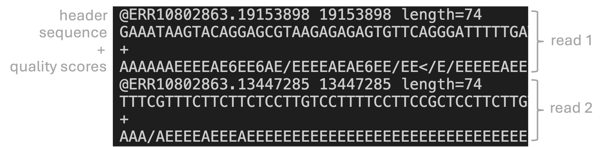
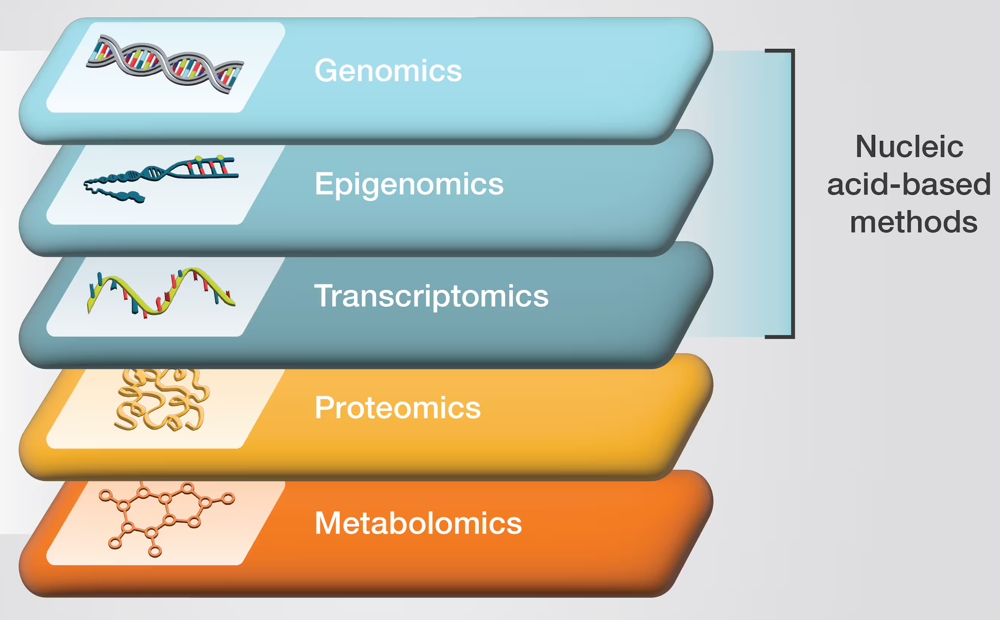

# Goals for this lecture {background-color="silver"}

## In this lecture, you will get:

- A brief general overview of omics data
- An intro to high-throughput sequencing, a key technology producing omics data
- An intro to Illumina sequencing, a key HTS technology
- An idea of what reference genomes are and what they are for
- An overview of key sequence file types (FASTA, FASTQ, etc.)
- An intro to the course's main example dataset

# An overview of omics data {background-color="silver"}

## The main omics data types

| Omics type       | Molecule type      |               |
|------------------|--------------------|:-----------------------------:|
| Genomics         | DNA                | |
| Epigenomics      | DNA modifications  | |
| Transcriptomics  | RNA                | |
| Proteomics       | Proteins           | |
| Metabolomics     | Metabolites        | |

: {.striped}

. . .

<br>

:::callout-note
#### -omics 
The "omics" suffix indicates the involvement of large-scale datasets ---
in the sense that, for example, "genomics" data typically spans much or all 
of the genome.

While the boundaries can be fuzzy,
sequencing a single gene in a single organism is not genomics,
and running qPCR for a handful of genes is not transcriptomics.
:::

## The main omics data types

| Omics type       | Molecule type      | Data mainly produced by              |
|------------------|--------------------|-----------------------------|
| Genomics         | DNA                | High-throughput sequencing  |
| Epigenomics      | DNA modifications  | High-throughput sequencing  |
| Transcriptomics  | RNA                | High-throughput sequencing  |
| Proteomics       | Proteins           | Mass Spectometry       |
| Metabolomics     | Metabolites        | Mass Spectometry       |

: {.striped}

<br>

::: callout-tip
#### This course focuses on data produced by high-througput sequencing
Genomics, epigenomics, and transcriptomics data are produced by
**High-Throughput Sequencing** (HTS) technologies.
HTS and the resulting data are the focus of this lecture are used in examples
throughout the course.

Note also that nearly all HTS currently involves **DNA** sequencing,
including epigenomics and transcriptomics data
(e.g., RNA is reverse-transcribed before sequencing).
:::

## Learn more in this week's first reading

> @poinsignon2023: *Working with omics data: An interdisciplinary challenge at the crossroads of biology and computer science*

# High-throughput sequencing (HTS) {background-color="silver"}

## An overview of sequencing technologies

**Sanger sequencing (since 1977)**\
Sequencing of a single, short-ish (≤900 bp) DNA fragment at a time.
The fragment is typically PCR-amplified and therefore specifically targeted.

. . .

<hr style="height:1pt; visibility:hidden;" />

**High-throughput sequencing (HTS, since 2005)**\
Sequencing of hundreds of thousands to billions of DNA fragments at a time.
Fragments can be targeted or randomly selected.

<hr style="height:1pt; visibility:hidden;" />

. . .

::: callout-tip
#### "Sequencing" and "reads"
Here, the shorthand "sequencing" refers to the
**determination of the nucleotide sequence of DNA fragments**.
Sequenced DNA fragments are referred to as "reads".
::::

<hr style="height:1pt; visibility:hidden;" />

. . .

::: callout-important
#### All sequencing technologies involve some degree of error
The sequences in reads are never 100% accurate,
and this has large consequences for downstream analyses.
::::

## Sequencing costs have declined sharply

...with the advent of HTS.

{width="80%" fig-align="center" fig-alt="A graph showing falling sequenicng costs over time." .lightbox}

:::legend2
<https://www.genome.gov/about-genomics/fact-sheets/Sequencing-Human-Genome-cost>
:::

## Examples of HTS applications

- **Whole-genome assembly**

. . .

- **Variant analysis** (for population genetics/genomics, molecular evolution, GWAS, etc.)

. . .

- **RNA-Seq** (transcriptome analysis)

. . .

- Other "functional" sequencing methods like **methylation sequencing, ChIP-Seq,** etc.

. . .

- **Microbial community characterization**
  - Metabarcoding
  - Shotgun metagenomics

## The two stages of many omics analyses

Omics data analysis can often be divided into **two consecutive stages**:

<hr style="height:1pt; visibility:hidden;" />

. . .

1. **Algorithmic/bioinformatic data processing**
   - [_For example: alignment of reads to a genome_]{style="color:olive"}
   - This is typically done in a **Unix shell** environment using a **supercomputer**
   - These steps are often relatively standardized, automatable, and "non-interactive"

. . . 

<hr style="height:1pt; visibility:hidden;" />

2. **Biostatistical downstream analysis**
   - [_For example: comparing expression levels of genes between treatments_]{style="color:olive"}
   - This is typically done in **R** and is typically possible to do on a laptop
   - This is often highly interactive and iterative,
     and less standardized and automatable than the previous stage.
     
## Examples of HTS data analyses

**Stage I: The algorithmic/bioinformatic parts**

- Read quality control (QC) and trimming
- Read alignment to a reference genome
- Read taxonomic classification against a reference database
- Read assembly into a genome or transcriptome
- Variant calling

<hr style="height:1pt; visibility:hidden;" />

. . .

**Stage II: The biostatistical part**

- Differential abundance of gene (RNA-Seq) or taxon (metabarcoding) counts
  among groups
- Clustering/ordination and network analyses
- Genome-wide Association Studies (GWAS)
- Statistical enrichment of functional gene categories (e.g. Gene Ontology)

## The main HTS technologies

| | Short-read HTS   | Long-read HTS
|---|-------|-------|
**Overview**    | Produces up to billions of short, highly accurate reads | Produces longer but fewer, less accurate, and more costly reads
**Main companies**  | Illumina                | Oxford Nanopore Technologies (ONT) and Pacific Biosciences (PacBio)

: {.striped}

## The main HTS technologies

| | Short-read HTS   | Long-read HTS
|---|-------|-------|
**Overview**    | Produces up to billions of short, highly accurate reads | Produces longer but fewer, less accurate, and more costly reads
**Main companies**  | Illumina                | Oxford Nanopore Technologies (ONT) and Pacific Biosciences (PacBio)
**Read lengths**    | 50-300 bp               | PacBio: 10-50 kbp / ONT: 10-100+ kbp
**Error rates**     | Mostly <0.1%            | 1-10% (ONT) / <0.1-10% (PacBio)

: {.striped}

## The main HTS technologies

|                   | Short-read HTS          | Long-read HTS
|---|-------|-------|
**Overview**    | Produces up to billions of short, highly accurate reads | Produces longer but fewer, less accurate, and more costly reads
**Main companies**  | Illumina                | Oxford Nanopore Technologies (ONT) and Pacific Biosciences (PacBio)
**Read lengths**    | 50-300 bp               | PacBio: 10-50 kbp / ONT: 10-100+ kbp
**Error rates**     | Mostly <0.1%            | 1-10% (ONT) / <0.1-10% (PacBio)
**Timeline**        | Since 2005 — technology fairly stable | Since 2011 — remains under rapid development
**Usage**           | More common             | Less common

: {.striped}

## The main HTS technologies

|                   | Short-read HTS          | Long-read HTS
|---|-------|-------|
**Overview**    | Produces up to billions of short, highly accurate reads | Produces longer but fewer, less accurate, and more costly reads
**Main companies**  | Illumina                | Oxford Nanopore Technologies (ONT) and Pacific Biosciences (PacBio)
**Read lengths**    | 50-300 bp               | PacBio: 10-50 kbp / ONT: 10-100+ kbp
**Error rates**     | Mostly <0.1%            | 1-10% (ONT) / <0.1-10% (PacBio)
**Timeline**        | Since 2005 — technology fairly stable | Since 2011 — remains under rapid development
**Usage**           | More common             | Less common
**AKA**             | Next-Generation Sequencing (NGS) | Third-generation sequencing

: {.striped}

## Video of Illumina technology



## Video of Oxford Nanopore technology



## Video of Pacific Biosciences technology



## More on read lengths and error rates

- Choosing between short-read and long-read technology has often involved a
  trade-off between **accuracy** and **read-length**.

- However: error rates of long-read technologies are rapidly decreasing.
  (While _per-base costs_ remain much higher for long-read sequencing.)

<br>

. . .

<details><summary>**Can you think of applications where longer reads are useful?**</summary>

For example:

- Genome assembly
- Taxonomic identification of single reads (microbial metabarcoding)
- Transcript isoform identification
</details>

. . .

<hr style="height:1pt; visibility:hidden;" />

<details><summary>**Can you think of applications where read length may not matter much?**</summary>

For example:

- SNP variant analysis
- Read-as-a-tag: the goal is just to know a read's origin in a reference genome,
  like in counting applications such as RNA-seq
</details>

## HTS recap

- High-throughput sequencing produces the two most prevalent kinds of omics data:
  genomics and transcriptomics (as well as epigenomics data)

<hr style="height:1pt; visibility:hidden;" />

- Many different applications exist;
  some are not just about determining the exact DNA sequence

<hr style="height:1pt; visibility:hidden;" />

- Three HTS technologies are most commonly used,
  and these produce either short (Illumina) or long (ONT and PacBio) reads

# Illumina libraries and sequencing {background-color="silver"}

## Libraries and library prep

In a sequencing context,
a "**library**" is a collection of nucleic acid fragments ready for sequencing.

<hr style="height:1pt; visibility:hidden;" />

::: {.callout-note appearance="simple"}
We'll go into some specifics of Illumina library prep
because this is the most common type of HTS,
and we'll use Illumina read files as examples throughout the course.
:::

<br>

. . .

In Illumina and other HTS libraries,
these fragments **number in the millions or billions** and are in some applications
simply randomly generated from input such as genomic DNA:

::: {style="margin-bottom: 0px;"}
{fig-align="center" fig-alt="A diagram showing the main Illumina library preparation steps." .lightbox}
:::

::: legend2
An overview of the **library prep** procedure.
This is typically done for you by a sequencing facility or company.
:::

## A closer look at the processed DNA fragments

As shown in the previous slide, after library prep,
each DNA fragment is flanked by several types of short sequences that together
make up the "**adapters**":

<br>

{fig-align="center" fig-alt="A diagram of DNA fragment in a prepared library, with adapters flanking the fragment." .lightbox}

<hr style="height:1pt; visibility:hidden;" />

. . .

::: callout-note
#### Multiplexing!
Adapters can include so-called "indices" or "barcodes" that identify individual
samples.
That way, up to 96 samples can be combined (_multiplexed_) into a single library,
i.e. into a single tube.
:::

## Paired-end vs. single-end sequencing

DNA fragments can be sequenced from both ends as shown below —   
this is called **"paired-end" (PE) sequencing**:

{fig-align="center" fig-alt="A diagram showing forward and reverse reads in paired-end sequencing." .lightbox}

. . .

<hr style="height:1pt; visibility:hidden;" />

When sequencing is instead **single-end (SE)**, no reverse read is produced:

{fig-align="center" fig-alt="A diagram showing the forward read in single-end sequencing." .lightbox}

## Insert size variation

The size of the DNA fragment (the "**insert size**" ) can vary --
both by design and because of limited precision in size selection.
In some cases, it is:

- Shorter than the *combined* read length, leading to **overlapping reads** (this can be useful):

{fig-align="center" width="70%" fig-alt="A diagram illustrating the scenario when the DNA fragment is shorter than the combined read length" .lightbox}

. . .

- Shorter than the *single* read length, leading to "**adapter read-through**"
  (i.e., the ends of the resulting reads will consist of adapter sequence, which should be removed):

{fig-align="center" width="58%" fig-alt="A diagram illustrating the scenario when the DNA fragment is shorter than the single read length" .lightbox}

::: footer
:::

# Reference genomes {background-color="silver"}

## Reference genomes

Many HTS applications either **require a "reference genome"** _or_
**involve its production.**
What exactly does reference genome refer to? It usually includes:

. . .

- **An assembly**\
  A representation of most or all of the genome DNA sequence: the genome assembly

- **An annotation**\
  This provides, for example, the *locations of genes and other genomic features*
  in the corresponding genome assembly,
  as well as functional information on these features

. . .

<hr style="height:1pt; visibility:hidden;" />

:::callout-tip
#### Taxonomic identity

Reference genomes are typically applicable at the **species level**.
For example, if you work with maize, you want a _Zea mays_ reference genome. But:

- If needed, it's often possible to work with genomes of closely related species
- Conversely, different subspecies/lines may have their own reference genomes
:::

## Reference genomes

Many HTS applications either **require a "reference genome"** _or_ **involve its production.**
What exactly does reference genome refer to? It usually includes:

- **An assembly**\
  A representation of most or all of the genome DNA sequence: the genome assembly

- **An annotation**\
  This provides, for example, the *locations of genes and other genomic features*
  in the corresponding genome assembly,
  as well as functional information on these features

<hr style="height:1pt; visibility:hidden;" />

:::callout-warning
#### Chromosomes, scaffolds, and contigs

Nearly all genome assemblies are incomplete and fragmented to some extent.
Therefore, in addition to complete chromosome sequences, assemblies may contain:

- **Contigs**: contiguous stretches of assembled sequence
- **Scaffolds**: a collection of multiple contigs known to occur on the same chromosome,
  but with gaps (often of unknown length) between them.
:::

## Illumina and reference genome recap

- **Library prep** makes nucleic acid molecules ready for sequencing,
  e.g. by attaching adapter and sample barcode sequences
  
- **Illumina sequencing** is often done with paired-end reads,
  and with multiple/many samples at a time (_multiplexing_)

. . .

<hr style="height:1pt; visibility:hidden;" />

- For many omics analyses, you need a **reference genome** assembly and annotation
  for your species or intraspecific variant of interest.
  If you don't have one, your first step may be to generate one.

# Sequence file types {background-color="silver"}

## Overview

Sequences and annotations are mostly stored in **plain-text** formats.
Some of the most common types, which you'll work with in this course, are:

- **FASTA**\
  Simple sequence files, where each entry contains a header and a DNA/AA sequence.\
  Versatile: may contain a few short sequences, entire genome assemblies, proteomes, ...

<hr style="height:1pt; visibility:hidden;" />

. . .

- **FASTQ**\
  The standard format for **HTS reads** — has a quality score for each nucleotide.

<hr style="height:1pt; visibility:hidden;" />

- **SAM/BAM**\ _[(not further discussed today)]{style="color:#969696"}_  
  An alignment format for **HTS reads**.
  E.g. produced when you align reads to a genome.
    
. . .

<hr style="height:1pt; visibility:hidden;" />

. . .

- **GTF**/**GFF**\
  A **genome annotation** format:
  tables with information such as coordinates of genes and exons.

## FASTA files

FASTA files contain one or more DNA or amino acid sequences,
with no limits on the number of sequences or the sequence lengths.

The following example FASTA file contains two entries:

``` bash
>unique_sequence_ID Optional description
ATTCATTAAAGCAGTTTATTGGCTTAATGTACATCAGTGAAATCATAAATGCTAAAAA
>unique_sequence_ID2
ATTCATTAAAGCAGTTTATTGGCTTAATGTACATCAGTGAAATCATAAATGCTAAATG
```

. . .

<hr style="height:1pt; visibility:hidden;" />

Each entry contains a **header** and the **sequence** itself, where:

- Header lines start with a "`>`" and provide identifying information for the sequence
- The sequence is often spread across multiple lines (with a fixed line width like 50 characters)

## FASTQ files

FASTQ is the standard format for HTS reads.
**Each** **read forms** **one FASTQ entry** and is represented by four lines,
which contain, respectively:

. . .

1.  A **header** that starts with `@` and e.g. uniquely identifies the read
2.  The **sequence** itself
3.  A **`+`** (plus sign)
4.  One-character **quality scores** for each base (hence FASTQ as in "Q" for "quality")

. . .

{fig-align="center" width="100%" fig-alt="An annotated screenshot of two reads in a FASTQ file." .lightbox}

## FASTQ quality scores

The quality scores in the reads represent an estimate of the error probability of
the base call.

Specifically, they correspond to a numeric "Phred" quality score ($Q$),
which is a function of the estimated probability that a base call is erroneous ($P$ ):

$$
Q = -10 * log_{10}(P)
$$

. . .

For example:

$$
-10 * log_{10}(0.1) = 10
$$

## FASTQ quality scores

The quality scores in the reads represent an estimate of the error probability of
the base call.

Specifically, they correspond to a numeric "Phred" quality score ($Q$),
which is a function of the estimated probability that a base call is erroneous ($P$ ):

$$
Q = -10 * log_{10}(P)
$$

<br>

Some specific probabilities and their rough qualitative interpretation for Illumina data:

| Phred quality score | Error probability | Rough interpretation |
|:---------------------:|-------------------|----------------------|
| **10**              | 1 in 10           | terrible             |
| **20**              | 1 in 100          | bad                  |
| **30**              | 1 in 1,000        | good                 |
| **40**              | 1 in 10,000       | excellent            |

: {.striped}

## FASTQ quality scores (cont.)

To make things a little more complicated:
the numeric Phred quality score is represented in FASTQ files
*not by the number itself*,
but by a corresponding "ASCII character".

This allows for a single-character representation of each possible score —
therefore,
**each quality score character can conveniently correspond to (& line up with) a base character**
in the read.

. . .

<hr style="height:1pt; visibility:hidden;" />

For example:

| Phred quality score | Error probability | ASCII character |
|:----:|--------------|:----:|
| **10**              | 1 in 10           | `+`             |
| **20**              | 1 in 100          | `5`             |
| **30**              | 1 in 1,000        | `?`             |
| **40**              | 1 in 10,000       | `I`             |

: {.striped}

## FASTQ quality scores (cont.)

To make things a little more complicated:
the numeric Phred quality score is represented in FASTQ files
*not by the number itself*,
but by a corresponding "ASCII character".

This allows for a single-character representation of each possible score —
therefore,
**each quality score character can conveniently correspond to (& line up with) a base character**
in the read.

<hr style="height:1pt; visibility:hidden;" />

{fig-align="center" width="100%" fig-alt="An annotated screenshot of two reads in a FASTQ file." .lightbox}

## FASTQ (cont.)

How are reads organized into different FASTQ files?
While FASTQ files can be any size, they are usually split by:

- **Read direction**\
  In paired-end (PE) sequencing,
  forward and reverse reads are typically in two separate files:

  | Read direction | File name identifier |
  |----|--------------|
  | Forward | `_R1` |
  | Reverse | `_R2` |

- **Sample**\
  Reads are normally "demultiplexed" into separate files for each sample.

. . .

With that,
having paired-end FASTQ files for 2 samples typically looks something like this:

``` bash
sample1_R1.fastq.gz
sample1_R2.fastq.gz
sample2_R1.fastq.gz
sample2_R2.fastq.gz
```

## GTF/GFF files

The very similar GTF and GFF formats are **tabular** genome annotation files with:

- One row for each annotated "**genomic feature**" (gene, exon, etc.)
- Columns with information like the genomic coordinates of the features

. . .

After a metadata header, the tabular part looks like this
(column names added for clarity):

```bash
#seqname      source  feature     start   end     score  strand  frame    attributes
NC_068937.1   Gnomon  gene        2046    110808  .       +       .       gene_id "LOC120427725"; transcript_id ""; db_xref "GeneID:120427725"; description "homeotic protein deformed"; gbkey "Gene"; gene "LOC120427725"; gene_biotype "protein_coding"; 
NC_068937.1   Gnomon  transcript  2046    110808  .       +       .       gene_id "LOC120427725"; transcript_id "XM_052707445.1"; db_xref "GeneID:120427725"; gbkey "mRNA"; gene "LOC120427725"; model_evidence "Supporting evidence includes similarity to: 25 Proteins"; product "homeotic protein deformed, transcript variant X3"; transcript_biotype "mRNA"; 
NC_068937.1   Gnomon  exon        2046    2531    .       +       .       gene_id "LOC120427725"; transcript_id "XM_052707445.1"; db_xref "GeneID:120427725"; gene "LOC120427725"; model_evidence "Supporting evidence includes similarity to: 25 Proteins"; product "homeotic protein deformed, transcript variant X3"; transcript_biotype "mRNA"; exon_number "1"; 
NC_068937.1   Gnomon  exon        52113   52136   .       +       .       gene_id "LOC120427725"; transcript_id "XM_052707445.1"; db_xref "GeneID:120427725"; gene "LOC120427725"; model_evidence "Supporting evidence includes similarity to: 25 Proteins"; product "homeotic protein deformed, transcript variant X3"; transcript_biotype "mRNA"; exon_number "2"; 
```

<hr style="height:1pt; visibility:hidden;" />

::: callout-note
#### Details for a few columns:

- _seqname_ -- Name of the chromosome, scaffold, or contig
- _source_ --- Name of the program that generated this feature, or the data source (e.g. database)
- _attribute_ --- A semicolon-separated list of tag-value pairs with additional information
:::

## Recap: Sequence file types

- FASTA

- FASTQ

- GTF/GFF
  
# The course's main example dataset {background-color="silver"}

## Garrigos et al. 2025

Throughout the course, we will use an example/practice data set,
which is from the paper:

@garrigós2025 --
*Two avian Plasmodium species trigger different transcriptional responses on their vector Culex pipiens*:

{fig-align="center" width="80%" fig-alt="A screenshot of the paper's front matter." .lightbox}

## Experimental design

This paper uses RNA-Seq data to study gene expression in *Culex pipiens* mosquitos
infected with malaria-causing *Plasmodium* protozoans ---
specifically, it compares mosquitos according to:

- **Infection status**: control vs. *Plasmodium cathemerium* vs. *P. relictum*
- **Time after infection**: 1 vs. 10 vs. 21 days (DAI)

All in all, the experimental design contains the following number of samples
(biological replicates) for each treatment combination:

|        | Control | _P. cathemerium_ | _P. relictum_ | 
|--------|:---------:|:--------:|:---------:|
| **01 DAI** |    3    |     3  |   4 
| **10 DAI** |    4    |     4  |   4 
| **21 DAI** |    4    |     4  |   3

: {.striped}

## The dataset's files

However, to keep things manageable while practicing,
I have **subset** the data to omit the 21-day samples and only keep 500,000
reads per FASTQ file.

All in all, the set of files, [available through GitHub](https://github.com/jelmerp/garrigos-data),
consists of:

- **Sequence data**: 44 paired-end 75-bp Illumina FASTQ files for 22 samples.
- A **Reference genome annotation** GTF file for _Culex pipiens_
  (we will download the assembly FASTA file separately)
- **Metadata** (sample data): A table with e.g. treatment info for each sample
- A **README** file describing the data set.

## RNA-Seq analysis steps

{fig-align="center" width="60%" fig-alt="A diagram showing the steps in an RNA-Seq analysis pipeline." .lightbox}

## RNA-Seq analysis steps (cont.)

{fig-align="center" width="60%" fig-alt="A diagram showing the steps in an RNA-Seq analysis pipeline." .lightbox}

## RNA-Seq analysis steps (cont.)

{fig-align="center" width="60%" fig-alt="A diagram showing the steps in an RNA-Seq analysis pipeline." .lightbox}

# Questions? {background-color="silver"}

<br><br><br><br>

# Bonus slides

## Omics data types

{fig-align="center" width="70%" fig-alt="A diagram showing the main omics data types." .lightbox}

::: legend2
Copyright [ThermoFisher](https://www.thermofisher.com/us/en/home/brands/thermo-scientific/molecular-biology/molecular-biology-learning-center/molecular-biology-resource-library/spotlight-articles/supporting-multi-omics-approaches.html)
:::

## Sequencing technology development timeline

{fig-align="center" width="70%" fig-alt="A graphical overview of developments in sequencing technology over time" .lightbox}

::: legend2
Modified after @pereira2020
:::

## HTS applications

{fig-align="center" width="67%" fig-alt="An annotated diagram of omics data types and associated molecular components." .lightbox}

::: legend2
From @lee2023
:::

::: footer
:::

## The sequencing process: Illumina

{fig-align="center" width="100%" fig-alt="A figure with an overview of the Illumina sequencing process." .lightbox}

::: legend2
From @poinsignon2023
:::

::: footer
:::

## The sequencing process: Oxford Nanopore

<br>

{fig-align="center" width="100%" fig-alt="A figure with an overview of the Oxford Nanopore sequencing process." .lightbox}

::: legend2
From @poinsignon2023
:::

## Correcting sequencing errors

Inferring the sequence of the source DNA despite the presence of sequencing errors
is attempted by sequencing every base multiple times,
i.e. obtaining a so-called "**depth of coverage**" greater than 1:

{fig-align="center" width="60%" fig-alt="A diagram illustraing the concept of depth of coverage." .lightbox}

<hr style="height:1pt; visibility:hidden;" />

This process is complicated by **genetic variation** among and within individuals.

<hr style="height:1pt; visibility:hidden;" />

::: {.callout-tip appearance="simple"}
_Typical depths of coverage: ~50-100x for genome assembly; 10-30x for resequencing._
:::

## Genome size variation

{fig-align="center" width="63%" fig-alt="A graph illustrating genome size differences among major taxonomic groups." .lightbox}

::: legend2
<https://en.wikipedia.org/wiki/Genome_size>
:::


## Growth of genome databases

{fig-align="center" width="85%" fig-alt="A graph showing the rapid increase in data in genome databases." .lightbox}

::: legend2
@konkel2023
:::

## References
