## Goals for this lecture

- A brief general overview of **omics data**

- An intro to **high-throughput sequencing**, a key technology that produces omics data

- An intro to **Illumina sequencing**, a key HTS technology

. . .

- An idea of what **reference genomes** are and what they are for

- An overview of the course's main **example dataset**

# An overview of omics data {background-color="silver"}

## The main omics data types

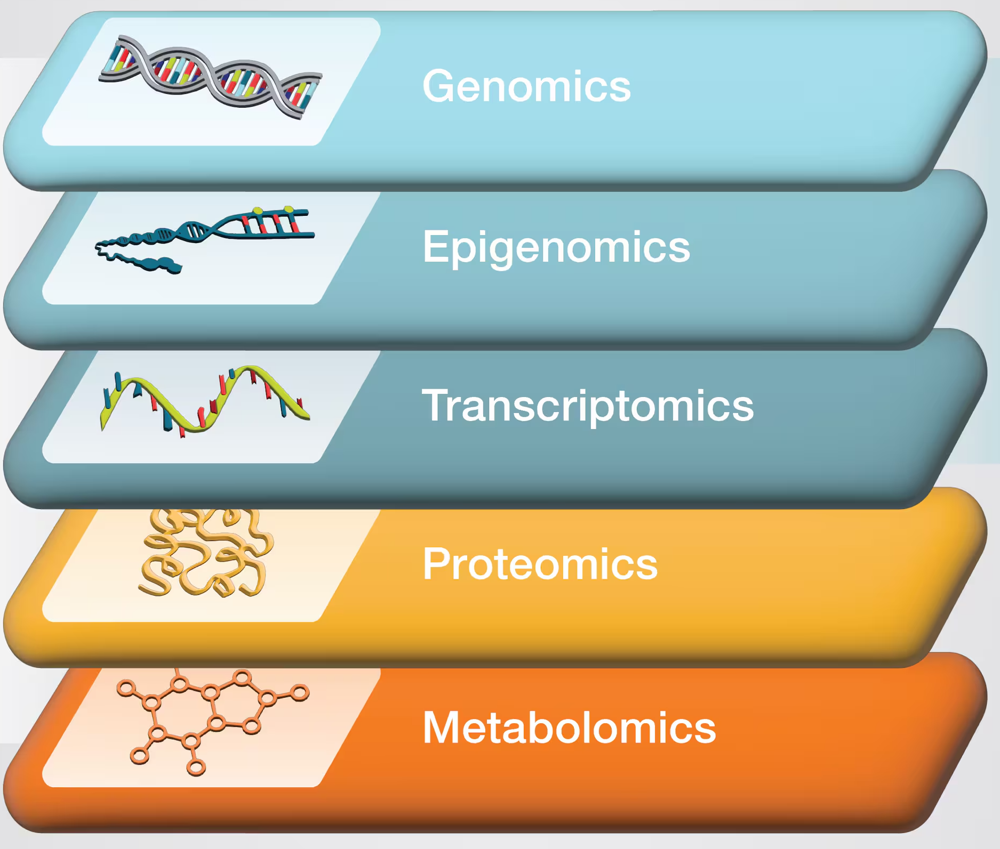{fig-align="center" width="55%" fig-alt="A diagram showing the main omics data types." .lightbox}

::: legend2
Copyright [ThermoFisher](https://www.thermofisher.com/us/en/home/brands/thermo-scientific/molecular-biology/molecular-biology-learning-center/molecular-biology-resource-library/spotlight-articles/supporting-multi-omics-approaches.html)
:::

## The main omics data types (cont.)

| Omics type       | Molecule type      |               |
|------------------|--------------------|-----------------------------|
| Genomics         | DNA                | |
| Epigenomics      | DNA modifications  | [**High-throughput sequencing (HTS)**]{style="color:white"} |
| Transcriptomics  | RNA                | |
| Proteomics       | Proteins           | |
| Metabolomics     | Metabolites        | |

: {.striped}

. . .

 

:::callout-note
#### -omics 
The "omics" suffix indicates the involvement of large-scale datasets ---
in the sense that, for example, "genomics" data typically spans much or all 
of the genome.

While the boundaries can be fuzzy,
sequencing a single gene in a single organism is not genomics,
and running qPCR for a handful of genes is not transcriptomics.
:::

## The main omics data types (cont.)

| Omics type       | Molecule type      | Data mainly produced by              |
|------------------|--------------------|-----------------------------|
| Genomics         | DNA                | [**High-throughput sequencing (HTS)**]{style="color:#00A087FF"}  |
| Epigenomics      | DNA modifications  | [**High-throughput sequencing (HTS)**]{style="color:#00A087FF"}  |
| Transcriptomics  | RNA                | [**High-throughput sequencing (HTS)**]{style="color:#00A087FF"}  |
| Proteomics       | Proteins           | [**Mass Spectrometry**]{style="color:#3C5488FF"}       |
| Metabolomics     | Metabolites        | [**Mass Spectrometry**]{style="color:#3C5488FF"}       |

: {.striped}

 

HTS and the resulting data are the focus of the rest of this lecture,
and used in examples throughout the course.

. . .

::: {.callout-tip appearance="simple"}
Note that nearly all HTS currently involves **DNA** sequencing,
including epigenomics and transcriptomics data
(e.g., RNA is reverse-transcribed before sequencing).
:::

## Learn more in this week's first reading

@poinsignon2023: *Working with omics data: An interdisciplinary challenge at the crossroads of biology and computer science*

::: {style="margin-bottom: 0px;"}
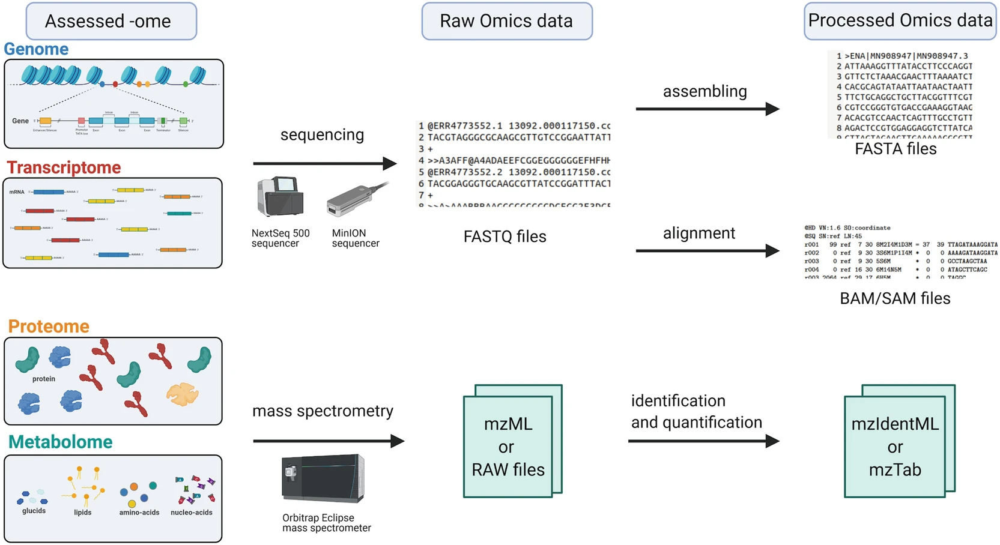{width="65%" fig-align="center" fig-alt="A diagram showing how different kinds of omics data are produced and analyzed." .lightbox}
:::

::: legend2
Figure 2 from the paper.
:::

# High-throughput sequencing (HTS) {background-color="silver"}

## Sanger vs. high-throughput sequencing

**Sanger sequencing (since 1977)**\
Sequencing of a single, short DNA fragment at a time.
The fragment is typically PCR-amplified and therefore specifically targeted.

. . .

**High-throughput sequencing (HTS, since 2005)**\
Sequencing of hundreds of thousands to billions of DNA fragments at a time.
Fragments can be targeted in various ways or randomly generated from input DNA.

. . .

::: callout-important
#### Reads and sequencing errors
Sequenced DNA fragments are referred to as "**reads**".
With current technologies, reads are never 100% accurate,
and this has large consequences for downstream analyses.
::::

## The main HTS technologies

| | Short-read HTS   | Long-read HTS
|---|-------|-------|
[**Main companies**]{style="color:white"}  | [Illumina]{style="color:white"}                | [Oxford Nanopore Technologies (ONT) & Pacific Biosciences (PacBio)]{style="color:white"}

## The main HTS technologies

| | Short-read HTS   | Long-read HTS
|---|-------|-------|
**Usage**           | Most common                    | Less common (but increasing)
**Main companies**  | Illumina                | Oxford Nanopore Technologies (ONT) & Pacific Biosciences (PacBio)
**Timeline**        | Since 2005 — [technology fairly stable]{style="color:crimson"} | Since 2011 — [still rapid development]{style="color:green"}

: {.striped}

## The main HTS technologies

|                   | Short-read HTS          | Long-read HTS
|---|-------|-------|
**Usage**           | Most common                    | Less common (but increasing)
**Main companies**  | Illumina                | Oxford Nanopore Technologies (ONT) & Pacific Biosciences (PacBio)
**Timeline**        | Since 2005 — [technology fairly stable]{style="color:crimson"} | Since 2011 — [still rapid development]{style="color:green"}
**Read lengths**    | [50-300 bp]{style="color:crimson"}               | [10-100+ kbp]{style="color:green"}
**Error rates**     | [Mostly <0.1%]{style="color:green"}            | [1-10% (ONT) / <0.1-10% (PacBio)]{style="color:crimson"}
**Throughput**    | [Higher]{style="color:green"} | [Lower]{style="color:crimson"}
**Cost per base**    | [Lower]{style="color:green"} | [Higher]{style="color:crimson"}

: {.striped}

## The main HTS technologies

|                   | Short-read HTS          | Long-read HTS
|---|-------|-------|
**Usage**           | Most common                    | Less common (but increasing)
**Main companies**  | Illumina                | Oxford Nanopore Technologies (ONT) & Pacific Biosciences (PacBio)
**Timeline**        | Since 2005 — [technology fairly stable]{style="color:crimson"} | Since 2011 — [still rapid development]{style="color:green"}
**Read lengths**    | [50-300 bp]{style="color:crimson"}               | [10-100+ kbp]{style="color:green"}
**Error rates**     | [Mostly <0.1%]{style="color:green"}            | [1-10% (ONT) / <0.1-10% (PacBio)]{style="color:crimson"}
**Throughput**    | [Higher]{style="color:green"} | [Lower]{style="color:crimson"}
**Cost per base**    | [Lower]{style="color:green"} | [Higher]{style="color:crimson"}
**AKA**             | Next-Generation Sequencing (NGS) | Third-generation sequencing

: {.striped}

## Video of Illumina technology



## Video of Oxford Nanopore technology



## Video of Pacific Biosciences technology



## Examples of HTS applications

- **Whole-genome assembly**

. . .

- **Variant analysis** (for population genetics/genomics, molecular evolution, GWAS, etc.)

. . .

- **RNA-Seq** (transcriptome analysis)

. . .

- Other "functional" sequencing methods like **methylation sequencing, ChIP-Seq,** etc.

. . .

- **Microbial community characterization**
  - Metabarcoding
  - Shotgun metagenomics

## Read lengths

**Can you think of applications where longer reads are useful?**

For example:

- Genome assembly
- Taxonomic identification of single reads (microbial metabarcoding)

. . .

**Can you think of applications where read length may not matter much?**

For example:

- (SNP) variant analysis
- Read-as-a-tag: the goal is just to know a read's origin in a reference genome,
  like in counting applications such as RNA-seq.

## The two stages of many HTS analyses

HTS and other omics data analysis can often be roughly divided into
**two consecutive stages**:

. . .

1. **Algorithm-heavy initial data processing**
   - [_For example: alignment of reads to a genome_]{style="color:olive"}
   - This is typically done in a **Unix shell** environment using a **supercomputer**
   - These steps are often relatively standardized, automatable, and "non-interactive"

. . . 

2. **Downstream statistical analysis and visualization**
   - [_For example: comparing expression levels of genes between groups_]{style="color:olive"}
   - This is typically done in **R** and is typically possible to do on a laptop
   - This is often highly interactive and iterative,
     and less standardized and automatable than the previous stage.
     
## Examples of HTS data analyses

**Stage I**

- Read quality control (QC) and trimming
- Read alignment to a reference genome
- Read taxonomic classification against a reference database
- Read assembly into a genome or transcriptome
- Variant calling

. . .

**Stage II**

- Differential abundance of gene (RNA-Seq) or taxon (metabarcoding) counts
  among groups
- Clustering/ordination and network analyses
- Genome-wide Association Studies (GWAS)
- Statistical enrichment of functional gene categories (e.g. Gene Ontology)

## HTS recap

- High-throughput sequencing produces the two most prevalent kinds of omics data:
  genomics and transcriptomics (as well as epigenomics data)

- Three HTS technologies are most commonly used,
  and these produce either short (Illumina) or long (ONT and PacBio) reads

- Many different applications exist;
  some are not just about determining the exact DNA sequence
  
# Illumina libraries and sequencing {background-color="silver"}

## Libraries and library prep

In a sequencing context,
a "**library**" is a collection of nucleic acid fragments ready for sequencing.

::: {.callout-note appearance="simple"}
We'll go into some specifics of Illumina library prep
because this is the most common type of HTS,
and we'll use Illumina read files as examples throughout the course.
:::

 

. . .

In Illumina and other HTS libraries,
these fragments **number in the millions or billions** and are often
simply randomly generated from input such as genomic DNA:

::: {style="margin-bottom: 0px;"}
{fig-align="center" fig-alt="A diagram showing the main Illumina library preparation steps." .lightbox}
:::

::: legend2
An overview of the **library prep** procedure.
This is typically done for you by a sequencing facility or company.
:::

## A closer look at the processed DNA fragments

As shown in the previous slide, after library prep,
each DNA fragment is flanked by several types of short sequences that together
make up the "**adapters**":

 

{fig-align="center" fig-alt="A diagram of DNA fragment in a prepared library, with adapters flanking the fragment." .lightbox}

. . .

::: callout-note
#### Multiplexing!
Adapters can include so-called "indices" or "barcodes" that identify individual
samples.
That way, up to 96 samples can be combined (_multiplexed_) into a single library,
i.e. into a single tube.
:::

## Paired-end vs. single-end sequencing

DNA fragments can be sequenced from both ends as shown below —   
this is called **"paired-end" (PE) sequencing**:

{fig-align="center" fig-alt="A diagram showing forward and reverse reads in paired-end sequencing." .lightbox}

. . .

When sequencing is instead **single-end (SE)**, no reverse read is produced:

{fig-align="center" fig-alt="A diagram showing the forward read in single-end sequencing." .lightbox}

## Insert size variation

The DNA fragment's size ("**insert size**" ) can vary --
by design, but also because of limited precision in size selection.
In some cases, it is:

Shorter than the *combined* read length, which leads to?

- **Overlapping reads** (this can be useful!):

{fig-align="center" width="70%" fig-alt="A diagram illustrating the scenario when the DNA fragment is shorter than the combined read length" .lightbox}

. . .

Shorter than the *single* read length, which leads to?

- "**Adapter read-through**": the final bases in the resulting reads will consist of
  adapter sequence, which should be removed before moving on.

{fig-align="center" width="58%" fig-alt="A diagram illustrating the scenario when the DNA fragment is shorter than the single read length" .lightbox}

# Reference genomes {background-color="silver"}

## Reference genomes

Many HTS applications either **require a "reference genome"** _or_
**involve its production.**
What exactly does reference genome refer to? It usually includes:

. . .

- **An assembly**\
  A representation of most or all of the genome DNA sequence: the genome assembly

- **An annotation**\
  Provides e.g. *locations of genes and other genomic "features"*
  in the corresponding genome assembly, and functional information for these features

. . .

:::callout-tip
#### Taxonomic identity

Reference genomes are typically applicable at the **species level**.
For example, if you work with maize, you want a _Zea mays_ reference genome. But:

- If needed, it's often possible to work with genomes of closely related species
- Conversely, different subspecies/lines may have their own reference genomes
:::

## Reference genomes

Many HTS applications either **require a "reference genome"** _or_ **involve its production.**
What exactly does reference genome refer to? It usually includes:

- **An assembly**\
  A representation of most or all of the genome DNA sequence: the genome assembly

- **An annotation**\
  Provides e.g. *locations of genes and other genomic "features"*
  in the corresponding genome assembly, and functional information for these features

:::callout-warning
#### Chromosomes, scaffolds, and contigs

Nearly all genome assemblies are incomplete and fragmented to some extent.
Therefore, in addition to complete chromosome sequences, assemblies may contain:

- **Contigs**: contiguous stretches of assembled sequence
- **Scaffolds**: a collection of multiple contigs known to occur on the same chromosome,
  but with gaps (often of unknown length) between them.
:::

## Illumina and reference genome recap

- **Library prep** makes nucleic acid fragments ready to be sequenced,
  e.g. by attaching adapter and sample barcode sequences
  
- **Illumina sequencing** is often done with paired-end reads,
  and with multiple/many samples at a time (_multiplexing_)

. . .

- For many omics analyses, you need a **reference genome** assembly and annotation
  for your species or intraspecific variant of interest.
  If you don't have one, your first step may be to generate one.

# The course's main example dataset {background-color="silver"}

## Garrigós et al. 2025

Throughout the course, we'll use an example/practice data set from 
@garrigós2025:

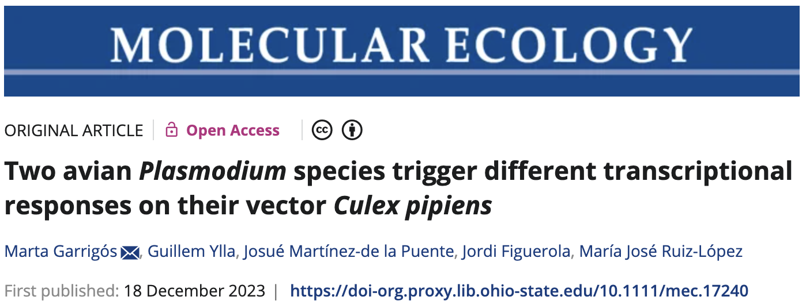{fig-align="center" width="75%" fig-alt="A screenshot of the paper's front matter." .lightbox}

This paper uses **paired-end Illumina RNA-Seq data** to study gene expression in
*Culex pipiens* mosquitos infected with two different malaria-causing *Plasmodium*
protozoans.

## Analysis stage I: from reads to gene counts

{fig-align="center" width="72%" fig-alt="A diagram of RNA-Seq analysis steps." .lightbox}

::: footer
:::

## Analysis stage I: from reads to gene counts (cont.)

{fig-align="center" width="72%" fig-alt="A diagram of RNA-Seq analysis steps." .lightbox}

::: footer
:::

## Analysis stage I: from reads to gene counts (cont.)

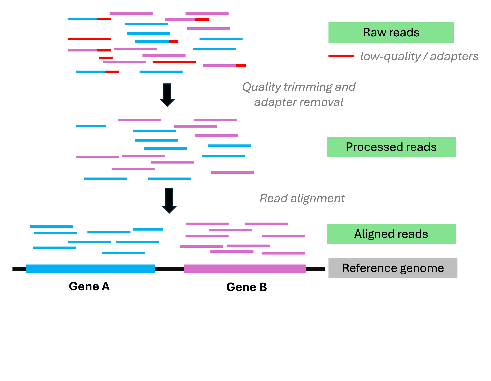{fig-align="center" width="72%" fig-alt="A diagram of RNA-Seq analysis steps." .lightbox}

::: footer
:::

## Analysis stage I: from reads to gene counts (cont.)

{fig-align="center" width="72%" fig-alt="A diagram of RNA-Seq analysis steps." .lightbox}

::: footer
:::

## Analysis stage I: from reads to gene counts (cont.)

{fig-align="center" width="72%" fig-alt="A diagram of RNA-Seq analysis steps." .lightbox}

::: footer
:::

## Analysis stage I: from reads to gene counts  (cont.)

This is what the Adobe Firefly AI came up with when I tried to get
it to help me with producing the diagram on the previous slide 👌 💯

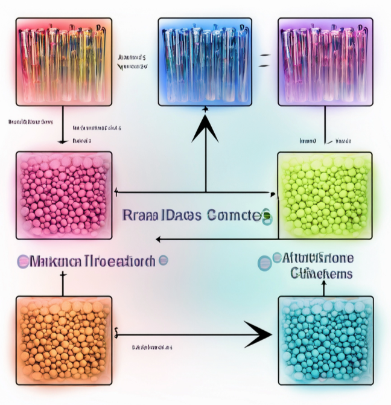{fig-align="center" width="45%" fig-alt="Adobe Firefly's image when asking it create a diagram of RNA-Seq analysis steps." .lightbox}

## Analysis stage II: gene count analysis

A comparison of gene counts between treatments to see which genes differ in
expression levels between treatments.
For example, see the plot below for gene counts for a single gene:

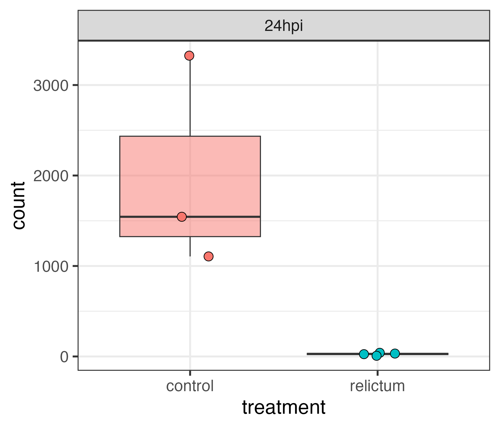{fig-align="center" width="50%" fig-alt="A plot comparing gene expression levels for a single gene between two treatments." .lightbox}

## What's next?

At the beginning of week 3,
we'll discuss some related and follow-up material to today's lecture:

- Sequence file types (like the FASTQ format that contains HTS reads)

- More details on the Garrigós dataset (and the paper will be reading material for that week)

- A more detailed overview of the data processing and analysis steps we will
  perform on the Garrigós dataset

# Questions? {background-color="silver"}

    

# Bonus slides

## Sequencing technology development timeline

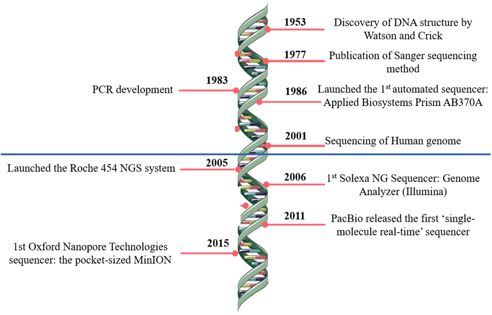{fig-align="center" width="70%" fig-alt="A graphical overview of developments in sequencing technology over time" .lightbox}

::: legend2
Modified after @pereira2020
:::

## Sequencing costs have declined sharply

...with the advent of HTS.

{width="80%" fig-align="center" fig-alt="A graph showing falling sequenicng costs over time." .lightbox}

:::legend2
<https://www.genome.gov/about-genomics/fact-sheets/Sequencing-Human-Genome-cost>
:::

## HTS applications

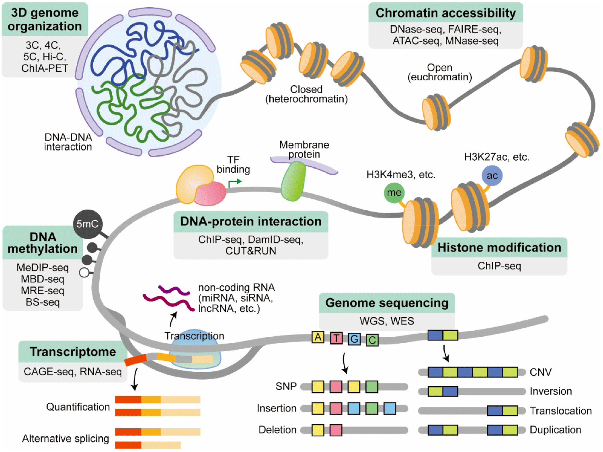{fig-align="center" width="67%" fig-alt="An annotated diagram of omics data types and associated molecular components." .lightbox}

::: legend2
From @lee2023
:::

::: footer
:::

## The sequencing process: Illumina

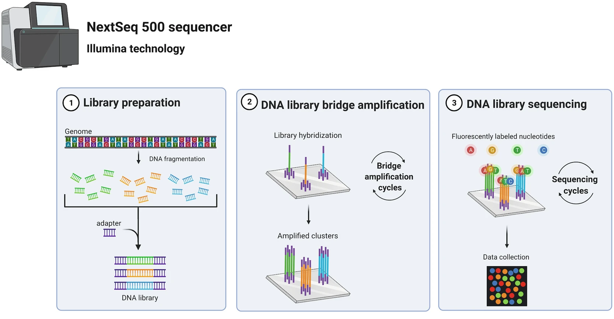{fig-align="center" width="100%" fig-alt="A figure with an overview of the Illumina sequencing process." .lightbox}

::: legend2
From @poinsignon2023
:::

::: footer
:::

## The sequencing process: Oxford Nanopore

 

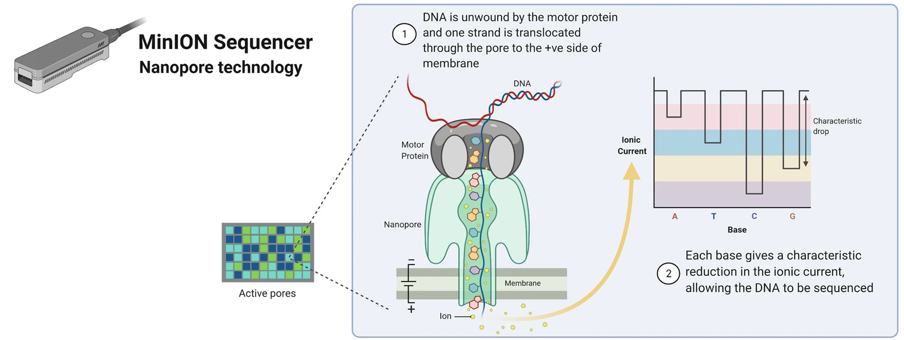{fig-align="center" width="100%" fig-alt="A figure with an overview of the Oxford Nanopore sequencing process." .lightbox}

::: legend2
From @poinsignon2023
:::

## Correcting sequencing errors

Inferring the sequence of the source DNA despite the presence of sequencing errors
is attempted by sequencing every base multiple times,
i.e. obtaining a so-called "**depth of coverage**" greater than 1:

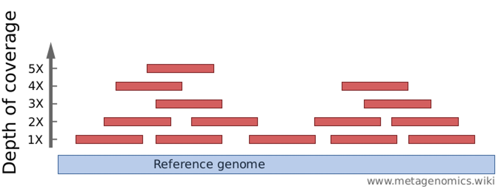{fig-align="center" width="60%" fig-alt="A diagram illustraing the concept of depth of coverage." .lightbox}

This process is complicated by **genetic variation** among and within individuals.

::: {.callout-tip appearance="simple"}
_Typical depths of coverage: ~50-100x for genome assembly; 10-30x for resequencing._
:::

## Genome size variation

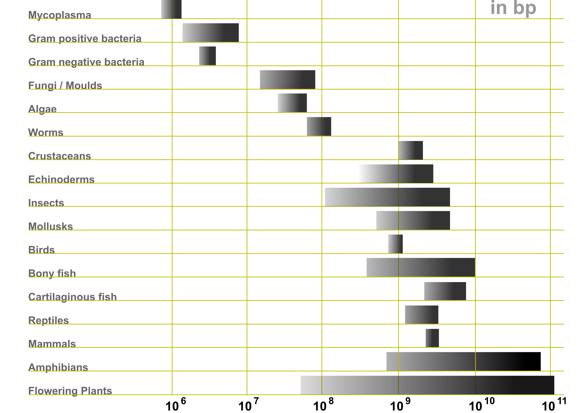{fig-align="center" width="63%" fig-alt="A graph illustrating genome size differences among major taxonomic groups." .lightbox}

::: legend2
<https://en.wikipedia.org/wiki/Genome_size>
:::

## Growth of genome databases

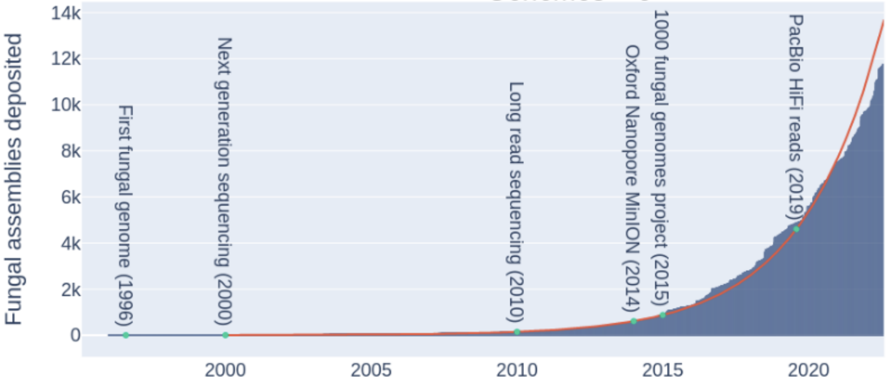{fig-align="center" width="85%" fig-alt="A graph showing the rapid increase in data in genome databases." .lightbox}

::: legend2
@konkel2023
:::

## From samples to reads for RNA-Seq

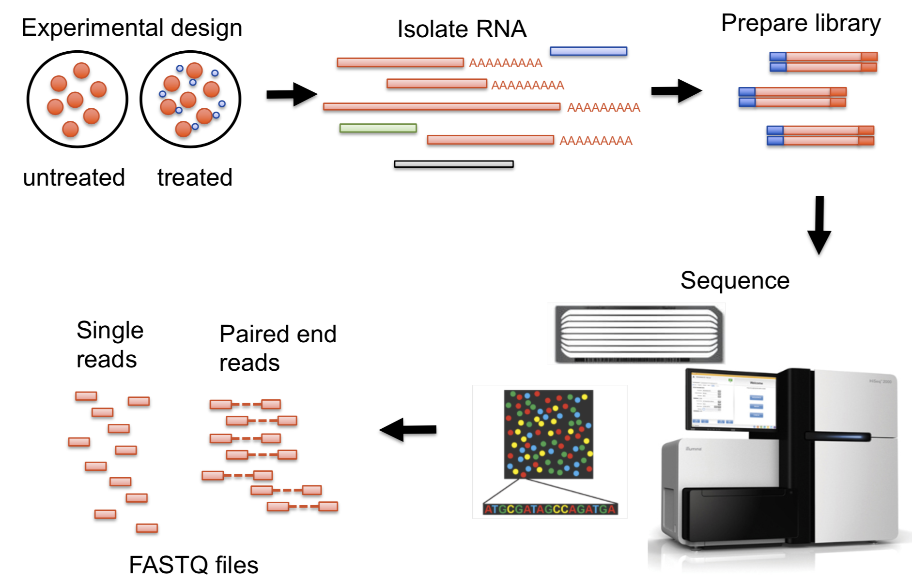

## Overview of all key RNA-Seq analysis steps

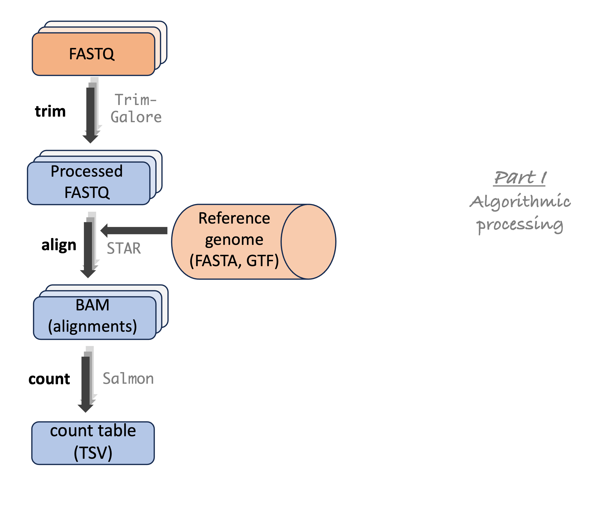{fig-align="center" width="60%" fig-alt="A diagram showing the steps in an RNA-Seq analysis pipeline." .lightbox}

## Overview of all key RNA-Seq analysis steps (cont.)

{fig-align="center" width="60%" fig-alt="A diagram showing the steps in an RNA-Seq analysis pipeline." .lightbox}

## Overview of all key RNA-Seq analysis steps (cont.)

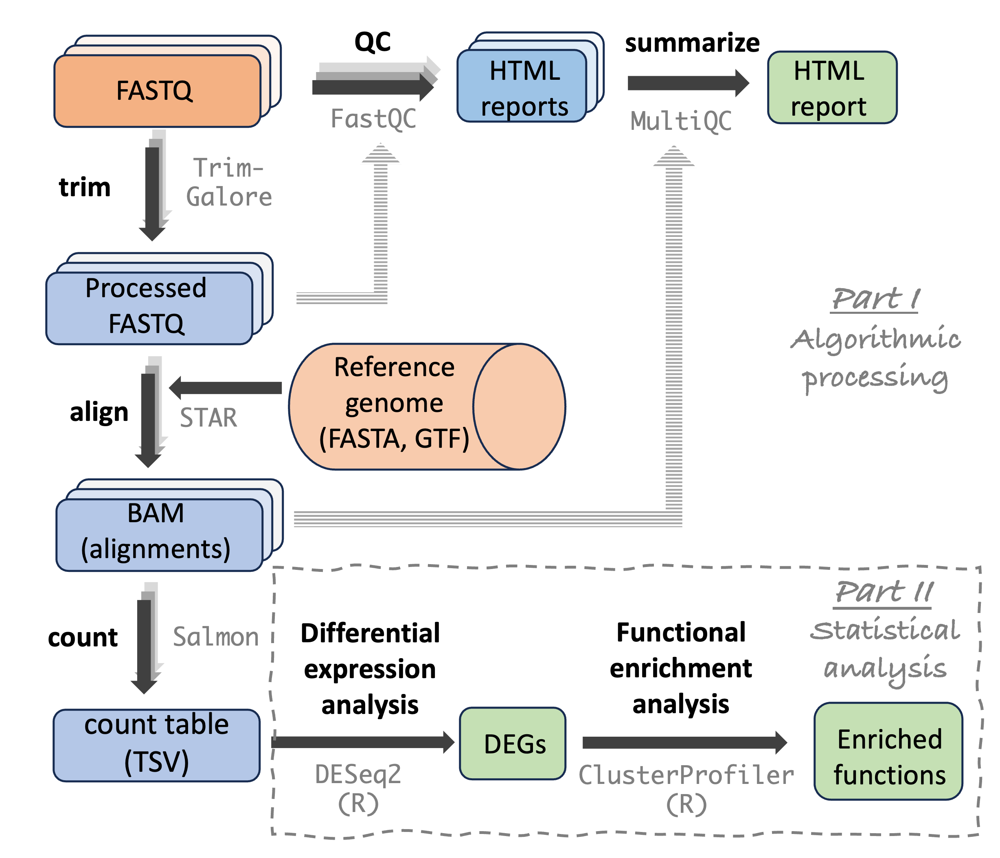{fig-align="center" width="60%" fig-alt="A diagram showing the steps in an RNA-Seq analysis pipeline." .lightbox}

## References
