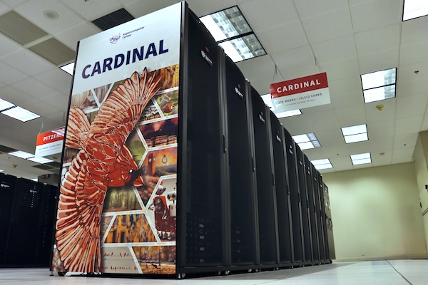
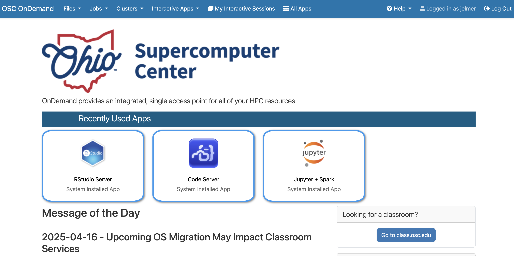
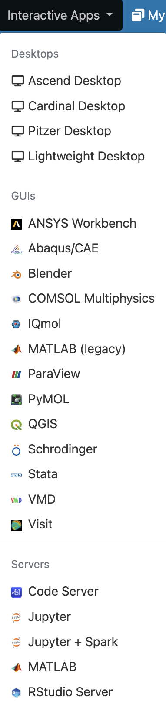
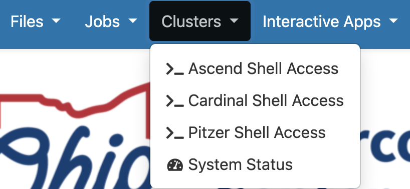

------------------------------------------------------------------------

{fig-align="center" width="25%" fig-alt="The Ohio Supercomputer Center logo." .lightbox}

## Introduction

### Overview

This session introduces high-performance computing 
and the Ohio Supercomputer Center (OSC).

This is only meant as a brief overview to give you some context about
the working environment that you will start using next week:
**you will do all your coding and computing at OSC during this course**.

Along the way, you'll learn a lot more about most topics that we will touch on here.
Specifically, a deeper dive into OSC will follow in week 5.

### Learning goals

In this session, you will learn:

- What a supercomputer is and why they are useful
- What resources the Ohio Supercomputer Center (OSC) provides
- How to access OSC resources through its OnDemand webportal

## High-performance computing

A **supercomputer** (also known as a "compute cluster" or simply a "**cluster**")
consists of many computers that are connected by a high-speed network,
and that can be _accessed remotely_ by its users.

Supercomputers provide high-performance computing (**HPC**) resources,
which consists of two main aspects:

- "Compute": computing power to run your data processing and analysis
- Storage: space for (long-term) storage of your data and results

This is what Cardinal, one of the OSC supercomputers, physically looks like:

{fig-align="center" width="50%" fig-alt="A photo of the Cardinal OSC cluster" .lightbox}

Here are some possible reasons to use a supercomputer instead of your own laptop or desktop:

- Your analyses take a long time to run, need large numbers of processors,
  or a large amount of memory.
- You need to run an analysis many times.
- You need to store a lot of data.
- Your analyses require software available only for the Linux operating system, but you have Windows.
- Your analyses require specialized hardware, such as GPUs (Graphical Processing Units).

**When you're working with omics data, many of these reasons typically apply.**
This can make it hard or impossible to run all your analyses on your
personal workstation, and supercomputers provide a solution.

## The Ohio Supercomputer Center (OSC)

The Ohio Supercomputer Center (OSC) is a facility provided by the state of Ohio.
It has several supercomputers, lots of storage space,
and an excellent infrastructure for accessing these resources.

Access to OSC's compute and storage goes through **OSC "Projects"**:

- A project can be tied to a research project or lab, or be educational like this course's project, `PAS2880`.
- Each project has a budget in terms of "compute hours" and storage space^[
  Though we don't have to pay anything for educational projects like this one!]
- As a user, it's possible to be a member of multiple different projects.
- OSC projects are typically requested and managed by PIs.

::: {.callout-note}
#### OSC websites

OSC has **three main websites** ---
in this course, we will almost exclusively use the first:

- **<https://ondemand.osc.edu>**: A web portal to use OSC resources through your browser (*login needed*).
- <https://my.osc.edu>: Account and project management (*login needed*).
- <https://osc.edu>: General website with information about the supercomputers, installed software, and usage.

:::

## The structure of a supercomputer center

### Terminology

Let's start with some (super)computing terminology,
going from smaller things to bigger things:

- **Node**\
  A single computer that is a part of a supercomputer.
- **Supercomputer / Cluster**\
  A collection of connected computers.
  OSC currently has three: "Ascend", "Cardinal", and "Pitzer".
- **Supercomputer Center**\
  A facility like OSC that has one or more supercomputers.

### Supercomputer components

We can think of a supercomputer as having three main parts:

- **File Systems**: Where files are stored (these are shared between the OSC supercomputers!)
- **Login Nodes**: The handful of computers everyone shares after logging in
- **Compute Nodes**: The many computers you can reserve to run your analyses

We wil briefly discuss these below,
and come back to them in more detail later in the course.

{fig-align="center" width="85%" fig-alt="A diagram showing the structure of a supercomputer with three main components: file systems, login nodes, and compute nodes" .lightbox}

#### File systems

OSC has several distinct file systems:

| File system | Located within "path" | Main purpose
|------|-------|-----------------|
| **Project**     | `/fs/ess/`   | OSC's main data storage location
| **Scratch**     | `/fs/scratch/`    | Additional, temporary storage
| **Home**        | `/users/`         | General, _personal_ files not tied to research projects or courses

: {.striped .hover}

During the course, we'll work in the project folder of the course's OSC Project
`PAS2880`: `/fs/ess/PAS2880`.

{fig-align="center" width="40%" .lightbox fig-alt="A diagram showing paths on OSC and navigating upwards with relative paths"}

::: callout-tip
#### Paths?
Paths, like those shown in the table above,
specify the _locations of folders and files on a computer_.
You will learn more about them in the next few weeks.
:::

#### Login Nodes

Login nodes are an initial landing spot for everyone who logs in to a supercomputer.
There are only a handful of them on each supercomputer,
they are shared among everyone, and cannot be reserved for exclusive usage.

Therefore, login nodes are meant only for things like organizing files and
creating scripts for compute jobs.
They are ***not*** **meant for serious computing** -- in other words,
they don't provide compute, which is the function of compute nodes.

#### Compute Nodes

Data processing and analysis is done on compute nodes.
You can only use compute nodes after putting in a **request for compute resources**
(a "compute job").

A *job scheduler* program called _Slurm_,
which you'll learn to use later in this course, then assigns the requested resources:
you may, for example, get exclusive access to a specific compute node for two hours.

::: {.callout-caution collapse="true"}
## When using scripts, what works differently on a supercomputer like OSC? _(Click to expand)_

The processing and analysis of data on a supercomputer is typically done by running
code through scripts.

If you have some familiarity with doing so on a laptop or a desktop,
you may wonder what (else) works differently on a supercomputer like at OSC.
You'll learn much more about these later on in the course, but here is an overview: 

- **"Non-interactive" computing is common**\
  It is common to write and then submit scripts to a queue instead of running programs interactively.
- **Software**\
  You generally can't install software like on a personal computer,
  and a lot of installed software needs to be "loaded" before you can use it.
- **Operating system**\
  Supercomputers run on the Linux operating system rather than on Windows or MacOS.
- **Login versus compute nodes**\
  As mentioned, the nodes you end up on after logging in are not meant for heavy computing
  and you have to *request access to compute nodes* to run most analyses.    
:::

## OSC OnDemand

The OSC OnDemand web portal is an amazing recourse that allows you to use a
web browser to access OSC resources. For example, it offers access to:

- A **file browser/explorer**
- A **Unix shell**
- "**Interactive Apps**": programs such as RStudio and VS Code

-----

 **Go to <https://ondemand.osc.edu> and log in** (use the boxes on the left-hand side).
Once logged in, you should see a landing page similar to the one below:

{fig-align="center" width="95%" fig-alt="A screenshot of the OSC OnDemand landing page" .lightbox}

We will now go through some of the dropdown menus in the **blue bar along the top**.

### Files menu

Hovering over the **Files** dropdown menu gives a list of folders that you have access to.
If your account is brand new, and you were added to `PAS2880`,
you should only see three folders listed:

1.  A **Home** folder (starts with `/users/`)
2.  The `PAS2880` project's "**project**" folder (`/fs/ess/PAS2880`)
3.  The `PAS2880` project's "**scratch**" folder (`/fs/scratch/PAS2880`) 

You will only ever have one Home folder at OSC,
but for every additional project you are a member of,
you will usually see additional `/fs/ess` and `/fs/scratch` folders appear.

-----

 **Click on our project folder `/fs/ess/PAS2880`**.
Once there, you should see the folders and files present at the selected location,
and you can click on folders to explore their contents:

{fig-align="center" width="95%" fig-alt="A screenshot of the OSC OnDemand file browser." .lightbox}

This interface is **much like the file browser on your own computer**, so you can also create, delete, move and copy files and folders, and even upload (from your computer to OSC) and download (from OSC your computer) files^[Though this is not meant for large (\>1 GB) transfers. Different methods are available --- we'll talk about those later on.] --- see the buttons across the top.

---- 

 **Create a personal folder** inside `/fs/ess/PAS2880/users`:

1. Click on the `users` folder
2. Click the "New Directory" (_**directory -or dir for short- is another word for folder**_)
   at the top
3. Give the new folder the **exact same name** as your OSC username.
   If you forgot your username, you can see it in the top-right corner of the OnDemand webpage.
4. Click on the new folder and within it,
   create two more folders: one called `week02` and one called `week03`.
   (You will use those folders in the next two weeks.)

### Interactive Apps menu

You can access programs with Graphical User Interfaces (**GUI**s; point-and-click interfaces)
via the **Interactive Apps** dropdown menu:

{fig-align="center" width="20%" fig-alt="A screenshot of the options in the OSC Ondemand Interactive Apps dropdown menu." .lightbox}

Next week, you'll start using the VS Code text editor,
which is listed here as `Code Server`,
to write Markdown files and work in the Unix shell.
Later, you'll also use `RStudio Server`^[
Which is just a version of RStudio that can run in a browser.]
to code in R.

### Clusters menu

#### System Status

In the "**Clusters**" dropdown menu, click on the item at the bottom, "**`System Status`**":

{fig-align="center" width="40%" fig-alt="A screenshot of the options in the OSC OnDemand Clusters dropdown menu." .lightbox}

This page shows an overview of the live, current usage of the two clusters ---
for now,
this should mostly just give you a good idea of the scale of the supercomputer center.
It can also be useful to learn which cluster is used more and what the sizes of
the "queues" (these contain jobs that are waiting to start) are at any given time.

{fig-align="center" width="90%" fig-alt="A screenshot of the OSC Ondemand System Status page showing live cluster usage." .lightbox}

::: {.callout-note collapse="true"}
#### Direct Unix shell acccess _(Click to expand)_

Interacting with a supercomputer is most commonly done using a so-called "Unix shell",
which is a command-line interface to a computer that you'll use throughout the course.
Still under the **Clusters** dropdown menu (see the screenshot above),
you can access a Unix shell on Ascend, Cardinal, or Pitzer.

If you click `Cardinal Shell Access`,
a new browser tab will open where the bottom of the page looks like this:

{fig-align="center" width="95%"fig-alt="A screenshot of a Unix shell opened via the Clusters menu on OSC OnDemand." .lightbox}

During the course,
you will instead access a Unix shell via the Code Server Interactive App.
Still, the abovementioned method can occasionally be useful as a more rapid access point.
:::

