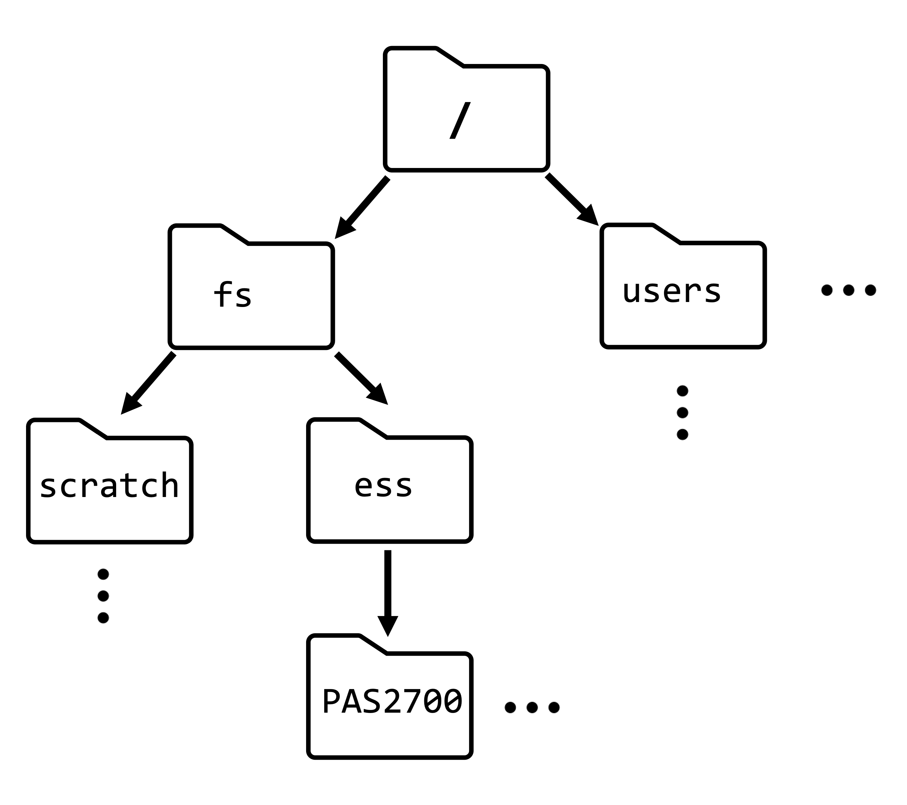
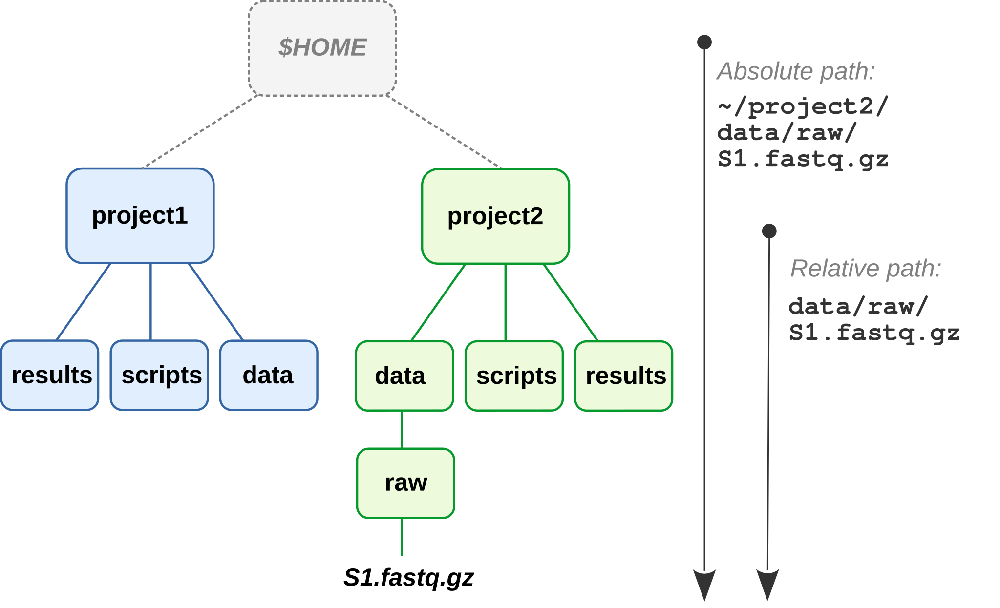
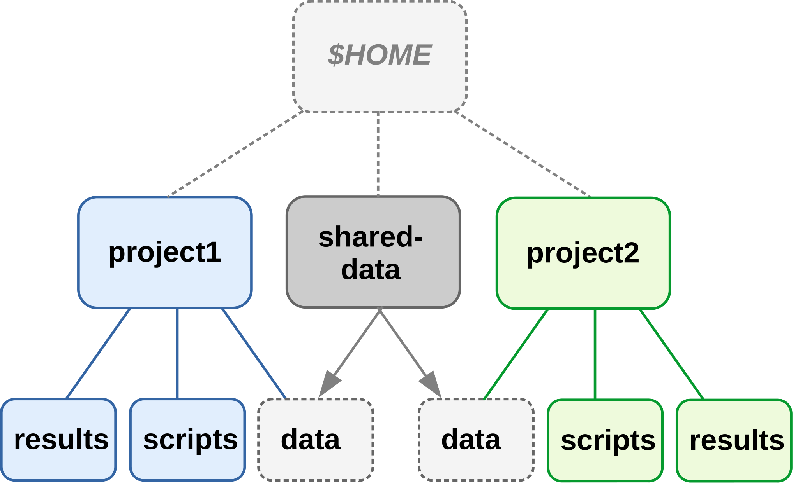
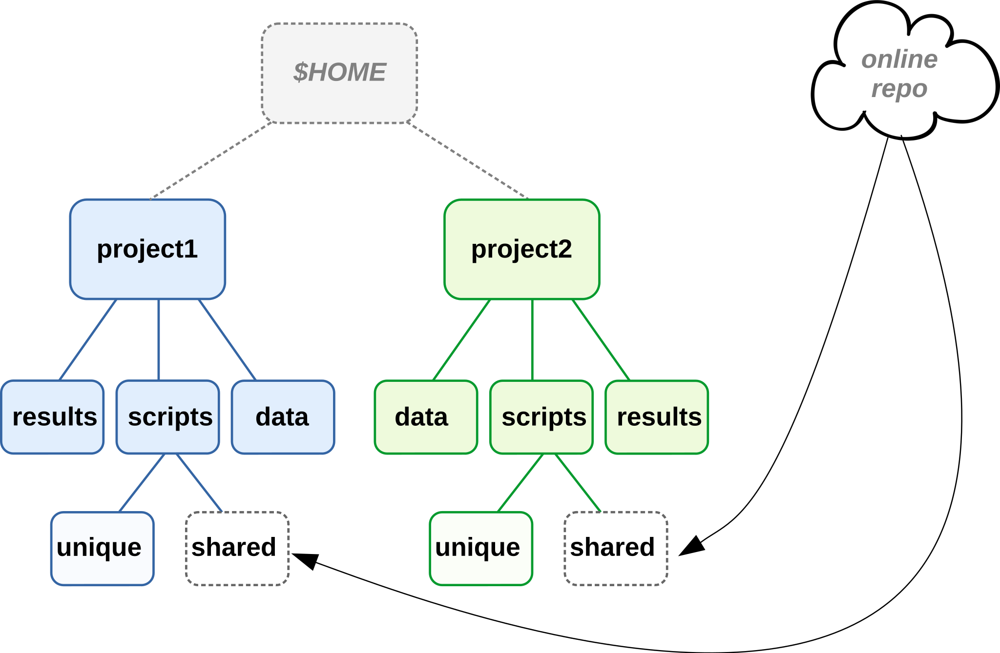

--------------------------------------------------------------------------------

<br>

## Introduction

### Learning goals

#### This week

- This page:  
  - Learn some best practices for file organization and management for your
    research projects, and documentation of your projects
- [Also today](w2_2_vscode-markdown.qmd)
  - Get to know our text editor, *VS Code*.
  - Learn how to use *Markdown* for documentation (and beyond).
- [Second session](w2_3_shell.qmd)
  - Learn the basics of working in the Unix shell.

#### This session 

Having good **research project documentation and file organization** facilitates:

- Collaboration with others and your future self
- Reproducibility
- Automation
- Version control

In short, good project documentation and file organization is a necessary
foundation to use this course's tools and to reach some of its goals.

Relatedly, [Noble (2009)](https://journals.plos.org/ploscompbiol/article?id=10.1371/journal.pcbi.1000424)
cited two principles guiding his set of recommendations on this topic:

> - Someone unfamiliar with your project should be able to look at your computer files
>   and understand in detail what you did and why.
> - Everything you do, you will probably have to do over again.

Keep those principles in mind while we discuss the recommendations below!

<br>

## File organization and management

We will discuss the following set of best practices and recommendations for
research project file organization and management:

- Use one folder (folder hierarchy) for one project
- Separate different kinds of files using a consistent folder structure
- Avoid manual editing of both data and results
- Use relative paths to refer to files and folders within your project
- Have good file and folder naming practices that favor machine- _and_
  human-readability

::: callout-warning
#### Files on OSC versus files elsewhere
TBA
:::

### Use one folder for one project

For one research project, all files should be contained in one folder ---
or we should perhaps say one _hierarchy_ of folders,
since you can and should liberally make use of "subfolders".
In other words,
you should not store files associated with one project scattered across a computer.

For example:

{fig-align="center" width="60%"}

Another way to look at this is that for a given research project,
you should be able to pinpoint a specific folder,
like the `project1` folder in the image above...

- that contains _all_ files related to that project..
- while not containing _any_ files that are unrelated to that project.

When you have a single directory hierarchy for each project, it is easier to:

- Find files
- Share or back up your entire project
- Avoid throwing away stuff in error
  
<hr style="height:1pt; visibility:hidden;" />

### Separate different kinds of files using a consistent folder structure

Within your project's folder hierarchy,
you should use subfolders to clearly separate, among others:

- Code
- Data
- Results

These folders and the files within them should also be named consistently,
following certain best practices as we'll discuss below.

::: callout-note
#### Data versus results

While managing your files, you should also treat raw data and results differently:

- Treat **raw data**, once it has been collected or received,
  as _read-only_ (never edit the original files!) and _highly valuable_ (make backups!)

- Treat **results** as _essentially disposable_,
  because you should be able to regenerate them easily with the skills you will
  learn in this course (see also the section on avoidng manual editing below).
:::

#### An example project folder structure

Here is one good way of organizing a project with a set of top-level folders:

{fig-align="center" width="70%"}

<hr style="height:1pt; visibility:hidden;" />

Another important good practice is to **use subfolders** liberally and hierarchically.
For example, in omics data analysis,
it often makes sense to create subfolders within `results` for each piece of
software that you are using:

{fig-align="center" width="30%"}

<hr style="height:1pt; visibility:hidden;" />

::: {.callout-tip collapse="true"}
#### Some other organization and naming options _(Click to expand)_
These recommendations only go so far,
and several things can be modified depending on personal preferences and project specifics ---
for example:

- Naming of some folders, like:
  - `results` vs `analysis`
  - `src` ("source") vs `scripts`
  
- Some recommendations (such as Buffalo)
  separate data into `data/raw` and `data/processed` folders,
  though this blurs the line between data and analysis results,
  and I much prefer to put "processed data" within `results`.

- [Noble (2009)](https://journals.plos.org/ploscompbiol/article?id=10.1371/journal.pcbi.1000424)
  recommends that subfolders within `results` are first organized by date.
  I personally don't think this works well for most omics analysis.

- Sometimes the order of subdirs can be done in multiple different ways.
  For example, where to put QC figures --- `results/plots/qc` or `results/qc/plots/`?
  
- You can start folder and file names with numbers so that they would automatically
  be sorted in a logical way (i.e. step 1 then step 2, etc.), e.g. within `results`.
  That can be really neat and clear but the drawback of this is that if you insert a step,
  a lot of renaming needs to be done.
:::

<hr style="height:1pt; visibility:hidden;" />

### Avoid manual editing of data and results

As mentioned above, once they have been produced,
raw data files should never be edited directly.
Instead, any data processing or even correction should be done by producing
_separate edited copies_ of the data.

Moreover, you should also avoid manually editing _results_ files.
As [Abdill et al. (2024)](https://journals.plos.org/plosbiology/article?id=10.1371/journal.pbio.3002815)
explain:

> For example, if script A processes raw data into a table of gene expression levels, and script B summarizes this table by pathway, we should be concerned if there is a step after script A that requires a user to open the table and edit fields by hand to prepare the data for script B. Such quick fixes can be tempting, but they also add risk: A researcher could easily add a typo, corrupt a file in unexpected ways, or forget the step altogether.

If at all possible, you should use _code_ to make such fixes,
because this code can be included as part of the rest of your projects "workflow"
and make the fix reproducible --- and much easier to repeat if needed
(recall the second of Noble's guiding principles mentioned above!).

<hr style="height:1pt; visibility:hidden;" />

### Use machine- and human-readable file names

Here are three key principles for good file names
([from Jenny Bryan](https://speakerdeck.com/jennybc/how-to-name-files)) ---
they should:

- Be machine-readable
- Be human-readable
- If approproate, be ordered correctly by default alphanumeric file sorting

We'll go into each of these aspects below.

#### Machine-readable

Consistent and informative naming helps you to programmatically find and process files.

- In file names, you can provide **metadata** like Sample ID, date, and treatment:
  - `sample032_2016-05-03_low.txt`  
  - `samples_soil_treatmentA_2019-01.txt`

- With such file names, you can easily select samples from e.g. a certain month or treatment
  (**TBA change this**)
  
  ```bash
  ls *2016-05*
  
  ls *treatmentA*
  ```

- **Don't use spaces in file names**,
  as these lead to inconvenience at best and disaster at worst when working in
  the Shell -- and to some extent with other programming languages as well.
  
- More generally, only use the following characters in file names:
  - Alphanumeric characters <kbd>A-Za-z0-9</kbd>
  - Underscores <kbd>_</kbd>
  - Hyphens (dashes) <kbd>-</kbd>
  - Periods (dots) <kbd>.</kbd>

<hr style="height:1pt; visibility:hidden;" />

#### Human-readable

> *"Name all files to reflect their content or function.*
> *For example, use names such as bird_count_table.csv, manuscript.md,*
> *or sightings_analysis.py.*"  
> --- [Wilson et al. 2017](https://journals.plos.org/ploscompbiol/article?id=10.1371/journal.pcbi.1005510)

<hr style="height:1pt; visibility:hidden;" />

#### Combining machine- and human-readable

- One good way (opinionated recommendations):
  - Use **underscores** (<kbd>_</kbd>) to delimit units you may later want to
    separate on: sampleID, batch, treatment, date.
  - Within such units, use **dashes** (<kbd>-</kbd>) to delimit words: `grass-samples`.
  - Limit the use of **periods** (<kbd>.</kbd>) to indicate file extensions.
  - Generally *avoid capitals*.

- For example:
  
  ```bash-out
  mmus001_treatmentA_filtered-mq30-only_sorted_dedupped.bam
  mmus002_treatmentA_filtered-mq30-only_sorted_dedupped.bam
  .
  .
  mmus086_treatmentG_filtered-mq30-only_sorted_dedupped.bam
  ```

<hr style="height:1pt; visibility:hidden;" />

#### Playing well with default ordering

- Use **leading zeros** for lexicographic sorting: `sample005`.   
  (If you don't do this, `sample11` will appear before `sample2`, etc.)

- **Dates** should be written as `YYYY-MM-DD`: for example, `2020-10-11`.
  Besides leading to correct ordering, this format is also unambiguous.

- **Group similar files together** by starting with same phrase,
  and **number scripts** by execution order:
  
  ```bash-out
  DE-01_normalize.R
  DE-02_test.R
  DE-03_process-significant.R
  ```

<hr style="height:1pt; visibility:hidden;" />

### Use relative paths

To understand this recommendation,
you first need to learn more about paths and folder structures.

#### Terminology and concepts related to paths

- "Directory" (or "**dir**" for short) is another term for *folder*,
  that is commonly used e.g. in coding contexts.

- The "**working dir**" is the dir that you are currently located in.
  In a command-line interface, like the Unix shell we'll learn after this,
  you are _always_ in a certain working dir
  (and the same is basically true in a regular file browser).

- "Unix-based" operating systems include Mac and Linux (OSC uses Linux),
  and these have a single starting point to the directory structure: 
  the **root** directory, depicted as **`/`**.
  On a Windows computer, there are often multiple dir structures,
  but they similarly have starting points, such as `C:/`.

::: columns
::: column
](../img/oneil_filesystem_ex2.png){fig-align="center" width="95%"}
:::
::: column
{fig-align="center" width="89%"}
:::
:::

- A "**path**" gives the location of a file or directory,
  in which directories are separated by forward slashes (`/`)^[
  But Windows uses backslashes (`\`).].
    
- So, in a path, a leading `/` is the root dir,
  and any subsequent `/` are used to separate dirs.
  For example, the path to our OSC project's dir is `/fs/ess/PAS2880`.
  This means: the dir `PAS2880` is located inside the dir `ess`, which in turn is
  inside the dir `fs`, which in turn is in the computer's root directory.

- Why all this talk of paths?
  _When we code, we always use paths to refer to files and dirs._
  
<hr style="height:1pt; visibility:hidden;" />

::: exercise
####  Exercise: Figure out the path

In the above schematic on the left, what is the path to the file `todo_list.txt`?

<details><summary>*Click to see the solution*</summary>

The path to the file `todo_list.txt` is:
`/home/oneils/documents/todo_list.txt`

</details>
:::

<hr style="height:1pt; visibility:hidden;" />

#### Absolute versus relative paths

The location of any file or dir can be referred to in two different ways,
using either:

- An **absolute path** (e.g. `/fs/ess/PAS2880`) \
  A path that begin with a `/` starts from the computer's root directory,
  and is called an "absolute path".\
  *(It is equivalent to GPS coordinates for a geographical location,*
  *and works regardless of where you are*).

- A **relative path** (e.g. `CSB/unix/sandbox` or `todo_list.txt`)\
  A path that starts from your current working directory is a "relative path".\
  *(It works like directions along the lines of "take the second left:"*
  *it depends on your current location.)*

<details><summary>In the example above, how can the mere file name `todo_list.txt` represent a path? _(Click for the solution)_</summary>

A file name like `todo_list.txt`, with no directories included,
can be seen (and is often used!) as a relative path that implies that the file
is in our current working dir.

(Alternatively, and often equivalently, you can be explicit about the fact that
a file is in your current working dir by using a `./` preface, e.g.: `./todo_list.txt`.
We'll talk about the `.` notation next week.)
</details>

<hr style="height:1pt; visibility:hidden;" />

#### Why you should prefer relative paths

Given that **absolute paths** do not depend on your working dir,
while **relative paths** do and therefore won't work if you're elsewhere ---
don't absolute paths sound better? What could be a disadvantage of them?

Absolute paths:

- Don't generally work across computers
- Break when you move your entire project dir

Relative paths, on the other hand, keep working when moving the project within and
between computers ---
as long as you consistently use the top-level dir of the project as the working dir.

<hr style="height:1pt; visibility:hidden;" />

{fig-align="center" width="70%"}

<hr style="height:1pt; visibility:hidden;" />

{fig-align="center" width="70%"}

<br>

## Documenting your research project

Slow down and document TBA

#### "README" file(s)

It is common practice to store project documentation in files that are called
"README" or at least include that phrase in their name.

We saw one such file in the example project folder structure above.
**You should always have a README(-style) file in the top-level folder of your project**,
and you may use additional README files elsewhere depending on the size of your
project and how you prefer to structure your documentation.

Use README files to document the following:

- Your methods
- Where/when/how each data and metadata file originated
- Versions of software, databases, reference genomes
- *...Everything needed to rerun whole project*

<hr style="height:1pt; visibility:hidden;" />

#### Electronic lab notebook (organized by date)

TBA

#### Final workflow file (organized in order of execution)

TBA

#### Use plain text files

In this course,
we'll be working almost exclusively with so-called "**plain-text**" files
(files with `.txt` and related extensions).
These are files that can be opened by any text editor on any computer,
and can also be processed by Unix commands and any other programming language.

Plain-text files are different from so-called "binary" and proprietary formats
like Microsoft Excel (e.g. `.xlsx`) or Word (e.g. `.docx`) that can often 
be opened and edited only in their respective programs.
That can pose many problems: for example, these programs are not always available,
and version mismatches may make files impossible to open.

Many common omics file formats, like FASTA, FASTQ, and GFF, are plain-text.
And while their simplicity may seem limiting,
**plain-text files are generally preferable for reproducible science** because they:

- Can be accessed on any computer, including over remote connections
- Are future-proof
- Allow to be version-controlled

For these reasons,
it is best-practice to also use a plain-text format to document your research,
and we will practice extensively with that in this course.
Specifically, we will use so-called **Markdown** files,
which strike a nice balance between ease of writing and reading on the one hand,
and formatting options on the other hand.
In the next session, we will learn the basics of the Markdown "syntax".

<br>

## At-home reading

#### How to define and separate your projects?

From [Wilson et al. 2017 - Good Enough Practices in Scientific Computing](https://journals.plos.org/ploscompbiol/article?id=10.1371/journal.pcbi.1005510):

> *As a rule of thumb, divide work into projects based on the overlap in data and code files:*
>
> - *If 2 research efforts share no data or code,*
>   *they will probably be easiest to manage independently.*  
>
> - *If they share more than half of their data and code, they are probably best*
>   *managed together.*
>
> - *If you are building tools that are used in several projects,*
>   *the common code should probably be in a project of its own.*

#### Projects with shared data or code

To access files outside of the project (e.g., shared across projects),
it is easiest to create **links** to these files:

{fig-align="center" width="50%"}

But shared data or scripts are generally better stored in separate dirs,
and then linked to by each project using them:

{fig-align="center" width="50%"}

These strategies do decrease the portability of your project,
and moving the shared files even within your own computer will cause links to break.

A more portable method is to **keep shared (multi-project) files online** ---
this is especially feasible for **scripts** under version control:  

{fig-align="center" width="70%"}

::: callout-info
For **data**, this is also possible but often not practical due to file sizes.
It's easier after data has been deposited in a public repository.
:::
