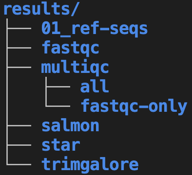

--------------------------------------------------------------------------------

<br>

## Introduction

### Lecture context & overview

This lecture covers the principles behind, and practice of,
good **research project documentation and file organization**.
Why is this important?
Thoughtful and systematic project documentation and organization facilitates:

- Collaboration with others and your future self
- Better reproducibility of your research
- Your ability to automate your work
- Your ability to use version control (week 4)

Relatedly, @noble2009 cited the following two principles underlying his
recommendations on this topic:

> 1. Someone unfamiliar with your project should be able to look at your computer files
>    and understand in detail what you did and why.
> 2. Everything you do, you will probably have to do over again.

Keep those principles in mind while we discuss the recommendations below!

### Learning goals

- **This page** -- learn best practices for:
  - Organization and management of your research project files
  - Documentation of your research project
- [This week's second lecture](w2b_vscode-markdown.qmd):
  - Learn how to use *Markdown* for documentation.
  - Get to know the text editor you'll use throughout the course: *VS Code*.
- [This week's third lecture](w2c_shell.qmd):
  - Learn the basics of working in the Unix shell.

## File organization and management

We will discuss the following set of best practices and recommendations for
research project file organization and management:

- Use one folder (folder hierarchy) for one project
- Separate different kinds of files using a consistent folder structure
- Avoid manual editing of both your data and your results
- Have good file and folder naming practices that favor machine- _and_
  human-readability
- Use so-called "relative paths" to refer to files and folders within your project

### Use one folder for one project

For one research project, all files should be contained in one folder ---
or we should perhaps say one _hierarchy_ of folders,
since you can -and should!- make liberal use of "subfolders".
This means that you should not store files associated with one project
scattered across a computer.

Here is a minimal example diagram of two properly separated and systematically
organized research project folders:

{fig-align="center" width="60%" fig-alt="A diagram showing two research project folder hierarchies." .lightbox}

Another way to look at this is that for a given research project,
you should be able to pinpoint a specific folder,
like the `project1` folder in the image above...

- that contains _all_ files related to that project..
- while not containing _any_ files unrelated to that project.

When you have a single directory hierarchy for each project, it is easier to:

- Find files
- Share or back up your entire project
- Avoid throwing away stuff in error

::: {.callout-warning collapse="true"}
#### How to define and separate projects in more complicated scenarios? _(Click to expand)_

From @wilson2017:

> *As a rule of thumb, divide work into projects based on the overlap in data and code files:*
>
> - *If 2 research efforts share no data or code,*
>   *they will probably be easiest to manage independently.*  
>
> - *If they share more than half of their data and code, they are probably best*
>   *managed together.*
>
> - *If you are building tools that are used in several projects,*
>   *the common code should probably be in a project of its own.*

#### Projects with shared data or code

To access files outside of the project (e.g., shared across projects),
it is easiest to create **links** (i.e. shortcuts/aliases) to these files:

{fig-align="center" width="50%" fig-alt="A diagram showing two research project folder hierarchies, with the data folder from one project being linked to the other project." .lightbox}

But shared data or scripts are generally better stored in separate dirs,
and then linked to by each project using them:

{fig-align="center" width="50%"  fig-alt="A diagram showing two research project folder hierarchies, with a separate shared-data folder that is linked to both projects." .lightbox}

These strategies do decrease the portability of your project,
and moving the shared files even within your own computer will cause links/shortcuts to break.
A more portable method is to **keep shared (multi-project) files online** ---
this is especially feasible for **scripts** under version control:  

{fig-align="center" width="70%" fig-alt="A diagram showing two research project folder hierarchies, both of which have a connection to an online script repository." .lightbox}

For **data**, this is also possible but often not practical due to file sizes._
It's easier after data has been deposited in a public repository._

:::

### Separate different kinds of files using a consistent folder structure

Within your project's folder hierarchy,
you should use subfolders to clearly separate different kinds of files,
such as files that contain:

- Code
- Data
- Results (of data processing and analysis)

These folders and the files within them should also be named consistently,
following best practices we'll discuss below.

::: callout-tip
#### Treatment of data versus results

While managing your files,
you should also conceptually treat raw data and results differently:

- _Raw data_, once collected or received,
  should be treated as **read-only** (never edit the original files!) and
  **highly valuable** (make backups!)
- _Results_ can be treated as **essentially disposable**,
  because you should be able to regenerate them easily with the skills you will
  learn in this course (see also the section on avoidng manual editing below).
:::

#### An example project folder structure

Here is one good way of organizing project files with a set of top-level folders
and some standard documentation files:

{fig-align="center" width="70%" fig-alt="A screenshot showing an example research project folder hierarchy." .lightbox}

First, we'll talk more about the _folder structure_ suggested in the image above
whereas the last section of this session will cover the `.md` _documentation files_
also shown in the image above.

----

Another important good practice is to **use subfolders** liberally and hierarchically.
For example, in omics data analysis,
it often makes sense to create subfolders within `results` for each piece of
software that you are using:

::::::: columns
:::: {.column width="50%"}
{fig-align="center" width="60%" fig-alt="A screenshot showing an example Results folder in a research project folder, with separate runs for MultiQC grouped into subfolders using dates." .lightbox}
::::
:::: {.column width="50%"}
{fig-align="center" width="64%" fig-alt="Another screenshot showing an example research project folder hierarchy, with separate runs for MultiQC grouped into subfolders using a description." .lightbox}
::::
:::::::

In the above examples:

- Subfolders are mostly organized by and named after the
  **software (tool) that produced each set of results**.
  Depending on the type of project,
  subfolders could similarly be organized by topic or by data analysis step.

- However, other kinds of descriptive names may make more sense in some cases.
  For example, the `01_ref-seqs` represent a folder with reference genome sequences.
  The `01_` prefix is used to ensure this folder shows up at the top
  (see the box below for more on file and dir _numbering_).

- Say that the MultiQC program was run multiple times.
  On the left, these folders are named after the run date, whereas on the right,
  folder names describe what each run was for.
  Both of these options have pros and cons -- for example,
  always using a date is simple and consistent but is less clear about the
  purpose of each folder.
  
The two different treatments of `multiqc` subfolders illustrates that for many
of the recommendations, multiple reasonable alternatives do exist.
For more, see the box below.

::: {.callout-tip collapse="true"}
#### Some alternative file organization and naming options _(Click to expand)_
The above recommendations only go so far,
and several details can be modified depending on personal preferences and
project specifics.
For example:

- You can start folder and file names with numbers so that they would automatically
  be sorted in a logical way (i.e. step 1 then step 2, etc.),
  e.g. within `results` and/or `scripts` as shown below.
  That can be really neat and clear but the drawback of this is that if you
  later _insert_ a step, a lot of renaming needs to be done...

  ```bash-out
  |-- results/
  |   |-- 01_reference-seqs/
  |   |-- 02_fastqc/
  |   |-- 03_multiqc/
  |   |-- 04_trimgalore/
  |   |-- 05_star/
  |   |-- 06_salmon/
  |-- scripts/
  |   |-- 01_download-reference.sh
  |   |-- 02_fastqc.sh
  ```
  
- Several of these folders could be named differently, such as:
  - Some researchers prefer `analysis` over `results`
  - Some researchers prefer `src` ("source") over `scripts`
  
- Some recommendations, such as by @buffalo2015,
  separate data into `data/raw` and `data/processed` folders.
  However, this blurs the line between data and analysis results,
  and I much prefer to put "processed data" within `results`.

- @noble2009
  recommends that subfolders within `results` are initially organized by date
  and then by topic/program (e.g: `results/2025-08-30/multiqc`).
  I personally don't think this works well for most omics data analysis.
:::

### Avoid manual editing of data and results

As mentioned above, once they have been produced,
**raw data files should never be edited**.
Instead, any data processing or even correction should be done with
_separate copies_ of the data.

Additionally, you should avoid **_manually_ editing any data and results files**.
Instead, such editing should be done using code.
As @abdill2024 explain (my bolding):

> For example, if script A processes raw data into a table of gene expression levels, and script B summarizes this table by pathway, we should be concerned if there is a step after script A that requires a user to open the table and edit fields by hand to prepare the data for script B. **Such quick fixes can be tempting**, but they also add risk: A researcher could easily add a typo, corrupt a file in unexpected ways, or forget the step altogether.

When you use _code_ to make such fixes, it can be included as part of your
project's "workflow" and therefore be reproducible.

That also makes these fixes much easier to repeat if needed.
Recall the second of @noble2009's guiding principles mentioned above:
_"Everything you do, you will probably have to do over again."_
While a manual fix may be quicker if it would really only needed to be done twice,
in practice, it is common to have to repeat them,
such that writing code to do the fix can end up saving time.

### Use machine- and human-readable file names

Here are three key principles for good file names
([from Jenny Bryan](https://speakerdeck.com/jennybc/how-to-name-files)) ---
they should:

- Be machine-readable
- Be human-readable
- Wherever appropriate, be ordered correctly by default alphanumeric file sorting

We'll go into each of these aspects below.

#### Machine-readable

Consistent and informative naming helps you to programmatically find and process files.

- **Don't use spaces in file names**,
  as these lead to inconvenience at best and disaster at worst when working in
  the Unix Shell -- and to some extent with other programming languages as well.
  
- More generally, only use the following characters in file names:
  - Alphanumeric characters (<kbd>A-Za-z0-9</kbd>)
  - Underscores (<kbd>_</kbd>)
  - Hyphens (AKA dashes, <kbd>-</kbd>)
  - Periods (AKA dots, <kbd>.</kbd>)
  
- Where appropriate, you can provide **metadata** like Sample ID, date, and treatment
  in file names:
  
  - `sample032_2016-05-03_low.txt`  
  - `samples_soil_treatmentA_2019-01.txt`

  With such file names,
  you can easily find files from e.g. a certain month or treatment.
  
#### Human-readable

While machine-readability in file names is important,
this should not go at the expense of human readability.
For example, from @wilson2017:

> *"Name all files to reflect their content or function.*
> *For example, use names such as `bird_count_table.csv`, `manuscript.md`,*
> *or `sightings_analysis.py`.*"  

Not only are the above file names informative,
they are also human-readable thanks to the use of underscores (<kbd>_</kbd>)
to separate words.
Just because you shouldn't use spaces in file names, doesn't mean
you should name your files like `firstattemptatthissequenceanalysis.R`!

More specifically, while there are multiple reasonable methods,
here is one good way I will recommend:

- Use **underscores** (<kbd>_</kbd>) to delimit units you may later want to
  separate on: sampleID, batch, treatment, date.
- Within such units, use **dashes** (<kbd>-</kbd>) to delimit words: `grass-samples`.
- Limit the use of **periods** (<kbd>.</kbd>) to indicate file extensions
  (e.g., `.R`, `.sh`).
- Generally *avoid capitals*.

For example, for a set of BAM (`.bam`) sequence alignment files:
  
```bash-out
mmus001_filtered-by-mq30_sorted.bam
mmus002_filtered-by-mq30_sorted.bam
...
mmus086_filtered-by-mq30_sorted.bam
```

Most important, however, is that once you find a scheme that works for you,
you **use that scheme consistently**.

#### File names that are automatically ordered appropriately

In file listings in file explorers (and the Unix Shell, as you'll see),
default file ordering is typically alphanumerical.
With that in mind:

- **Dates** should be written as `YYYY-MM-DD`: for example, `2020-10-11`.
  Not only does this lead to files being ordered correctly,
  this format is also unambiguous.
  
- Use **leading zeros** for correct alphanumeric sorting: `sample005`. 
  If you don't do this, `sample10` will appear before `sample2`, etc.:
  
:::: {.columns}
::: {.column width="10%"}
:::

::: {.column width="35%"}
_Without leading zeros:_
```bash-out
sample1
sample10
sample11
sample2
sample3
...
```
:::

::: {.column width="10%"}
:::

::: {.column width="35%"}
_With leading zeros:_
```bash-out
sample01
sample02
sample03
...
sample10
sample11
```
:::
::::

- You may want to **group similar files together** by starting with the same phrase,
  and to **number scripts** by execution order -- for example:

:::: {.columns}
::: {.column width="10%"}
:::

::: {.column width="35%"}
```bash-out
DE-01_normalize.R
DE-02_test.R
DE-03_process-significant.R
preprocess-01_fastqc.sh
preprocess-02_multiqc.sh
```
:::

::: {.column width="45%"}
:::
::::

### Use relative paths

To understand this recommendation,
you first need to learn more about paths and folder structures.

#### Terminology and concepts related to paths

- "Directory" (or "**dir**" for short) is another term for *folder*,
  that is commonly used e.g. in coding contexts.

- The "**working dir**" is the dir that you are currently located in.
  In a command-line interface, like the Unix shell you'll learn after this,
  you are _always_ in a certain working dir
  (and the same is basically true in a regular file browser).

- "Unix-based" operating systems include Mac and Linux (note: OSC uses Linux),
  and these have a single starting point to the directory structure: 
  **the root directory, depicted as `/`**^[
  Windows computers often contain multiple dir structures instead,
  but each of these similarly have roots / starting points, such as `C:\`.].

::: columns
::: column
)](../img/oneil_filesystem_ex2.png){fig-align="center" width="95%" fig-alt="A diagram of an example dir structure on a Mac computer." .lightbox}
:::
::: column
{fig-align="center" width="89%" fig-alt="A diagram of the high-level dir structure at OSC." .lightbox}
:::
:::

- A "**path**" gives the location of a file or directory,
  in which directories are separated by forward slashes (`/`)^[
  But Windows uses backslashes (`\`).].
    
- In a path, a leading `/` is the root dir,
  and any subsequent `/` are used to separate dirs.
  For example, the path to our OSC project's dir is `/fs/ess/PAS2880`.
  This means: the dir `PAS2880` is located inside the dir `ess`, which in turn is
  inside the dir `fs`, which in turn is in the computer's root directory.

- Why all this talk of paths?
  _When you code, you always use paths to refer to files and dirs._

<details><summary>  In the left-hand schematic above, what is the path to the file `todo_list.txt`? _(Click for the solution)_ </summary>
`/home/oneils/documents/todo_list.txt`
</details>

#### Absolute versus relative paths

The location of any file or dir can be referred to in two different ways,
using either:

|  | Absolute paths | Relative paths |
|---|-------|-------|
| Meaning       | Start from the computer's root dir | Start from your working dir
| Recognized by | A leading `/`   [^1] | No leading `/`
| Examples      | `/fs/ess/PAS2880` |  -- `data/meta/metadata.tsv` <br> -- `todo_list.txt`
| Analogy       | GPS coordinates for a geographical location: valid regardless of where you are | Directions along the lines of "take the second left": validity depends on your current location

: {.striped .hover}

[^1]: This leading `/` can be _implicit_ though: For example, `~` is a shortcut
that expands to an absolute path to your Home directory.

<hr style="height:1pt; visibility:hidden;" />

<details><summary>  In the examples above, how can the mere file name `todo_list.txt` represent a path? _(Click for the solution)_ </summary>
A file name like `todo_list.txt`, with no directories included,
can represent a relative path that implies the file is in our current working dir.

Alternatively, you can be explicit about the fact that a file is in your current
working dir by using a `./` preface, e.g.: `./todo_list.txt`.
Next week, you'll learn more about the `.` notation for the current working dir.
</details>

#### Why you should prefer relative paths

Given that **absolute paths** do not depend on your working dir,
while **relative paths** do and therefore won't work if you're elsewhere ---
don't absolute paths sound better? What could be a disadvantage of them?

The disadvantages of absolute paths are that they:

- Don't generally work across computers
- Break when you move your entire project dir

Relative paths, on the other hand,
can continue to work after moving project dirs within and between computers.
This is the case as long as you
**consistently use the project's top-level dir as your working dir**
(this is another general recommendation),
i.e. as the starting point of your relative paths.
For example:

<hr style="height:1pt; visibility:hidden;" />

{fig-align="center" width="70%" fig-alt="A diagram of two project dir hierarchies." .lightbox}

<hr style="height:1pt; visibility:hidden;" />

{fig-align="center" width="70%" fig-alt="A diagram of two project dir hierarchies." .lightbox}

<hr style="height:1pt; visibility:hidden;" />

::: callout-warning
#### _But how does this work when I have files on OSC as well as on my laptop?_
This is a question we'll get back to in week 5!
:::

## Documenting your research project

Documenting what you are doing while working on your research project is of
key importance.
And this is not always easy!
It can be much more appealing to just keep chugging along.
In the moment, it may even seem like a waste of time to make notes on what
_then and there_ is obvious:
you will likely have a clear picture of what you did, say, this morning.

However, you won't have such a clear picture a month later,
and a collaborator would never automatically do.
Therefore, you should often make a
**conscious effort at taking a step back, slowing down,**
**and writing down what you did and why** ---
including in cases where you have reached a dead end.

An important advantage of using code to do your analyses,
like you will learn in this course,
is that it is _self-documenting_ to a much larger extent than is pointing and
clicking in a program with a Graphical User Interface (GUI).
**However**, this should not make you complacent and skip documenting what you did.

I have hopefully conveyed the importance of project documentation.
So, how should you do this in practice?

### Documentation files

In computational work,
it is common practice to store project documentation in files that are called
(or include the word) "README".
You saw two such `README.md` files in the example project folder structure above.
Use README and related text files to document the following:

- Your methods
- Where/when/how each data and metadata file originated
- Versions of software, databases, reference genomes
- *...Basically, everything needed to rerun whole project*

You should always have a README file in the top-level folder of your project,
and you may use additional README files elsewhere,
depending on the size of your project,
and how you prefer to structure your documentation.

- For **small projects**,
  one or two README files that contains all of the above may work.

- For **larger projects**, such as those that should produce a stand-alone
  paper and/or a chapter in your dissertation,
  it often makes sense to split documentation into different types of files as
  described below.

### Types of documentation files for larger projects

These are not ironclad rules or fixed categories,
but hopefully provide a good starting point:

#### README file(s)

As mentioned above,
**you should always have a README file in the top-level folder of your project**.
For larger projects, where you use separate files to keep your electronic lab
notebook and to create a final workflow/protocol, this file could contain:

- A brief overview of the project
- An explanation of your project's folder structure.
  What can be found where? How are the files named?
- Details about the data, such as how and when it was obtained
- How/where to start to rerun the analyses done as part of the project
- Who to contact for more information about different topics related to the project

::: callout-tip
#### Using multiple README files
Especially for larger projects,
you may add README files in key subdirectories such as `data`, `results`,
and `scripts`, each of which describe the files in that dir.
:::

#### Electronic lab notebook (organized by date)

You should keep an electronic lab notebook or "diary" that has chronological entries,
that documents what you did:

- This file should include things like what code you ran and why,
  quick interpretations of results, and so on.
  It can also include notes on meetings and copies of important emails.

- This should not be a "clean" document --- for example,
  you should not remove entries on say failed experiments and analyses,
  or consideration/testing of methods that you did not include in your final analyses.

In the project folder example above, this file was `doc/diary.md`.

#### Final workflow/protocol file (organized in order of execution)

This file should contain all the code and other details needed to **rerun** the
final data processing and analyses you performed for your project:

- Entries should be organized by the most sensible _final_ order of execution
  (which may be somewhat different from the order you used).
- This _should_ be a "clean" document,
  and should not include steps you don't consider part of your final results^[
  E.g., a method you ran but ultimately did not use,
  because an alternative method worked better.].
  
In the project folder example above, this file was `doc/workflow.md`.
Let's take another look at that image:

{fig-align="center" width="60%" fig-alt="An annotated screenshot of a recommended project dir hierarchy." .lightbox}

### Use plain text files

In this course,
we'll be working almost exclusively with so-called "**plain-text**" files
(files with `.txt` and related extensions).
These are files that can be opened by any text editor on any computer.

Plain-text files are different from so-called "binary" and proprietary formats
like Microsoft Excel (e.g. `.xlsx`) or Word (e.g. `.docx`),
which can often be opened and edited only in their respective programs.
That can pose many problems: for example, these programs are not always available,
and version mismatches may make files impossible to open.

Many common omics file formats, like FASTA, FASTQ, and GFF, are plain-text.
And while their simplicity may seem limiting,
**plain-text files are generally preferable for reproducible science** because they:

- Can be accessed on any computer, including over remote connections
- Can be operated on by Unix shell commands and any other programming language
- Are future-proof
- Can be version-controlled appropriately

For these reasons,
it is best-practice to also use a plain-text format to document your research,
and you will practice that during the course.
Specifically, you will use so-called **Markdown** files (`.md`),
which strike a nice balance between ease of writing and reading on the one hand,
and formatting options on the other hand.
In the next session, you will learn the basics of the Markdown "syntax".

## In closing
Some of these project organization and documentation recommendations may seem
a bit abstract this early in the course.
Therefore, I recommend that you revisit this page later on.
