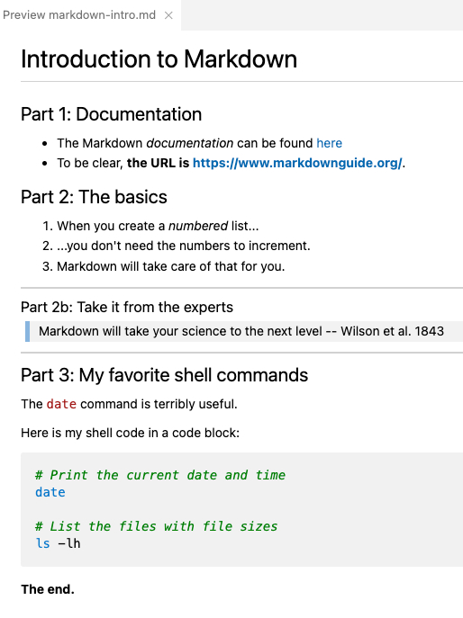

---------

<br>

## Introduction

### Context & overview

The [previous session](./w2a_project-org.qmd) emphasized the importance of good
documentation of your research, and advised to use plain-text files to do so.
In this session, you will learn how to use *Markdown*,
which specifically is the simple plain-text markup language that we recommend
you use for documentation.

But before you can start using Markdown, you'll need to be introduced to *VS Code*,
the text editor that you'll use to write Markdown ---
but also to write Unix shell code throughout the course.

<hr style="height:1pt; visibility:hidden;" />

## VS Code

### Why VS Code?

VS Code is basically a **fancy text editor**.
Its full name is Visual Studio Code, and it's also called "Code Server" at OSC.

To emphasize the additional functionality relative to basic text editors like Notepad and TextEdit,
editors like VS Code are also referred to as "**IDEs**": *Integrated Development Environments*.
The RStudio program is another good example of an IDE.
Just like RStudio is an IDE for R, VS Code will be our IDE for shell code. 

Some advantages of VS Code:

- Works with all operating systems, is free, and open source.
- Has an integrated terminal.
- Very popular nowadays -- lots of development going on including by users (*extensions*).
- Available at OSC OnDemand (and also allows you to "SSH-tunnel" in with your local installation). 

<hr style="height:1pt; visibility:hidden;" />

### Starting VS Code at OSC

- Log in to OSC's OnDemand portal at <https://ondemand.osc.edu>.

- In the blue top bar, select `Interactive Apps` and near the bottom, click `Code Server`.

- Interactive Apps like VS Code and RStudio **run on compute nodes** (not login nodes).
  Because compute nodes always need to be "reserved",
  we have to fill out a form and specify the following details:
  - The "_Cluster_" that we want to use: `pitzer`
  - The "_Account_", i.e. the OSC Project that we want to bill for the compute node usage: `PAS2880`.
  - The "_Number of hours_" we want to make a reservation for: `2`
  - This time, you can leave the "_Working Directory_" (starting pount) for the program
    blank.
  - The "_App Code Server version_": `4.8.3` (should be the only one)

- Click `Launch` --- you will be sent to the "My Interactive Sessions" page
  with a box for your job at the top.

- First, your job may be "*Queued*" for some seconds
  (i.e., waiting for computing resources to be assigned to it),
  but it should soon switch to "*Starting*" and then
  be ready for usage ("*Running*") in another couple of seconds:

{fig-align="center" width="75%" fig-alt="A screenshot of the OSC OnDemand page shown when the Code Server job has started running." .lightbox}

- Once the blue **Connect to VS Code** button appears,
  click that to open VS Code in a new browser tab.

- When VS Code opens, you may get these two pop-ups (and possibly some others) ---
  click "Yes" (and check the box) and "Don't Show Again", respectively:

::: columns
::: {.column width="52%"}
{fig-align="center" width="90%" fig-alt="A screenshot of a popup you may get when first opening a folder in VS Code." .lightbox}
:::

::: {.column width="48%"}
{fig-align="center" width="90%" fig-alt="A screenshot of a popup you may get when first opening VS Code." .lightbox}
:::
:::

- You'll also get a Get Started page ---
  you don't have to go through any steps that may be suggested there.

::: callout-tip
#### _If you need to switch folders, click      >   `File`   >   `Open Folder`._
:::

<hr style="height:1pt; visibility:hidden;" />

### The VS Code User Interface

{fig-align="center" width="80%" fig-alt="An annotated screenshot of the VS Code user interace" .lightbox}

#### Side bars

The **Activity Bar** (narrow side bar) on the far left has:

- A  ("hamburger menu"), which has menu items like `File` that you often find in a top bar.

- A  (cog wheel icon) in the bottom, through which you can mainly access *settings*.

- Icons to toggle **(wide/Primary) Side Bar** options:
  - ***Explorer***: File browser & outline for the active file.
  - ***Search***: To search recursively across all files in the active folder.
  - ***Source Control***: To work with Git (*next week*).
  - Debugger
  - ***Extensions***: To install extensions (*up soon*).

<hr style="height:1pt; visibility:hidden;" />

::: exercise
####  Exercise: Try a few color themes

1.  Access the "Color Themes" option by clicking <i class="fa fa-cog"></i> =\> `Color Theme`.
2.  Try out a few themes and see pick one you like!
:::

<hr style="height:1pt; visibility:hidden;" />

#### Terminal (with a Unix shell)

 **Open a terminal** by clicking      =\> `Terminal` =\> `New Terminal`.

We will start using this terminal next week! But for now:

 Try to _resize panes_ (terminal vs. editor, and the side bar)
by hovering your cursor over the borders and then dragging.

<hr style="height:1pt; visibility:hidden;" />

#### Editor pane and `Get Started` document

The main part of the VS Code is the **editor pane**.
Here, we can open files like scripts and other types of text files, and images.
(Whenever you open VS Code, an editor tab with a `Get Started` document is automatically opened.
This provides some help and some shortcuts like to recently opened files and folders.)

 Let's create and save a new file:

1. **Open a new file:**
   Click the hamburger menu <i class="fa fa-bars"></i>, then `File` > `New File`.
2. **Save the file** (<kbd>Ctrl/⌘</kbd>+<kbd>S</kbd>) within your `week02` dir
   as a Markdown file, e.g. `markdown-intro.md`.
   (Markdown files have the extension `.md`.)
   
<hr style="height:1pt; visibility:hidden;" />

### A folder as a starting point

VS Code takes a specific folder as a
**starting point in all parts of the program**:

- In its file explorer
- When saving files
- In the Unix shell its terminal

This is quite convenient!

Let's switch to our personal dir within `/fs/ess/PAS2880/users`.
Click `File` => `Open Folder` and then type/select that dir.
For example, I will select the dir `/fs/ess/PAS2880/users/jelmer`.

<hr style="height:1pt; visibility:hidden;" />

::: exercise
#### <i class="fa fa-user-edit"></i> Exercise: Install two extensions

Click the gear icon <i class="fa fa-cog"></i> and then `Extensions`,
and search for and then install:

- **shellcheck** (by *simonwong*) --- this will check our shell scripts later on!
- **Rainbow CSV** (by *mechatroner*) --- make CSV/TSV files easier to view with column-based colors
:::

<hr style="height:1pt; visibility:hidden;" />

:::{.callout-note collapse="false"}
### Some VS Code tips and tricks

- **Auto Save**\
  File => "Auto Save" - TBA

- **The Command Palette**\
  To access any menu option that is available in VS Code,
  the so-called "Command Palette" can be handy,
  especially if you know what you are looking for.
  To access the Command Palette, click   <i class="fa fa-cog"></i>   and then
  `Command Palette` (or press <kbd>F1</kbd> or <kbd>Ctrl</kbd>/<kbd>⌘</kbd>+<kbd>Shift</kbd>+<kbd>P</kbd>).
  To use it, start typing something to search for an option.
    
- **Keyboard shortcuts**\
  For a single-page PDF overview of keyboard shortcuts for your operating system:
     =\>   `Help`   =\>   `Keyboard Shortcut Reference`.
  (Or for direct links to these PDFs:
  [Windows](https://code.visualstudio.com/shortcuts/keyboard-shortcuts-windows.pdf) /
  [Mac](https://code.visualstudio.com/shortcuts/keyboard-shortcuts-macos.pdf) /
  [Linux](https://code.visualstudio.com/shortcuts/keyboard-shortcuts-linux.pdf).)

- **Toggling (hiding/showing) the side bars**\
  If you want to save some screen space while coding along in class,
  you may want to occasionally hide the side bars:
  - In  > `View` > `Appearance` you can toggle both the `Activity Bar`
    and the `Primary Side Bar`.
  - Or use keyboard shortcuts:
    - <kbd>Ctrl/⌘</kbd>+<kbd>B</kbd> for the primary/wide side bar
    - <kbd>Ctrl</kbd>+<kbd>Shift</kbd>+<kbd>B</kbd> for the activity/narrow side bar

:::

<br>

## Markdown

Markdown is a very lightweight text markup language that can be used in
plain-text files.
A source Markdown file can be "rendered" to produce an output file
in a variety of formats like HTML and PDF.

For example, surrounding one or more characters by single or double asterisks
(**`*`**) will make those characters italic or bold, respectively:

- When you write `*italic example*` this will be rendered as: *italic example*.
- When you write `**bold example**`this will be rendered as: **bold example**.

Markdown is:

- *Easy to write* ---
  a dozen or so syntax constructs, like the two above, is nearly all you use.
- *Easy to read* in source ("non-rendered") form,
  and editors like VS Code will apply some formatting even in these source files.

I recommend that you use Markdown files (with a `.md` extension) instead of regular
text (`.txt`) files to write the kind of documentation of your research projects
that was discussed in the previous session.

::: callout-note
##### Markdown documentation
Learn more about Markdown and its syntax on this excellent documentation site:
<https://www.markdownguide.org>.
:::

<hr style="height:1pt; visibility:hidden;" />

### Markdown in VS Code

Below, we'll be trying some Markdown syntax in the `markdown-intro.md` file we created earlier.

When you save a file in VS Code with an `.md` extension, as you have done:

- Some formatting will be automatically applied in the editor.
- You can open a live rendered **preview** by pressing the icon to
  "*Open Preview to the Side*" (top-right corner):

{fig-align="center" width="10%" fig-alt="A screenshot of the Markdown preview icon in VS Code." .lightbox}

That preview will look something like this:

{fig-align="center" width="90%" fig-alt="A side-by-side screenshot of a source Markdown document and its VS Code preview." .lightbox}

<hr style="height:1pt; visibility:hidden;" />

### Most common Markdown syntax

Here is an overview of the most commonly used Markdown syntax:

| Syntax            | Result
|-------------------|-------|
| \*italic\*        | *italic* text (or use one underscore: \_italic\_)
| \*\*bold\*\*      | **bold** text (or use two underscores: \_\_bold\_\_)
| \[link text\]\(website.com\)   | Clickable link with hidded URL [link text](https://website.com)
| `<https://website.com>`   | Clickable link with visible URL: <https://website.com>
| # My Title        | Header level 1 (largest)
| ## My Section     | Header level 2
| ### My Subsection | Header level 3 -- and so forth for additional header levels
| - List item       | Unordered (bulleted) list
| 1. List item      | Ordered (numbered) list
| \`inline code\`   | "Code-formatted" text: `inline code`
| ```` ``` ````     | Start/end of multi-line code block (put each on its own line)
| ```` ```bash ```` | Start of multi-line `bash` code block (end with ```` ``` ````)
| `---`             | Horizontal rule (line)
| > Text                    | Blockquote (like quoted text in emails)
| \!\[\](path/to/figure.png)   | Insert the figure that is at the specified path

: {.striped .hover}

<hr style="height:1pt; visibility:hidden;" />

### Syntax practice

<hr style="height:1pt; visibility:hidden;" />

::::::: columns
:::: {.column width="50%"}
**Let's try some of these things --- type:**

````markdown
# Introduction to Markdown

## Part 1: Documentation

- The Markdown _documentation_ can be found
  [here](https://www.markdownguide.org/)
- To be clear,
  **the URL is <https://www.markdownguide.org/>**.

## Part 2: The basics

1. When you create a _numbered_ list...
1. ...you don't need the numbers to increment.
1. Markdown will take care of that for you.

--------

### Part 2b: Take it from the experts

> Markdown will take your science to
> the next level
> -- Wilson et al. 1843

--------

## Part 3: My favorite shell commands

The `date` command is terribly useful.

Here is my shell code in a code block:

```bash
# Print the current date and time
date

# List the files with file sizes
ls -lh
```

**The end.**
````

::::
:::: {.column width="50%"}

**That should be previewed/rendered as:**

{fig-align="center" width="100%" fig-alt="The VS Code preview of the Markdown document above." .lightbox}

::::
:::::::

<hr style="height:1pt; visibility:hidden;" />

### Whitespace

You may have noticed above that Markdown doesn't show always show whitespace
(spaces, newlines, etc.) the way that you type them.

- It's recommended (and sometimes necessary) to leave a
  *blank line between different sections*, such as lists and headers:

  ```markdown
  ## Section 2: List of ...
  
  - Item 1
  - Item 2
  
  For example, ....
  ```

<hr style="height:1pt; visibility:hidden;" />

- A **blank line** between regular text will start a new paragraph,
  with some whitespace between the two:

::: columns
::: {.column width="10%"}
:::
::: {.column width="40%"}
**This:**

-----

```
Paragraph 1.
  
Paragraph 2.
```
:::
::: {.column width="40%"}
**Will be rendered as:**

-----

Paragraph 1.

Paragraph 2.
:::
:::

<hr style="height:1pt; visibility:hidden;" />

- Whereas a **single newline** will be completely ignored!:

::: columns
::: {.column width="10%"}
:::
::: {.column width="40%"}
**This:**

-----

```
Paragraph 1.
Paragraph 2.
```
:::
::: {.column width="40%"}
**Will be rendered as:**

-----

Paragraph 1.
Paragraph 2.
:::
:::

<hr style="height:1pt; visibility:hidden;" />

::: columns
::: {.column width="10%"}
:::
::: {.column width="40%"}

**This:**  

------

```
Writing  
one  
word  
per  
line.
```

:::
::: {.column width="40%"}
**Will be rendered as:**

-----

Writing one word per line.

:::
:::

<hr style="height:1pt; visibility:hidden;" />

- Multiple consecutive spaces will be **"collapsed"** into a single space,
  and the same is true for multiple blank lines:

::: columns
::: {.column width="10%"}
:::
::: {.column width="40%"}

**This:**  

------

```
Empty             space
```

:::
::: column
**Will be rendered as:**

-----

Empty space

:::
:::

<hr style="height:1pt; visibility:hidden;" />

::: columns
::: {.column width="10%"}
:::
::: {.column width="40%"}

**This:**  

------

```
Many


blank lines
```

:::
::: {.column width="40%"}
**Will be rendered as:**

-----
 
Many

blank lines

:::
:::

<hr style="height:1pt; visibility:hidden;" />

- If you want **more vertical whitespace** than what is provided between paragraphs,
  you'll have to resort to HTML (you can use any HTML markup in Markdown!) ---
  each **`<br>`** item forces a visible linebreak:

::: columns
::: {.column width="10%"}
:::
::: {.column width="40%"}

**This:**  

------

```
One <br> word <br> per line
and <br> <br> <br> <br> <br>
several blank lines.
```

:::
::: {.column width="40%"}
**Will be rendered as:**

-----
 
One <br> word <br> per line
and <br> <br> <br> <br> <br>
several blank lines.

:::
:::

<hr style="height:1pt; visibility:hidden;" />

- A single **linebreak** (as opposed to a new paragraph) can be forced using *two or more spaces*
  (i.e., press the spacebar twice) or a backslash `\` after the last character on a line:

::: columns
::: {.column width="10%"}
:::
::: {.column width="40%"}

**This:**  

------

```
My first sentence.\
My second sentence.
```

:::
::: {.column width="40%"}
**Will be rendered as:**

-----

My first sentence.\
My second sentence.

:::
:::

<hr style="height:1pt; visibility:hidden;" />

### Tables

Tables are not all that convenient to create in Markdown,
but you can do it as follows.

::: columns
::: {.column width="10%"}
:::
::: {.column width="40%"}
_This:_

\| city &nbsp; &nbsp; &nbsp; &nbsp; &nbsp; &nbsp; \| inhabitants   \|  
\|------------------\|------------------\|  
\| Columbus &nbsp; \| 906 K &nbsp; &nbsp; &nbsp; \|\
\| Cleveland &nbsp; \| 368 K &nbsp; &nbsp; &nbsp; \|\
\| Cincinnati &nbsp;  \| 308 K &nbsp; &nbsp; &nbsp; \|  

:::
::: {.column width="40%"}
_Will be rendered as:_

| city &nbsp; &nbsp; &nbsp; &nbsp; &nbsp; &nbsp; | inhabitants   |  
|------------------|------------------|  
| Columbus &nbsp; | 906 K &nbsp; &nbsp; &nbsp; |
| Cleveland &nbsp; | 368 K &nbsp; &nbsp; &nbsp; |
| Cincinnati &nbsp; | 308 K &nbsp; &nbsp; &nbsp; |  

:::
:::

<hr style="height:1pt; visibility:hidden;" />

### Markdown extensions -- Markdown for everything!

Several Markdown *extensions* allow Markdown documents to
**contain code that *runs***, and whose output can be included in rendered documents:

- R Markdown (`.Rmd`) and the follow-up [Quarto](https://quarto.org/) ---
  you will learn Quarto later in this course.
- Jupyter Notebooks (for Python)

There are many possibilities with Markdown! For instance, consider that:

- This entire website, including last week's slides, are written using Quarto.
- R Markdown/Quarto also has support for citations, journal-specific formatting, etc.,
  so you can even write manuscripts with it.

<hr style="height:1pt; visibility:hidden;" />

::: callout-note
### *Pandoc* to render Markdown files

In practice, I rarely render Markdown files "manually", because:

- Markdown source is so well readable (and you can also see rendered previews in VS Code)
- GitHub will render Markdown files for you (as we'll see next week)

That said, if you do need to render a Markdown file to e.g. HTML or PDF,
use [*Pandoc*](https://pandoc.org/installing.html).
:::
