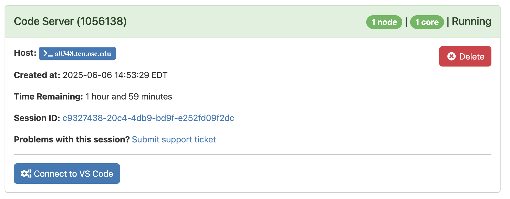
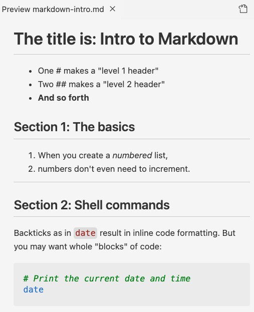

---------

<br>

## Introduction

### Context & overview

The [previous lecture](./w2a_project-org.qmd) emphasized the importance of research
documentation, and recommended using plain-text files to do so.
Now, you will learn to use **Markdown**,
a simple plain-text markup language that is a great option for writing your documentation.

But first, we'll introduce to **VS Code**,
the text editor you'll use to write Markdown --
as well as to write Unix shell code throughout the course.

## VS Code

### What is VS Code?

VS Code is basically a **fancy text editor**.
Its full name is Visual Studio Code, and it's also called "Code Server" at OSC.

To emphasize the additional functionality relative to basic text editors like Notepad and TextEdit,
editors like VS Code are also referred to as **IDEs**: *Integrated Development Environments*.
The RStudio program is another good example of an IDE.
Just like RStudio is an IDE for R, VS Code will be our IDE for shell code^[
Some advantages of VS Code: Works with all operating systems, is free, and open source;
it has an integrated terminal with a Unix shell; it is available at OSC OnDemand;
it is very popular and heavily developed].

### Starting VS Code at OSC

- Log in to OSC's OnDemand portal at <https://ondemand.osc.edu>

- In the blue top bar, select `Interactive Apps` and near the bottom, click `Code Server`.

- Interactive Apps like VS Code and RStudio **run on compute nodes** (not login nodes).
  Because compute nodes always need to be "reserved",
  we have to fill out a form and specify the following details:
  - The **Cluster** that we want to use: `pitzer`
  - The **Account**, the OSC Project to be billed for the compute node usage: `PAS2880`
  - The **Number of hours** we want to make a reservation for: `2`
  - This time, leave the **Working Directory** (starting point) for the program blank
  - The **App Code Server version**: `4.8.3` (this should be the only available option)

- Click `Launch` and you'll be sent to the _My Interactive Sessions_ page
  with a card for your job at the top.

- First, your job may be *Queued* for some seconds
  (i.e., waiting for computing resources to be assigned to it),
  but it should soon switch to *Starting* and then
  be ready for usage (*Running*) in another couple of seconds:

{fig-align="center" width="75%" fig-alt="A screenshot of the OSC OnDemand page shown when the Code Server job has started running." .lightbox}

- Once the blue **Connect to VS Code** button appears,
  click that to open VS Code in a new browser tab.

- When VS Code opens, you may get these two pop-ups (and possibly some others) ---
  click "Yes" (and check the box) and "Don't Show Again", respectively:

::: columns
::: {.column width="52%"}
{fig-align="center" width="85%" fig-alt="A screenshot of a popup you may get when first opening a folder in VS Code." .lightbox}
:::

::: {.column width="48%"}
{fig-align="center" width="85%" fig-alt="A screenshot of a popup you may get when first opening VS Code." .lightbox}
:::
:::

- You'll also see a Get Started page ---
  you don't have to go through any steps that may be suggested there.

_Congratulations: you have started your first compute job at OSC!_ 🥳

### The VS Code User Interface

{fig-align="center" width="80%" fig-alt="An annotated screenshot of the VS Code user interace" .lightbox}

#### Side bars

By default, the (wide) **Side Bar** will show a file explorer,
where you see your files, create new folders and files, and so on.

The **Activity Bar** (narrow side bar) on the far left has:

- A  ("hamburger menu"),
  which has menu items like `File` that you often find in a top bar
- A  (cog wheel icon) in the bottom,
  through which you can mainly access *settings*
- Icons to toggle between options for the wide Side Bar:
  we'll talk about those in a later session
  
### A folder as a starting point

Very conveniently, VS Code takes a specific
**folder as a starting point in all parts of the program**:

- In its file explorer
- When saving files
- In the Unix shell its terminal

 Click `File` > `Open Folder` and then type/select the
personal dir within `/fs/ess/PAS2880/users` you made last week
(for example, I will select `/fs/ess/PAS2880/users/jelmer`).
_This will cause the program to reload._

::: {.callout-tip appearance="simple"}
Remember all the talk of using relative paths that are supposed to start at a
(research) project's top-level dir?
Opening a folder like this in VS Code will help you with this,
and also makes it easy to switch between projects!
:::

#### Terminal (with a Unix shell)

 **Open a terminal** by clicking
   > `Terminal` > `New Terminal`.
We'll start using this terminal in the next lecture.
For now, practice _resizing panes_
(terminal vs. editor, and the width of the side bar)
by hovering your cursor over the lines dividing them and then dragging.

#### Editor pane and `Get Started` document

The main part of the VS Code is the **editor pane**.
Here, you can open scripts and other types of text files, images, and so on.
Like in a web browser, you can have multiple tabs open.

Whenever you open VS Code,
an editor tab with a `Get Started` document is automatically opened.
This provides some help and shortcuts to recently opened files and folders.

 **Create and save a new file:**

1. _Open a new file:_
   Click the hamburger menu <i class="fa fa-bars"></i> > `File` > `New File`.
2. _Save the file_ (<kbd>Ctrl/⌘</kbd>+<kbd>S</kbd>) within your `week02` dir
   as a Markdown file, e.g. `markdown-intro.md`.
   
## Markdown

Markdown is a lightweight text "markup language" that provides formatting
options for plain-text files.
Think of it as a much simpler version of HTML,
which also comes in plain-text source code/format and a rendered counterpart.
A _source_ Markdown file can be "**rendered**" to produce an output file
in a variety of formats like PDF and (rendered) HTML.

As a first example of the kind of markup you can do:
surrounding one or more characters by single or double asterisks
(**`*`**) will apply italic and bold formatting, respectively:

- When you write `*italic example*` this will be rendered as: *italic example*.
- When you write `**bold example**`this will be rendered as: **bold example**.

### Markdown in VS Code

When you save a file in VS Code with the extension `.md`
(short for Markdown) extension, as you have done:

::::::: columns
:::: {.column width="80%"}
- Some formatting will be automatically applied in the editor.
- You can open a live **preview** of the rendered version of the file by
  using the icon "*Open Preview to the Side*" shown on the right.
:::
:::: {.column width="20%"}
<br>
{fig-align="left" width="30%" fig-alt="A screenshot of the Markdown preview icon in VS Code." .lightbox}
:::
:::::::

Let's see this in action.
Try your first bit of Markdown by typing the following in your `markdown-intro.md` file...

````markdown
This is an *italic example*

This is a **bold example**
````

... and then click the Preview icon:

{fig-align="center" width="90%" fig-alt="A side-by-side screenshot of a source Markdown document and its VS Code preview." .lightbox}

### An example document

Now, let's learn some additional Markdown "syntax" (grammar/rules)
by typing what is shown on the left,
and seeing the effects in the live Preview in VS Code:

::::::: columns
:::: {.column width="47%"}
**Type:**

<hr style="height:1pt; visibility:hidden;" />
<hr style="height:1pt; visibility:hidden;" />
<hr style="height:1pt; visibility:hidden;" />

````
# The title is: Intro to Markdown

- One # makes a "level 1 header"
- Two ## makes a "level 2 header"
- **And so forth**

## Section 1: The basics

1. When you create a _numbered_ list,
1. numbers don't even need to increment.

----

## Section 2: Shell commands

Backticks as in `date` result in inline
code formatting.
But you may want whole "blocks" of code:

```bash
# Print the current date and time
date
```

````

::::
:::: {.column width="53%"}

**That should be rendered into the following preview:**

{fig-align="center" width="100%" fig-alt="The VS Code preview of the Markdown document above." .lightbox}

::::
:::::::

### Most common Markdown syntax

Here is an overview of some of the syntax we used above:

| Syntax/source            | Result/rendered output
|-------|-------------|
| \*italic\*        | *italic* text (or use one underscore: \_italic\_)
| \*\*bold\*\*      | **bold** text (or use two underscores: \_\_bold\_\_)
| # My Title        | Header level 1 (largest: _use for the document's title_)
| ## My Section     | Header level 2 (smaller -- and so forth for additional header levels)
| - List item       | Unordered (bulleted) list
| 1. List item      | Ordered (numbered) list
| \-\-\-             | Horizontal rule (line) -- use at least 3 dashes

<hr style="height:1pt; visibility:hidden;" />

Code-formatting related options:

| Syntax/source            | Result/rendered output
|-------|-------------|
| \`inline code\`   | "Code-formatted" text for inline use: `inline code`
| ```` ```bash ````<br> ```` code-block code ```` <br> ```` ``` ```` | `bash`-language code block: This will apply language-specific code formatting. Other languages can be specified equivalently, e.g. ```` ```r ```` creates an `R`-language code block.
| ```` ``` ````<br> ```` code-block code ```` <br> ```` ``` ```` | Generic/language-agnostic code block

<hr style="height:1pt; visibility:hidden;" />

And some other commonly used Markdown syntax:

| Syntax/source            | Result/rendered output
|----|-------------|
| \[link text\]\(website.com\)   | Clickable link with "hidden" URL: [link text](https://website.com)
| \<https://website.com\>   | Clickable link with visible URL: <https://website.com>
| > Text                    | Blockquote (like quoted text in emails)

: {.striped .hover}

<hr style="height:1pt; visibility:hidden;" />

::: exercise
####  Exercise: Markdown

Add text to your `markdown-intro.md` document that would result in the following
preview:

{fig-align="center" width="65%" fig-alt="A VS Code preview of a Markdown document." .lightbox}

<details><summary>*Click for the solution*</summary>

````markdown
## Section 3: Hyperlinks!

- The Markdown docs can be found [here](https://www.markdownguide.org)
- Or if you'd like to see the **URL**: <https://www.markdownguide.org>

### Section 3b: Take if from the experts

> This is a blockquote. It is often used to highlight text, for example quotes from papers or emails.

One last thing: `ls` is my favorite command
````

</details>

:::

### Use whitespace around Markdown syntax elements

First, it's highly recommended
(and in some cases necessary for correct rendering)
to leave a **blank line between different sections**,
such as between lists, headers, and regular paragraphs:

``` bash-in-nocolor
## Chapter 2: List of ...
  
- Item 1
- Item 2
  
For example, ....
```

Second, leave a **space after** heading (`#`) and list (`-` or `1.`) characters
or they won't be interpreted correctly:

::: columns
::: {.column width="10%"}
:::
::: {.column width="40%"}
**This:**

-----

```
##An important list

-x
-y
-z
```
:::
::: {.column width="40%"}
**Will be rendered as:**

-----

##An important list

-x -y -z
:::
:::
  
### How whitespace renders in Markdown

You'll have noticed Markdown doesn't show always show whitespace
(spaces, newlines, etc.) like you type it:

- A **single newline** is completely ignored!

::: columns
::: {.column width="10%"}
:::
::: {.column width="40%"}
**This:**

-----

```
Line 1.
Line 2.
```
:::
::: {.column width="40%"}
**Will be rendered as:**

-----

Line 1.
Line 2.
:::
:::

::: columns
::: {.column width="10%"}
:::
::: {.column width="40%"}

**This:**  

------

```
Writing  
one  
word  
per  
line.
```

:::
::: {.column width="40%"}
**Will be rendered as:**

-----

Writing one word per line.

:::
:::

- But a **blank line** between regular text will start a new paragraph,
  with some whitespace between the two:

::: columns
::: {.column width="10%"}
:::
::: {.column width="40%"}
**This:**

-----

```
Paragraph 1.
  
Paragraph 2.
```
:::
::: {.column width="40%"}
**Will be rendered as:**

-----

Paragraph 1.

Paragraph 2.
:::
:::

- Multiple consecutive spaces or blank lines will be **"collapsed"** into a single
  one:

::: columns
::: {.column width="10%"}
:::
::: {.column width="40%"}

**This:**  

------

```
Empty             spaces
```

:::
::: column
**Will be rendered as:**

-----

Empty spaces

:::
:::

::: columns
::: {.column width="10%"}
:::
::: {.column width="40%"}

```
Many


blank lines
```

:::
::: {.column width="40%"}
Many

blank lines

:::
:::

::: {.callout-tip collapse="true"}
#### How to force additional whitespace _(Click to expand)_

- If you want **more vertical whitespace** than what is provided between paragraphs,
  you'll have to resort to HTML (you can use any HTML markup in Markdown!) ---
  each **`<br>`** item forces a visible linebreak:

::: columns
::: {.column width="10%"}
:::
::: {.column width="40%"}

**This:**  

------

```
One <br> word <br> per line
and <br> <br> <br> <br> <br>
several blank lines.
```

:::
::: {.column width="40%"}
**Will be rendered as:**

-----
 
One <br> word <br> per line
and <br> <br> <br> <br> <br>
several blank lines.

:::
:::

- A single **linebreak** (as opposed to a new paragraph) can be forced using *two or more spaces*
  (i.e., press the spacebar twice) or a backslash `\` after the last character on a line:

::: columns
::: {.column width="10%"}
:::
::: {.column width="40%"}

**This:**  

------

```
My first sentence.\
My second sentence.
```

:::
::: {.column width="40%"}
**Will be rendered as:**

-----

My first sentence.\
My second sentence.

:::
:::

:::

::: {.callout-note collapse="true"}
### How to create tables in Markdown _(Click to expand)_

Tables are a bit of a pain to make, but you can do so with vertical bars <kbd>|</kbd>
and dashes/hyphens <kbd>-</kbd> as follows:

::: columns
::: {.column width="5%"}
:::
::: {.column width="35%"}
_This:_

````markdown
| city       | inhabitants |  
|------------|-------------|  
| Columbus   | 906 K       |
| Cleveland  | 368 K       |
| Cincinnati | 308 K       |
````
:::

::: {.column width="10%"}
:::

::: {.column width="40%"}
_Will be rendered as:_

| city &nbsp; &nbsp; &nbsp; &nbsp; &nbsp; &nbsp; | inhabitants   |  
|------------------|------------------|  
| Columbus &nbsp; | 906 K &nbsp; &nbsp; &nbsp; |
| Cleveland &nbsp; | 368 K &nbsp; &nbsp; &nbsp; |
| Cincinnati &nbsp; | 308 K &nbsp; &nbsp; &nbsp; |  

:::
:::

:::

### In closing

Markdown is useful for documentation because it is:

- *Easy to write* --
  you only need to know a dozen or so syntax constructs to be able to write Markdown.
- *Easy to read in source form* --
  and VS Code will apply some formatting even in source files!
- *A de facto standard* for documentation files in computational fields,
  such that e.g. GitHub, where you will learn to share your project files to
  in week 4, will render them for you.

Therefore, we recommend you use Markdown files (with a `.md` extension) instead
of regular text (`.txt`) files to write the kind of documentation of your
research projects we discussed in the previous session.

::: {.callout-note appearance="simple"}
Producing a rendered output file like a HTML or PDF from Markdown yourself is
rarely need for the abovementioned reasons.
That said, if you do need to render a Markdown file to e.g. HTML or PDF,
use [*Pandoc*](https://pandoc.org/installing.html).
:::

#### Markdown for everything!?

Several **Markdown extensions** allow Markdown documents to *contain code that runs*,
with that code's output then included in rendered documents!
For example, R Markdown (`.Rmd`) and the follow-up [Quarto](https://quarto.org/) ---
you will learn Quarto later in this course.

All in all, there are many possibilities with Markdown and its extensions!
For instance, consider that:

- This entire website, including last week's slides, is written using Quarto.
- Quarto also has support for citations and journal-specific formatting,
  so you can even write manuscripts with it.

::: {.callout-tip appearance="simple"}
Learn more about Markdown and its syntax on this excellent documentation site:
<https://www.markdownguide.org>.
:::
