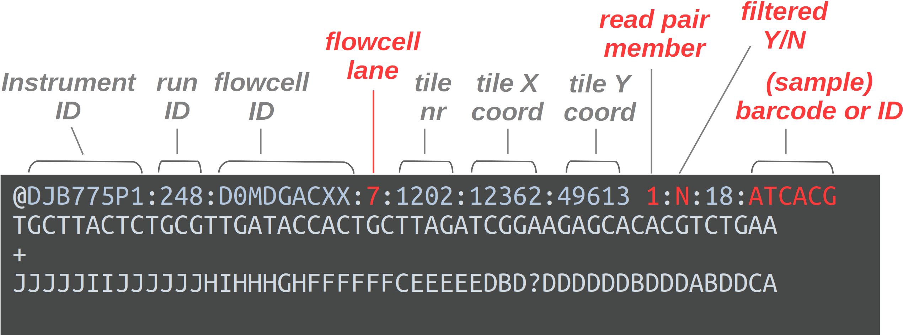

--------------------------------------------------------------------------------

<br>

## Before we start

### Learning goals

In this session, you will learn to use the Unix shell to:

- View the contents of text files in various ways
- Search within, manipulate, and extract information from text files

### Getting ready

#### Start a VS Code session

Start a VS Code session like we've done before.

<details><summary>_Click here to see the instructions_</summary>

1. Log in to OSC's OnDemand portal at <https://ondemand.osc.edu>.
2. In the blue top bar, select `Interactive Apps` and near the bottom, click `Code Server`.
3. In the form on the page that appears, fill out the following:
   - "_Cluster_": `pitzer-rhel9`
   - "_Account_" (= OSC Project): `PAS2880`.
   - "_Number of hours_": `2`
   - "_Working Directory_": your personal dir in `/fs/ess/PAS2880/users`
     (e.g. `/fs/ess/PAS2880/users/jelmer`)
   - "_App Code Server version_": `4.8.3`
4. Click `Launch`
5. Once the blue *Connect to VS Code* button appears,
   click that to open VS Code in a new browser tab.
6. In VS Code, open a terminal by either:
   - Clicking      =\> `Terminal` =\> `New Terminal`
   - Using the keyboard shortcut <kbd>Ctrl</kbd>+<kbd>`</kbd>
7. Check that your are in your dir within `/fs/ess/PAS2880/users` by typing `pwd`
   in the terminal.
   _(If you're not, that dir may be listed under `Recents` in the `Get Started`_
   _document --- if that's the case, click on that entry._
   _Otherwise, click `File` => `Open Folder` and type/select that dir.)_
   
</details>

#### Open a Markdown file for notes

Like before, I also recommend that you create and open a Markdown file to keep
notes:

1. Click <i class="fa fa-bars"></i> => `File` => `New File`.
2. Save the file (e.g. <kbd>Ctrl/⌘</kbd>+<kbd>S</kbd>) inside the
   `week03` dir within `/fs/ess/PAS2880/users/$USER`,
   e.g. as `session2.md` (make sure to use a `.md` extension).

#### Change your working dir

```bash
cd garrigos-data
```

<hr style="height:1pt; visibility:hidden;" />

## Viewing the contents of text files

Recall from the [Project Organization session](../week02/w2_1_project-org.qmd#use-plain-text-files)
that we'll be working almost exclusively with so-called "**plain-text**" files
in this course.
Many omics file formats are in plain text, we will code in plain text files,
and for reproducibility purposes,
we will also document our research in plain text (Markdown) files.

The commands we'll discuss here work with plain-text files but not with
"binary" formats like Excel or Word files.

### `cat`

The **`cat`** command will print the entire contents of one or more files to
screen:

```bash
cat README.md
```
```bash-out
sample_id       time    treatment
ERR10802882     10dpi   cathemerium
ERR10802875     10dpi   cathemerium
ERR10802879     10dpi   cathemerium
ERR10802883     10dpi   cathemerium
ERR10802878     10dpi   control
ERR10802884     10dpi   control
ERR10802877     10dpi   control
ERR10802881     10dpi   control
ERR10802876     10dpi   relictum
ERR10802880     10dpi   relictum
ERR10802885     10dpi   relictum
ERR10802886     10dpi   relictum
ERR10802864     24hpi   cathemerium
ERR10802867     24hpi   cathemerium
ERR10802870     24hpi   cathemerium
ERR10802866     24hpi   control
ERR10802869     24hpi   control
ERR10802863     24hpi   control
ERR10802871     24hpi   relictum
ERR10802874     24hpi   relictum
ERR10802865     24hpi   relictum
ERR10802868     24hpi   relictum
```

<hr style="height:1pt; visibility:hidden;" />

### `head` and `tail`

Some files, especially when working with omics data, can be huge,
so printing the whole file with `cat` is not always ideal.
The twin commands **`head`** and **`tail`** can be useful,
as they will print only the first (`head`) or last (`tail`) lines of a file.

`head` & `tail`'s defaults are to print 10 lines:

```bash
head meta/metadata.tsv
```
```bash-out
sample_id       time    treatment
ERR10802882     10dpi   cathemerium
ERR10802875     10dpi   cathemerium
ERR10802879     10dpi   cathemerium
ERR10802883     10dpi   cathemerium
ERR10802878     10dpi   control
ERR10802884     10dpi   control
ERR10802877     10dpi   control
ERR10802881     10dpi   control
ERR10802876     10dpi   relictum
```

Use the `-n` option to specify the number of lines to print:

```bash
head -n 3 meta/metadata.tsv
```
```bash-out
sample_id       time    treatment
ERR10802882     10dpi   cathemerium
ERR10802875     10dpi   cathemerium
```

A neat trick with `tail` is to *start at* a specific line,
`-n +<starting-line>`.
This is often used to skip the header line:

```bash
# '-n +2' tells tail to start at line 2:
tail -n +2 meta/metadata.tsv
```
```bash-out
ERR10802882     10dpi   cathemerium
ERR10802875     10dpi   cathemerium
ERR10802879     10dpi   cathemerium
ERR10802883     10dpi   cathemerium
ERR10802878     10dpi   control
# [...output truncated...]
```

Next, let's try to take a peak inside one of our FASTQ files.
We may want to use `-n 8` with `head` to print the first 8 lines,
which corresponds to 2 reads:

``` bash
head -n 8 fastq/ERR10802863_R1.fastq.gz
```
``` bash-out
�
Խے�8�E��_1f�"�QD�J��D�fs{����Yk����d��*��
|��x���l޴�j�N������?������ٔ�bUs�Ng�Ǭ���i;_��������������|<�v����3��������|���ۧ��3ĐHyƕ�bIΟD�%����Sr#~��7��ν��1y�Ai,4
w\]"b�#Q����8��+[e�3d�4H���̒�l�9LVMX��U*�M����_?���\["��7�s\<_���:�$���N��v�}^����sw�|�n;<�<�oP����
i��k��q�ְ(G�ϫ��L�^��=��<���K��j�_/�[ۭV�ns:��U��G�z�ݎ�j����&��~�F��٤ZN�'��r2z}�f\#��:�9$�����H�݂�"�@M����H�C�
�0�pp���1�O��I�H�P됄�.Ȣe��Q�>���
�'�;@D8���#��St�7k�g��|�A䉻���_���d�_c������a\�|�_�mn�]�9N������l�٢ZN�c�9u�����n��n�`��
"gͺ�
    ���H�?2@�FC�S$n���Ԓh�       nԙj��望��f      �?N@�CzUlT�&�h�Pt!�r|��9~)���e�A�77�h{��~��     ��
# [...output truncated...]
```

<details><summary>Ouch! 😳 What went wrong here? *(Click for the solution)*</summary>
We were directly presented with the contents of the *compressed* file, which isn't human-readable.
</details>

<hr style="height:1pt; visibility:hidden;" />

::: callout-note
#### When it comes to FASTQ files, no need to decompress
To get around the problem we just encountered with `head`,
you might be inclined to decompress these files
(which you could do with the `gunzip` command).
However, at least when it comes to FASTQ files,
you are best off leaving them compressed:

- Uncompressed files take up several times as much disk storage space as
  compressed ones
- Almost any bioinformatics tool accepts compressed FASTQ files
- You _can_ actually view these files while they are in compressed form,
  as shown below.
:::

<hr style="height:1pt; visibility:hidden;" />

### `less`: A file pager

The `less` command is rather different from the previous commands,
which simply printed file contents to the screen and gave us our shell prompt back.
Instead, `less` will open a file for you to browse through,
and you need to explicitly quit the program to get your prompt back.

Also, `less` will automatically display gzip-compressed files in
human-readable form:

``` bash
less garrigos-data/fastq/ERR10802863_R1.fastq.gz
```
```bash-out
@ERR10802863.8435456 8435456 length=74
CAACGAATACATCATGTTTGCGAAACTACTCCTCCTCGCCTTGGTGGGGATCAGTACTGCGTACCAGTATGAGT
+
AAAAAEEEEEEEEEEEEEEEEEEEEEEEEEEEEEEEEEEEEEEEEEEEEEEEEEEEEEEEEEEEEEEEEEEEEE
@ERR10802863.27637245 27637245 length=74
GCCACACTTTTGAAGAACAGCGTCATTGTTCTTAATTTTGTCGGCAACGCCTGCACGAGCCTTCCACGTAAGTT
+
AAAAAEEEEEEEEEEEEEEEEEEEEEEEEEEEEEEEEEAEE<EEEEEEEEEEEEEEEEEEEEEEEEEEEEEEEE
@ERR10802863.10009244 10009244 length=73
CTCGGCGTTAACTTCATCACGCAGATCATTCCGTTCCAGCAGCTGAAGCAAGACTACCGTCAGTACGAGATGA
+
AAAAAEEEEEEEEEEEEEEEEEEEEEEEEEEEEEEEEEEEEEEEEEEEEEEEEEEEEEEEEEEEEEEEEEEEE
```

You can move around in the file in several ways:

- By scrolling with your mouse
- With up <kbd>↑</kbd> and down <kbd>↓</kbd> arrows to move line-by-line
- If you have them, with <kbd>PgUp</kbd> and <kbd>PgDn</kbd> keys to move page-by-page
- With <kbd>u</kbd> (up) and <kbd>d</kbd> (down) to half a page at a time

To exit/quit `less` and get your shell prompt back, simply type **<kbd>q</kbd>**:

```bash
# Type 'q' to exit the less pager:
q
```

<hr style="height:1pt; visibility:hidden;" />

::: {.callout-note collapse="true"}
#### FASTQ format recap _(Click to expand)_

Recall that in a FASTQ file, each read has four lines and the reads are simply
printed back-to-back:

{width="90%" fig-align="center"}

The above screenshot is from one of the Garrigos et al. FASTQ files,
which were downloaded from the NCBI Sequence Read Archive (SRA).
When you receive FASTQ files from the sequencer,
they will instead have header with a lot more information, such as shown below:

{width="80%" fig-align="center"}
:::

<details><summary> Do you notice any unusual-looking reads? _(Click for the solution)_
</summary>

  There are a number of reads that are much shorter than the others and only consist
  of `N`, i.e. uncalled bases. For example:
  
  ```bash-out-solo
  @ERR10802863.11918285 11918285 length=35
  NNNNNNNNNNNNNNNNNNNNNNNNNNNNNNNNNNN
  +
  ###################################
  ```
</details>

<hr style="height:1pt; visibility:hidden;" />

::: {.callout-tip}
#### The `-S` option to `less` suppresses "line-wrapping"

With `-S`, lines in the file will not be "wrapped" across multiple lines in case
the line is too long to be shown on the screen.
Instead, the line will "run out of the screen" on the right-hand side
(and you can press the rightward arrow <kbd>→</kbd> to see that part).
With formats like FASTQ as well as tables,
line-wrapping can be confusing and is best turned off.

``` bash
less -S garrigos-data/fastq/ERR10802863_R1.fastq.gz
```
:::

<hr style="height:1pt; visibility:hidden;" />

### `wc -l` to count lines

_(This command doesn't display the contents of files and may better fit_
_in the section on Unix data tools below, but needs to be introduced for the_
_next bit.)_

The **`wc`** command by default counts the number of lines, words, and characters
in its input ---
but it is most commonly used to only **count lines**, with the `-l` option:

```bash
wc -l meta/metadata.tsv
```
```bash-out
23 meta/metadata.tsv
```

This can be surprisingly useful,
as the number of lines in many file types reflects the number of entries.

<hr style="height:1pt; visibility:hidden;" />

## Redirection and pipes

Since we'll be creating some dummy files,
let's create and move into a `sandbox` dir within `garrigos-data`:

```bash
mkdir sandbox
cd sandbox
```

### Redirection

The regular output of a command that is printed to the screen
(like a list of files by `ls`, or a number of lines by `wc -l`)
is technically called **"standard out"** or in short "*stdout*".
Sometimes, we may want to do something else with this output,
like storing it in a file.
Luckily, this is easy to do with something called "**redirection**".

First, let's remind ourselves what `echo` does without redirection ---
it will simply print the characters we provide it with to the screen:

```bash
echo "My first line"
```
```bash-out
My first line
```

Now, let's redirect `echo`'s standard out to a new file `test.txt`:

```bash
echo "My first line" > test.txt
```

No output was printed to the screen, as it instead went into the file:

```bash
cat test.txt
```
```bash-out
My first line
```

The "**`>`**" operator will redirect output to a file with the following rules:

- If the file doesn't exist, it will be *created*.
- If the file does exist, any contents will be *overwritten*.

Let's redirect another line into that same file:

```bash
echo "My second line" > test.txt
cat test.txt
```
```bash-out
My second line
```

That may not have been what we intended!
As explained above, the earlier file contents was _overwritten_. 
With "**`>>`**", however, we **append** the output to a file:

```bash
echo "My third line" >> test.txt
cat test.txt
```
```bash-out
My second line
My third line
```

<hr style="height:1pt; visibility:hidden;" />

### The pipe

Let's say that we want to count the number of entries (files and "sub"dirs)
in a directory. We could do that as follows:

```bash
# First we redirect the ls output to a file
ls ../fastq > filelist.txt

# Then we count the nr. of lines, which is the number of files in ../fastq:
wc -l filelist.txt
```
```bash-out
44 filelist.txt
```

That worked, but we needed two separate lines of code,
and we are left with a file `filelist.txt` that we probably want to remove
since it has served its sole purpose.

A more conventient way to do this kind of thing is with a "**pipe**", as follows:

```bash
ls ../fastq | wc -l
```
```bash-out
44
```

When we use the pipe, the output of the command on the left-hand side
(a file listing, in this case) is **redirected into the `wc` command**.
This command like many others will gladly accept input that way 
(i.e., via **standard in**) instead of via a file name argument.

Pipes are useful because they avoid having to write/read intermediate files ---
this saves typing, makes the operation quicker, and reduces file clobber.
In the example above,
we don't need to make a `filelist.txt` file to count the number of files.
We'll see pipes in action a bunch more in the next section.

<hr style="height:1pt; visibility:hidden;" />

## Unix data tools

We'll now turn to some commands that may be described as Unix "data tools".
These commands are very useful when working in the shell generally,
and when working with omics data specifically.

Their strengths are especially relatively simple data processing and summarizing
steps, and they are excellent in dealing with very large files. 
Here, we will cover:

- `grep` to search for text in files 
- `cut` to select one or more columns from tabular data
- `sort` to sort lines, or tabular data by column
- `uniq` to remove duplicates

We'll start with taking a look at one of the example data files,
and discussing tabular plain-text files.

### Tabular plain-text files and file extensions

The examples below will use the file `meta/metadata.tsv`,
so let's take another look at the first lines of that file first:

```bash
cd meta
head metadata.tsv
```
```bash-out
sample_id       time    treatment
ERR10802882     10dpi   cathemerium
ERR10802875     10dpi   cathemerium
ERR10802879     10dpi   cathemerium
ERR10802883     10dpi   cathemerium
ERR10802878     10dpi   control
ERR10802884     10dpi   control
ERR10802877     10dpi   control
ERR10802881     10dpi   control
ERR10802876     10dpi   relictum
```

"_Tabular_" files like this one contain data that is arranged in a
rows-and-columns format, i.e. as in a table or an Excel spreadsheet.
Because plain-text files do not have an intrinsic way to define columns,
certain characters are used as column "delimiters" in **plain-text tabular** files.
Most commonly, these are:

- A Tab, and such files are often stored with a **`.tsv`** extension for
  Tab-Separated Values ("**TSV** file").
- A comma, and such files are often stored with a **`.csv`** extension for
  Comma-Separated Values ("**CSV** file").

<hr style="height:1pt; visibility:hidden;" />

::: callout-important
#### Plain-text file extensions are flexible and mostly for human-readibility

A side note on **plain-text file extensions** like `.txt`, `.csv`, and `.tsv`,
but also genomics files like `.fastq` and scripts like `.R` or `.sh`:
because all plain text files are fundamentally the same,
i.e. "just plain-text files",
_changing the extension does not change anything about the file._
Instead, different file extensions are used primarily to make it clear
to humans (as opposed to the computer) what the file contains.
:::

<hr style="height:1pt; visibility:hidden;" />

### `grep` to print lines that match a pattern

The `grep` command is extremely useful and will find specific text 
(or text patterns) in a file.
By default, it will **print each line that contains a "match" in full**.

Its basic syntax is `grep "<pattern>" <file-path>`.
For example,
this will print all lines from `metadata.tsv` that contain "cathemerium":

```bash
grep "cathemerium" metadata.tsv
```
```bash-out
ERR10802882     10dpi   cathemerium
ERR10802875     10dpi   cathemerium
ERR10802879     10dpi   cathemerium
ERR10802883     10dpi   cathemerium
ERR10802864     24hpi   cathemerium
ERR10802867     24hpi   cathemerium
ERR10802870     24hpi   cathemerium
```

Instead of printing matching lines,
we can also **count** them with the `-c` option --
for example, how many control samples are in the dataset?

```bash
grep -c "control" metadata.tsv
```
```bash-out
7
```

The option `-v` **inverts** `grep`'s behavior and will print all lines that
do _not_ match the pattern --- here,
we'll combine `-v` and `-c` to count lines that do not contain "control":

```bash
grep -vc "control" metadata.tsv
```
```bash-out
16
```

::: {.callout-note collapse="false"}
#### Additional `grep` tips

- While not always necessary,
  it is a good habit to consistently use quotes (`"..."`) around the search pattern.
- Incomplete matches,
  including in individual words, work: "`contr`" will match the `control` lines
  (compare this behaviour with globbing using shell wildcards!)
- `grep` has many other useful options, such as:
  - `-i` to ignore case when searching
  - `-r` to search files recursively 
    (note that even without `-r`, it can operate on multiple files)
  - `-w` to make a pattern match whole "words" only
:::

<hr style="height:1pt; visibility:hidden;" />

### Selecting columns using `cut`

The `cut` command will select or we could say "cut out" one or more columns
from a tabular file.

You always have to use the **`-f`** option to specify the
**desired column(s) / "field"(s)**.

```bash
# Select the second column of the file:
cut -f 1 metadata.tsv
```
```bash-out
time
10dpi
10dpi
10dpi
10dpi
10dpi
10dpi
[...output truncated...]
```

In many cases, with `cut` and other commands alike,
it can be useful to **pipe the output to `head`** to quickly see if your command
works without printing a large number (sometimes thousands) of lines:

```bash
cut -f 1 metadata.tsv | head -n 3
```
```bash-out
time
10dpi
10dpi
```

::: {.callout-note collapse="true"}
#### Selecting multiple columns and specifying the delimiter with `cut` _(Click to expand)_

To select **multiple columns**, use a range or comma-delimited list:

```bash
cut -f 1,3 metadata.tsv | head -n 3
```
```bash-out
sample_id       treatment
ERR10802882     cathemerium
ERR10802875     cathemerium
```

```bash
cut -f 1-2 metadata.tsv | head -n 3
```
```bash-out
sample_id       time
ERR10802882     10dpi
ERR10802875     10dpi
```

However, it is not possible to change the order of columns with `cut`!
(The more advanced `awk` command can do this --
see [this optional reading material](../bonus/shell-data.qmd))

The default cut delimiter is a Tab,
so we didn't have to specify the delimiter with our current file.
But when you need to do this, use the `-d` option, e.g. `-d ,` for a CSV file:

```bash
# [Don't run this, hypothetical example]
# Select the second column in a comma-delimited (CSV) file:
cut -d, 2 my-data.csv
```
:::

<hr style="height:1pt; visibility:hidden;" />

### Combining `cut`, `sort`, and `uniq` to create a list

Let's say you want an alphabetically sorted list of treatments in `metadata.tsv`.
(Yes, that's a bit trivial in this case, but you could use the following code
also to operate on a huge genome annotation file, as you'll do later.)

To do this, you need to learn about two new commands:

- **`sort`** to sort/order/arrange rows, by default in alphanumeric order.
- **`uniq`** to remove duplicates (i.e., keep all distinct/unique) entries
  _from a sorted file/list_.

We'll build up a small "pipeline" to do this, step-by-step,
and piping the output into `head` at every step.
First, get rid of the header line with the previously mentioned `tail` trick:

```bash
tail -n +2 metadata.tsv | head
```
```bash-out
ERR10802882     10dpi   cathemerium
ERR10802875     10dpi   cathemerium
ERR10802879     10dpi   cathemerium
ERR10802883     10dpi   cathemerium
ERR10802878     10dpi   control
ERR10802884     10dpi   control
ERR10802877     10dpi   control
ERR10802881     10dpi   control
ERR10802876     10dpi   relictum
ERR10802880     10dpi   relictum
```

Second, select the column of interest with `cut`:

```bash
tail -n +2 metadata.tsv | cut -f 3 | head
```
```bash-out
cathemerium
cathemerium
cathemerium
cathemerium
control
control
control
control
relictum
relictum
```

Third, use `sort` to alphabetically sort the result:

```bash
tail -n +2 metadata.tsv | cut -f 3 | sort | head
```
```bash-out
cathemerium
cathemerium
cathemerium
cathemerium
cathemerium
cathemerium
cathemerium
control
control
control
```

Finally, use `uniq` to only keep unique (distinct) values ---
and also get rid of `head` since we now have a final command:

```bash
tail -n +2 metadata.tsv | cut -f 3 | sort | uniq
```
```bash-out
cathemerium
control
relictum
```

And with a very small modification to this pipeline,
you can generate a "count table" instead of a simple list!
You just have to add `uniq`'s `-c` option (for **c**ount):

```bash
tail -n +2 metadata.tsv | cut -f 3 | sort | uniq -c
```
```bash-out
      7 cathemerium
      7 control
      8 relictum
```

And this count table can in turn be sorted by most frequent occurrence ---
to do this, use `sort`'s `-n` option for numeric sorting together with `-r`
for reverse sorting so the largest numbers go first:

```bash
tail -n +2 metadata.tsv | cut -f 3 | sort | uniq -c | sort -nr
```
```bash-out
      8 relictum
      7 control
      7 cathemerium
```

<hr style="height:1pt; visibility:hidden;" />

:::{.callout-note collapse="true"}
#### Sorting based on one or more columns _(Click to expand)_
Above, we used `sort` to simply sort a list.
More generally, by default,
`sort` will sort based on the entire contents of a line.
To sort based on one or more columns, like you've likely done in Excel,
use the `-k` option --- for example:

```bash
# Sort based on the third column:
tail -n +2 metadata.tsv | sort -k3
```

`-k` takes a start and a stop column to sort by,
so if you want to strictly sort only based on one column at a time, use this syntax:

```bash
# Explicitly indicate to sort based on the third column only:
tail -n +2 metadata.tsv | sort -k3,3
```

To sort first by one column and _then_ by another, use `-k` multiple times:

```bash
# Sort first by the first column, then break ties using the second column:
tail -n +2 metadata.tsv | sort -k3,3 -k2,2
```
:::

<hr style="height:1pt; visibility:hidden;" />

### The Unix philosophy

With these Unix data tool examples, we saw the Unix philosophy in action:

> *This is the Unix philosophy: Write programs that do one thing and do it
> well.* *Write programs to work together. Write programs to handle text
> **streams**,* *because that is a universal interface.*<br> — Doug McIlory

Here are some advantages of a modular approach:

- Easier to spot errors
- Easy to swap out components, including in other languages
- Easier to learn

#### Text/data streaming

What about those **text "streams"** mentioned in the quote above?
Rather than loading entire files into memory,
Unix tools process them one line at a time.

This is very useful when working with large files in particular!
For example,
_`head` will print results instantly even for a 10 TB file_
that could never be loaded into memory.
By contrast, try to take a peak at such a file with a GUI text editor,
and your computer will crash.

Here is one other example, combining the `cat` command with globbing and redirection.
This command would concatenate (combine) all your R1 FASTQ files into a single file
-- and this is both elegantly short code,
and will run quickly and without using much computer memory!

```bash
# [Don't run this - for illustration only]
cat fastq/*R1.fastq.gz > all_R1.fastq.gz
```

::: {.callout-tip collapse="false"}
#### The above will even produce a valid compressed FASTQ file, because:

- FASTQ files can (in principle) be concatenated freely since every read is a
  "stand-alone" unit of 4 lines.
- Gzipped (`.gz`) files can also be concatened freely!
:::

If you want to learn more about these and other Unix data tools,
take a look at [this optional reading page on them](../bonus/shell-data.qmd).

<hr style="height:1pt; visibility:hidden;" />

::: {.callout-warning collapse="false"}
#### Don't redirect back to the input file!

You should never redirect the output of Unix commands "back" to the input file.
This will corrupt the input file because of how Unix commands stream input and
output line-by-line.

Therefore, if you really want to edit/overwrite the original file instead of
creating a separate edited copy, you will need multiple steps:
first produce a separate copy and then rename that.
For example:

```bash
# [Don't run any of this - for illustration only]

# You should NEVER run something like this:
sort metadata.tsv > metadata.tsv

# Instead, you would use:
sort metadata.tsv > metadata_sorted.tsv

# Possibly followed by (if you really needed to edit the original file):
mv metadata_sorted.tsv metadata.tsv
rm metadata_sorted.tsv
```
:::
