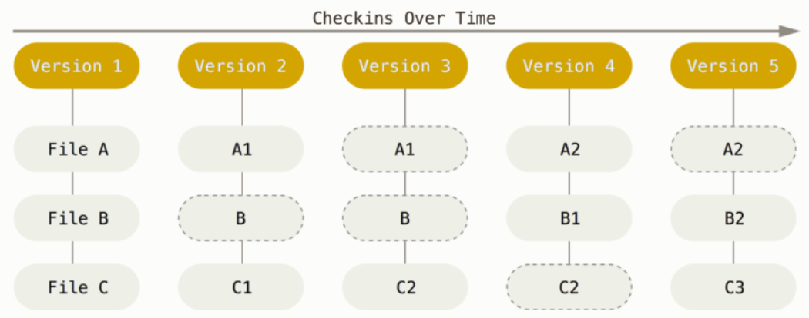
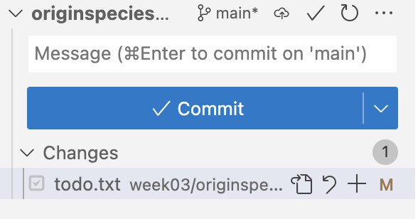

----------------------------------------------------------------------------------------------------

<br>

## Introduction

### Week overview and context

This week, you will learn about the why and how of storing different versions of
some of your project files using **Git**, a formal Version Control System (VCS),
and sharing the resulting repositories on the **GitHub** website.

- This lecture: Getting started with Git
- Next lecture: [Remote Git repositories on GitHub](w4b_github.qmd)
- Optional self-study material:
  [branching & merging, undoing committed changes, and viewing the past](../bonus/git.qmd)
  
### Lecture learning goals

- Understand why it's a good idea to use a formal Version Control System (VCS)
  for research projects.
- Learn the basics of Git, the most widely used VCS -- e.g.:
  - The basic Git workflow and basic Git commands
  - Showing changes between files
  - Making Git ignore specific files and dirs
  - Undoing accidental changes to your files

### Getting ready

#### Start a VS Code session

Start a VS Code session like you've done before.

<details><summary>_Click here to see the instructions_</summary>

1. Log in to OSC's OnDemand portal at <https://ondemand.osc.edu>
2. In the blue top bar, select `Interactive Apps` and near the bottom,
   click `Code Server`
3. Fill out the form as follows:
   - **Cluster**: `pitzer`
   - **Account**: `PAS2880`
   - **Number of hours**: `2`
   - **Working Directory**: `/fs/ess/PAS2880/user/<username>`
    (replace `<username>` with your user name)
   - **App Code Server version**: `4.8.3`
4. Click `Launch`
5. Click the `Connect to VS Code` button once it appears
6. In VS Code, open a terminal by 
   clicking      =\> `Terminal` =\> `New Terminal` ^[
   Or use the keyboard shortcut <kbd>Ctrl</kbd>+<kbd>`</kbd>.]
7. Check that your are in `/fs/ess/PAS2880/users/$USER`
   by typing `pwd` in the terminal.\
   _(Recall that `$USER` is a variable that represents your username._
   _If you're not in that dir, it may be listed under `Recents` in the_
   _`Get Started` document -- if so, click on that entry._
   _Otherwise, click `File` > `Open Folder` and type/select_
   _`/fs/ess/PAS2880/users/$USER`.)_
   
</details>

#### Create a dir for this week and navigate there

```bash
# You should be in /fs/ess/PAS2880/users/$USER :
pwd
```
```bash-out
/fs/ess/PAS2880/users/jelmer
```

```bash
mkdir week04
cd week04
```

#### Open a Markdown file for notes

You may want to create and open a Markdown file to keep class notes:

1. Click <i class="fa fa-bars"></i> => `File` => `New File`.
2. Save the file inside `/fs/ess/PAS2880/users/$USER/week04`,
   e.g. as `lectureA.md`.

#### Add a VS Code keyboard shortcut

Add a keyboard shortcut to send code from your editor pane to the terminal.
That way, you don't have to copy-and-paste code into the terminal when you've
typed it in the editor^[
This is the same type of behavior that you may be familiar with from RStudio]:

1. Click <i class="fa fa-cog"></i> (bottom-left) > `Keyboard Shortcuts`
2. Enter "Run Selected Text" in the search box,
   and the option in question should pop up:
   `Terminal: Run Selected Text in Active Terminal`
3. Click on that, then add the shortcut <kbd>Ctrl</kbd>+<kbd>Enter</kbd>^[
   Don't worry about the warning that other keybindings exist for this shortcut.].

::: callout-tip
### Automatic whole-line selection in VS Code
In VS Code's editor pane,
the _entire line that your cursor is on is selected by default_.
As such, you don't need to manually select the entire line when wanting to send
it to the terminal (or when cutting/copying!).
:::

## Version control

### Why use a Version Control System (VCS)?

Here are some "versioning"- and backup-related challenges for your **research project files**
that you may run into:

- How do you save periodic copies?
  - *Do you only save versions of individual files?*\
    Space-efficient, but doesn't allow you to go back to the state of
    other project files at the same point in time.
  - *Do you save a copy of the full project periodically?*\
    Better than the above option, but can become prohibitive in terms of disk storage.
- How do you know what changes were made between saved versions?
- How do you restore an accidentally deleted, modified, or overwritten file?
  This can especially be an issue at OSC where there is no recycle bin or undo button.
- [How do you manage simultaneous variants of files, such as when making experimental changes?]{style="color:#807c7c"}
- [How do you collaborate, especially when working simultaneously?]{style="color:#807c7c"}

Modern cloud storage solutions like OneDrive and Dropbox can help with some
of these challenges:
for example, you can restore automatically saved earlier versions of files,
and work simultaneously on files.
But they don't solve all of them, and you can't use use them directly at (e.g.) OSC.

However, with a formal Version Control System (VCS) like Git:

- You can easily see your history of changes.
- You have a time machine: you can go back to past states of your project
  (and not just of individual files!).
- Sharing your code and other aspects of your project is easy.
- [You can do simultaneous collaborative work -- and can always track down who made which changes.]{style="color:#807c7c"}
- [You can make experimental changes without affecting current functionality.]{style="color:#807c7c"}

Or, as @allesina2019 puts it in Chapter 2 of the book:

> *Version control is a way to keep your scientific projects tidily organized,*
> *collaborate on science, and have the whole history of each project at your* *fingertips.*\

In this course, you will (only) learn the basics of using version control.
The grayed-out examples above are only covered in the
[optional self-study material](../bonus/git.qmd).
But you will practice with applying these basics quite a lot!

### How Git works

**Git** is the most widely used Version Control System.
Git maintains databases called **repositories**,
in which you save "snapshots" of your project with every minor piece of progress.
Git manages this cleverly without having to create full copies of the project for every snapshot:

{fig-align="center" width="90%" fig-alt="A diagram showing how Git saves project snapshots." .lightbox}

<hr style="height:1pt; visibility:hidden;" />

As illustrated above,
files that haven't changed between snapshots are not saved again and again with every snapshot.
In fact, Git _doesn't even save full copies of files that have changed_:
instead, it tracks changes on a line-by-line basis, and only saves changed lines!

Note that **one Git repository manages files inside a single directory structure**.
That is, you should have a separate Git repository for each research project.
To use Git effectively,
it is therefore important that your projects are properly organized or at least
kept in separate dirs, as discussed in week 2.

#### Key Git term #1: Repository (repo)

A Git "repository" (or "repo") is the **version-control database for a project.**
Note that:

- You can start a Git repository in any dir you have access to on your computer and on OSC.
- It is typical (and recommended) to have one Git repository for each research project.
- The Git database is saved in a hidden dir (**`.git`**) within the dir in which you started the repo.

::: callout-tip
#### Hidden files and dirs
When a file or dir name starts with a **`.`**, like in `.git`, it is "hidden".
Hidden files and dirs don't show up in most file browsers by default,
nor in `ls` file listings unless you use the `-a` ("all") option.

Hidden files and dirs are often generated (and used!) automatically by various software,
and one reason they are hidden is that they are not supposed to be manually
edited, moved, or removed^[Unless you know exactly what you're doing.].
A location that has many hidden files is your Home directory,
where these file store different kinds of personal configurations.
:::

#### Key Git term #2: Commit

A Git "commit" is a **saved snapshot** of the project.
You'll soon learn more about this, but for now, note that:

- You can always go back the exact state of the entire project or of individual
  files for any commit.
- You make commits **manually** --
  Git is not an automated backup system, and this is by design!
  
### What do I put under version control?

You should primarily put **manually edited** files under version control, e.g.:

- Scripts^[And if you're writing software, all its source code.]
- Project documentation files
- Metadata / sample data
- Optionally manuscripts, especially if you write them in a plain text format

What about data and results?

- Raw data may or may not be included ---
  for omics data, this is generally not feasible due to large file sizes
- Results from analyses should generally not be included.

#### Source versus derived files

The general idea behind what you should and should not include is that you
should _version-control the source, but not derived files_.
In other words, version-control files that are manually edited,
but not the files that can be automatically/deterministically generated from them.
For instance:

- Version-control your Markdown file, not the HTML it produces.
- Version-control your script, not the output it produces.

::: callout-tip
#### Derived files

Recall last week's point that results and other derived files are (or should be)
in essence *dispensable*,
because they can be regenerated using the raw data and the scripts.
:::

#### File limitations

There are some limitations to the types and sizes of files that can be committed with Git:

- **File type**: binary (non-text) files, such a Word or Excel files, or compiled software, can be
  included but can't be tracked in quite the same way as plain-text files[^4].
- **Repository size**: for performance reasons, it's best to keep individual repositories under about 1 GB.
- **File size**: while you can have them in your Git repo, GitHub will not allow you to upload files >100 MB.

[^4]: Git will just save an entirely new version whenever there's been a change rather than
      tracking changes in individual lines.

As such, omics data is usually too large to be version-controlled.
To make your data available to others,
you should use dedicated repositories like the NCBI's Sequence Read Archive
(SRA; we'll talk more about data sharing later).

### User Interfaces for Git

You can work with Git in several different ways --- using:

- The native command-line interface (CLI)
- Third-party graphical user interfaces (GUIs) such as GitHub Desktop and Git Kraken
- IDEs/editors with Git integration like RStudio and VS Code.

In this course, we will focus on the CLI because it's the most universal and powerful
interface. But it's absolutely fine to switch to GUI usage later,
which will not be hard if you've learned Git basics with the CLI.

Git takes some getting used to, regardless of the interface.
Many people have one or more "false starts" with it.
I hope that being forced to use it in a course will take you past that!

## The basic Git workflow

Git commands always start with `git` followed by a second command/subcommand or "verb": `git add`,
`git commit`, etc. Only three commands tend to make up the vast majority of your Git work:

- **`git add`** does two things:\
  - Start "**tracking**" files -- needed because files in your dir hierarchy
    are _not_ automatically included in the repo
  - Mark changed and new files as ready to be committed, which is called "**staging**" files
- **`git commit`**\
  Create a new snapshot of the project by commiting all currently staged files
- **`git status`**\
  Get the status of your repo: which files have changed, which new files are present,
  tips on next steps, etc.

{fig-align="center" width="90%" fig-alt="A diagram of the process of adding and committing changes with Git commands." .lightbox}

<hr style="height:1pt; visibility:hidden;" />

{fig-align="center" width="50%" fig-alt="A diagram of the process of adding and committing changes with Git commands" .lightbox}

## One-time Git configuration

We will start by doing some one-time personal Git configuration that will apply
anywhere on OSC, and won't ever have to be redone unless you want to make changes.
This is all done with `git config --global`.

1. Make your name known to Git --
   your actual name (first and last) and not e.g. your OSC or GitHub username:
   
   ```sh
   git config --global user.name 'John Doe'
   ```

3. Make your email address known
   (_should match the address associated with your GitHub account_):
   
   ```sh
   git config --global user.email 'doe.391@osu.edu'
   ```

4. Set a default text editor for Git.
   (Git will
   occasionally^[When you need to provide Git with a "commit message" to Git
   and you haven't entered one on the command line.]
   open a text editor for you. Even though we're using VS Code,
   here it is better to select a text editor that runs in the shell,
   like `nano`.)

   ```sh
   git config --global core.editor "nano -w"
   ```

5. Change the default "branch" name to `main`:

   ```sh
   git config --global init.defaultbranch main
   ```
   
6. Check whether you successfully changed the settings:

   ```sh
   git config --global --list
   ```
   ```bash-out
   # user.name=John Doe
   # user.email=doe.39@osu.edu
   # core.editor=nano -w
   # init.defaultbranch=main
   ```

## Your first Git repository

You'll create a Git repository for a mock book project:
writing Charles Darwin's "On the Origin of Species"
(this content follows chapter 2 in @allesina2019).

### Start a new Git repository

Create a new dir for a mock project that you will version-control with Git,
and navigate there:

``` sh
# (Your starting point should be /fs/ess/PAS2880/users/$USER/week04)
mkdir originspecies
cd originspecies
```

The command to **initialize a new Git repository is `git init`** ---
use that to start a repo for the `originspecies` dir:

``` sh
git init
```
``` bash-out
Initialized empty Git repository in /fs/ess/PAS2880/users/jelmer/week03/originspecies/.git/
```

Can we confirm that the Git repo dir is there?

```bash
# The -a option to ls will also show hidden files
ls -a
```
```bash-out
.  ..  .git
```

Next, check the status of your new repository with `git status`:

``` sh
git status
```

``` bash-out
On branch main

No commits yet

nothing to commit (create/copy files and use "git add" to track)
```

Git reports that you:

- Are on a "branch" called `main`.
  We won't cover Git branches in class, but this is discussed in the
  [optional self-study material](../bonus/git.qmd) and @allesina2019 Chapter 2.6.
  Basically, branches are "parallel versions" of your repository.
- Have not created any commits yet.
- Have "nothing to commit" because there are no files in this dir.

### Your first Git commit

You will start writing the book (😉) by `echo`-ing some text into a new file
called `origin.txt`:

``` sh
echo "An Abstract of an Essay on ..." > origin.txt
```

Now, check the status of the repository again:

``` sh
git status
```
``` bash-out
On branch main

No commits yet

Untracked files:
  (use "git add <file>..." to include in what will be committed)
        origin.txt

nothing added to commit but untracked files present (use "git add" to track)
```

::: {.callout-tip appearance="minimal"}
The Git output will include some [colors]{style="color:red"} that are not shown
in the output on this website.
:::

Git has clearly **detected** the new file.
But as mentioned, Git does not automatically start "tracking" files,
which is to say it won't automatically include files in the repository.
Instead, it tells you the file is "Untracked" and gives a hint on how to add it to the repository.

So, **start tracking the file and stage it all at once** with `git add`:

``` sh
# (Note that tab-completion on file names will work here, too)
git add origin.txt
```

Check the status of the repo again:

``` sh
git status
```
``` bash-out
On branch main

No commits yet

Changes to be committed:
  (use "git rm --cached <file>..." to unstage)
        new file:   origin.txt
```

Now, your file has been added to the **staging area** (also called the **Index**) and is
listed as a "_change to be committed_"^[
You also get a hint on how to "*unstage*" the file:
i.e., reverting what you just did with `git add` and leaving the file untracked once again].
This means that if you now run `git commit`, the file would be included in that commit.

So, with your file tracked & staged, let's make your **first commit**.
Note that you must add the option `-m` followed by a "commit message":
a short description of the changes you are including in the current commit.

``` sh
# We use the commit message (option '-m') "Started the book" to describe our commit
git commit -m "Started the book"
```

``` bash-out
[main (root-commit) 3df4361] Started the book
 1 file changed, 1 insertion(+)
 create mode 100644 origin.txt
```

Now that you've made your first Git commit, check the status of the repo again:

``` sh
git status
```

``` bash-out
On branch main
nothing to commit, working tree clean
```

::: {.callout-tip appearance="simple"}
Try to get in the habit of using `git status` a lot --
as a sanity check before and after other `git` actions.
:::

Also look at the **commit history** of the repo with `git log`:

``` sh
git log
```

``` bash-out
commit 3df4361c1de9b71e08bf6e050105d53097acec21 (HEAD -> main)
Author: Jelmer Poelstra <jelmerpoelstra@gmail.com>
Date:   Mon Mar 11 10:55:35 2024 -0400

    Started the book
```

Note the "hexadecimal code" (which uses numbers and the letters `a`-`f`)
on the first line --
this is a unique identifier for each commit, called the **SHA-1 checksum**.
You can reference and access each past commit with these checksums.

### Your second commit

Start by modifying the book file -- you'll actually overwrite the earlier content:

``` sh
echo "On the Origin of Species" > origin.txt
```

Check the status of the repo:

``` sh
git status
```

``` bash-out
Changes not staged for commit:
  (use "git add <file>..." to update what will be committed)
  (use "git restore <file>..." to discard changes in working directory)
        modified:   origin.txt

no changes added to commit (use "git add" and/or "git commit -a")
```

Git has *noticed* the changes, because the file is being tracked:
`origin.txt` is listed as "modified".
But changes to tracked files aren't automatically _staged_ ---
use `git add` to **stage** the file as a first step to committing these changes:

``` sh
git add origin.txt
```

Now, make your second commit:

``` sh
git commit -m "Changed the title as suggested by Murray"
```

``` bash-out
[main f106353] Changed the title as suggested by Murray
 1 file changed, 1 insertion(+), 1 deletion(-)
```

Git gives a brief summary of the changes that were made:
you changed 1 file (`origin.txt`), and since you replaced the line of text in that file,
it is interpreting that as 1 insertion (the new line) and 1 deletion (the removed/replace line).

Check the history of the repo again -- you'll see that there are now 2 commits:

``` bash
git log
```

``` bash-out
commit f1063537b6a1e0d87d2d52c9e96c38694959997a (HEAD -> main)
Author: Jelmer Poelstra <jelmerpoelstra@gmail.com>
Date:   Mon Mar 11 11:01:49 2024 -0400

    Changed the title as suggested by Murray

commit 3df4361c1de9b71e08bf6e050105d53097acec21
Author: Jelmer Poelstra <jelmerpoelstra@gmail.com>
Date:   Mon Mar 11 10:55:35 2024 -0400

    Started the book
```

As you start accumulating commits,
you might prefer `git log --oneline` for a one-line-per-commit summary:

```bash
git log --oneline
```
```bash-out
1e2bba4 (HEAD -> main) Changed the title as suggested by Murray
4fd04af Started the book
```

::: callout-note
### Staging files efficiently

When you have multiple files that you would like to stage, you don't need to add them one-by-one:

``` sh
# NOTE: Don't run any of this - these are hypothetical examples
# Stage all files in the project/repository:
git add --all

# Stage all files in a specific dir (here: 'scripts') in the project:
git add scripts/*
```

Finally, you can use the `-a` option for `git commit` as a shortcut to
**stage and commit all changes with a single command**
(but note that this will *not add untracked files*):

``` sh
# Stage & commit all tracked files:
git commit -am "My commit message"
```
:::

### What to include in individual commits

The last example in the box above showed the `-a` option to `git commit`,
which allows you to at once stage and commit all changes since the last commit.
That seems more convenient than separately `git add`ing files before committing.

However, it's good practice not to simply and only commit, say, at the end of each day,
but instead to try and create commits for *units of progress worth saving* and as such
**create separate commits for distinct changes**.

For example, let's say that you use `git status` to check which files you've changed
since your last commit, and you find that you have:

-   Updated a README file to include more information about your samples.
-   Worked on a script to run quality control of sequence files.

These are completely unrelated changes, and it would **not** be recommended to include both in a
single commit.

::: exercise
####  Exercise

1.  Create a new file `todo.txt` containing the line:
    "June 18, 1858: read essay from Wallace".

    <details><summary>Click to see the solution</summary>
    
    ``` sh
    echo "June 18, 1858: read essay from Wallace" > todo.txt
    ```
    </details>

2.  Use a Git command to stage the file.

    <details><summary>Click to see the solution</summary>
    
    ``` sh
    git add todo.txt
    ```
    </details>

3.  Create a Git commit with the commit message "*Added to-do list*".

    <details><summary>Click to see the solution</summary>
    
    ``` sh
    git commit -m "Added to-do list"
    ```
    </details>
:::

<hr style="height:1pt; visibility:hidden;" />

::: {.callout-tip appearance="simple"}
You have now learned the basic Git workflow! 🥳
The sections below will go through a few related key aspects of using Git.
:::

## Ignoring files and directories

As discussed above, it's best not to track some files,
such as very bulky data files, temporary files, and results.

We've seen that Git will notice and report any "untracked" files in your project
whenever you run `git status`.
This can get annoying and can make it harder to spot changes and untracked files
that you do want to add ---
and you might even accidentally start tracking these files such as with `git add --all`.

To deal with this, you can tell Git not to pay attention to certain files by adding file names and
wildcard selections to a **`.gitignore` file**.
This way, these files won't be listed as untracked files when you run `git status`,
and they wouldn't be added even when you use `git add --all`.

To see this in action,
start by adding some content that you don't want to commit to your repository:
a dir `data`,
and a file ending in a `~` (a temporary file type that e.g. text editors can produce):

``` sh
mkdir data
touch data/drawings_1855-{01..12} todo.txt~
```

When you check the status of the repo, you see that Git has noticed these files:

``` sh
git status
```

``` bash-out
Untracked files:
  (use "git add <file>..." to include in what will be committed)
        data/
        todo.txt~
```

If you don't do anything about this,
Git will keep reporting these untracked files whenever you run `git status`.
**To prevent this, you can create a `.gitignore` file:**

- `.gitignore` should be in the project's root dir and should be called `.gitignore`
- This is a plain text file that contains dir and file names/patterns,
  all of which will be ignored by Git
- As soon as a `.gitignore` file exists, Git will automatically check and process its contents
- It's a good idea add and commit this file to the repo.

Now, create a `.gitignore` file and add entries to instruct Git
to ignore everything in the `data/` dir, and any file that ends in a `~`:

``` sh
# Ignore everything in the data dir:
echo "data/" > .gitignore
# Ignore everything that ends in a ~:
echo "*~" >> .gitignore
```
```sh
cat .gitignore
```
```bash-out
data/
*~
```

When you check the status again,
Git will have automatically processed the the `.gitignore` file,
and the targeted files should no longer be listed as untracked files:

``` sh
git status
```

``` bash-out
Untracked files:
  (use "git add <file>..." to include in what will be committed)
        .gitignore
```

However, you do now have an untracked `.gitignore` file,
so track and commit this file as follows:

``` sh
git add .gitignore
git commit -m "Add a gitignore file"
```

``` bash-out
[main 9715ab5] Added a gitignore file
 1 file changed, 2 insertions(+)
 create mode 100644 .gitignore
```

::: callout-tip
### Good project file organization helps with version control

Good project file organization, as discussed last week, can make your life with Git a lot easier.
This is especially true when it comes to files that you want to ignore.

Since you'll generally want to ignore data and results files,
if you keep all of those in their own top-level directories,
it will be easy and not error-prone to tell Git to ignore them.
But if you were, for example, mixing scripts and either results or data within dirs,
it would be much harder to keep this straight.
:::

## File states and showing changes

### File states

To formalize what we've seen earlier,
tracked files can be in one of three states:

- Unchanged since the last commit: **committed** (=> latest version is in the repo/commits).
- Modified and staged since the last commit: **staged** (=> latest version is in the stage/"Index").
- Modified but not staged since the last commit: **modified** (=> latest version is in the working dir).

::: callout-warning
### "Working dir" in the context of Git
Note that when we talk about the "working dir" in the context of Git,
it means not just your top-level project/repository directory,
or any specific dir within there that you may have `cd`-ed into,
but the **entire project/repository directory hierarchy**.

In a Git context,
this term is mainly used to distinguish between the state of your
project on your computer ("working dir")
versus that in the repository ("index" and "commits"),
and is in full referred to as the "working dir _tree_".
:::

### Showing changes

You can use the **`git diff` command** to show changes that you have made.
By default, it will show all changes between the _working dir_ and:

- The _last commit_ if nothing has been staged.
- The _stage (Index)_ if something has been staged.

Right now, there are no differences to report in our `originspecies` repository,
because your working dir, the stage/Index, and the last commit are all the same:

``` sh
# Git diff will not print anything if there are no changes to report:
git diff
```

Change the to-do list
(note: this will only work if you did the exercise above) and check again:

``` sh
echo "June 20, 1858: Send first draft to Huxley" >> todo.txt

git diff
```

``` bash-out
diff --git a/todo.txt b/todo.txt
index e3b5e55..9aca508 100644
--- a/todo.txt
+++ b/todo.txt
@@ -1 +1,2 @@
 June 18, 1858: read essay from Wallace
+June 20, 1858: Send first draft to Huxley
```

We won't go into the details of the above "diff format",
but at the bottom of the output above, you can see some specific changes:
the line "Send first draft to Huxley" was added (hence the **`+`** sign) in our
latest version of the file.

::: {.callout-note collapse="true"}
#### More `git diff` *(Click to expand)*

- To show changes **between the Index (stage) and the last commit**,
  use the `--staged` option to `git diff`.

- If you have *changed multiple files, but just want to see differences for one of them*,
  you can specify the filename.
  In our example,
  that will print the same output as the plain `git diff` command above,
  since we only changed one file:

  ```sh
  git diff todo.txt
  # Output not shown, same as above
  ```
:::

### VS Code functionality to show changes

VS Code has some built-in Git functionality,
some of which is quite a bit more user-friendly than the Git command-line interface.
For example, to see changes between files:

1. Click on the Git symbol in the narrow side bar (below the search icon)
   to open the *Source Control* side bar.
   
2. In the source control sidebar,
   you should see the `garrigos-data` repository,
   but you may not see the `originspecies` repository.
   If not, click "File" > "Open Folder" and select `week04/originspecies`
   to make VS Code start at that dir --
   then, you should definitely see the `originspecies` repo.
   
3. Within the `originspecies` listing, you should see `todo.txt`:
   click on the **`M`** next to the file `todo.txt`:
   
{fig-align="center" width="40%" fig-alt="A screenshot of the VS Code source control sidebar." .lightbox}
   
4. Then, the following should appear in your editor pane:
   
{fig-align="center" width="95%" fig-alt="A screenshot of the VS Code diff view." .lightbox}

That's a much more intuitive overview than that of `git diff`,
and makes very clear which line was added.

::: exercise
####  Exercise: another commit

Stage and commit the changes to `todo.txt`, then check what you have done.

<details><summary>Click to see the solution</summary>

- Stage the file:

  ```bash
  git add todo.txt
  ```

- Commit:

  ```bash
  git commit -m "Update the TODO list"
  ```
  ```bash-out
  [main 8ec8103] Update the TODO list
  1 file changed, 1 insertion(+)
  ```
  
- Check the log --
  note, when the Git log output gets longer, because you have more commits,
  it may open in `less` rather than print the output to the screen.
  Recall that to exit `less`, you have to press `q`.

  ```bash
  git log
  ```
  ```bash-out
  commit 8ec8103e8d01b342f9470908b87f0649be53edd5
  Author: Jelmer Poelstra <jelmerpoelstra@gmail.com>
  Date:   Mon Mar 11 12:30:35 2024 -0400
  
      Update the TODO list
  
  commit 9715ab5325429526a90ea49e9d40a923c93ccb72
  Author: Jelmer Poelstra <jelmerpoelstra@gmail.com>
  Date:   Mon Mar 11 11:37:32 2024 -0400
  
      Added a gitignore file
  
  commit 603d1792619bf628d66cd91a45cd7114e3d6b95b
  Author: Jelmer Poelstra <jelmerpoelstra@gmail.com>
  Date:   Mon Mar 11 11:21:36 2024 -0400
  
      Added to-do list
  
  commit f1063537b6a1e0d87d2d52c9e96c38694959997a
  Author: Jelmer Poelstra <jelmerpoelstra@gmail.com>
  Date:   Mon Mar 11 11:01:49 2024 -0400
  
      Changed the title as suggested by Murray
  
  commit 3df4361c1de9b71e08bf6e050105d53097acec21
  Author: Jelmer Poelstra <jelmerpoelstra@gmail.com>
  Date:   Mon Mar 11 10:55:35 2024 -0400
  
      Started the book
  ```

</details>

:::

## Moving and removing tracked files

When you want to remove, move, or rename files that are tracked by Git,
it is good practice to preface regular `rm` and `mv` commands with `git`:
so, to `git rm` and `git mv`.

When removing or moving/renaming a tracked file with `git rm` / `git mv`,
changes will be made to your working dir just like with a regular `rm`/`mv`,
and the operation will also be _staged_.
For example:

``` sh
# (NOTE: Don't run this, hypothetical examples)
git rm file-to-remove.txt
git mv myoldname.txt mynewname.txt

git status
```
```bash-out
On branch main
Changes to be committed:
  (use "git restore --staged <file>..." to unstage)
        renamed:    myoldname.txt -> mynewname.txt
        deleted:    file-to-remove.txt
```

::: {.callout-warning collapse=true}
#### What if I forget to use `git rm`/`git mv`? _(Click to expand)_

It is inevitable that you will occasionally forget about this and e.g. use `rm`
instead of `git rm`.
Fortunately, _Git will eventually figure out what happened_. For example:

- For a renamed file, Git will first be confused and register both a removed file and an
  added file:
  
  ```bash
  # (Don't run this, this is a hypothetical example)
  mv myoldname.txt mynewname.txt
  
  git status
  ```
  ```bash-out
  On branch main
  Changes not staged for commit:
    (use "git add/rm <file>..." to update what will be committed)
    (use "git restore <file>..." to discard changes in working directory)
          deleted:    myoldname.txt
  
  Untracked files:
    (use "git add <file>..." to include in what will be committed)
          mynewname.txt
  ```

- But after you stage both changes (the new file and the deleted file),
  Git realizes it was renamed instead:

  ```bash
  git add myoldname.txt
  git add mynewname.txt
  
  git status
  ```
  ```bash-out
  On branch main
  Changes to be committed:
    (use "git restore --staged <file>..." to unstage)
          renamed:    myoldname.txt -> mynewname.txt
  ```

So, there is no need to stress if you forget this, but when you remember,
use `git mv` and `git rm`.
:::

::: exercise
####  Exercise: `.gitignore` and `git rm`

Create a new directory `results` with files `Galapagos.txt` and `Ascencion.txt`.
Add a line to the `.gitignore` file to ignore all files in `results`,
and commit the changes to the `.gitignore` file.

<details><summary>Click to see the solution</summary>

- Create the dir and files:
  
  ```bash
  mkdir results
  touch results/Galapagos.txt results/Ascencion.txt
  ```

- Optional - check that they are detected by Git
  (note: only the dir will be shown, not its contents):

  ```bash
  git status
  ```
  ```bash-out
  On branch main
  Untracked files:
    (use "git add <file>..." to include in what will be committed)
          results/
  
  nothing added to commit but untracked files present (use "git add" to track
  ```

- Add the text "results/" to the `.gitignore` file:

  ```bash
  echo "results/" >> .gitignore
  ```

- Optional - check the status again:

  ```bash
  git status
  ```
  ```bash-out
  On branch main
  Changes not staged for commit:
    (use "git add <file>..." to update what will be committed)
    (use "git restore <file>..." to discard changes in working directory)
          modified:   .gitignore
  
  no changes added to commit (use "git add" and/or "git commit -a")
  ```
  
  Looks good, `results/` is no longer listed.
  But you do need to commit the changes to `.gitignore`.
  
- Commit the changes to `.gitignore`:

  ```bash
  git add .gitignore
  git commit -m "Add results dir to gitignore"
  ```
  ```bash-out
  [main 33b6576] Add results dir to gitignore
  1 file changed, 1 insertion(+)
  ```

</details>

Create and commit an empty new file `notes.txt`.
Then, remove it with `git rm` and commit your file removal.

<details><summary>Click to see the solution</summary>

- Create the file and add and commit it:

  ```bash
  touch notes.txt
  git add notes.txt
  git commit -m "Add notes"
  ```
  ```bash-out
  [main 44a37f9] Add notes
   1 file changed, 0 insertions(+), 0 deletions(-)
   create mode 100644 notes.txt
  ```

- Optional - check that the file is there:

  ```bash
  ls
  ```
  ```bash-out
  data  notes.txt  origin.txt  README.md  todo.txt  todo.txt~
  ```

- Remove the file with `git rm` and commit the removal:

  ```bash
  git rm notes.txt
  git commit -m "These notes were made in error"
  ```
  ```bash-out
  [main 058fd47] These notes were made in error
   1 file changed, 0 insertions(+), 0 deletions(-)
   delete mode 100644 notes.txt
  ```

- Optional - check that the file is no longer there:

  ```bash
  ls
  ```
  ```bash-out
  data  origin.txt  README.md  todo.txt  todo.txt~
  ```

</details>
:::

## Undoing changes that have not been committed

Here, you'll learn how to undo changes that have not been
committed, like undoing an accidental file removal or overwrite.
(In the [optional self-study Git material](../bonus/git.qmd),
there is a section on undoing changes that _have_ been committed.)

### Recovering a version from the repo

We'll practice with undoing changes to your working dir (that have not been staged)
by recovering a version from the repo:
in other words,
using Git as an "undo button" after accidental file changes or removal.

Let's say you **accidentally overwrote** instead of appended to a file:

1. Accidental overwriting of the file:

   ```sh
   echo "Finish the taxidermy of the finches from Galapagos" > todo.txt
   ```

2. Next, always start by checking the status:
  
   ```sh
   git status
   ```
   ```bash-out
   On branch main
   Changes not staged for commit:
     (use "git add <file>..." to update what will be committed)
     (use "git restore <file>..." to discard changes in working directory)
           modified:   todo.txt
   
   no changes added to commit (use "git add" and/or "git commit -a")
   ```

3. You'll want to "discard changes in working directory",
   and Git told you how to do this --- with `git restore`:
  
   ```sh
   git restore todo.txt
   ```

<hr style="height:1pt; visibility:hidden;" />

If you **accidentally deleted a file**,
you can similarly retrieve it with `git restore`:

1. Accidental removal of `todo.txt`

   ```sh
   rm todo.txt
   ```

2. Use `git restore` to get the file back!
   
   ```bash
   git restore todo.txt
   ```

### Unstaging a file

`git restore` can also *unstage* a file.
In other words, you can undo the staging that is done by `git add`,
so the file goes back to the *modified* stage.

This is most often needed when you added a file that was not supposed to be part
of the next commit. For example:

1. You modify two files and use `git add --all`:

   ```sh
   echo "Variation under domestication" >> origin.txt
   echo "Prepare for the next journey" >> todo.txt
   
   git add --all
   ```

2. Then you realize that those two file changes should be part of separate commits.
   Again, check the status first:

   ```bash
   git status
   ```
   ```bash-out
   On branch main
   Changes to be committed:
     (use "git restore --staged <file>..." to unstage)
           modified:   origin.txt
           modified:   todo.txt
   ```

3. And use `git restore --staged` as suggested by Git:

   ```sh
   git restore --staged todo.txt
   
   git status
   ```
   ```bash-out
   On branch main
   Changes to be committed:
     (use "git restore --staged <file>..." to unstage)
           modified:   origin.txt
   
   Changes not staged for commit:
     (use "git add <file>..." to update what will be committed)
     (use "git restore <file>..." to discard changes in working directory)
           modified:   todo.txt
   ```

Now, you can go ahead and add these changes to separate commits: see the exercise below.

And finally, in case you merely staged a file _prematurely_,
you can just continue editing the file and re-add it afterwards.

::: exercise
####  Exercise: Commit the changes 1-by-1

Commit the currently staged changes to `origin.txt`.

<details><summary>Click for the solution</summary>

```bash
git commit -m "Start writing about artificial selection"
```
</details>

Next, stage and commit the changes to `todo.txt`.

<details><summary>Click for the solution</summary>

```bash
git add todo.txt
git commit -m "Update the TODO file"
```
</details>

:::

::: {.callout-note collapse="true"}
#### Undoing staged changes _(Click to expand)_

What if you had made mistaken changes (like an accidental deletion) and also
*staged* those changes?
You can simply follow both of the two steps described above in order:

1. First unstage the file with `git restore --staged <file>`.
2. Then discard changes in the working dir with `git restore <file>`.

For instance, you overwrote the contents of the book and then staged the misshapen file:

```sh
echo "Instincts of the Cuckoo" > origin.txt
git add origin.txt

cat origin.txt
```
```bash-out
Instincts of the Cuckoo
```

You can undo all of this as follows:

```bash
git restore --staged origin.txt
git restore origin.txt

cat origin.txt
```
```bash-out
On the Origin of Species
Variation under domestication
```
:::

## A few Git best-practices

- **Write informative commit messages.**  
  Imagine looking back at your project in a few months,
  after finding an error that you introduced a while ago.
  - Not-so-good commit message: "Updated file"
  - Good commit message: "In file x, updated function y to include z"

](../img/xkcd-git-commit-msg.png){fig-align="center" width="70%" fig-alt="A humorous cartoon showing ever-worsening Git commit messages over time." .lightbox}

- **Commit often, using small commits.**\
  This will also help to keep commit messages informative!

- **Before committing, check what you've changed.**\
  Use `git diff [--staged]` or VS Code functionality.

- **Avoid including unrelated changes in commits.**\
  Separate commits if your working dir contains work from disparate edits:
  use `git add` + `git commit` separately for two sets of files.

- **Don't commit unnecessary files.**\
  These can also lead to conflicts --- especially automatically generated,
  temporary files.
