--------------------------------------------------------------------------------

<br>

## Introduction

### Overview & context

In the previous lecture,
you learned how to create and maintain version control repositories with Git.
One of the advantages of doing so is the ease with which you can then share
your code and other relevant files -- here, you'll learn to do so with GitHub.

In other words, we will cover how can  put your local repositories online at GitHub,
and how to keep local and online ("remote") repositories in sync.

::: {.callout-important appearance="minimal"}
Of course, you always pay attention,
but here is some extra incentive to do so today:
you'll be handing in all your assignments for the rest of the course via GitHub.
:::

### Learning goals

In this lecture, you will learn to:

- Create and explore version control repositories on the GitHub website
- Set up GitHub authentication to connect a local/OSC Git repo to its online
  counterpart on GitHub
- How to keep your local and online (remote) repositories in sync

<hr style="height:1pt; visibility:hidden;" />

### Getting ready

#### Start a VS Code session

Start a VS Code session like you've done before.

<details><summary>_Click here to see the instructions_</summary>

1. Log in to OSC's OnDemand portal at <https://ondemand.osc.edu>.
2. In the blue top bar, select `Interactive Apps` and near the bottom, click `Code Server`.
3. In the form on the page that appears, fill out the following:
   - "_Cluster_": `pitzer`
   - "_Account_" (= OSC Project): `PAS2880`.
   - "_Number of hours_": `2`
   - "_Working Directory_": your personal dir in `/fs/ess/PAS2880/users`
     (e.g. `/fs/ess/PAS2880/users/jelmer`)
   - "_App Code Server version_": `4.8.3`
4. Click `Launch`
5. Once the blue *Connect to VS Code* button appears,
   click that to open VS Code in a new browser tab.
6. In VS Code, open a terminal by either:
   - Clicking      =\> `Terminal` =\> `New Terminal`
   - Using the keyboard shortcut <kbd>Ctrl</kbd>+<kbd>`</kbd>
7. Check that your are in your dir within `/fs/ess/PAS2880/users` by typing `pwd`
   in the terminal.
   _(If you're not, that dir may be listed under `Recents` in the `Get Started`_
   _document --- if that's the case, click on that entry._
   _Otherwise, click `File` => `Open Folder` and type/select that dir.)_
   
</details>

#### Open a Markdown file for notes

Like before, I recommend that you create and open a Markdown file to keep notes:

1. Click <i class="fa fa-bars"></i> => `File` => `New File`.
2. Save the file inside `/fs/ess/PAS2880/users/$USER/week04`,
   e.g. as `lecture2.md` (use a `.md` extension).
   
#### Change your working dir

```bash
cd week04
```

<hr style="height:1pt; visibility:hidden;" />

## Remote repositories

So far, we have been locally version-controlling our `originspecies` repository.
Now, we also want to put this repo online, so we can:

- Share our work (e.g. alongside a publication) and/or
- Have an online backup and/or
- Collaborate with others^[
  We will not cover collaboration workflows in class, though --
  see the [bonus material](../bonus/git.qmd#collaboration-with-git-multi-user-remote-workflows) for this.].

We will use the **GitHub website** as the place to host our online repositories.
Online counterparts of local repositories are usually referred to as
"remote repositories" or simply "**remotes**".

Using remote repositories will mean adding a couple of Git commands to our toolbox:

- **`git remote`** to add and manage connections to remotes.
- **`git push`** to upload ("push") changes from local to remote.
- **`git pull`** to download ("pull") changes from remote to local.

But we will need to start with some one-time setup to enable GitHub authentication.

<hr style="height:1pt; visibility:hidden;" />

### One-time setup: GitHub authentication

In order to link your local Git repositories to their online counterparts on GitHub,
you need to set up GitHub authentication.
There are two options for this (see the box below) but we will use
`SSH` access with an SSH key.

1. Use the `ssh-keygen` command to generate a public-private SSH key pair ---
   in the command below, replace `your_email@example.com` with the email
   address you used to sign up for a GitHub account:

   ```sh
   ssh-keygen -t ed25519 -C "your_email@example.com"
   ```

2. You'll be asked three questions, and for all three,
   you can accept the default simply by pressing <kbd>Enter</kbd>:
  
   ```sh
   # Enter file in which to save the key (<default path>):
   # Enter passphrase (empty for no passphrase):
   # Enter same passphrase again: 
   ```
   ```bash-out
   Generating public/private ed25519 key pair.
   Enter file in which to save the key (/users/PAS0471/jelmer/.ssh/id_ed25519): 
   Enter passphrase (empty for no passphrase): 
   Enter same passphrase again: 
   Your identification has been saved in /users/PAS0471/jelmer/.ssh/id_ed25519.
   Your public key has been saved in /users/PAS0471/jelmer/.ssh/id_ed25519.pub.
   The key fingerprint is:
   SHA256:KO73cE18HFC/aHKIXR7nf9Fk4++CiIw6GTk7ffG+p2c your_email@example.com
   The key's randomart image is:
   +--[ED25519 256]--+
   |          ...    |
   |           . .   |
   |            + o.o|
   |       . + = *.+o|
   |    ... S * B oo.|
   |   .+.  .o =   .o|
   |    .*.o.+.. .  +|
   |   .= +o+ o E ...|
   |    o= o..+*   ..|
   +----[SHA256]-----+
   ```

3. Now, you have a file `~/.ssh/id_ed25519.pub`, which is your **public key**.
   To enable authentication, you will put this public key (which interacts with
   your private key) on GitHub.
   Print the public key to your screen using `cat`:
  
   ```sh
   cat ~/.ssh/id_ed25519.pub
   ```
   ```bash-out
   ssh-ed25519 AAAAC3NzaC1lZDI1NTE5AAAAIBz4qiqjbNrKPodoGyoF/v7n0GKyvc/vKiW0apaRjba2 your_email@example.com
   ```

4. Copy the line that was printed to screen to your clipboard.
5. In your browser, go to <https://github.com> and log in.
6. Go to your personal Settings.
   (Click on your avatar in the far top-right of the page, then select "Settings".)
7. Click on `SSH and GPG keys` in the sidebar.
8. Click the green `New SSH key` button.
9. In the form (see screenshot below):
   - Give the key an arbitrary, informative "Title" (name),
     e.g. "OSC" to indicate that you will use this key at OSC.
   - Paste the public key, which you copied to your clipboard earlier, into the "Key" box.
   - Click the green `Add SSH key` button. Done!

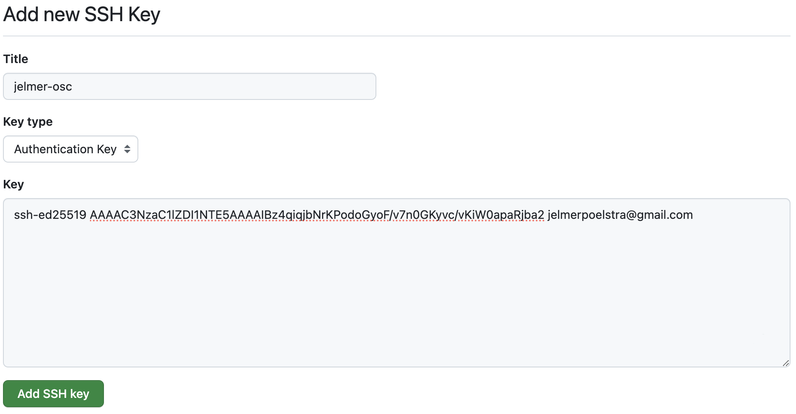{fig-align="center" width="80%" fig-alt="The GitHub dialog box to enter your SSH key." .lightbox}

<hr style="height:1pt; visibility:hidden;" />

::: callout-tip
#### Authentication and GitHub URLs
The current two options to authenticate to GitHub when connecting with remotes are:

- `SSH` access with an *SSH key* (which we have just set up)
- `HTTPS` access with a *Public Access Token* (PAT).
   [See this GitHub page](https://docs.github.com/en/authentication/keeping-your-account-and-data-secure/managing-your-personal-access-tokens) 
   to set this up instead of or in addition to SSH access.

For everything on GitHub, **there are separate SSH and HTTPS URLs**.
When using `SSH` (as we are), we need to use URLs with the following format:

```bash-out-solo
git@github.com:<USERNAME>/<REPOSITORY>.git
```

(And when using `HTTPS`, you would use URLs like
`https://github.com/<USERNAME>/<REPOSITORY>.git`)
:::

<hr style="height:1pt; visibility:hidden;" />

### Create a remote repository

While we can *interact* with online repos using Git commands,
we can't _create_ a new online repo with the Git CLI.
Therefore, we will to go to the GitHub website to create a new online repo:

1. On the GitHub website, click the **`+`** next to your avatar (top-right) and
   select "**New repository**":

{fig-align="center" width="40%" fig-alt="A screenshot showing the button on GitHub to create a new repository." .lightbox}

2. In the box "**Repository name**", we'll use the same name that we gave to our
   local directory: `originspecies`^[Though note that these names don't *have to* match up.].

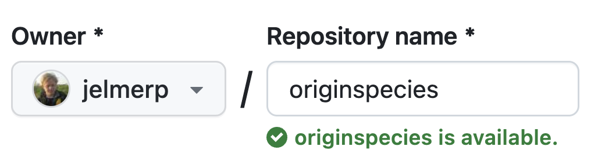{fig-align="center" width="45%" fig-alt="A screenshot showing how to name your repository on GitHub." .lightbox}

3. Leave other options as they are, as shown below, and click "**Create repository**":

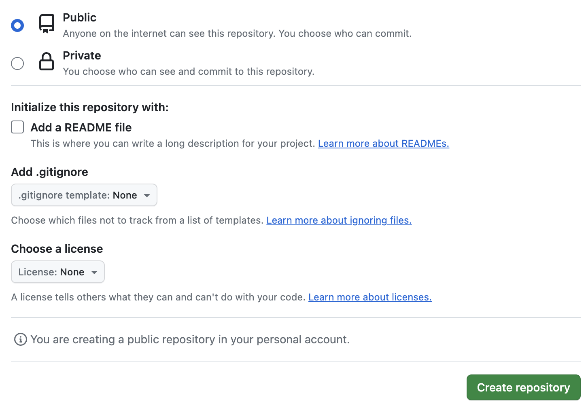{fig-align="center" width="80%" fig-alt="A screenshot showing the desired settings when creating a new repository on GitHub" .lightbox}

<hr style="height:1pt; visibility:hidden;" />

### Link the local and remote repositories

After you clicked "Create repository",
a page similar to this screenshot should appear,
which gives us some information about linking the remote and local repositories:

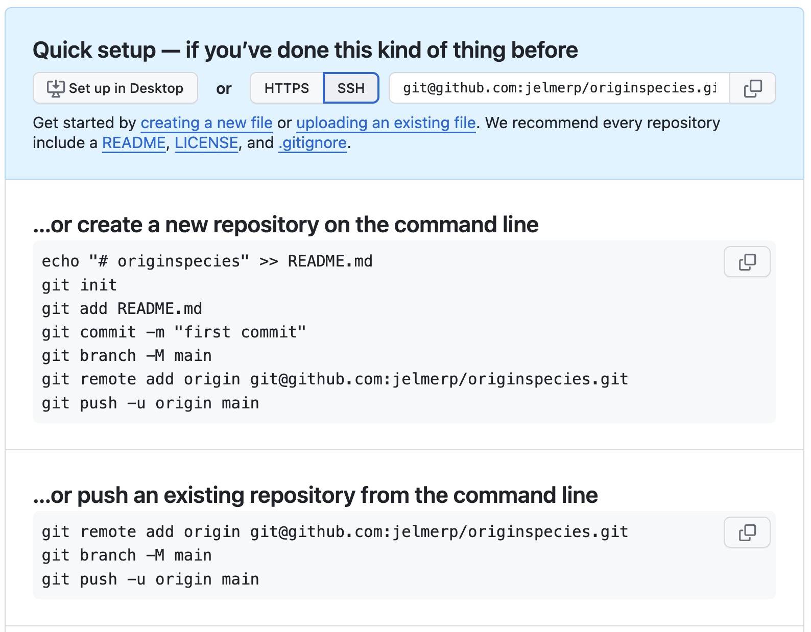{fig-align="center" width="75%" fig-alt="A screenshot showing the information GitHub provides about linking remote and local repositories." .lightbox}

We go back to VS Code, where we'll enter the commands that GitHub provided to us under the
"*...or push an existing repository from the command line*"
heading shown at the bottom of the screenshot above:^[
Though we can skip the second one, `git branch -M main`, since our branch is already called "main".
] 

1. First, we tell Git to add a "remote" connection with **`git remote`**,
   providing three arguments to this command:
   - **`add`** --- because we're adding a remote connection.
   - **`origin`** --- the arbitrary nickname we're giving the connection
     (usually called "origin" by convention).   
   - The **URL** to the GitHub repo
     (**in SSH format**: click on the `HTTPS`/`SSH` button to toggle the URL type).

   ```sh
   # git remote add <remote-nickname> <URL>
   git remote add origin git@github.com:<user>/originspecies.git
   ```

2. Second, we upload ("push") our local repo to remote using **`git push`**.
   When we push a repository for the first time,
   we need to use the `-u` option to set up an "**u**pstream" counterpart:
  
   ```sh
   # git push -u <connection> <branch>
   git push -u origin main
   ```

3. You should then get a message like this: type `yes` and press <kbd>Enter</kbd>.

   ```bash-out-solo
   The authenticity of host 'github.com (140.82.114.4)' can't be established.
   ECDSA key fingerprint is SHA256:p2QAMXNIC1TJYWeIOttrVc98/R1BUFWu3/LiyKgUfQM.
   ECDSA key fingerprint is MD5:7b:99:81:1e:4c:91:a5:0d:5a:2e:2e:80:13:3f:24:ca.
   Are you sure you want to continue connecting (yes/no)?
   ```

4. Then, the push/upload should go through, with a message along these lines
   printed to screen:
   
   ```bash-out-solo
   Counting objects: 18, done.
   Delta compression using up to 40 threads.
   Compressing objects: 100% (12/12), done.
   Writing objects: 100% (18/18), 1.67 KiB | 0 bytes/s, done.
   Total 18 (delta 1), reused 0 (delta 0)
   remote: Resolving deltas: 100% (1/1), done.
   remote: To git@github.com:jelmerp/originspecies2.git
   * [new branch]      main -> main
   ```

<hr style="height:1pt; visibility:hidden;" />

::: callout-note
### Pushing will be easier from now on
Note that when we don't give `git push` any arguments, it will push:

- To the **default remote connection**.
- To & from the **currently active repository *"branch"*** (default: `main`)^[
  To learn more about branches, see the [Git bonus material](../bonus/git.qmd).].

Because we only have one remote connection and one branch,
we can from now on simply use the following to push:

```sh
git push
```

----

Also, note that you can check your remote connection settings for a repo with `git remote -v`:

```bash
git remote -v
```
```bash-out
origin  git@github.com:jelmerp/originspecies.git (fetch)
origin  git@github.com:jelmerp/originspecies.git (push)
```

<hr style="height:1pt; visibility:hidden;" />

:::

<hr style="height:1pt; visibility:hidden;" />

### Explore the repository on GitHub

Back at GitHub on your repo page, click where it says `<> Code` in the lower of the top bars:

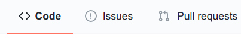{fig-align="center" width="40%" fig-alt="A screenshot of the GitHub Code button for a repository." .lightbox}

This is basically our repo's "home page",
and we can see the files that we just uploaded from our local repo:

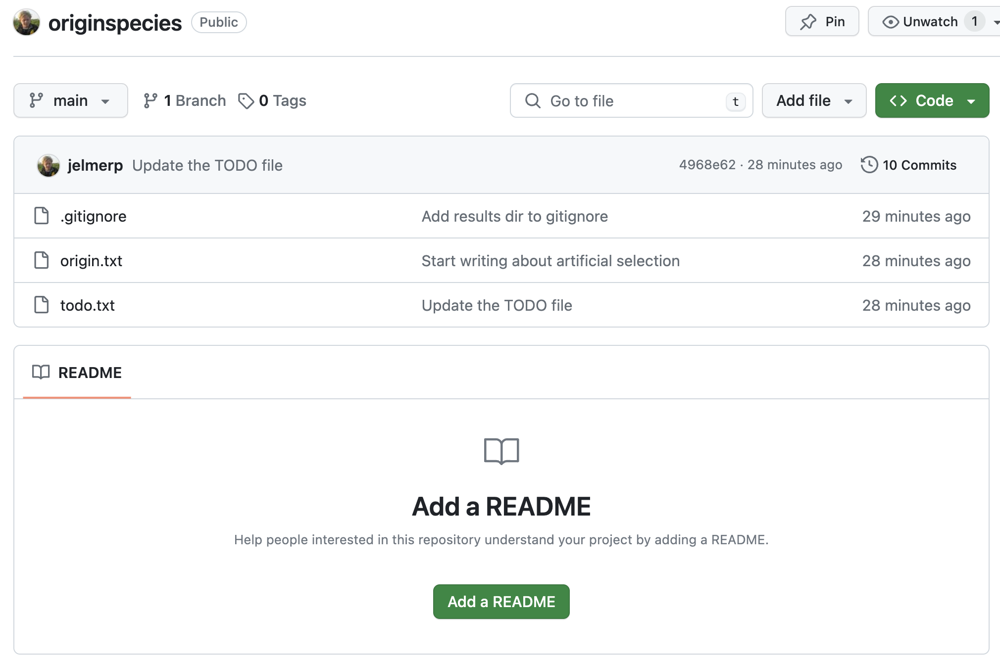{fig-align="center" width="90%" fig-alt="A screenshot of the front page of our new repository." .lightbox}

Next, click where it says `x commits` (x should be 10 in this case):

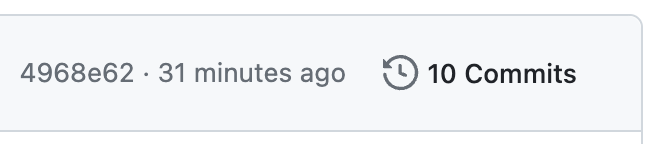{fig-align="center" width="35%" fig-alt="A screenshot of the commit info on GitHub." .lightbox}

You'll get an overview of the commits that you made,
somewhat similar to what you get when you run `git log`:

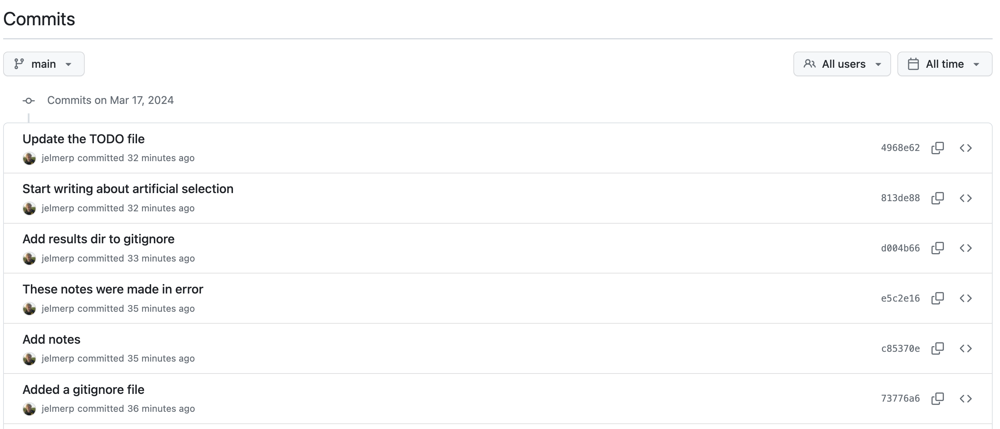{fig-align="center" width="95%" fig-alt="A screenshot of the overview of commits on GitHub." .lightbox}

You can click on a commit to see the changes that were made by it:

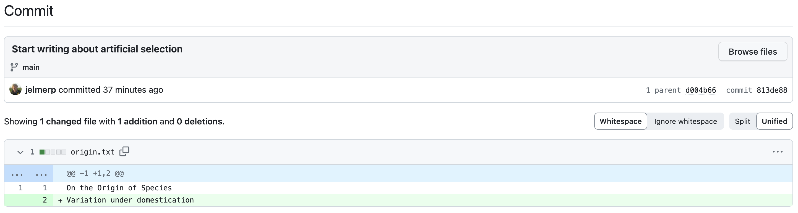{fig-align="center" width="95%" fig-alt="A screenshot of the diff view on GitHub." .lightbox}

On the right-hand side, a **<kbd>< ></kbd>** button will allow you to
see the _state of the repo_ at the time of that commit:

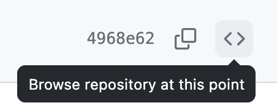{fig-align="center" width="28%" fig-alt="A screenshot of the Browse Repository button on GitHub." .lightbox}

On the commit overview page, scroll down all the way to the first commit and click the **<kbd>< ></kbd>**:
you'll see the repo's "home page" again, but now with only the `origin.txt` file,
since that was the only file in your repo at the time:

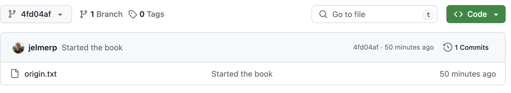{fig-align="center" width="90%" fig-alt="A screenshot of the view of our repository at an earlier timepoint." .lightbox}

<hr style="height:1pt; visibility:hidden;" />

#### GitHub "Issues"

Each GitHub repository has an "Issues" tab --- issues are mainly used to
track bugs and other (potential) problems with a repository.
In an issue, you can reference specific commits and people, and use Markdown formatting.

::: callout-note
#### When you hand in your final project submissions, you will create an issue simply to notify me about your repository.
:::

To go to the Issues tab for your repo, click on Issues towards the top of the page:

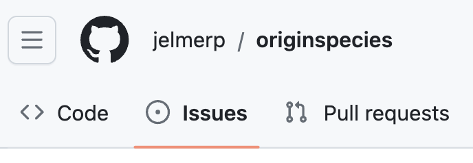{fig-align="center" width="35%" fig-alt="A screenshot showing the Issues button for a repo." .lightbox}

And you should see the following page ---
in which you can open a new issue with the "New" button:

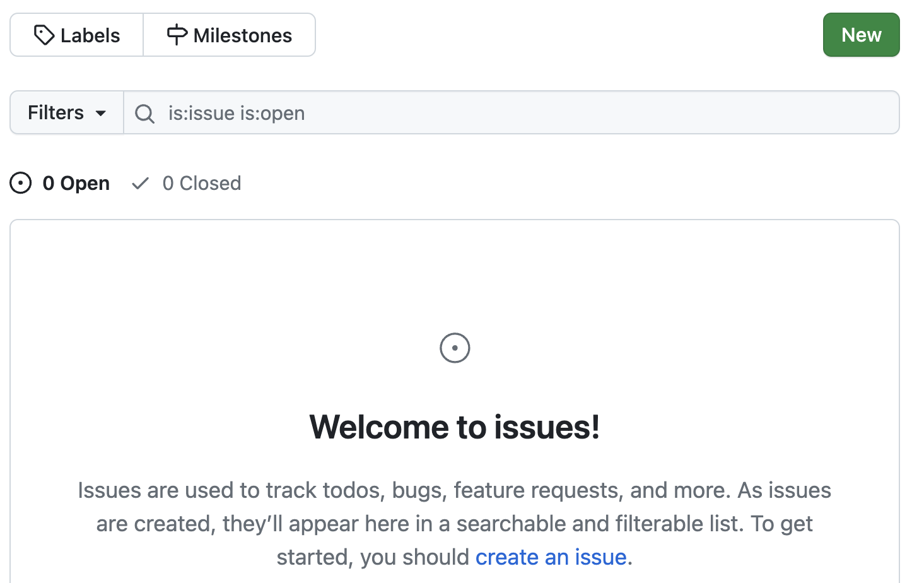{fig-align="center" width="65%" fig-alt="A screenshot showing the New Issue button on GitHub." .lightbox}

<br>

## Remote repo workflows: single-user

In a single-user workflow, all changes are typically made in the local repository,
and the remote repo is simply periodically updated (*pushed to*).
So, the interaction between local and remote is unidirectional:

::: columns
::: {.column width="48%"}
{fig-align="center" width="95%" fig-alt="A diagram of the remote repo workflow: uploading for the first time." .lightbox}
:::
::: {.column width="4%"}
:::
::: {.column width="48%"}

{fig-align="center" width="95%" fig-alt="A diagram of the remote repo workflow: now the repos are in sync." .lightbox}

:::
:::

-----

::: columns
::: {.column width="48%"}
{fig-align="center" width="95%" fig-alt="A diagram of the remote repo workflow after you've made a local commit." .lightbox}
:::
::: {.column width="4%"}
:::
::: {.column width="48%"}
{fig-align="center" width="95%" fig-alt="A diagram of the remote repo workflow: use git push to sync again." .lightbox}
:::
:::

<hr style="height:1pt; visibility:hidden;" />

In a single-user workflow with a remote,
you commit just like you would without a remote in your day-to-day work,
and in addition, *push* to remote occasionally ---
let's run through an example.

- Start by creating a `README.md` file for your repo:

  ```sh
  echo "# Origin" > README.md
  echo "Repo for book draft on my new **theory**" >> README.md
  ```

- Add and commit the file:

  ```sh
  git add README.md
  git commit -m "Added a README file"
  ```
  ```bash-out
  [main 63ce484] Added a README file
  1 file changed, 2 insertions(+)
  create mode 100644 README.md
  ```

- If you now run `git status`, you'll see that Git knows that your local repo
  is now one commit "ahead" of its remote counterpart:
  
  ```bash-out
  On branch main
  Your branch is ahead of 'origin/main' by 1 commit.
  (use "git push" to publish your local commits)

  nothing to commit, working tree clean
  ```

- But Git will not automatically sync. So now, push to the remote repository:
  
  ```sh
  git push
  ```
  ```bash-out
  Counting objects: 4, done.
  Delta compression using up to 40 threads.
  Compressing objects: 100% (3/3), done.
  Writing objects: 100% (3/3), 404 bytes | 0 bytes/s, done.
  Total 3 (delta 0), reused 0 (delta 0)
  remote: To git@github.com:jelmerp/originspecies.git
  4968e62..b1e6dad  main -> main
  ```

<hr style="height:1pt; visibility:hidden;" />

Let's go back to GitHub: note that the `README.md` Markdown has been automatically rendered!

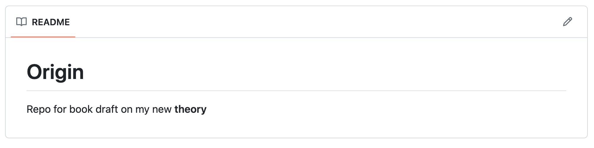{fig-align="center" width="90%" fig-alt="A screenshot of the rendered README file on GitHub." .lightbox}

<hr style="height:1pt; visibility:hidden;" />

::: callout-tip
#### Want to collaborate on repositories?
The [version control bonus page](../bonus/git.qmd##collaboration-with-git-multi-user-remote-workflows)
covers collaboration with Git and Github, i.e. multi-user workflows.
:::

<br>
