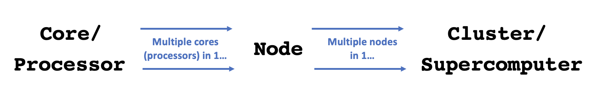
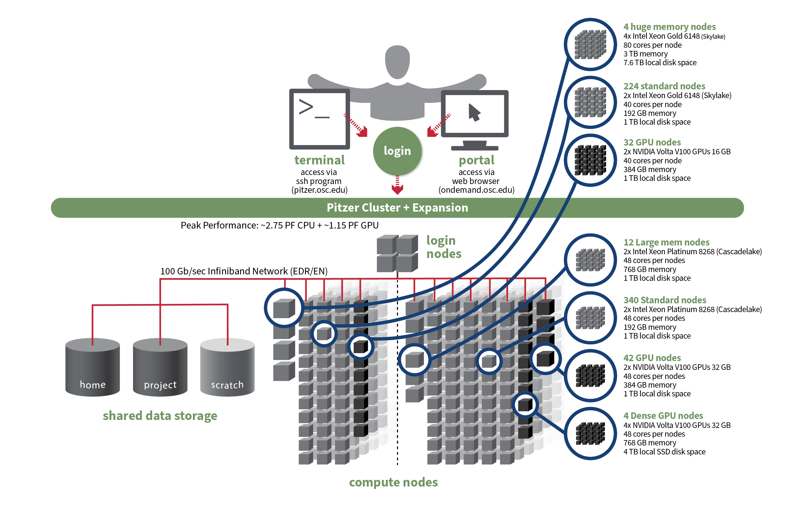

----------------------------------------------------------------------------------------------------

 

## Introduction

### Week overview and context

The contents of this and the next few weeks will slowly get you ready to run
command-line bioinformatics programs at OSC by teaching you:

1. More details about OSC generally _(now)_
2. How to use software at OSC, including programs that aren't installed _(next lecture)_
3. How to write shell scripts _(next week)_
4. How to submit shell scripts as "batch jobs" _(in two weeks)_
5. How to build functional commands to run such programs _(throughout)_

### Lecture overview and learning goals

This session complements the
[initial OSC introduction in week 1 of the course](../week01/w1c_osc.qmd),
and will go a bit deeper into the following aspects of the Ohio Supercomputer Center
(OSC):

- OSC Projects
- Cores
- OSC file systems
- Compute node types and access

## OSC Projects

In this course, we exclusively use the course's OSC Project `PAS2880`.
When you use OSC for your own research project, you would use a different OSC Project.
This would likely be a Project specific to a research project or grant,
or perhaps your lab/PI's general-use OSC Project.

With "using" an OSC Project, we mean:

- Storing data in its project dirs in `/fs/ess` and/or `/fs/scratch`
- Selecting the Project when starting compute jobs, like Code Server and the
  command-line batch jobs you'll learn about later in this course.

Generally, only PIs request and manage/administrate OSC projects.
OSC has [a webpage with more information on how to do so](https://www.osc.edu/supercomputing/support/account).
The administrator of an OSC Project can, among others:

- Manage the compute budget and allocated storage space in `/fs/ess` for the Project.
- Add users to the Project.
  If the user doesn't yet have an OSC account,
  this addition will trigger an invite email that allows the user to create an account
  (you can't create an account unless you've been added to a Project).

::: callout-note
#### OSC billing
OSC will bill OSC Projects (not individual users), and only for the following two things:

- _**File storage**_ in the Project Storage (`/fs/ess`) file system per TB per month
- _**Compute node usage**_ per "core hour" (e.g. using 2 cores for 2 hours = 4 core hours)

OSC no longer publishes flat rates,
but the prices for academic usage are generally quite low.
Nevertheless, a Project that uses dozens of TBs of storage space and hundreds of
thousands of core hours could be charged several thousands dollars per year.
But:

- Every PI at OSU gets a $1,000 credit
- OSU pays some or all of these costs at the college level, depending on the college.
  CFAES currently pays all of it.
:::

## Cores

In week 1, you learned that a supercomputer center like OSC typically has
multiple supercomputers, each of which in turn consists of many nodes.
But I omitted an additional "level" in this hierarchy:

{fig-align="center" width="95%" fig-alt="A diagram showing how the terms core/processor, node, and cluster/supercomputer fit together." .lightbox}

**Core / Processor / CPU / Thread** ---
Components of a computer (recall: we refer to these as "nodes" at OSC)
that can each (semi-)independently be asked to perform
a computing task like running a bioinformatics program.
With many programs, you can also use multiple cores for a single run,
which can speed things up considerably.

The terms core, processor, CPU and thread are not technically synonyms.
However, they are often used interchangeably,
and for the purposes of working at OSC, you should treat them as meaning the same thing:
the components of a node that can be reserved and used independently.

## File systems

Here is an expanded table with details about OSC's file systems:

| File system   | Located within        | Quota                 | Backed up?    | Auto-purged?          | One for each... |
|---------------|-----------------------|-----------------------|---------------|-----------------------|-----------------|
| **Home**      | `/users/`             | 500 GB / 1 M files    | Yes           | No                    | User            |
| **Project**   | `/fs/ess/`            | Flexible              | Yes           | No                    | OSC Project     |
| **Scratch**   | `/fs/scratch/`        | 100 TB                | No            | After 60 days         | OSC Project     |
| **Compute**   | `$TMPDIR`             | 1 TB                  | No            | After job completes   | Compute job     |

: {.striped .hover}

When you use OSC for your own research project with a different OSC Project,
I would recommend that you **work mostly in the Project dir** (`/fs/ess/`),
which offers backed-up, permanent storage with flexible quota.
Each of the other file systems has certain drawbacks:

- Scratch dirs (`/fs/scratch`) are temporary and not backed up.
- The storage space of Home dirs (`/users/`) is limited and cannot be expanded,
  and file sharing / collaborating is also more difficult with Home dirs.
- Compute storage space (`$TMPDIR`) is linked to compute jobs and extremely fleeting:
  as soon as the compute "job" in question has stopped, these files will be deleted.

So when _are_ these other file systems useful?

- Your **Home** dir can be useful for files that you use across projects,
  like some software.
  Additionally, this is where many of your user-specific settings are stored.
  That is mostly done automatically by OSC and the programs that you use,
  with _hidden_ files and dirs (start with a `.`) that you should generally
  not manually edit or remove.
  
- **Scratch** has the advantages of having _effectively unlimited_ space and
  much _faster_ data read and write ("I/O") speed than Home and Project space.
  Especially if you are working with large datasets,
  it can therefore makes sense to run analyses on Scratch,
  and then copy specific files over to the Project dirs.
  Additionally, some programs produce lots of temporary files while they are
  running, so setting a scratch dir as the output dir may speed things up.

- **Compute** storage has even faster I/O and can be useful for very I/O-intensive jobs ---
  but using it requires some extra code in your script^[
  Copying of files back-and-forth, and making sure your results are not lost upon some kind of failure.]
  and I personally end up using this very rarely.

::: {.callout-note}
#### Accessing back-ups
Home and Project directories are **backed up** daily.
You don't have _direct_ access to the backups, but if you've accidentally deleted important files,
you can email OSC to have them restore your files to the way they were on a specific date.
:::

::: {.callout-tip}
#### Accessing files on different clusters
As mentioned previously,
file systems are shared among OSC's clusters,
such that you can access your files in the exact same way regardless of which
cluster you have connected to.
:::

## Compute nodes

### Compute node types

Compute nodes come in different shapes and sizes:

- **"Standard nodes"** are by far the most numerous (e.g., Pitzer has 564)
  and even those vary in size, e.g. from 40-48 cores per node on Pitzer.

- **Other types of nodes** include those with extra memory
  (`largemem` and `hugemem`),
  and nodes that provide access to GPUs (Graphical Processing Units) rather than CPUs.

Standard nodes are used by default and these will serve you well for the majority
of omics analysis.
But you may occasionally need a different type of node, such as for genome or transcriptome
assembly (you'll need need nodes with a lot of memory) or Oxford Nanopore sequence data
base-calling (GPU nodes).

::: {.callout-caution}
#### Memory versus storage
When we talk about a computer's "memory", this refers to RAM:
the data that your computer has actively "loaded" or in use.
Don't confuse memory with file storage, the data that is on disk.

A computer can access data in RAM orders of magnitude faster than data on disk,
which is why computers load actively used data into memory.
For example, if you play a computer game or have many browser tabs open,
your computer's memory will be heavily used.
And when your computer slows down noticeably or freezes,
this is typically because all its memory capacity is being used,
and your disk storage needs to be used as well.

Bioinformatics programs may also load input data from disk into memory to
allow for fast access,
and will often also hold intermediate results in memory.
When datasets are large,
such programs may therefore need lots (10s or 100s of GBs) of memory.
:::

#### Using compute nodes

You can use compute nodes by putting in a request for resources,
such as the number of nodes, cores, and for how long you will need them.
These requests result in "**compute jobs**" (also simply called "jobs").
Our VS Code sessions are an example of such compute jobs. 

Because many different users are sending such requests all the time,
there is software called a **job scheduler** (specifically, **Slurm** in case of OSC)
that considers each request and assigns the necessary resources to the job as they become available.

In two weeks,
you will learn about submitting scripts as "batch jobs" with Slurm commands.

## Putting it together

Let's take a look at the specs for Pitzer now that we understand a supercomputer's
components a bit better:

{fig-align="center" width="95%" fig-alt="A complex diagram showing the specs for the OSc Pitzer cluster." .lightbox}

::: callout-tip
#### Citing and contacting OSC

- When you use OSC, it's good practice to **acknowledge and cite OSC** in your papers,
  see their [citation page](https://www.osc.edu/resources/getting_started/citation). 
- For many questions,
  such as if you have problems with your account or with installing or using specific software,
  or don't understand why your jobs keep failing,
  you can **email OSC at <oschelp@osc.edu>**.
  They are usually very quick to respond!
- If you don't yet have an account, then use this email address: <start@osc.edu>.
:::
