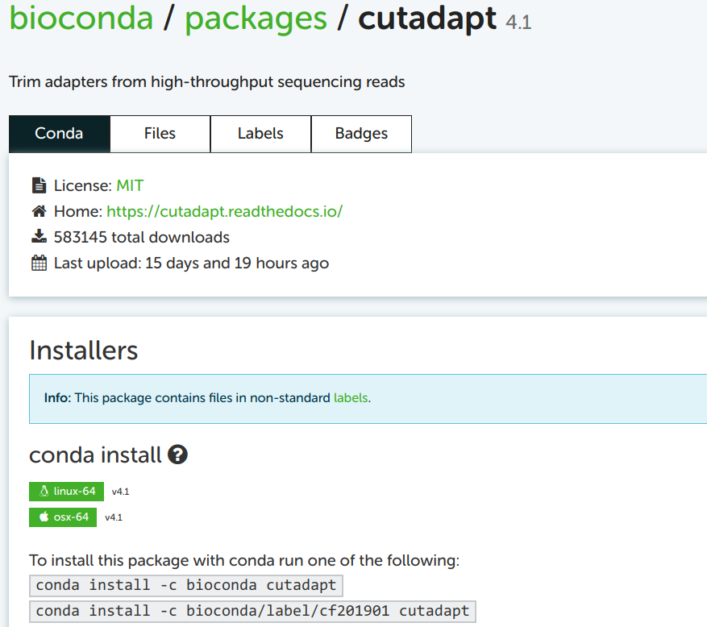

----------------------------------------------------------------------------------------------------

<br>

## Conda basics

Conda can create so-called **environments** in which you can install
one or more software packages.

As you'll learn below, as long as a program is available in one of the online Conda
repositories (and this is nearly always the case for open-source bioinformatics programs),
then installing it:

- Is quite straightforward;
- Is done with a procedure that is nearly identical regardless of the program
  you are installing;
- Doesn't require admin privileges.

A Conda environment is "merely" a directory that includes the executable (binary)
files for the program(s) in question.
I have a collection of Conda environments that anyone can use,
and you can see a list of these environments as follows:

```bash
ls /fs/ess/PAS0471/jelmer/conda
```
```{.bash-out}
agat           cactus         fastqc             mbarq             parsnp                   racon             smap-4.6.5
alv            cgmlst         fastq-dl           medaka            perl                     ragtag-2.1.0      smartdenovo-env
amber          chopper        feba               metabat2          phylofisher              rascaf            snippy-4.6.0
amrfinderplus  cialign        filtlong           metaphlan         picard                   ratatosk          snpeff
antismash      clinker        flye               metawrap          pilon-1.24               rcorrector-1.0.5  sortmerna-env
aswcli         clipkit        gcta               minibusco         pirnn                    repeatmasker      sourmash
bactopia3      clonalframeml  geofetch           mitofinder        pkgs                     repeatmodeler     spades
bakta          cogclassifier  gffread            mitohifi          plasmidfinder-2.1.6      resfinder         sra-tools
base           compleasm      gget               mlst              plink2                   rnaquast-2.2.1    star
bbmap          curl           gubbins            mlst-cge          plottree                 roary-3.13        subread
bcftools       cutadapt       hclust2            mlst_check        pmprimer                 r-rnaseq          taxonkit
bedops         deeploc        hisat2             mobsuite          pod5                     r_tree            tgsgapcloser
bedtools       deeptmhmm      hmmer              multiqc           porechop                 sabre-1.0         tiara
bioawk         diamond        humann             mummer4           prokka                   salmon            transdecoder-5.5.0
bioconvert     dorado         inspector          muscle            protrac                  samtools          treetime
bit            dwgsim         interproscan-5.55  nanoplot          pseudofinder             scoary            trimgalore
blast          eggnogmapper   iqtree             ncbi-datasets     purge_dups-1.2.6         seqkit            trimmomatic-0.39
bowtie1        emboss         kofamscan          nextdenovo-env    pycoqc                   seqtk             unicycler
bowtie2        emu            kraken2            nextflow          qiime2-amplicon-2024.10  shellcheck        vcftools
bracken        entrez-direct  kraken-biom        nextflow-24.10.6  qualimap-env             shoot             virema
busco          evigene        krona              orthofinder       quarto                   signalp-6.0       virsorter
bwa            fast5tofastq   lissero            orthofisher       quast                    skim2mito         virulencefinder
cabana         fastp          mafft              panaroo           quickmerge-env           smap              vsearch
```

This is organized similarly to the Lmod modules in that there's generally
**one separate environment for one program**,
and the environment is named after that program.

<hr style="height:1pt; visibility:hidden;" />

### Activating Conda environments

Before you can activate Conda environments, you always need to load OSC's
Miniconda module first, and we will load the most recent one:
      
```bash
module load miniconda3/24.1.2-py310
```

As mentioned above, these environments are (de)activated much like with the Lmod system.
But while the term "load" is used for Lmod modules,
the term **"activate"** is used for Conda environments --- it means the same thing.

Also like Lmod, there is a main command (`conda`) and several sub-commands
(`deactivate`, `create`, `install`, `update`).
For example, to activate an environment:

```bash
conda activate /fs/ess/PAS0471/jelmer/conda/multiqc
```
```{.bash-out}
(/fs/ess/PAS0471/jelmer/conda/multiqc) [jelmer@p0085 jelmer]$
```

:::{.callout-tip}
##### Conda environment indicator!
When you have an active Conda environment, its name is displayed in front of your prompt,
as depicted above with `(multiqc)`.

Because the MultiQC environment you just loaded is not your own,
the full path to the environment is shown (making the prompt rather long...).
But when you load your own environment, only the name will be shown, like so:

```bash-out-solo
(multiqc) [jelmer@p0085 jelmer]$
```
:::

After you have activated the _MultiQC_ environment, you should be able to use the program.
To test this, simply run the `multiqc` command with the `--help` option:

```bash
multiqc --help
```
```bash-out
 /// MultiQC 🔍 | v1.17
                                                                                              
 Usage: multiqc [OPTIONS] [ANALYSIS DIRECTORY]
 
 MultiQC aggregates results from bioinformatics analyses across many samples into a    
 single report.                                                                        
[...output truncated...]
```

<hr style="height:1pt; visibility:hidden;" />

Unlike Lmod / `module load`, Conda will by default only keep **a single environment active**.
Therefore, when you have one environment activate and then activate another.
For example, after activating the TrimGalore environment,
the MultiQC environment is no longer active:
  
```bash
conda activate /fs/ess/PAS0471/jelmer/conda/trimgalore
  
multiqc --help
```
```{.bash-out}
bash: multiqc: command not found...
```

<hr style="height:1pt; visibility:hidden;" />

::: {.callout-note collapse="true"}
#### The `--stack` option does enable you having multiple Conda environments active _(Click to expand)_

1. Activate the TrimGalore environment, if it isn't already active:

   ```bash
   conda activate /fs/ess/PAS0471/jelmer/conda/trimgalore
   ```

2. "Stack" the MultiQC environment:

   ```bash
   conda activate --stack /fs/ess/PAS0471/jelmer/conda/multiqc
   ```

3. Check that you can use both programs --- output not shown,
   but both should successfully print help info:

   ```bash
   multiqc --help
  
   trim_galore --help
   ```
:::

<hr style="height:1pt; visibility:hidden;" />

### Lines to add to your shell script

Like for Lmod modules, you'll have to load Conda environments in every shell session
that you want to use them --- they don't automatically reload.

Conda environments loaded in your interactive shell environment _do_ "carry over"
to the environment in which your script runs
(even when you submit them to the Slurm queue with `sbatch`).
However, it is good practice to always
_include the necessary code to load/activate programs in your shell scripts:_

```bash
#!/bin/bash
set -euo pipefail

# Load software
module load miniconda3/24.1.2-py310
conda activate /fs/ess/PAS0471/jelmer/conda/multiqc
```

<hr style="height:1pt; visibility:hidden;" />

::: {.callout-warning}
#### Perils of Conda environments inside scripts
Problems can occur when you have a Conda environment active in your interactive
shell while you submit a script as a batch job that activates a different environment.
Therefore, it is generally a good idea **not to have any Conda environments active**
**in your interactive shell when submitting batch jobs**^[
Unless you first deactivate any active environments in your script.].
To deactivate the currently active Conda environment,
simply type `conda deactivate` without any arguments:

```bash
conda deactivate   
```
:::

<br>

## Creating your own Conda environments

### One-time Conda configuration

Before you can create our own environments, you first have to do some one-time configuration[^6].
The configuration will set the **Conda "channels"** (basically, software repositories)
that we want to use when we install programs, including the relative priorities among channels
(since one program may be available from multiple channels).

[^6]: That is, these settings will be saved somewhere in your OSC home directory,
      and you never have to set them again unless you need to make changes.

We can do this configuration with the `config` sub-command ---
run the following in your shell:

```bash
conda config --add channels defaults     # Added first => lowest priority
conda config --add channels bioconda
conda config --add channels conda-forge  # Added last => highest priority
```

Let's check whether the configuration was successfully saved:

```bash
conda config --get channels
```
``` {.bash-out}
--add channels 'defaults'   # lowest priority
--add channels 'bioconda'
--add channels 'conda-forge'   # highest priority
```

<hr style="height:1pt; visibility:hidden;" />

### Example: Creating an environment for TrimGalore

We will now create a Conda environment with the program TrimGalore installed,
which you used in last week's exercises,
and which does not have a system-wide installation at OSC.
Here is the command to all at once create a new Conda environment
and install TrimGalore into that environment:

```bash
# [Don't run this - we'll modify this a bit below]
conda create -y -n trim-galore -c bioconda trim-galore
```

Let's break that command down:

- **`create`** is the Conda sub-command to create a new environment.
- When adding **`-y`**, Conda will not ask us for confirmation to install.
- Following the **`-n`** option, you can specify the _name_ you would like the
  environment to have: we used `trim-galore`.
  You can use whatever name you like for the environment,
  but a descriptive yet concise name is a good idea.
  For single-program environments, it makes sense to simply name it after the program.
- The **`-c`** option is to specify a "channel" (repository) from which to install,
  here `bioconda`^[
  Given that you've done some config above, this is not always necessary,
  but it can be good to be explicit.].
- The **`trim-galore`** argument at the end of the line simply tells Conda to install the
  package of that name.

<hr style="height:1pt; visibility:hidden;" />

By default, Conda will install the **latest available version** of a program.
If you create an entirely new environment for a program, like we're doing here,
that default should always apply ---
but if you're installing into an environment that already contains programs,
it's _possible_ that due to compatibility issues, it will install a different version. 

If you want to be explicit about the version you want to install,
add the version number after **`=`** following the package name,
and you may then also want to include that version number in the Conda environment's name ---
try this:

```bash
conda create -y -n trim-galore-0.6.10 -c bioconda trim-galore=0.6.10
```
```{.bash-out}
Collecting package metadata (current_repodata.json): done  
Solving environment: done
# [...truncated...]
```

There should be a lot of output, with many packages that are being downloaded
(these are all "dependencies" of TrimGalore), but if it works, you should see
this before you get your prompt back:

```bash-out-solo
Downloading and Extracting Packages

Preparing transaction: done
Verifying transaction: done
Executing transaction: done                                                                                                                   
#                        
# To activate this environment, use                          
#
#     $ conda activate trim-galore-0.6.10                          
#
# To deactivate an active environment, use
#
#     $ conda deactivate
```

Now, you should be able to activate the environment (using just its name -- see the box below):

```bash
conda activate trim-galore-0.6.10  
```

Let's test if we can run TrimGalore --- note, the command is `trim_galore`: 

```bash
trim_galore --help
```
```{.bash-out}
 USAGE:

trim_galore [options] <filename(s)>

-h/--help               Print this help message and exits.
# [...truncated...]
```

<hr style="height:1pt; visibility:hidden;" />

:::{.callout-note collapse="true"}
#### Specifying the full path to the environment dir _(Click to expand)_

You may have noticed above that we merely gave the environment a _name_
(`trim-galore` or `trim-galore-0.6.10`),
and did not tell it _where_ to put this environment.
Similarly, we were able to activate the environment with just its name.
Conda assigns a **personal default directory for its environments**,
somewhere in your Home directory.
  
You can install environments in a different location with the `-p` (instead of `-n`)
option --- for example:
  
```bash
# [Don't run this]
conda create -y -p /fs/scratch/PAS2880/$USER/conda/trim-galore -c bioconda trim-galore
```
  
And when you want to load someone else's Conda environments,
you'll always have to specify the full path to environment's dir,
like you did when loading one of my Conda environments above.
:::

<hr style="height:1pt; visibility:hidden;" />

### Finding Conda installation info online

Minor variations on the `conda create` command above can be used to install
almost any program for which a Conda package is available,
which is the vast majority of open-source bioinformatics programs!

However, you may wonder how you would know:

- Whether the program is available and what the name of its Conda package is
- Which Conda channel we should use
- Which versions are available

To find this out, my strategy is to simply Google the program name together with
"conda", e.g. "cutadapt conda" if I wanted to install the Cutadapt program.
Let's see that in action:

{fig-align="center" width="85%"}

Click on that first link (in my experience, it is always the first Google hit):

{fig-align="center" width="85%"}

<hr style="height:1pt; visibility:hidden;" />

### Building the installation command from the online info

You can take the top of the two example installation commands as a template,
here: `conda install -c bioconda cutadapt`.
You may notice the `install` subcommand, which we haven't yet seen.
This would install Cutadapt into _the currently activated Conda environment_.
Since our strategy here is to create a separate environment for each program,
just installing a program into whatever environment is currently active is not a great idea.

You _can_ use the `install` command with a new environment,
but then you would first have to create an "empty" environment,
and _then_ run the install command.
However, we saw above that we can do all of this in a single command.
To build this create-plus-install command, all we need to do is replace `install`
in the example command on the Conda website by `create -y -n <env-name>`.
Then, our full command (without version specification) will be:

```bash
# [Don't run this - example command]
conda create -y -n cutadapt -c bioconda cutadapt
```

To see which **version** of the software will be installed by default,
and to see which older versions are available:

{fig-align="center" width="70%"}

For almost any other program,
you can use the exact same procedure to find the Conda package and install it!

::: {.callout-note collapse="true"}
#### More Conda commands to manage your environments _(Click to expand)_

- Remove an environment entirely:

  ```bash
  conda env remove -n cutadapt
  ```

- List all your conda environments:

  ```bash
  conda env list
  ```

- List all packages (programs) installed in an environment &mdash;
  due to dependencies, this can be a long list,
  even if you only actively installed one program:

  ```bash
  conda list -p /fs/ess/PAS0471/jelmer/conda/multiqc
  ```
  
- Export a plain-text "YAML" file that contains the instructions to recreate
  your currently-active environment (useful for reproducibility!)  

  ```bash
  conda env export > my_env.yml
  ```

  And you can use the following to create a Conda environment from such a YAML file:

  ```bash
  conda env create -n my_env --force --file my_env.yml
  ```
:::

<hr style="height:1pt; visibility:hidden;" />

### Organizing your Conda environments

There are two reasonable alternative way to organize your Conda environments:

- **Have one environment per program** (my preference)
  - Easier to keep an overview of what you have installed
  - No need to reinstall the same program across different projects
  - Less risk of running into problems with your environment due to mutually
    incompatible software and complicated dependency situations

- **Have one environment per research project**
  - You just need to activate that one environment when you're working on
    your project.
  - Easier when you need to share your entire project with someone else
    (or yourself) on a different (super)computer.

Even though it might seem easier, a third alternative,
to simply install all programs across all projects in one single environment,
is _not_ recommended. This doesn't benefit reproducibility,
and your environment is likely to stop functioning properly sooner or later.
