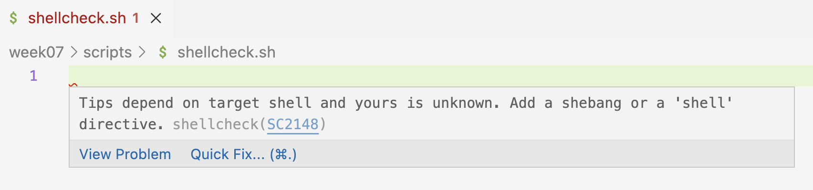
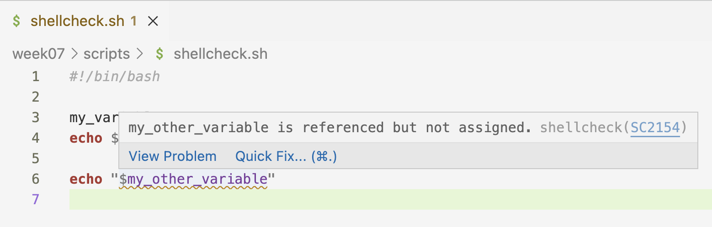

----------------------------------------------------------------------------------------------------

<br>

## Introduction

### Learning goals

Now that you know the basics of submitting and managing Slurm batch jobs,
you will learn:

- The most common Slurm/`sbatch` options, including those to request:
  - More time, cores, and memory for jobs
  - An email notification when jobs e.g. fail or finish
- How to run Slurm jobs in practice, including how to submit many jobs at the same time
- How to make sure that your jobs succeeded

### Getting ready

1. At <https://ondemand.osc.edu>,
   start a VS Code session in `/fs/ess/PAS2880/users/$USER`
2. In the terminal, navigate to your `week07` dir

### Testing the Shellcheck extension

1. Create a new script `scripts/shellcheck-test.sh` and open it.
2. If Shellcheck works, you should immediately see a small red squiggly line
   on the first line -- and when you hover over that, the following warning:

{fig-align="center" width="50%" fig-alt="A screenshot showing a shellcheck warning." .lightbox}

{fig-align="center" width="80%" fig-alt="A screenshot showing a shellcheck warning." .lightbox}

3. So, Shellcheck wants you to add a shebang line, and once you do so,
   the squiggly line disappears:
   
{fig-align="center" width="65%" fig-alt="A screenshot showing a shellcheck warning." .lightbox}

4. That was one example of a handy Shellcheck tip.
   Another is when you have assigned a variable, but don't use (reference it):

{fig-align="center" width="50%" fig-alt="A screenshot showing a shellcheck warning." .lightbox}

{fig-align="center" width="70%" fig-alt="A screenshot showing a shellcheck warning." .lightbox}

4. Referencing the variable in question makes the squiggly line disappear:

{fig-align="center" width="50%" fig-alt="A screenshot showing a shellcheck warning." .lightbox}

5. Conversely, when you reference a variable that hasn't been assigned:

{fig-align="center" width="70%" fig-alt="A screenshot showing a shellcheck warning." .lightbox}

6. These tips can be extremely useful!
   Also in cases where you e.g. make a typo in a variable name,
   or renamed a variable but didn't do so consistently.

## Common Slurm/`sbatch` options

Here, we'll go through the most commonly used `sbatch` options
(except `--account`, which was covered in the previous lecture).
As pointed out above, each of these options can be:

- passed on the command line: `sbatch --account=PAS2880 myscript.sh`
  _(has precedence over the next)_ and/or
- added at the top of the script you're submitting: `#SBATCH --account=PAS2880`.

Also, note that many options have a corresponding long
(e.g. `--account=`) and short format (e.g `-A`).
For clarity, we'll stick to long-format options here.

### Time with `--time`

If you suspect or know that the default time limit of 1 hour may not be enough
for your job, use the `--time` option to request more time.
Note that tour job will be **killed** (stopped) as soon as it hits the time limit!

For single-node jobs, up to 168 hours / 7 days can be requested.
(If that's not enough, you can request access to a separate queue for long
jobs of up to 14 days, called the `longserial` queue.)
  
OSC bills projects for **the time that jobs actually used**, not what you reserved.
And recall that batch jobs will stop as soon as the focal script has finished running.
But before you decide to ask for 168 hours for every job,
note that jobs that request more time are likely to have to wait longer
before they start.

:::callout-tip
##### The time your reserve is the "**wall time**"
When you reserve an amount of time with `--time`, this is the "wall time".
What does wall time mean?
This is simply the actual amount of time that passes on the (wall) clock.
This term is used to contrast it with "_core hours_",
which is the number of hours multiplied by the number of cores:

:::: columns
::: {.column width=30%}
:::
::: {.column width=40%}
| # hours | # cores | wall time | # core hours
|:---:|:---:|:---:|:---:|
| 2 | 1 | 2 | 2
| 2 | 8 | 2 | 16

: {.striped .hover}

:::
::: {.column width=30%}
:::
::::

:::

A number of formats can be used to specify the time, including:

:::: columns
::: {.column width=15%}
:::
::: {.column width=70%}
| Format | Example | Meaning |
|:---|:---:|:---:|:---:|
| minutes | `60` | 60 minutes |
| hours:minutes:seconds | `1:00:00` | 60 minutes
| days-hours | `2-12` | two-and-a-half days (60 hours)

: {.striped .hover}

:::
::: {.column width=15%}
:::
::::

For example, requesting 2 hours in the "minute-format" inside a shell script:

```bash
#!/bin/bash
#SBATCH --time=120
```

:::{.callout-important}
##### When in doubt, request more time!
It is common to be uncertain about how much time your job will take
(i.e., how long it will take for your script to finish).
Whenever this happens, ask for more, perhaps much more, time than what you
think/guesstimate you will need.
It is really annoying to have a job run out of time after several hours,
while the increase in queueing time for jobs that request more time is often
quite minimal at OSC.
:::

::: exercise
####  Exercise: exceed the time limit

Modify the `sleep.sh` script to reserve only 1 minute for the job,
while making the script run for longer than that by increasing the `sleep` sleeping
time to at least 100 seconds.

If you succeed in exceeding the time limit, an error message will be printed.
Where do you think this error message will be printed: to the screen, in the Slurm log
file, or in `sleep.txt`?

After waiting for the job to be killed after 60 seconds,
check if you were correct and what the error message is.

<!---
<details><summary>_Click for the solution_</summary>

We request 1 minute of wall-time while we let the script sleep for 100 seconds:

```bash
#!/bin/bash
#SBATCH --account=PAS2880
#SBATCH --time=1

echo "I will sleep for 100 seconds" > sleep.txt
sleep 100s
echo "I'm awake! Done with script sleep.sh"
```

Submit it as usual:

```bash
sbatch scripts/sleep.sh
```
```bash-out
Submitted batch job 23641567
```

This would result in the following type of error,
which will be printed in the Slurm log file:

```bash-out-solo
slurmstepd: error: *** JOB 23641567 ON p0133 CANCELLED AT 2025-04-04T14:55:24 DUE TO TIME LIMIT ***
```
</details>
-->

:::

### Cores with `--cpus-per-task`

First, note that Slurm mostly uses the terms "core" and "CPU" interchangeably[^3].
More generally with bioinformatics tools,
"thread" is also commonly used interchangeably with core/CPU[^4].
Therefore, for our purposes, you can
**think of "core", "CPU", and "thread" as synonyms** that all refer to the
same sub-parts/components of a node that you can reserve and use separately.

[^3]: Even though technically, one CPU often contains multiple cores.
[^4]: Even though technically, one core often contains multiple threads.

Running a bioinformatics program with multiple threads/cores/CPUs ("multi-threading")
is very common, and this can make the running time of such programs much shorter.
While the specifics depend on the program,
using **8-12 cores** is often a sweet spot,
whereas asking for even more cores can lead to rapidly diminishing returns.

While there are multiple relevant Slurm options (see the box below),
I recommend that you specify the number of threads/cores/CPUs with
the option **`--cpus-per-task`** (`-c`).

Typically, inside your shell script,
you will also want to inform the program that your script runs about the number of
available cores -- most have an option like `--cores` or `--threads`.
**You should set this to the same value `n` as the `--cpus-per-task`.**
An example, where we ask for 8 CPUs/cores/threads:

```bash
#!/bin/bash
#SBATCH --cpus-per-task=8

# And we tell a fictional program about that number of cores:
trimming_program.py --cores 8 sampleA_R1.fastq.gz
```

:::{.callout-note collapse="true"}
##### What about nodes and tasks? _(Click to expand)_

You may have noticed that the long form of the above option is
`--cpus-per-task` instead of just, say, `--cpus`.
What is that about? Let's go over nodes and tasks:

- Tasks are independent processes that a computer can run.
  And recall that nodes are the large computers that a supercomputer is made of.

- In bioinformatics, running multiple processes (tasks) or needing multiple nodes
  in a single batch job is _not_ common.

- You can specify the number of nodes with `--nodes` and the number of tasks
  with `--ntasks` and/or `--ntasks-per-node`; all have defaults of 1
  (see the table below).
  
- Unless you have very clear reasons to,
  I recommend not to use the abovementioned options to change the number of tasks
  or nodes, so your job will have 1 of each.
  When you do this, the above `-c` option simply specifies the number of cores.
  
- For example, only ask for **more than one node** when a program is parallelized
  with e.g. "MPI", which is rare in bioinformatics.

- For jobs that require multiple processes (tasks),
  you can use `--ntasks=n` or `--ntasks-per-node=n` --- this is also quite rare!
  However, note in practice, specifying the number of tasks `n` with one of these
  options is equivalent to using `--cpus-per-task=n`,
  in the sense that both ask for `n` cores that can subsequently be used by a program
  in your script.
  Therefore, some people use `tasks` as opposed to `cpus` for multi-threading,
  and you may run across this in the OSC documentation too.
  (Yes, this is confusing!)

Here is an overview of the options related to cores, tasks, and nodes:

| Resource/use                  | short    | long                    | default
|-------------------------------|----------|-------------------------|:--------:| 
| Nr. of cores/CPUs/threads (per task)    | `-c 1`   | `--cpus-per-task=1`     | 1
| Nr. of "tasks" (processes) | `-n 1`   | `--ntasks=1`            | 1
| Nr. of tasks per node      | -        | `--ntasks-per-node=1`   | 1
| Nr. of nodes               | `-N 1`   | `--nodes=1`             | 1

: {.striped .hover}

:::

### RAM memory with `--mem`

The `--mem` option specifies the maximum amount of RAM
(Random Access Memory) available to your job.

The **default** amount of memory will depend on how many cores you reserved.
Standard cores have 4 GB of memory "on it", and therefore,
the default amount of memory you will get is 4 GB is per reserved core.
For example, if you specify `--cpus-per-task=4`, you will have 16 GB of memory.
And the default number of cores is 1, which gives you 4 GB.

Like with the time limit, your job gets **canceled** by Slurm when it hits
the memory limit (see the box below).

Because it is common to ask for multiple cores and due to the above-mentioned
adjustment of the memory based on the number of cores,
you will often end up having enough memory automatically,
and won't need to use the `--mem` option.

The maximum amount of memory you can request on regular Pitzer compute nodes
is 178 GB.
If you need more than that,
you should use one of the specialized `largemem` or `hugemem` nodes ---
switching to such a node generally happens automatically based on your requested amount^[
Though there are unfortunately "gaps" between the maximum and minimum amounts
of RAM on different nodes...
] --- see
[this OSC page for details on node types and associated memory on Pitzer](https://www.osc.edu/resources/technical_support/supercomputers/pitzer/batch_limit_rules).

The default `--mem` unit is MB (MegaBytes); append `G` for GB
(i.e. `100` means 100 MB, `10G` means 10 GB).
For example, to request 20 GB of RAM:

```sh
#!/bin/bash
#SBATCH --mem=20G
```

::: {.callout-warning collapse="true"}
#### It is not always clear what happened when your job ran out of memory _(Click to expand)_
Whereas you get a very clear Slurm error message when you hit the time limit
(as seen in the exercise above), hitting the memory limit can result in a variety of errors.

But look for keywords such as "Killed", "Out of Memory" / "OOM",
and "Core Dumped", as well as actual "dumped cores" in your working dir
(large files with names like `core.<number>`, these can be deleted).

If you see these or otherwise suspect that your job ran out of memory,
resubmit it with an increased requested amount of memory.
:::

::: {.callout-note collapse="true"}
#### How to request a non-default node type _(Click to expand)_
To request that a bach job runs on a non-default node type, you should use
the `--partition` option. For example:

```sh
#!/bin/bash
#SBATCH --partition=hugemem
#SBATCH --mem=900G
```
:::

::: exercise
####  Exercise: Adjusting cores and memory

Think about submitting a shell script that runs a bioinformatics tool like FastQC
as a batch job, in the following two scenarios:

1. The program has an option `--cores`, and you want to set that to 12.
   The program also says you'll need 60 GB of memory.
   Which relevant `#SBATCH` option values will you use?

   <!---
   <details><summary>_Click for the solution_</summary>
   
   Since the default amount of memory associated with 12 cores is only 48 GB,
   it makes sense to ask for `--mem` separately in this scenario:
   
   ```bash
   #SBATCH --cpus-per-task=12
   #SBATCH --mem=60G
   ```
   
   Alternatively, you could ask for 15 cores, but then instruct the program to use
   only 12. Or you could reason that since you'll need 15 cores anyway due to the
   amount of memory you'll need, you might as well instruct the program to use all
   15, since this may well speed things up a little more.
   </details>
   --->

2. The program has an option `--threads`, and you want to set that to 8.
   The program also says you'll need 25 GB of memory.
   Which relevant `#SBATCH` option values will you use?

   <!---
   <details><summary>_Click for the solution_</summary>

   You should only need the following, since this will give you 8 * 4 = 32 GB of memory. 
   There is no point in "downgrading" the amount of memory.

   ```bash
   #SBATCH --cpus-per-task=8
   ```
   --->
   </details>
:::

### Slurm log file names with `--output`

As you saw above, output from a script that would normally be printed to screen
will end up in a Slurm log file when it is submitted as a batch job.
By default, this file is created in the directory from which you submitted the script,
and is called `slurm-<job-number>.out`, e.g. `slurm-12431942.out`.

But it is possible to change the name of this file.
For instance, it can be useful to include the **name of the bioinformatics program**
that the script runs (or another kind of keyword describing the function of the script),
so that it's easier to recognize this file later.
You can do this with the `--output` option,
e.g. `--output=slurm-fastqc.out` if you were running FastQC.

But you'll generally want to keep the batch job number in the file name too[^6].
Since you won't know the batch job number in advance, you need a trick here --
and that is to use **`%j`**, which represents the batch job number:

```bash
#!/bin/bash
#SBATCH --output=slurm-fastqc-%j.out
```

[^6]: For instance, we might be running the FastQC script multiple times,
      and otherwise those Slurm log files would all have the same name and be overwritten!

:::{.callout-note collapse="false"}
##### The output streams `stdout` and `stderr`, and separating them

The output that programs (including basic Unix commands) print to screen can
be divided into two types:

1. **Standard output** (`stdout`) for regular output
2. **Standard error** (`stderr`) for error messages and sometimes warnings messages

Most of the time, it's not obvious that these are two separate types,
but it possible to treat them separately. For example,
while both `stdout` and `stderr` by default end up in the same Slurm log file,
it is possible to separate them into different files.
You can do that by using the `--error` option, e.g.:

```bash
#SBATCH --output=slurm-fastqc-%j.out
#SBATCH --error=slurm-fastqc-%j.err
```

In the above example, only `stdout` will go into the file specified with `--output`,
and `stderr` will go into the file specified with `--error`.
Separating `stdout` and `stderr` like that could be useful because it may make
it easier to spot errors,
and an empty `--error` file would mean that there were no errors.

However, reality is more messy:
some programs print their main output (results) not to a file but to standard out,
in which case all logging output, i.e. errors and regular messages alike,
is designated as standard error.
And some other programs use _stdout_ for all messages.
Therefore, with Slurm, I personally only specify `--output`,
such that both `stdout` and `stderr` end up in that file.
:::

### Notification emails with `--mail-type`

You can use the `--mail-type` option to receive emails when
a job begins, completes successfully, or fails.
You don't have to specify your email address:
you'll be automatically emailed on the address linked to your OSC account. 
I would recommend that for...

- **Shorter-running jobs** (roughly up to a few hours):
  only have Slurm send emails if they fail (`--mail-type=FAIL`).
  Especially when you submit many jobs at a time,
  you may otherwise overlook failure for some jobs.
  
  ```bash
  #!/bin/bash
  #SBATCH --mail-type=FAIL
  ```

- **Longer-running jobs**,
  have Slurm send emails both for failed and successfully completed jobs
  (`--mail-type=END,FAIL`).
  This is helpful because you don't want to have to keep checking in on jobs
  that run for many hours^[
  I would avoid having Slurm send you emails upon regular completion for shorter jobs,
  because you may get inundated with emails and then quickly start ignoring them
  altogether.].

  ```bash
  #!/bin/bash
  #SBATCH --mail-type=END,FAIL
  ```

::: {.callout-tip collapse="true"}
#### Get warned when your job is close to its time limit _(Click to expand)_
You may also find the `--mail-type` values `TIME_LIMIT_90`, `TIME_LIMIT_80`,
and `TIME_LIMIT_50` useful for very long-running jobs,
which will warn you when the job is at 90/80/50% of the time limit.
For example, it is possible to email OSC to ask for an extension on individual jobs.
You shouldn't do this often, but if you have a job that ran for 6 days and it
looks like it may time out, this may well be worth it.
:::

### Table with `sbatch` options

Here are the main options we discussed above:

| Resource/use | long option example | short option | default |
|------------------|----------------------|-----|:----------:|
| Project to be billed | `--account=PAS2880` | `-A` | *N/A* |
| Time limit | `--time=4:00:00` | `-t` | 1:00:00 |
| Nr of cores | `--cpus-per-task=1` | `-c` | 1 |
| Memory limit per node | `--mem=4G` | \- | 4G |
| Log output file | `--output=slurm-fastqc-%j.out` | `-o` |  |
| Put error output (*stderr*) from into a separate file | `--error=slurm-fastqc-%j.err` | |
| Get email when job ends<br>/ ends or fails | `--mail-type=END` <br> `--mail-type=END,FAIL` | \- |  |


: {.striped .hover}

<hr style="height:1pt; visibility:hidden;" />

And some additional ones:

| Resource/use            | long option example
|-----------|------------|
| Job name (will e.g. be displayed in `squeue` output)    | `--job-name=fastqc`
| Partition (=queue type)                      | `--partition=longserial` <br> `--partition=hugemem`
| Only allow job to begin after a specific time | `--begin=2025-04-05T12:00:00`
| Only allow job to begin after another job has successfully finished | `--dependency=afterok:123456`
| Nr of nodes | `--nodes=1` | `-N` | 1 |
| Nr of "tasks" (processes)     | `--ntasks=1`
| Nr of tasks per node          | `--ntasks-per-node=1`

: {.striped .hover}

## Batch job examples with FastQC

Last week, we used a `for` loop to run FastQC interactively for every FASTQ file.
This ran quickly,
but keep in mind that our practice FASTQ files are only 5% of their original sizes.
Additionally, other bioinformatics programs may take much longer.
To speed things up, and not block the terminal while programs are running,
we will submit a batch job for each sample/file,
so that many jobs can run simultaneously^[
But keep in mind that batch jobs are sometimes queued/waiting for a while,
especially if you submit large amounts of jobs.].

So, let's practice with submitting a batch job for each FastQC run.
We'll first submit a job for a single file,
and then loop over all files to submit many jobs.
You should have the FastQC script in `scripts/fastqc.sh` --
if not, see the box below.

::: {.callout-note collapse="true"}
### ...Or create a new script and copy this code into it _(Click to expand)_
```bash
#!/bin/bash
set -euo pipefail

# Load the OSC module for FastQC
module load fastqc/0.12.1

# Copy the placeholder variables
fastq="$1"
outdir="$2"

# Initial logging
echo "# Starting script fastqc.sh"
date
echo "# Input FASTQ file:   $fastq"
echo "# Output dir:         $outdir"
echo

# Create the output dir if needed
mkdir -p "$outdir"

# Run FastQC
fastqc --outdir "$outdir" "$fastq"

# Final logging
echo
echo "# Used FastQC version:"
fastqc --version
echo
echo "# Successfully finished script fastqc.sh"
date
```
:::

### Modify the script for usage with Slurm

Next, add Slurm options with the following `#SBATCH` lines in the script --
note that you'll ask for 4 cores:

```bash
#!/bin/bash
#SBATCH --account=PAS2880
#SBATCH --cpus-per-task=4
#SBATCH --mail-type=FAIL
#SBATCH --output=slurm-fastqc-%j.out
```

When you have multiple cores at your disposal in a batch job,
you should almost always
**explicitly tell the program that you're running about this**.
Some programs default to using 1 core while others try to auto-detect the number
of cores, but any auto-detection tends to be inappropriate:
the program would detect the total number of cores on the OSC node rather than the
number that we have reserved.

::: exercise
####  Exercise: Let FastQC use multiple cores

Change the FastQC command in the script so that FastQC will use all 4 reserved cores.
Run `fastqc --help` to find the relevant option.

<details><summary>_Click to see the solution_</summary>

The relevant section of the Help text:

```bash-out
 -t --threads    Specifies the number of files which can be processed
                 simultaneously.  Each thread will be allocated 250MB of
                 memory so you shouldn't run more threads than your
                 available memory will cope with, and not more than
                 6 threads on a 32 bit machine
```

Let FastQC know how many cores you have reserved by _editing the command_
to include `--threads 4`:

```bash
fastqc --threads 4 --outdir "$outdir" "$fastq"
```
</details>
:::

### Submit a single test batch job

Now, you're ready to submit the script.
Let's test it for one sample first:

```bash
# We'll assign the FASTQ file to a variable first
# (e.g. to shorten the next sbatch command):
fastq_file=../garrigos-data/fastq/ERR10802863_R1.fastq.gz
ls -lh "$fastq_file"
```
```bash-out
-rw-rw----+ 1 jelmer PAS0471 21M Sep  9 13:46 
```
```bash
sbatch scripts/fastqc.sh "$fastq_file" results/fastqc
```
```bash-out
Submitted batch job 37615710
```

#### Monitor the batch job

Next, monitor your job by checking its status in the Slurm queue:

```bash
squeue -u $USER -l
```
```bash-out
Tue Sep 30 09:21:48 2025
             JOBID PARTITION     NAME     USER    STATE       TIME TIME_LIMI  NODES NODELIST(REASON)
          37615710   cpu-exp fastqc.s   jelmer  RUNNING       0:01   1:00:00      1 p0510
```

After a while:

- You will know that your job has stopped running
  (either due to failure or because it finished succesfully)
  when it is no longer listed in the `squeue` output
- If you additionally didn't receive an email from Slurm,
  this implies the job succeeded --
  job failure should have triggered an email due to the
  `#SBATCH --mail-type=FAIL` line.
  
#### Check the output files

Even if you've inferred that your job succeeded from the abovementioned clues,
don't forget to look at the output files to confirm this:

- **Slurm log file**:
  The combination of having strict bash `set` settings and the "_Succesfully finished_"
  `echo` line at the end of the script
  means that if you see that line printed, the script encountered no errors.
  Nevertheless, you should also look at the rest of this file,
  because a program's "logging statements" may have useful information,
  including output summaries but also warnings.

- **The program's main output files**:
  As discussed, most bioinformatics tools don't just print "logging" information
  that ends up in the Slurm log file, but will also have output files
  (in the case of of FastQC, and HTML and a Zip file).
  Therefore, always check the output dir for the presence of such output files.

Checking the Slurm log file:

- Make sure it's there:

  ```bash
  ls
  ```
  ```bash-out
  slurm-fastqc-37615710.out
  ```

- Quick check that the "marker" line that indicates a successful run is printed:

  ```bash
  tail slurm-fastqc*.out
  ```
  ```bash-out
  ==> slurm-fastqc-37615710.out <==
  Approx 90% complete for ERR10802863_R1.fastq.gz
  Approx 95% complete for ERR10802863_R1.fastq.gz
  Approx 100% complete for ERR10802863_R1.fastq.gz
  Analysis complete for ERR10802863_R1.fastq.gz
  
  # Used FastQC version:
  FastQC v0.12.1
  
  # Successfully finished script fastqc.sh
  Tue Sep 30 09:21:51 AM EDT 2025
  ```

- Take a closer look at the file:

  ```bash
  less slurm-fastqc*
  # [output not shown]
  ```

Finally, check for the presence of the main FastQC output files:

```bash
ls -lh results/fastqc
```
```bash-out
total 1.1M
-rw-rw----+ 1 jelmer PAS0471 718K Sep 30 09:21 ERR10802863_R1_fastqc.html
-rw-rw----+ 1 jelmer PAS0471 364K Sep 30 09:21 ERR10802863_R1_fastqc.zip
```

::: callout-tip
#### Pay attention to file sizes
It can also be a good idea to pay attention to the sizes of output files,
as shown by `ls -lh`.
Especially if you're not going to open the output files right away,
this can be yet another clue as to whether the program succeeded. 
When they fail, some programs programs produce empty or extremely small output
files -- their presence should always be a red flag.
:::

#### Clean up

Because this was a test-run, and you will now run a loop to analyze each sample,
let's remove the outputs:

```bash
rm -r results/fastqc slurm-fastqc*
```

::: exercise
####  Exercise: Trigger a job failure email

1. Submit the script `scripts/fastqc.sh` as a batch job again,
   but don't give the script any arguments when you do so.

2. This will make the job fail, so wait for a failure email to arrive.
   (If it doesn't arrive immediately,
   check the queue to make sure your job isn't still pending.)

3. Optional: if you prefer, set a "Rule" in Outlook so the Slurm emails will not
   go to your Inbox but to a specific folder for such emails.
:::

### Submit a job for each file

Next, we'll loop over all FASTQ files to submit a job for each file.
Though before you do so, let's do a "mock-run" --
it your preface the command with `echo`,
the command will just be printed instead of executed.
That can be really helpful with loops,
e.g. to make sure you are looping over the files you want:

```bash
for fastq_file in ../garrigos-data/fastq/*fastq.gz; do
    echo sbatch scripts/fastqc.sh "$fastq_file" results/fastqc
done
```
```bash-out
sbatch scripts/fastqc.sh ../garrigos-data/fastq/ERR10802863_R1.fastq.gz results/fastqc
sbatch scripts/fastqc.sh ../garrigos-data/fastq/ERR10802863_R2.fastq.gz results/fastqc
sbatch scripts/fastqc.sh ../garrigos-data/fastq/ERR10802864_R1.fastq.gz results/fastqc
sbatch scripts/fastqc.sh ../garrigos-data/fastq/ERR10802864_R2.fastq.gz results/fastqc
sbatch scripts/fastqc.sh ../garrigos-data/fastq/ERR10802865_R1.fastq.gz results/fastqc
sbatch scripts/fastqc.sh ../garrigos-data/fastq/ERR10802865_R2.fastq.gz results/fastqc
# [...output truncated...]
```

That looked as expected, so now you can actually submit the batch jobs: 

```bash
for fastq_file in ../garrigos-data/fastq/*fastq.gz; do
    sbatch scripts/fastqc.sh "$fastq_file" results/fastqc
done
```
```bash-out
Submitted batch job 37615718
Submitted batch job 37615719
Submitted batch job 37615720
Submitted batch job 37615721
Submitted batch job 37615722
Submitted batch job 37615723
# [...output truncated...]
```

All these jobs were submitted in very quick succession, and we got our prompt back.
Check the queue:

```bash
squeue -u $USER -l
```
```bash-out
Tue Sep 30 06:36:01 2025
             JOBID PARTITION     NAME     USER    STATE       TIME TIME_LIMI  NODES NODELIST(REASON)
          37615718   cpu-exp fastqc.s   jelmer  RUNNING       0:03   1:00:00      1 p0840
          37615719   cpu-exp fastqc.s   jelmer  RUNNING       0:03   1:00:00      1 p0840
          37615720   cpu-exp fastqc.s   jelmer  RUNNING       0:03   1:00:00      1 p0840
          37615721   cpu-exp fastqc.s   jelmer  RUNNING       0:03   1:00:00      1 p0840
          37615722   cpu-exp fastqc.s   jelmer  RUNNING       0:03   1:00:00      1 p0840
          37615723   cpu-exp fastqc.s   jelmer  RUNNING       0:03   1:00:00      1 p0840
          37615724   cpu-exp fastqc.s   jelmer  RUNNING       0:03   1:00:00      1 p0840
          37615725   cpu-exp fastqc.s   jelmer  RUNNING       0:03   1:00:00      1 p0840
# [...output truncated...]          
```

Nice! At least in this case, all jobs started running simultaneously right away!
Once all jobs have finished (are no longer listed in `squeue` output),
you should have many Slurm log files: 

```bash
ls
```
```bash-out
results                    slurm-fastqc-37615719.out  slurm-fastqc-37615723.out  slurm-fastqc-37615727.out  slurm-fastqc-37615731.out  slurm-fastqc-37615735.out
scripts                    slurm-fastqc-37615720.out  slurm-fastqc-37615724.out  slurm-fastqc-37615728.out  slurm-fastqc-37615732.out  slurm-fastqc-37615736.out
slurm-fastqc-37615717.out  slurm-fastqc-37615721.out  slurm-fastqc-37615725.out  slurm-fastqc-37615729.out  slurm-fastqc-37615733.out  slurm-fastqc-37615737.out
slurm-fastqc-37615718.out  slurm-fastqc-37615722.out  slurm-fastqc-37615726.out  slurm-fastqc-37615730.out  slurm-fastqc-37615734.out  slurm-fastqc-37615738.out
```

You now arguably have too many Slurm log files to go through, so what to do next?
Here's what I would generally recommend:

1. Take a close look at (at least) one Slurm log file:

   ```bash
   less slurm-fastqc-*
   # [output not shown]
   ```

   ::: {.callout-tip appearance="minimal"}
   When you pass multiple files to `less`, like in the command above,
   it will only open one file at a time, but you can "cycle" through the files:
   as `less` itself suggests at the bottom of the screen,
   successively press <kbd>:</kbd> then <kbd>n</kbd> to go to the next file.
   :::

2. Check the last few lines of all of them:

   ```bash
   tail slurm-fastqc-*
   ```
   ```bash-out
   ==> slurm-fastqc-37615717.out <==
   Approx 85% complete for ERR10802863_R1.fastq.gz
   Approx 90% complete for ERR10802863_R1.fastq.gz
   Approx 95% complete for ERR10802863_R1.fastq.gz
   Approx 100% complete for ERR10802863_R1.fastq.gz
   Analysis complete for ERR10802863_R1.fastq.gz
   # Used FastQC version:
   FastQC v0.12.1
   
   # Successfully finished script fastqc.sh
   Tue Sep 30 09:35:55 AM EDT 2025
   
   ==> slurm-fastqc-37615718.out <==
   Approx 85% complete for ERR10802864_R1.fastq.gz
   Approx 90% complete for ERR10802864_R1.fastq.gz
   Approx 95% complete for ERR10802864_R1.fastq.gz
   Approx 100% complete for ERR10802864_R1.fastq.gz
   Analysis complete for ERR10802864_R1.fastq.gz
   # Used FastQC version:
   FastQC v0.12.1
   
   # Successfully finished script fastqc.sh
   Tue Sep 30 09:36:03 AM EDT 2025
   
   # [...output truncated...] 
   ```

3. Check for the presence of the FastQC output files:

   ```bash
   ls -lh results/fastqc
   ```
   ```bash-out
   total 25M
   -rw-rw----+ 1 jelmer PAS0471 718K Sep 30 06:35 ERR10802863_R1_fastqc.html
   -rw-rw----+ 1 jelmer PAS0471 364K Sep 30 06:35 ERR10802863_R1_fastqc.zip
   -rw-rw----+ 1 jelmer PAS0471 714K Sep 30 06:36 ERR10802864_R1_fastqc.html
   -rw-rw----+ 1 jelmer PAS0471 366K Sep 30 06:36 ERR10802864_R1_fastqc.zip
   -rw-rw----+ 1 jelmer PAS0471 713K Sep 30 06:36 ERR10802865_R1_fastqc.html
   -rw-rw----+ 1 jelmer PAS0471 367K Sep 30 06:36 ERR10802865_R1_fastqc.zip
   -rw-rw----+ 1 jelmer PAS0471 718K Sep 30 06:36 ERR10802866_R1_fastqc.html
   -rw-rw----+ 1 jelmer PAS0471 372K Sep 30 06:36 ERR10802866_R1_fastqc.zip
   -rw-rw----+ 1 jelmer PAS0471 710K Sep 30 06:36 ERR10802867_R1_fastqc.html
   # [...output truncated...]
   ```

If everything looks good,
and you are convinced that all jobs have finished succesfully,
all that is left is to clean up the Slurm log files.
In this case, it does makes sense to **keep these files** around somewhere,
as they contain information about our runs (when, which files, what version, etc.).
But we want to move them out of our working dir.
It often makes sense to store them in a subdir of the program's outdir, e.g.:

```bash
mkdir results/fastqc/logs
mv slurm-fastqc-* logs/
```

### Recap: Making sure your jobs ran successfully

To recap, here is an overview of basic strategies to monitor your batch jobs:

- To see whether your job(s) have started,
  check the queue (with `squeue`) and/or check for Slurm log files (with `ls`).
  
- Once the jobs are no longer listed in the queue,
  they will have finished: either successfully or because of an error.

- When you've submitted many jobs that run the same script for different samples/files:
  - For at least 1 one of the jobs,
    carefully read the full Slurm log file, and check other output files,
  - Check whether no jobs have failed: via email when using `--mail-type=END`,
    and/or by checking the `tail` of each log for messages like
    "Successfully finished script".
  - Check that you have the expected number of output files and that no files
    have size zero (run `ls -lh`).

::: callout-tip
#### Job monitoring tip: See output added to the Slurm log file in real time
Text will be added to the Slurm log file in real time as the running script
(or the program ran by the script) outputs it.
However, the output printed by commands like `cat` and `less` print are static
and not updated in real-time.

Therefore, if you find yourself opening/printing the contents of the Slurm log
file again and again to keep track of the job's progress,
then instead **use `tail -f`**, which will "follow" the file and _will_ print
new text as it's added to the Slurm log file:

```bash
# See the last lines of the file, with new contents added in real time
tail -f slurm-fastqc-37615717.out
```

_To exit the `tail -f` livestream, press <kbd>Ctrl</kbd>+<kbd>C</kbd>._
:::
