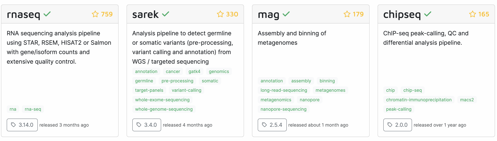

----------------------------------------------------------------------------------------------------

 

## Introduction

TBA

## Workflow management systems

Pipeline/workflow tools, often called "workflow management systems" in full,
provide ways to formally describe and execute pipelines.

#### The need for specialized programs to orchestrate pipelines

_TBA - Explain this is about the bioinformatics/algorithmic stage of analyses._

{fig-align="center" width="70%"}

Two quotes from this article:

> Typically, researchers codify workflows using general scripting languages such as Python or Bash.
> But these often lack the necessary flexibility.

>Workflows can involve hundreds to thousands of data files;
> a pipeline must be able to monitor their progress and exit gracefully if any step fails.
> And pipelines must be smart enough to work out which tasks need to be re-executed and which do not.

#### Advantages of workflow management systems

Advantages of workflow management systems are improved _automation_,
_flexibility_ (e.g., ease of running with different settings or on different datasets),
_portability_ (ease of running on different computers),
and _scalability_ (ease of scaling up to larger datasets):

- **Automation**
  - Detect & rerun upon changes in input files and failed steps.
  - Automate Slurm job submissions.
  - Integration with software management.

- **Flexibility, portability, and scalability**\
  This is due to these tools separating generic pipeline nuts-and-bolts from the
  following two aspects:
  - Run-specific configuration --- samples, directories, settings/parameters.
  - Things specific to the run-time environment (laptop vs. cluster vs. cloud).

#### Nextflow

The two most commonly used command-line based options in bioinformatics are
**Nextflow** and **Snakemake**.
Both are small "domain-specific" languages (DSLs) that are an extension of a
more general language: Python for Snakemake, and Groovy/Java for Nextflow.
Unfortunately, their learning curves are steeper than you might expect for a
tool that "merely" needs to tie your workflow steps together.
Therefore, we'll spend this week and next week on learning one of them: Nextflow. 

::: callout-note
#### Nextflow vs. Snakemake (TBA)
:::

## nf-core pipelines

You don't always have to build your own pipeline.
Many publicly available pipelines exist,
and if reliable pipelines exist for your planned analyses,
there are several advantages to using one of these instead of trying to build
your own pipeline.

For example, a bewildering array of bioinformatics programs is often available
for a given type of analysis,
and it can be very hard and time-consuming to figure out what you should use.
If you use a XXX, you can be confident that it uses a good if not optimal combination
of tools and tool settings:
most of these pipelines have been developed over years by many experts in the field,
and are continuously updated.

Among workflow tools,
Nextflow has by far the best ecosystem of publicly available pipelines.
The "nf-core" initiative (<https://nf-co.re>, @ewels2020)
curates a set of best-practice, highly flexible,
and well-documented pipelines written in Nextflow:

{fig-align="center" width="50%"}

For many common omics analysis types, nf-core has a pipeline.
It currently has 58 complete pipelines --- these are the four most popular ones:

{fig-align="center"}

Here's a closer look at the most widely used nf-core pipeline,
the [rnaseq pipeline](https://nf-co.re/rnaseq>),
which we'll run in [week 15 of the course](../week15/w15_1_nfcore.qmd):

{fig-align="center" width="120%"}
