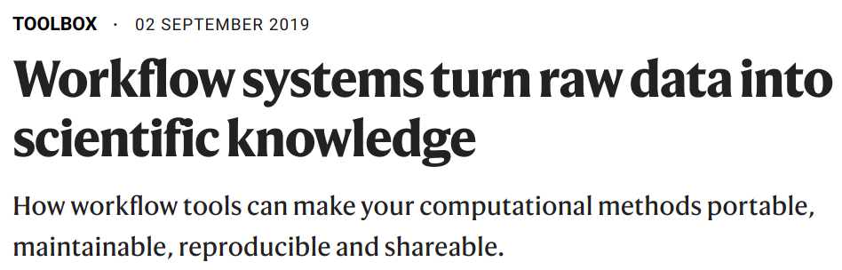
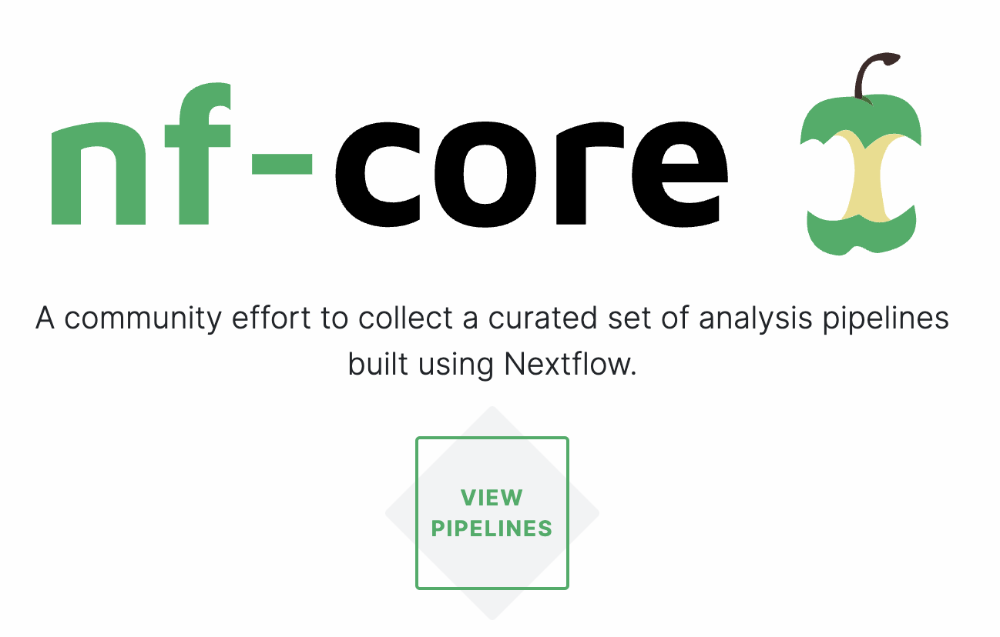
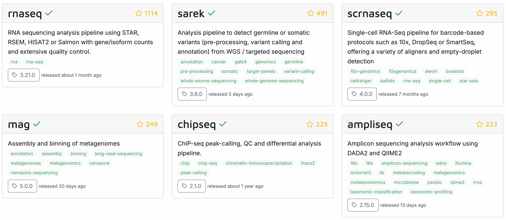
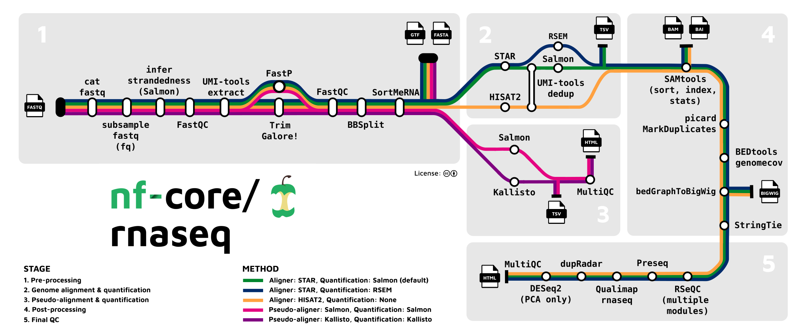

----------------------------------------------------------------------------------------------------

<br>

## Introduction

### Learning goals

#### This week

This week, we'll cover two distinct topics:

- Workflow management (_this session_)
- Data management and sharing (_next session_)

#### This session

- What a Markdown protocol of your workflow can look like
- How you can automate such workflows with Bash and Slurm,
  and what the associated challenges are
- What "workflow management systems" are,
  and what the advantages of formal pipelines/workflows written with these are
- That you may be able to use publicly available pipelines such as those produced
  by the nf-core initiative
  
### Getting ready

1. At <https://ondemand.osc.edu>,
   start a VS Code session in `/fs/ess/PAS2880/users/$USER`

## Structuring your analysis workflow

### Multi-step workflows

In a typical research project with omics data
(and likely in your final project for this course),
you need to run multiple consecutive steps to process/analyze your data.
In other words,
you will have a "**workflow**" that you need to structure
properly and reproducibly.

In the past few weeks, we have focused on writing code to complete individual
steps of such workflows.
Now, we'll zoom out to look at the bigger picture:
how do you organize and run your workflows as a whole?

Once again, let's look at this RNA-Seq analysis workflow you've seen before,
going from raw reads to gene counts:

{fig-align="center" width="60%" fig-alt="A diagram showing the steps in an RNA-Seq analysis pipeline." .lightbox}

In the past few weeks of this course,
you've created Markdown files with the commands you used to run your scripts.
For example, these files contained `for` loops to submit many FastQC and TrimGalore
batch jobs.

As [discussed in week 2](../week02/w2a_project-org.html#types-of-documentation-files-for-larger-projects),
for larger projects, it is a good idea to create at least two separate Markdown files 
for the code you used to run scripts and other commands:

- A "lab notebook"-style file that has **chronological entries** and is comprehensive:
  this should cover everything of note that you did, including mishaps,
  dead ends, and things that were redone differently later on.

- A "protocol" (or "recipe" / "workflow")-style file that has the
  **final code in order of execution** needed to run and rerun your entire project's
  computational work.

Let's see a more worked-out example of a protocol file.

### A longer protocol example

Specifically, we'll include the following steps: 

1. Read QC with FastQC _(independently for each file)_
2. FastQC summary with MultiQC _(once for all files)_
3. Read trimming with TrimGalore _(independently for each sample)_
4. Trimmed read alignment to a reference genome with STAR _(independently for each sample)_
5. Gene-level alignment counting with Salmon _(independently for each sample)_

::: {.callout-note collapse="true"}
## Click here to see an example header to this protocol file

````markdown
# RNA-Seq analysis of _Culex pipiens_

- Author: Jelmer Poelstra, MCIC, OSU (poelstra.1@osu.edu)
- Date: First created on 2025-04-01, last modified on 2025-08-25
- GitHub repository: <https://github.com/jelmerp/culex>
- This was run at the Pitzer cluster of the Ohio Supercomputer Center (<www.osc.edu>)
- OSC working dir: /fs/ess/PAS2880/users/jelmer
- More information about the project and its files:
  see the `README.md` file in the abovementioned working dir

## Prerequisites

- **Input files**:
  - The input files are:
    - Paired-end FASTQ files
    - Reference genomes files `assembly.fna` and `annotation.gtf`
  - Input file paths are set below and can be adjusted to your situation.
    - If you're running this at OSC and have access to project PAS2880,
      you can copy the files from the working dir specified above,
      or adjust the input file paths below to directly use these files.
    - Otherwise:
      - Reference genome files can be downloaded from <URL>
      - FASTQ files are available through the SRA via accession number <ACCESSION>

- **Software**:
  - The scripts will run programs using Singularity/Apptainer containers
    available online, with links contained inside the scripts
  - If running at OSC, no software installations are needed
  - If you're not at OSC, you need to have `apptainer` and `Slurm` installed.

- You don't need to create the output dirs because the scripts will do so.
````
:::

````markdown
<!--- [Hypothetical example - don't run any of the code in this document] -->

## Set up: Set the input file paths

```bash
fastq_dir=data/fastq
ref_assembly=results/01_refseqs/assembly.fna
ref_annotation=results/01_refseqs/annotation.gtf
```

## Step 1: Read QC with FastQC

The `fastqc.sh` script runs on 1 FASTQ file at a time and takes 2 arguments -
the input FASTQ file and output dir:

```bash
for fastq in "$fastq_dir"/*fastq.gz; do
    sbatch scripts/fastqc.sh "$fastq" results/fastqc
done
```

## Step 2: FastQC summary with MultiQC

The `multiqc.sh` script runs on all FastQC outputs at a time and takes 2 arguments -
the input dir (i.e., the FastQC output dir) and output dir:

```bash
sbatch scripts/multiqc.sh results/fastqc results/multiqc
```

## Step 3: Read trimming with TrimGalore

The `trim.sh` script runs for one sample at a time and takes 3 arguments -
input forward-read (R1) FASTQ, reverse-read (R2) FASTQ, and the desired output dir:

```bash
for R1 in "$fastq_dir"/*_R1.fastq.gz; do
    R2=${R1/_R1/_R2}
    sbatch scripts/trimgalore.sh "$R1" "$R2" results/trimgalore
done
```

## Step 3: Trimmed read alignment to a reference genome with STAR

The `star.sh` script runs for one sample at a time and takes 4 arguments -
input trimmed R1 and R2 FASTQs produced by `trimgalore.sh`, a reference FASTA file,
and the desired output dir:

```bash
for R1 in results/trimgalore/*_R1.fastq.gz; do
    R2=${R1/_R1/_R2}
    sbatch scripts/star.sh "$R1" "$R2" "$ref_assembly" results/star
done
```

## Step 5: Gene-level alignment counting with Salmon

The `salmon.sh` script runs for one sample at a time and takes 4 arguments -
input BAM file produced by `start.sh`, a reference GTF file,
and the desired output dir:

```bash
for bam in results/star/*bam; do
    sbatch scripts/salmon.sh "$bam" "$ref_annotation" results/salmon
done
```
````

### Why organize your workflow this way?

The protocol above submits a shell script one or more times for each step,
with each script taking arguments to specify the in- and output files,
and running a bioinformatics program to perform that step.

Here are some advantages of structuring your workflows with single-step,
flexible (i.e., argument-accepting) scripts,
and an overarching protocol Markdown file to describe the entire workflow:

- Rerunning everything, including with a modified sample set, or tool settings,
  is relatively straightforward -- both for yourself and others, improving reproducibility
- Re-applying the same set of analyses in a different project is straightforward
- The Markdown file documents the steps taken
- It (more or less) ensures you are including all necessary steps

However, in the example above,
it is import to realize that you **cannot** run all the code at once.

<details><summary>Why can't all the code be run at once? _(Click to see the solution)_</summary>
This is because most steps need the input 
with both the second and third steps using the output of an earlier step as their input.

Therefore, if you run all code at once, all batch jobs will be submitted at the same time:
this means that later steps will start running before the earlier step has finished,
i.e. before their input files are available, and will fail.
</details>

<details><summary>Which steps _can_ be run simultaneously? _(Click to see the solution)_</summary>
This is because most steps need the input 
with both the second and third steps using the output of an earlier step as their input.
</details>

### How about automation?

The above protocol is not an automated pipeline because for most steps,
you can't run them until the previous step has finished.
You may therefore consider trying to improve automation,
which you can do with two main approaches:

1. With more advanced Bash and Slurm code 
2. With "workflow management systems" like Nextflow _(recommended but takes some learning)_

In this course, we will cover neither approach in detail^[
We did initially plan to cover Nextflow, as you may have noticed,
but decided to cut this part to allow for more time for the remaining topics.],
but the rest of this lecture serves to at least make you aware of the possibilities.
This is a more advanced topic that I would recommend to those of you planning
to work with omics (especially genomics and transcriptomics) data a lot.

## Improving automation with Bash and Slurm

When trying to improve automation with Bash and Slurm,
here are two approaches to _potentially_ consider:

- Reducing the number of steps by creating multi-step shell scripts and/or
- Automatically managing batch job submissions with job "dependencies"

We'll go over each of these below.

### Reduce the number of steps by combining scripts

At the extreme, you could write a single shell script for all steps and all samples
(i.e., a script with multiple loops) that can be submitted as a single batch job.
While this would work, it would be highly inefficient^[
Unless you use some other tricks - see also below.]
because sample-wise steps would run consecutively across samples instead of 
simultaneously.

A more reasonable approach would be to write
**scripts that only process one sample but include as many steps as possible**
for that sample.

However, this has downsides too,
some of which can be overcome with a further increase in script complexity.
For example, what if you need to redo only the steps from the middle of your
workflow onwards (e.g. because you want to change some settings there).
Rerunning your all-inclusive script would mean rerunning all steps,
which could be a big waste of time.
You could overcome this by including clauses in your script to only rerun certain
steps -- see the [Appendix](#appendix-automation-with-bash-and-slurm).

At that point, though, the increased amount of time spent on writing your scripts
and the general burden of having to maintain more complicated scripts
_may not be worth the time you save with increased automation_.
All in all, I personally prefer to write shell scripts that just run one program
and for one sample, where appropriate.

### Automatically manage batch job submission

There are ways to automate Slurm batch job submission so you don't have to wait
for each step to finish before moving on to the next.
Specifically, you can specify so-called Slurm "job dependencies" that only allow
a job to to actually start once one or more other jobs have (sucessfully) finished
running.
For an example, see the [Appendix](#appendix-automation-with-bash-and-slurm).

However, similar to the approach with longer shell scripts,
the added complexity comes with its own costs,
and may only be able to improve automation somewhat.
Therefore, it may in the end not pay off.

## Automation with workflow management systems

### Introduction

Pipeline/workflow tools, often called "workflow management systems" in full,
provide ways to formally describe and execute pipelines.

{fig-align="center" width="70%"}

A quote from this article, @perkel2019: 

>Workflows can involve hundreds to thousands of data files;
> a pipeline must be able to monitor their progress and exit gracefully if any step fails.
> And pipelines must be smart enough to work out which tasks need to be re-executed and which do not.

The two most commonly used command-line based options in bioinformatics are
**[Nextflow](https://www.nextflow.io/)** (@ditommaso2017)
and **[Snakemake](https://snakemake.github.io/)** (@molder_sustainable_2025).
Both are small "domain-specific" languages (DSLs) that are an extension of a
more general language: Python for Snakemake, and Groovy/Java for Nextflow.

### Pros and cons of workflow management systems

The advantages of using workflow management systems rather than some of the
abovementioned approaches are improved automation,
flexibility (e.g., ease of running with different settings or on different datasets),
portability (ease of running on different computers),
and scalability (ease of scaling up to larger datasets):

- **Automation**
  - Detect & rerun upon changes in input files and failed steps.
  - Automate Slurm job submissions.
  - Integration with software management.

- **Flexibility, portability, and scalability**\
  This is due to these tools separating generic pipeline nuts-and-bolts from the
  following two aspects:
  - Run-specific configuration --- samples, directories, settings/parameters.
  - Things specific to the run-time environment (laptop vs. cluster vs. cloud).

The main disadvantage is that they have a somewhat steep learning curve and pipelines
are more complicated to write than you might expect for a tool that "merely"
ties your workflow steps together.

But overall, my recommendation with respect to workflow management is to either:

- Accept that you're workflow isn't automated, and use Markdown protocols like the one above
- Go all-in and use a workflow tool (I recommend Nextflow, specifically)

## Pre-existing pipelines

Another thing to keep in mind is that you don't always have to build your own
workflow/pipeline.
Many publicly available pipelines exist.
And if reliable pipelines exist for your planned analyses,
there are several advantages to using one of these instead of trying to build
your own pipeline.

For example, a bewildering array of bioinformatics programs is often available
for a given type of analysis,
and it can be very hard and time-consuming to figure out what you should use.
With pipelines from certain initiatives,
you can be confident that it uses a good combination of tools and tool settings:
most of these pipelines have been developed over years by many experts in the field,
and are continuously updated.

Among workflow tools,
Nextflow has by far the best ecosystem of publicly available pipelines.
The "nf-core" initiative (<https://nf-co.re>, @ewels2020)
curates a set of best-practice, highly flexible,
and well-documented pipelines written in Nextflow:

{fig-align="center" width="50%" .lightbox}

<hr style="height:1pt; visibility:hidden;" />

For many common omics analysis types, nf-core has a pipeline.
It currently has 84 complete pipelines --
these are the six most popular ones:

{fig-align="center" width="95%" .lightbox}

Here's a closer look at the most widely used nf-core pipeline,
the [rnaseq pipeline](https://nf-co.re/rnaseq>),
which we'll run in week 15 of the course:

{fig-align="center" width="90%" .lightbox}

<br>

-----

## Appendix: automation with Bash and Slurm

### `if`-statements

`if`-statements will allow you to flexibly run part of a script,
for example:

```sh
trim=$1   # true or false
map=$2    # true or false
count=$3  # true or false
  
if [[ "$trim" == true ]]; then
    for R1 in data/fastq/*_R1.fastq.gz; do
        bash scripts/trim.sh "$R1" results/trim
    done
fi
  
if [[ "$map" == true ]]; then
    for R1 in results/trim/*_R1.fastq.gz; do
        bash scripts/map.sh "$R1" results/map
    done
fi
  
if [[ "$count" == true ]]; then
    bash scripts/count.sh results/map results/count_table.txt
fi
```

To learn more about `if` statements,
see [this section](../bonus/shell-scripting.html#conditionals)
of the bonus page on shell scripting.

### Script options

If your script has a whole bunch of options to specify which steps should be run,
it will become tedious and error prone to work with the regular "positional arguments".
Instead, you should then consider writing your script such that it can accept
options too, e.g.:

```bash
bash myscripts.sh --skip_count --skip_map $fastq $outdir
```

To learn how to do this,
see [this section](../bonus/shell-scripting.html#shell-script-options-vs.-arguments)
of the bonus page on shell scripting.

### Slurm job dependencies

In the example below,
jobs will only start after their "dependencies" (jobs whose outputs they need)
have finished:
  
```sh
for R1 in data/fastq/*_R1.fastq.gz; do
    # Submit the trimming job and store its job number:
    submit_line=$(sbatch scripts/trim.sh "$R1" results/trim)
    trim_id=$(echo "$submit_line" | sed 's/Submitted batch job //')
      
    # Submit the mapping job with the condition that it only starts when the
    # trimming job is done, using '--dependency=afterok:':
    R1_trimmed=results/trim/$(basename "$R1")
    sbatch --dependency=afterok:$trim_id scripts/map.sh "$R1_trimmed" results/map
done
  
# If you give the mapping and counting jobs the same name with `#SBATCH --job-name=`,
# then you can use '--dependency=singleton': the counting job will only start
# when ALL the mapping jobs are done:
sbatch --dependency=singleton scripts/count.sh results/map results/count_table.txt
```

<br>
