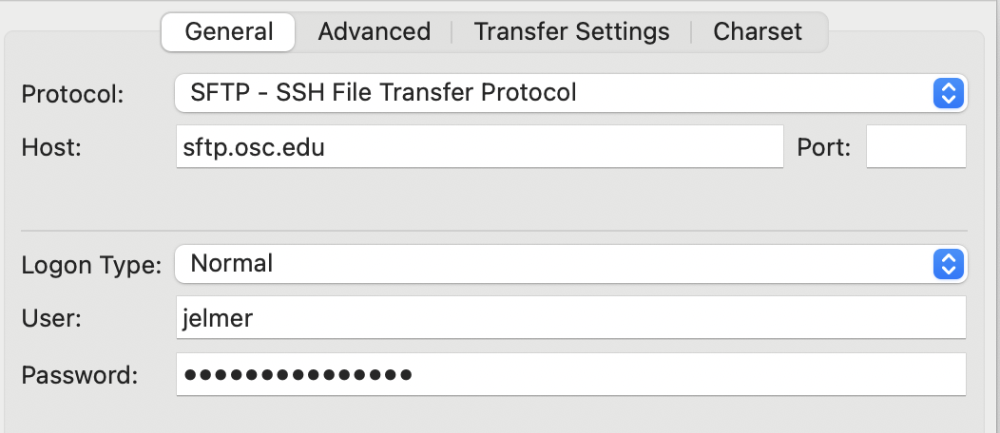
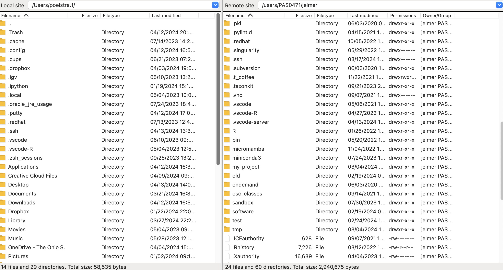
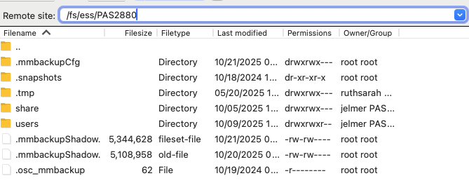
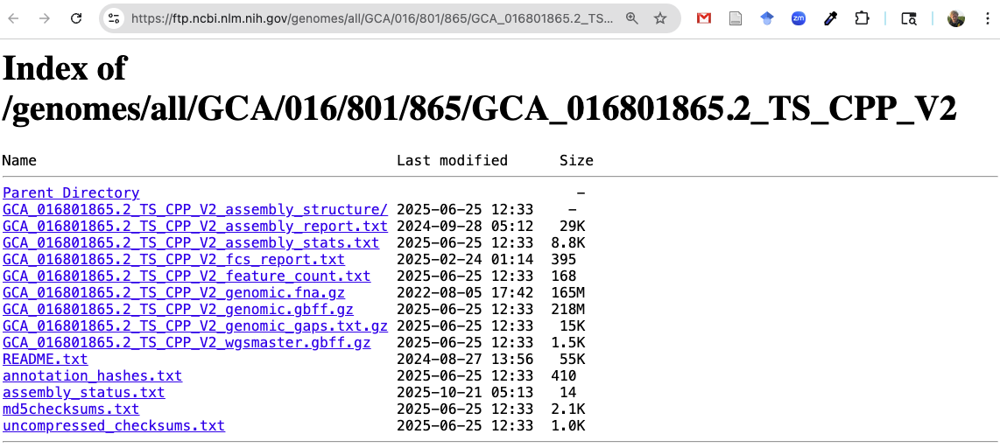
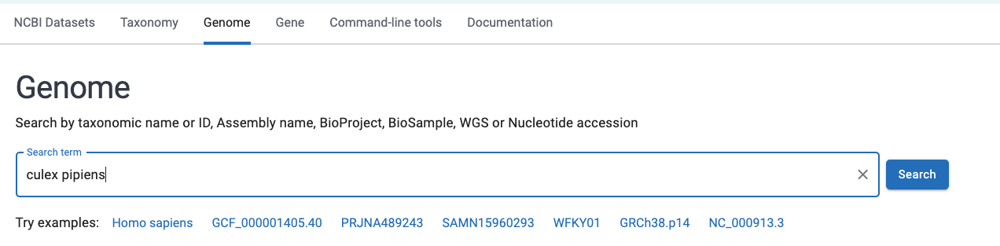
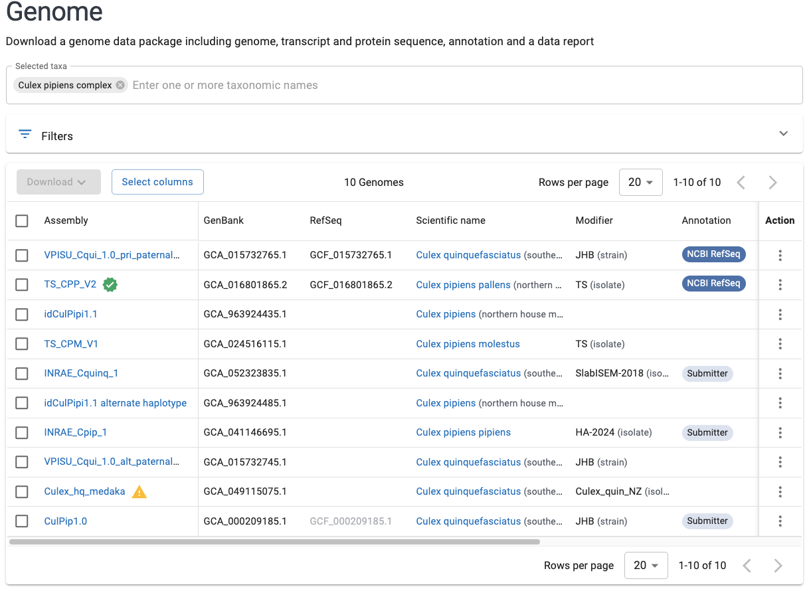
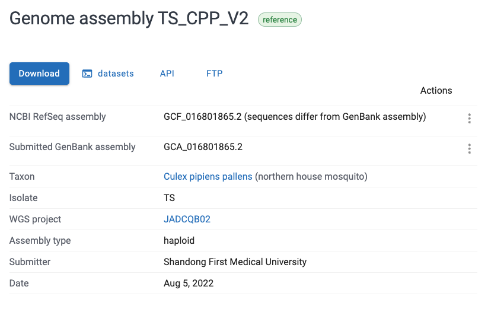
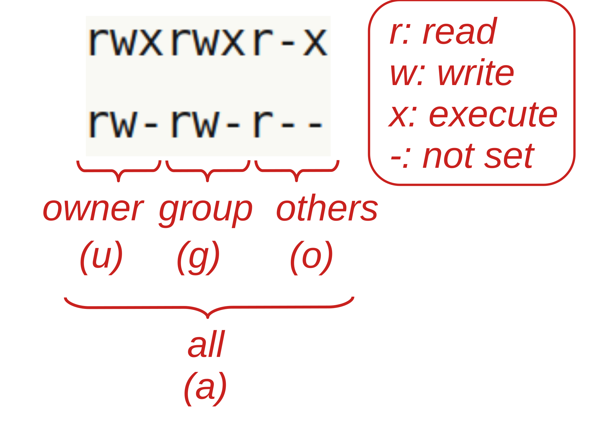

----------------------------------------------------------------------------------------------------

<br>

## Introduction

### Learning goals

- How you can manage your data and share it after publication
- How to transfer files between OSC and other computers like your own
- How to download files at the command-line
- How to manage file permissions

### Getting ready

1. At <https://ondemand.osc.edu>,
   start a VS Code session in `/fs/ess/PAS2880/users/$USER`

## Raw data management

In general, any type of raw data from your research is extremely valuable.
There are the results of your experiment,
and may have been labor-intensive and expensive to produce.

In the examples in this course, raw data has been in the form of FASTQ files.
More generally with (epi)genomics and transcriptomics projects,
your main piece of raw data will be a set of sequence files,
most commonly in FASTQ format.
However, similar principles apply with other types of data/files.

### Key recommendations

- **Never delete your raw data.**
  It doesn't matter if you "finished" your downstream analyses,
  or produced processed FASTQ files that you personally find more useful:
  your ground truth will always be the raw data.
  These ensure that your results can be reproduced by yourself and others,
  and they allow for a modified re-analysis of the data after e.g. new methods
  or relevant data become available.

- **Keep multiple copies of your raw data.**
  You should always keep two or more copies of your raw data,
  ideally in at least two different physical locations.
  So, even if your data mainly lives on OSC, also keep a copy elsewhere.
  And on OSC, you should never only store files in a scratch dir,
  since these dirs are periodically deleted.
  
- **Share your raw data publicly after publication.**
  Most journals and funding agencies nowadays require that
  research data is made publicly available after publication of the results.
  While this is somewhat of a novelty for some types of data,
  sequencing data has long been expected to be shared publicly.

- Also:
  - Keep track of data provenance and metadata
    - When and from where was the data obtained/received?
    - What metadata exists for each sample?
  - Use standard and preferably plain-text file formats
  - To avoid accidents,
    consider making your data read-only with file permissions _([covered below](#file-permissions))_
  - After downloading or when sharing key data,
    consider using "checksums" to check that files were transferred entirely
    _([bonus material](../bonus/data.qmd))_

### Details about sharing data and other files

  > By the end of 2025, all federally-funded research must make articles and data publicly available immediately upon journal publication with no waiting periods allowed. 
 >
 > --- [Federal Research Policy Guide](https://research.osu.edu/federal-research-policy-guide-public-access-requirements)
     from OSU's [Enterprise for Research, Innovation and Knowledge](https://erik.osu.edu/)
     
#### Platforms for sharing data

- Raw sequences from high-throughput sequencing, such as FASTQ files,
  must be uploaded to NCBI's
  [Sequence Read Archive (SRA)](https://www.ncbi.nlm.nih.gov/sra)
- Some results should also be uploaded to NCBI,
  such as genome assemblies and annotations, and gene expression count tables
  (Geno Expression Omnibus, [GEO](https://www.ncbi.nlm.nih.gov/geo/))
- (Other) results and data can, and are increasingly required to upon publication,
  be shared via general data repositories like [Dryad](https://datadryad.org/)
  and [Zenodo](https://zenodo.org/)
- Code can be shared via GitHub (or similar platforms like GitLab and Bitbucket),
  ideally with a permanent Digital Object Identifier (DOI) via
  [Zenodo's GitHub integration](https://guides.github.com/activities/citable-code/) ^[
  Journals may in some cases require code to be shared via the abovementioned
  general repositories like Dryad as well,
  where they (or especially their documentation) are subject to manual quality control.]

::: {.callout-note collapse="true"}
### Data Management Plans _(Click to expand)_

Data Management Plans (DMPs), which specify how you are planning to manage and share
your data, have recently also become required by major funding agencies:

>  A DMP is currently required for all competitive grant programs of the United States Department of Agriculture and the National Science Foundation.
>
> --- @grünwald2024

Here are specific guidelines for [USDA NIFA ](https://www.nifa.usda.gov/grants/lifecycle/pre-award/data-management-plans)
and [NSF](https://www.nsf.gov/funding/data-management-plan) grants.
:::

::: {.callout-tip appearance="simple"}
For more and OSU-specific information about data management and sharing,
[OSU's Research Commons](https://library.osu.edu/researchcommons) has
[guides](https://guides.osu.edu/rdm-best-practice/how-to-share) and
[offers consultations](https://library.osu.edu/research-data).
:::

## File transfer to and from OSC

### Should I keep my OSC and local directories synced and how?

You can't keep files synced between OSC and your local computer
in a fully automatic way like with OneDrive or Dropbox.
And because the amount of data on OSC is typically very large,
you may not want to either. Instead, here is a good strategy:

- Keep the files you have under version control (code, etc.) synced via Git/GitHub
- Periodically sync all or a selection of other files with the data transfer
  methods discussed below
  
Data syncing is especially important when you do analyses both at OSC and on
your local computer for a given project. 
To reduce this friction,
I recommend that for projects for which you need OSC,
you instead try to do _all_ your work there.
When you do that,
it even works to keep entirely separate sets of files at OSC and your local computer
-- for example,
you may keep only the manuscript and related files on your local computer
(and/or OneDrive/Teams), and everything else at OSC.

### Overview of transfer options

In week 1, you learned that you can upload and download files from OSC
in the OnDemand Files menu.
However, that method is only suitable for relatively small transfers.
Here is a table with methods to transfer files between your computer and OSC:

| Method                            | Transfer size         | CLI or GUI        | Ease of use   | Flexibility/options   |
|-----------------------------------|-----------------------|-------------------|---------------|-----------------------|
| **OnDemand Files menu**           | smaller (<1GB)        | GUI               | Easy          | Limited               |
| **Remote transfer commands**      | smaller (<1GB)        | CLI               | Moderate      | Extensive             |
| **SFTP**                          | larger (>1GB)         | Either            | Moderate      | Extensive             |
| **Globus**                        | larger (>1GB)         | GUI               | Moderate      | Extensive             |

: {.striped .hover}

### FileZilla: a GUI-based SFTP client

Here, we'll go over what is probably overall the most convenient and versatile
way to transfer files to and from OSC,
since it works for transfers of any size, and is easy and quick:
**file transfer with a GUI-based SFTP client**.
There are several such programs, but I can recommend FileZilla ^[
E.g. because it works on all operating systems and has a more intuitive user
interface than CyberDuck,
another very commonly used program that works both on Mac and Windows.].
Let's give that a try!

1. **Install FileZilla**\
   - For OSU-managed computers:\
     Open the "Software Center" (Windows) or "Ohio State Application Self Service"
     (Mac), search for "FileZilla", and click the install button.
   
   - For personal computers:\
     Go to the
     [FileZilla download page](https://filezilla-project.org/download.php?type=client)
     --- it should automatically display a big green download button for your
     operating system: click on that, then install the program, and open it.
  
2. **Connect to OSC**\
   Open FileZilla.
   To connect it to OSC, find the **Site Manager**:
   click `File` in the top menu bar and then `Site Manager`^[
   There is a also an icon in the far top-left to access this menu.
   Additionally, there is a "Quickconnect" bar,
   but I've not managed to connect to OSC with that.].
   In the Site Manager, enter/select the following:
   - _Protocol_: "SFTP - SSH File Transfer Protocol"
   - _Host_: `sftp.osc.edu` (leave the Port box empty)
   - _Logon Type_: Make sure "Normal" is selected
   - _User_: Type your OSC username
   - _Password_: Enter your OSC password
   - Click the "**Connect**" button at the bottom to connect to OSC

{fig-align="center" width="60%" fig-alt="A screenshot of the connection setup dialog box on FileZilla" .lightbox}

3. **The connection interface**\
   Once connected, your main screen is split with a local file explorer
   on the left, and a remote file explorer on the right:
  
{fig-align="center" width="90%" fig-alt="A screenshot of the split screen view showing local and remote on FileZilla" .lightbox}

4. **Changing directories**\
   You can change directories in either file explorer.
   At OSC, your default location is your Home dir within `/users/`,
   but you can type a path in the top bar to e.g. go to `/fs/ess/PAS2880` --
   and from there you can further click your way to your personal dir there.
  
{fig-align="center" width="70%" fig-alt="A screenshot of FileZilla showing how to change the remote dir." .lightbox}

4. **Transferring files**\
   Transferring dirs and files in either direction is as simple as dragging and
   dropping them to the other side!
   
::: exercise
####  Exercise: File transfer with FileZilla

Try to download some files from `/fs/ess/PAS2880/users/$USER` to your local computer,
and vice versa.
:::

## Downloading files at the command line

When you need to get large files from public repositories like NCBI
(e.g. reference genome files, raw reads from the SRA),
I would recommend to **download them directly to OSC using commands**
(instead of downloading to your own computer and then transferring to OSC).
Not only is this quicker once you know how to,
it is also much more reproducible:
in your Markdown documentation files,
you can store the exact commands used to obtain the data.

### `wget`

You can download files from a URL using the `wget` command.
It has _many_ options, but basic usage is quite simple:

```bash
# This will download the file at the URL to your current working dir
wget <URL>
```

As an example, say that you want to download the reference genome FASTA
file for _Culex pipiens_,
the focal species of the @garrigós2025 RNA-Seq data set we've been working with.
We actually do need to do this because my `garrigos-data` repo contains only
the GTF annotation file, and not the assembly file,
which wasn't included due to its large size.

The files for that genome can be found at this
[NCBI FTP webpage](https://ftp.ncbi.nlm.nih.gov/genomes/all/GCF/016/801/865/GCF_016801865.2_TS_CPP_V2/):

{fig-align="center" width="85%" fig-alt="A browser screenshot of the NCBI FTP dir for the Culex pipiens genome" .lightbox}

You can right-click on any of the files there and then click "Copy Link Address"
(or similar, depending on your browser).

1. Go ahead and copy the URL to the assembly FASTA (`.fna.gz`) file.
2. Type `wget` and <kbd>Space</kbd> in your terminal, paste the URL,
   and execute the command:

    ```bash
    wget https://ftp.ncbi.nlm.nih.gov/genomes/all/GCF/016/801/865/GCF_016801865.2_TS_CPP_V2/GCF_016801865.2_TS_CPP_V2_genomic.fna.gz
    ```
    ```bash-out
    --2025-10-23 10:19:04--  https://ftp.ncbi.nlm.nih.gov/genomes/all/GCF/016/801/865/GCF_016801865.2_TS_CPP_V2/GCF_016801865.2_TS_CPP_V2_genomic.fna.gz
    Resolving ftp.ncbi.nlm.nih.gov (ftp.ncbi.nlm.nih.gov)... 130.14.250.13, 130.14.250.10, 130.14.250.7, ...
    Connecting to ftp.ncbi.nlm.nih.gov (ftp.ncbi.nlm.nih.gov)|130.14.250.13|:443... connected.
    HTTP request sent, awaiting response... 200 OK
    Length: 172904433 (165M) [application/x-gzip]
    Saving to: ‘GCF_016801865.2_TS_CPP_V2_genomic.fna.gz’
    
    GCF_016801865.2_TS_CPP_V2_genomic.fna.gz           100%[===============================================================================================================>] 164.89M  28.5MB/s    in 7.2s    
    
    2025-10-23 10:19:12 (23.0 MB/s) - ‘GCF_016801865.2_TS_CPP_V2_genomic.fna.gz’ saved [172904433/172904433]
    ```

3. As you saw, `wget` is quite chatty and prints a bunch of logging and progress 
   to the screen. If that all looked good, list the downloaded file:

   ```bash
   ls -lh
   ```
   ```bash-out
   -rw-rw----+ 1 jelmer PAS0471 165M Dec 22  2022 GCF_016801865.2_TS_CPP_V2_genomic.fna.gz
   ```

4. Move it to your `garrigos-data` dir:

   ```bash
   mv -v GCF_016801865.2_TS_CPP_V2_genomic.fna.gz garrigos-data/ref
   ```

5. Create a new README file...

   ```bash
   touch garrigos-data/ref/README.md
   ```
   
   ...and in it, add a note about how you obtained the file:
   
   ````markdown
   Downloaded reference genome FASTA from NCBI on 2025-10-23 with:
   
   ```bash
   wget https://ftp.ncbi.nlm.nih.gov/genomes/all/GCF/016/801/865/GCF_016801865.2_TS_CPP_V2/GCF_016801865.2_TS_CPP_V2_genomic.fna.gz
   ```
   ````
   
<hr style="height:1pt; visibility:hidden;" />

::: callout-note
#### Additional download command notes

- You can use `wget`s `-P` option to directly download to a different dir,
  for example:

  ```bash
  # This would download the file into a dir 'data/ref':
  wget -P data/ref <URL>
  ```

- Another commonly used downloading command is `curl` --
  both have similar functionality, so you don't really need to learn both.
  But you may see examples with `curl` elsewhere.
:::

::: callout-tip
#### Tips for other kinds of genomics downloads 

- For reference genome downloads,
  NCBI also has a relatively new and very useful portal called **"datasets"**
  [that also includes a CLI tool with the same name](https://www.ncbi.nlm.nih.gov/datasets/docs/v2/reference-docs/command-line/datasets).
  This tool is very useful if you want to download multiple or many genomes --
  for example, it allows you to download all available genomes of say a certain 
  genus with a single command.

- For downloads from the Sequence Read Archive (SRA),
  which contains high-throughput sequencing reads,
  you can use tools like [fasterq-dump](https://github.com/ncbi/sra-tools/wiki/HowTo:-fasterq-dump)
  and [dl-fastq](https://github.com/rpetit3/fastq-dl).
  Also handy is the simple [SRA explorer website](https://sra-explorer.info),
  where you can enter an NCBI accession number and it will give you download links.
:::

::: {.callout-tip collapse="true"}
#### How to find a reference genome and its files for any species _(Click to expand)_

1. Go to the genome part of NCBI's datasets portal <https://www.ncbi.nlm.nih.gov/datasets/genome/>
2. Type in the name of a species (or other taxonomic level)

{fig-align="center" width="95%" fig-alt="A screenshot of the NCBI datasets website" .lightbox}

3. Select an appropriate taxonomic match within the search box, and press Enter.
   You will get a list of available genomes:

{fig-align="center" width="95%" fig-alt="A screenshot of the NCBI datasets website" .lightbox}  
   
4. All else being equal (e.g. the appropriate subspecies), it is generally a good
   idea to pick the "Reference" genome which is highlighted with a green checkmark,
   i.e. `TS_CPP_V2` in the screenshot above.
   Click on the name of the desired genome, and you will see a page like this:

{fig-align="center" width="85%" fig-alt="A screenshot of the NCBI datasets website" .lightbox}  

5. There are multiple ways of downloading, but the FTP page we downloaded from
   can be accessed by clicking the "FTP" button shown in the screenshot above.
   
<hr style="height:1pt; visibility:hidden;" />
:::

## File permissions

### Introduction to file permissions 

File "permissions" are what different categories of users are permitted to do
with files and dirs.
Being able to view and modify file permissions is useful when you:

- Want to make your data read-only to prevent accidental modification or deletion
- Need to share files with other users at OSC

There are three different file permissions that can be independently controlled:

1. **Read** (`r`) permissions allow you to read and copy files/dirs
2. **Write** (`w`) permissions allow you to move, rename, modify, overwrite, or delete
3. **Execute** (`x`) permissions allow you to directly execute a file (see the box below)

While it is possible to set permissions for individual users,
they are most easily and commonly set for three different user categories:

- **Owner (or "user")** (`u`) ---
  By default, this the person that created the file or dir.
  This includes cases where this person merely copied or downloaded files:
  e.g., after you have copied someone else's FASTQ files,
  you are the owner of these copies.
- **Group** (`g`) ---
  At OSC, the group category is at the OSC Project level
- **Other** (`o`) --- Any other user 

::: callout-note
#### Executing a file?
Executing a file means running it as a program/command.
For example, when we run the FastQC program with the command `fastqc`,
we are really executing a binary (executable) file somewhere on the system.
Similarly, self-written shell scripts can be executed if they have execute permissions set.
:::
  
### Viewing file permissions

To show file permissions,
use **`ls`**  with the **`-l`** (*long* format) option that we've seen before,
which should show you something like this:

```bash
ls -lh garrigos-data
```
```bash-out
total 2.5K
drwxrwx---+ 2 jelmer PAS0471 4.0K Sep  9 13:46 fastq
drwxrwx---+ 2 jelmer PAS0471 4.0K Sep  9 13:46 meta
-rw-rw----+ 1 jelmer PAS0471 2.3K Sep  9 13:46 README.md
drwxrwx---+ 2 jelmer PAS0471 4.0K Sep  9 13:46 ref
drwxrwx---+ 2 jelmer PAS0471 4.0K Sep 16 13:26 sandbox
```

With annotations:

{fig-align="center" width="80%" fig-alt="A screenshot of the long-format ls output that includes info about file permissions." .lightbox}

::: {.callout-important}
#### "Groups" at OSC

When you create a file in the PAS2880 project dir,
its "**group**" will include all members of the OSC project PAS2880.
That is true even if the primary group displayed in the `ls -l` output shown below
is a different one, e.g. `PAS0471` for me (my personal default group at OSC).
:::

Here is an overview of the file permission notation in `ls -l` output:

{fig-align="center" width="40%" fig-alt="A diagram showing the different file permissions that can be set." .lightbox}

In the two lines above:

- `rwxrwxr-x` means: read, write, and execute permissions are set for the owner
  (first `rwx`) and the group (second `rwx`),
  and read and execute _but not_ write permissions for others (`r-x` at the end).

- `rw-rw-r--` means: read and write _but not_ execute permissions are set
  for both the owner (first `rw-`) and the group (second `rw-`),
  and only read permissions for others (`r--` at the end).

::: {.callout-warning}
#### Default permissions at OSC

Most commonly, files and dirs that you create at OSC will by default have:

- Read permissions for owner (you) and group
- Write permissions only for owner (you)

However, this is not always the case,
and I am personally sometimes vexed by file permissions at OSC.
For instance, in our `PAS2880` project, the default permissions appear to include
write permissions for the group.
I think because this is an "Educational" project but am not certain about that.

More generally, by default:

- OSC users that are not members of a specific project can't access that project's
  file in `/fs/ess/` and `/fs/scratch` at all.
- Other OSC users cannot access your personal Home dir files --
  so it's never a good idea to keep files there that should be accessible to collaborators.
:::

::: exercise
####  Exercise: Viewing file permissions

Check the file permissions in your Home dir.
:::

### Changing file permissions

Let's create a file to play around with file permissions:

```bash
# Create a test file
cd sandbox
touch testfile.txt

# Check the default permissions
ls -l testfile.txt
```
```bash-out
-rw-rw----+ 1 jelmer PAS0471 0 Mar  7 13:36 testfile.txt
```

To change a file's permissions, you can use the **`chmod` command**.
There are two main ways to use this command, one of which uses symbols as follows:

- `+` : add a permission
- `-` : remove a permission
- `=` : set a permission to

These are used with both the kind of permission (`r` / `w` / `x`)
and the user category (`a` / `u` / `g` / `o`).
For example, `a+r` means that for `a`ll, you add (`+`) `r`ead permissions.
Let's see some commands:

- To add read (`r`) permissions for all (`a`):

  ```bash
  chmod a+r testfile.txt
  
  ls -l testfile.txt
  ```
  ```bash-out
  -rw-rw-r--+ 1 jelmer PAS0471 0 Mar  7 13:40 testfile.txt
  ```

- To set read + write + execute (`rwx`) permissions for all (`a`):

  ```bash
  chmod a=rwx testfile.txt
  
  ls -l testfile.txt
  ```
  ```bash-out
  -rwxrwxrwx+ 1 jelmer PAS2880 0 Mar  7 13:36 testfile.txt
  ```

  ::: {.callout-tip appearance="simple"}
  Because the file is now "executable", 
  its name should display in **[green]{style="color:green"}** in your terminal.
  :::

- To remove write (`w`) permissions for others (`o`):

  ```bash
  # chmod <who>-<permission-to-remove>:
  chmod o-w testfile.txt
  
  ls -l testfile.txt
  ```
  ```bash-out
  -rwxrwxr-x+ 1 jelmer PAS2880 0 Mar  7 13:36 testfile.txt
  ```

<hr style="height:1pt; visibility:hidden;" />

::: {.callout-note collapse="true"}
#### An alternative method: changing file permissions with numbers _(Click to expand)_

`chmod` alternatively accepts a series of 3 numbers
(for user, group, and others, respectively) to set permissions,
where each permission is "worth" the following number of points:

:::: columns
::: {.column width="5%"}
:::
::: {.column width="40%"}
| Nr | Permission     |
|:----:|:-----------:|
| 1  | x              |
| 2  | w              |
| 4  | r              |

: {.striped .hover}
:::
::: {.column width="10%"}
:::
::: {.column width="40%"}
| Nr | Permission |
|:----:|:-----------:|
| 5  | r + x          |
| 6  | r + w          |
| 7  | r + w + x      |
 
: {.striped .hover}
:::
::: {.column width="5%"}
:::
::::

For example, to set read + write + execute permissions for all:

```bash
chmod 777 testfile.txt
```

To set read + write + execute permissions for yourself, and only read permission
for the group and others:

```bash
chmod 744 file.txt
```
:::

::: {.callout-warning collapse="true"}
#### Read/execute permissions for directories _(Click to expand)_

`chmod` is not recursive by default:
you need the `-R` option to change permissions throughout a dir hierarchy.
For example:

```bash
chmod -R g+r my-dir
```

One tricky and confusing aspect of file permissions is that
**to be able to view/list a directory's content,**
**you need _execute_ permissions for the dir!**
This is something to take into account when you want to grant others
access to your project e.g. at OSC.

To set execute permissions for everyone but *only for dirs* throughout a dir hierarchy,
use an `X` (**uppercase x**):

```sh
chmod -R a+X my-dir
```
:::

### Making your data read-only

Now, let's see how you can make your data read-only.
Here, we'll work with the files in the `garrigos-data/fastq/` dir,
so let's check the initial permissions first:

```bash
cd ..
ls -l garrigos-data/fastq/ | head -n 3
```
```bash-out
total 963552
-rw-rw----+ 1 jelmer PAS0471 21266097 Sep  9 13:46 ERR10802863_R1.fastq.gz
-rw-rw----+ 1 jelmer PAS0471 22700521 Sep  9 13:46 ERR10802863_R2.fastq.gz
```

To make this data read-only, you can for example run:

```bash
# Allow only read permissions for all users
chmod a=r garrigos-data/fastq/*
```

After running this command, let's check the permissions:
  
```sh
ls -l garrigos-data/fastq/ | head -n 3
```
```bash-out
total 963552
-r--r--r--+ 1 jelmer PAS0471 21266097 Sep  9 13:46 ERR10802863_R1.fastq.gz
-r--r--r--+ 1 jelmer PAS0471 22700521 Sep  9 13:46 ERR10802863_R2.fastq.gz
```

What happens when you try to remove write-protected files?

```sh
rm garrigos-data/fastq/*
```
```bash-out
rm: remove write-protected regular empty file ‘garrigos-data/fastq/ERR10802863_R1.fastq.gz’?
```

You'll be prompted for every file!
If you answer `y` (yes), you can still remove them.
But note that people other than the file's owners cannot override file permissions
(unless they are system administrators).

::: callout-tip
#### Force-remove with `rm -f`

Instead of interactively approving the removal of each write-protected file,
you can also use the `-f` (force) option with `rm`.

For example, if you try to remove a dir that contains a Git repo,
even if it isn't your own, you would have to confirm the removal of many
write-protected files:

```bash
rm -r garrigos-data/
```
```bash-out
rm: remove write-protected regular file 'garrigos-data/.git/objects/pack/pack-b1b2783f93b7c1f77f508f07e971dee5c0d39958.rev'? y
rm: remove write-protected regular file 'garrigos-data/.git/objects/pack/pack-b1b2783f93b7c1f77f508f07e971dee5c0d39958.idx'? y
rm: remove write-protected regular file 'garrigos-data/.git/objects/pack/pack-b1b2783f93b7c1f77f508f07e971dee5c0d39958.pack'? 
```

Adding the `-f` flag will skip these prompts and remove the files directly:

```bash
rm -rf garrigos-data/
```

However, **you must be careful when using the `-f` option** to prevent accidental
removal of files.

```bash
# In case you need to re-download the repo after playing around with file permissions:
# git clone https://github.com/jelmerp/garrigos-data
```
:::

::: exercise
####  Exercise: Changing file permissions

For this exercise, you will be divided into pairs.
In each pair, choose one person (the Owner) to first create a test file and
manipulate its permissions, and another (the Collaborator) to try to access and
modify that file. After the first round, you will switch roles.

In each round:

1. The Owner creates a test file in their `sandbox/` dir,
   types a line of text in it (doesn't matter what),
   and lets the Collaborator know its path
2. The Collaborator tries to `cat` the file
3. The Owner changes the file's permissions to make it read-only for everyone
   but themself
4. The Collaborator again tries to `cat` the file
5. If you want, you can try additional permission changes
:::

## Recap

In this lecture,
you have learned about best practices for managing and sharing your data,
and the following practical applications:

- File transfer to and from OSC with FileZilla (and what other options exist)
- Downloading files at the command line with `wget`
- Viewing and changing file permissions with `ls -l` and `chmod`

<br>
