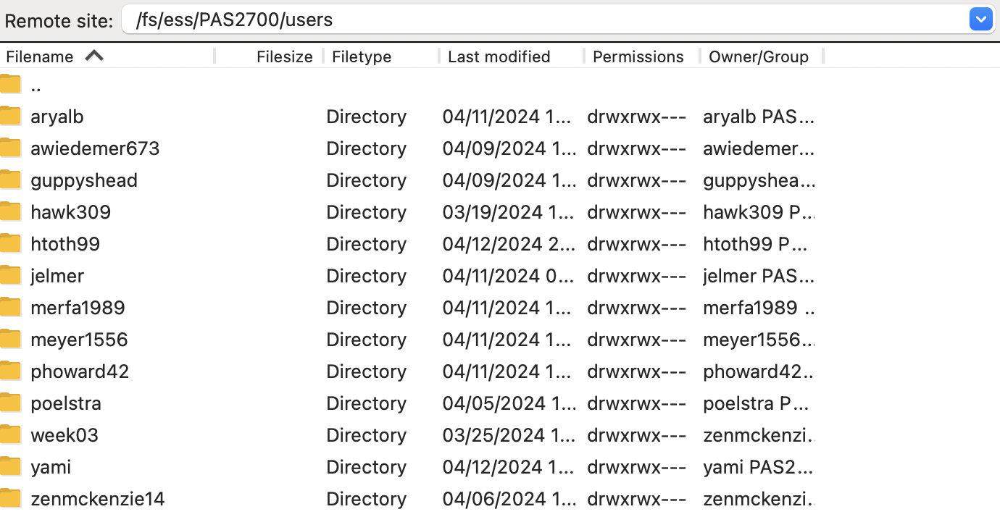

----------------------------------------------------------------------------------------------------

<br>

:::callout-caution
#### THIS PAGE IS STILL UNDER CONSTRUCTION
:::

<br>

## Before we get started

### Learning goals

<hr style="height:1pt; visibility:hidden;" />

## Introduction

### Managing your data and results

Your raw FASTQ data is extremely invaluable as it contains the result
of your experiment and was produced by an expensive sequencing process.
Even after you've produced "clean versions" of these files after quality and adapter
trimming, or after you have generated your final gene count tables,
you'll always want to keep these files around.
For example,
these are the foremost files you need to **make publicly available** 
when you publish your results
(they are typically deposited at the **[NCBI's SRA](https://www.ncbi.nlm.nih.gov/sra)**),
they ensure that your results can be reproduced by yourself and others,
and they allow for a modified re-analysis of the data after e.g. new methods or
relevant data become available.

You should therefore keep at least one copy of your FASTQ files in a Project dir
(as opposed to a Scratch dir) at OSC &mdash;
recall that these dirs are being backed up daily by OSC!
You'll also want to keep at least one copy of the data outside of OSC.

- Keeping back-ups of raw data
- Project versus scratch dirs (and avoid your Home dir for research projects)

### Sharing your data, results, and code

- Raw sequences to NCBI (SRA)
- Some results can also go to NCBI, e.g. genome assemblies and annotations, GEO
- Other results to e.g. Dryad / Zenodo
- Scripts via GitHub

### Data Management Plans (DMPs)

> By the end of 2025, all federally-funded research must make articles and data publicly available immediately upon journal publication with no waiting periods allowed. Data management plans are required before getting funding and sharing costs must be included in budgets.

-- Email from OSU Erik on 2025-09-19

>  A DMP is currently required for all competitive grant programs of the United States Department of Agriculture and the National Science Foundation.

-- Grunwald et al. 2024 (<https://apsjournals-apsnet-org.proxy.lib.ohio-state.edu/doi/full/10.1094/PHYTO-12-23-0483-IA>)

<https://www.nifa.usda.gov/grants/lifecycle/pre-award/data-management-plans>

<https://www.nsf.gov/funding/data-management-plan>

<br>

::: {.callout-tip collapse="true"}
#### Use the `du` command to see the total size of a dir _(Click to expand)_

Given that the `ls` size output is not informative for dirs,
how can you find out the total size of a dir and all its contents?
Use the `du` (**d**isk **u**sage) command -- for example:

- Get the total size for a single dir:

  ```bash
  # -h: human-readable file sizes / -s: specify a dir
  du -hs fastq/
  ```
  ```bash-out
  941M    fastq/
  ```

- Get the total size for all top-level dirs as well as the current working dir:

  ```bash
  # -d 1: summarize sizes at a depth of 1 (= top-level dirs below current)
  du -h -d 1
  ```
  ```bash-out
  1.0K    ./meta
  5.1M    ./ref
  941M    ./fastq
  946M    ./.git
  1.9G    .
  ```
:::

## File transfer to and from OSC

### Should I keep my OSC and local directories synced and how?

Unfortunately, you can't just keep files synced fully automatically like with Dropbox
or OneDrive --- and you may not want to either because of the amount of data on OSC.
Instead:

- You could keep a selection of files (especially code) synced via GitHub.
- You could periodically sync all or a selection of files with data transfer
  methods that we'll discuss in week 5.
- If you do _all_ data analysis at OSC,
  you could keep separate sets of files at either location,
  with your laptop only storing, for example, the manuscript and related files.

### Overview of options

In week 1, you learned that you can upload and download files from OSC
in the OnDemand Files menu.
However, that method is only suitable for relatively small transfers.
Here is a table with methods to transfer files between your computer and OSC:

| Method                            | Transfer size         | CLI or GUI        | Ease of use   | Flexibility/options   |
|-----------------------------------|-----------------------|-------------------|---------------|-----------------------|
| **OnDemand Files menu**           | smaller (<1GB)        | GUI               | Easy          | Limited               |
| **Remote transfer commands**      | smaller (<1GB)        | CLI               | Moderate      | Extensive             |
| **SFTP**                          | larger (>1GB)         | Either            | Moderate      | Extensive             |
| **Globus**                        | larger (>1GB)         | GUI               | Moderate      | Extensive             |

: {.striped .hover}

<hr style="height:1pt; visibility:hidden;" />

### In practice: FileZilla, a GUI-based SFTP client

Here, we'll go over what is probably overall the most convenient and versatile
way to transfer files to and from OSC,
since it works for transfers of any size, and is easy and quick:
**file transfer with a GUI-based SFTP client**.
There are a number of such programs, but I chose to show you **FileZilla** because
it works on all operating systems^[
And has a more intuitive user interface than CyberDuck,
another very commonly used program that works both on Mac and Windows.].

- Go to the [FileZilla download page](https://filezilla-project.org/download.php?type=client) ---
  it should automatically display a big green download button for your operating system:
  click that and install and open the program.
  
- To connect to OSC, find the Site Manager:
  click `File` in the top menu bar and then `Site Manager`^[
  There is a also an icon in the far top-left to access this menu.
  Additionally, there is a "Quickconnect" bar but I've not managed to connect to
  OSC with that.].
  In the Site Manager:
  - Protocol: select "SFTP - SSH File Transfer Protocol".
  - Host: type `sftp.osc.edu` (and you can leave the Port box empty).
  - Logon Type: Make sure "Normal" is selected.
  - User: Type you OSC user name.
  - Password: Type or copy your OSC password.
  - Click the "Connect" button at the bottom to connect to OSC.

{fig-align="center" width="60%" fig-alt="A screenshot of the connection setup dialog box on FileZilla" .lightbox}

- Once connected, your main screen is split with a local file explorer
  on the left, and a remote file explorer on the right:
  
{fig-align="center" width="90%" fig-alt="A screenshot of the split screen view showing local and remote on FileZilla" .lightbox}

- Transferring dirs and files in either direction is as simple as dragging and
  dropping them to the other side!
  
- Your default location at OSC is your home dir in `/users/`, but you can type
  a path in the top bar to e.g. go to `/fs/ess/PAS2880/users`:
  
{fig-align="center" width="70%" fig-alt="A screenshot of FileZilla showing how to change the remote dir." .lightbox}

<br>

## Downloading files at the command line

When you need to get large files from public repositories like NCBI
(e.g. reference genome files, raw reads from the SRA),
I would recommend not to download these to your own computer and then transfer
them to OSC, but to download them directly to OSC using commands.

### `wget`

You can download files from any URL that will allow you using the `wget` command.
It has many options, but basic usage is quite simple:

```bash
# This will download the file at the URL to your current working dir
wget <URL>
```

As an example, say that we want to download the reference genome FASTA and GTF
files for _Culex pipiens_, the focal species of the Garrigos et al. RNA-seq data
set that we've been working with.
The files for that genome can be found at this
[NCBI FTP webpage](https://ftp.ncbi.nlm.nih.gov/genomes/all/GCA/016/801/865/GCA_016801865.2_TS_CPP_V2/).

You can right-click on any of the files and then click "Copy Link Address"
(or something similar, depending on your browser) ---
let's copy the URL to the assembly FASTA (`.fna.gz`) file.
Then type `wget` and <kbd>Space</kbd> in your terminal and paste the URL:

```bash
wget https://ftp.ncbi.nlm.nih.gov/genomes/all/GCA/016/801/865/GCA_016801865.2_TS_CPP_V2/GCA_016801865.2_TS_CPP_V2_genomic.fna.gz
```
```bash-out
--2025-04-13 13:33:16--  https://ftp.ncbi.nlm.nih.gov/genomes/all/GCA/016/801/865/GCA_016801865.2_TS_CPP_V2/GCA_016801865.2_TS_CPP_V2_genomic.fna.gz
Resolving ftp.ncbi.nlm.nih.gov (ftp.ncbi.nlm.nih.gov)... 130.14.250.12, 130.14.250.11, 2607:f220:41e:250::12, ...
Connecting to ftp.ncbi.nlm.nih.gov (ftp.ncbi.nlm.nih.gov)|130.14.250.12|:443... connected.
HTTP request sent, awaiting response... 200 OK
Length: 172895917 (165M) [application/x-gzip]
Saving to: ‘GCA_016801865.2_TS_CPP_V2_genomic.fna.gz’

100%[=====================================================================================================================>] 172,895,917 51.7MB/s   in 3.2s   

2025-04-13 13:33:20 (51.7 MB/s) - ‘GCA_016801865.2_TS_CPP_V2_genomic.fna.gz’ saved [172895917/172895917]
```

Let's list our downloaded file:

```bash
ls -lh
```
```bash-out
-rw-r--r--  1 jelmer PAS0471 165M Aug  5  2022 GCA_016801865.2_TS_CPP_V2_genomic.fna.gz
```

<hr style="height:1pt; visibility:hidden;" />

::: callout-tip
#### Another commonly used downloading command is `curl`
`wget` and `curl` have similar functionality,
so you don't really need to learn to use both of them.
:::

<hr style="height:1pt; visibility:hidden;" />

### Other genomic downloads

- For reference genome downloads,
  NCBI also has a relatively new and very useful portal called **"datasets"**
  [that also includes a CLI tools of the same name](https://www.ncbi.nlm.nih.gov/datasets/docs/v2/reference-docs/command-line/datasets).
  This is especially useful if you want to download multiple or many genomes ---
  for example, you can download all available genomes of a certain (say, bacterial)
  genus with a single command.

- For downloads from the Sequence Read Archive (SRA),
  which contains high-throughput sequencing reads,
  you can use tools like [fasterq-dump](https://github.com/ncbi/sra-tools/wiki/HowTo:-fasterq-dump)
  and [dl-fastq](https://github.com/rpetit3/fastq-dl).
  Also handy is the simple [SRA explorer website](https://sra-explorer.info),
  where you can enter an NCBI accession number and it will give you download links.

<br>


## File compression

Let's start with downloading a file to play around with:

```bash
wget http://hgdownload.soe.ucsc.edu/goldenPath/hg19/chromosomes/chr22.fa.gz
```

### Decompress files

When you download data,
it is often compressed with `gzip` ("gzipped", `.gz` extension).

Many programs can work with gzipped files directly,
but sometimes you do need to unzip them, which can be done with `gunzip`:

```bash
# gunzip unzips in place - the original zipped file disappears:
gunzip chr21.fa.gz
ls chr21*
```
```{bash-out}
chr21.fa
```
```bash
# To keep the original, output to stdout with "-c" and redirect:
gunzip -c chr22.fa.gz > chr22.fa
ls chr22*
```
```{bash-out}
chr22.fa  chr22.fa.gz
```

### Compress files

Conversely, to zip files, use `gzip`:

```bash
gzip chr21.fa
ls chr21*
```
```{bash-out}
chr21.fa.gz
```

```bash
# As with unzipping, use -c and redirect to keep the original:
gzip -c chr22.fa > chr22_copy.fa.gz
ls chr22*
```
```{bash-out}
chr22_copy.fa.gz  chr22.fa  chr22.fa.gz
```

Often, a program will *output unzipped data to standard out*,
which we can immediately pipe to `gzip` so we only need to write the compressed
file to disk (beneficial because reading/writing to files is time-consuming):

```sh
trimmer in.fastq.gz | gzip > out.fastq.gz
```
  
*(Note that because the input to `gzip` comes from standard in, the output
will by default be to standard out!)*

### Working with compressed data directly

Several familiar shell commands have `z` counterparts that can work with
gzipped files directly, such as `zgrep` and `zcat`.

- `zgrep` is `grep` for gzipped files:

```bash
zgrep -i -n --color "AGATAGATATAT" chr22.fa.gz
```
```{bash-out}
589810:TATTGCAGGTAAGATGGGGCCACTCAGTACTTTAAAAAGATAGATATATA
596134:tctatctatatatagatagatatattgtagatatatctatctatatatat
966248:tatagatagatatataaaggggagtttattaagtattaactcacatgatc
```

- `zcat` is `cat` for gzipped files:

```bash
zcat chr22.fa.gz | head
```
```{bash-out}
>chr22
NNNNNNNNNNNNNNNNNNNNNNNNNNNNNNNNNNNNNNNNNNNNNNNNNN
NNNNNNNNNNNNNNNNNNNNNNNNNNNNNNNNNNNNNNNNNNNNNNNNNN
NNNNNNNNNNNNNNNNNNNNNNNNNNNNNNNNNNNNNNNNNNNNNNNNNN
```

::: {.callout-note collapse="true"}
#### Concatenating compressed data

Concatenating files means you combine them into a single file,
simply printing them back-to-back.
When it is okay to concatenate files^[
This does mean you'll lose information about the origin of the original files] 
this can be done very easily.

To add a second FASTQ file to an existing gzipped file,  
we can simply use `>>`:

```bash
ls
```
```{bash-out}
in.fastq.gz in2.fastq
```
```bash
gzip -c in2.fastq >> in.fastq.gz
```

Even more conveniently, if we have two gzipped FASTQ file for the same sample
but from different Illumina lanes:
  
```bash
cat smpA_L001_R1.fastq.gz smpA_L002_R1.fastq.gz > smpA_R1.fastq.gz
```
:::

#### `tar`

TBA


<br>

## File permissions

File "permissions" are the types of things (e.g. reading, writing) that different
groups of users (creator, group, anyone else) are permitted to do with files and dirs.
There are a couple of reasons you may occasionally need to view and modify file permissions:

- You may want to make your data read-only to prevent accidental modification or deletion
- You may need to share files with other users at OSC

Here is an overview of the different file permissions:

- **Read permissions** allow you to read and copy files/dirs
- **Write permissions** allow you to move, rename, modify, overwrite, or delete
- _Execute permissions_ allow you to directly execute a file
  (e.g. running a program, or a script as a command).

These permissions can be most easily set for three different groups of people:

- **Owner (or "user")** ---
  By default, this the person that created the file or dir.
  After you have copied or downloaded some FASTQ files, for example,
  you are the owner of these copies.
- **Group** ---
  When you create a file in the PAS2880 project dir,
  its "group" will include all members of the OSC project PAS2880.
- **Other** ---
  In the example above,
  anyone with access to OSC that is not a member of PAS2880.
  
<hr style="height:1pt; visibility:hidden;" />

#### Viewing file permissions

To show file permissions,
use **`ls`**  with the **`-l`** (*long* format) option that we've seen before.
The command below also uses the **`-a`** option to show all files,
including hidden ones (and **`-h`** to show file sizes in human-readable format):

{fig-align="center" width="80%" fig-alt="A screenshot of the long-format ls output that includes info about file permissions." .lightbox}

Here is an overview of the file permission notation in `ls -l` output:

{fig-align="center" width="40%" fig-alt="A diagram showing the different file permissions that can be set." .lightbox}

In the two lines above:

- **`rwxrwxr-x` means:**\
  read + write + execute permissions for both the owner (first `rwx`)
  and the group (second `rwx`), and read + execute **but not** write permissions
  for others (`r-x` at the end).

- **`rw-rw-r--` means:**\
  read + write _but not_ execute permissions for both the owner (first `rw-`)
  and the group (second `rw-`), and only read permissions for others (`r--` at the end).

Let's create a file to play around with file permissions:

```bash
# Create a test file
touch testfile.txt

# Check the default permissions
ls -l testfile.txt
```
```bash-out
-rw-rw----+ 1 jelmer PAS2880 0 Mar  7 13:36 testfile.txt
```

<hr style="height:1pt; visibility:hidden;" />

#### Changing file permissions

This can be done in two different ways with the `chmod` command.
Here, we'll focus on the method with `=` (set permission to),
`+` (add permission), and `-` (remove permission).
For example:

- To add read (`r`) permissions for all (`a`):

  ```bash
  # chmod <who>+<permission-to-add>:
  chmod a+r testfile.txt
  
  ls -l testfile.txt
  ```
  ```bash-out
  -rw-rw-r--+ 1 jelmer PAS0471 0 Mar  7 13:40 testfile.txt
  ```

- To set read + write + execute (`rwx`) permissions for all (`a`):

  ```bash
  # chmod <who>=<permission-to-set>`:
  chmod a=rwx testfile.txt
  
  ls -l testfile.txt
  ```
  ```bash-out
  -rwxrwxrwx+ 1 jelmer PAS2880 0 Mar  7 13:36 testfile.txt
  ```

- To remove write (`w`) permissions for others (`o`):

  ```bash
  # chmod <who>-<permission-to-remove>:
  chmod o-w testfile.txt
  
  ls -l testfile.txt
  ```
  ```bash-out
  -rwxrwxr-x+ 1 jelmer PAS2880 0 Mar  7 13:36 testfile.txt
  ```

::: {.callout-note collapse="true"}
#### An alternative method: changing file permissions with numbers _(Click to expand)_

You can also use a series of 3 numbers (for user, group, and others) to set permissions,
where each number can take on the following values:

| Nr | Permission     | Nr | Permission |
|----|----------------|----|----------------|
| 1  | x              | 5  | r + x          |
| 2  | w              | 6  | r + w          |
| 4  | r              | 7  | r + w + x      |

: {.striped .hover}

For example, to set read + write + execute permissions for all:

```bash
chmod 777 testfile.txt
```

To set read + write + execute permissions for yourself, and only read permission
for the group and others:

```bash
chmod 744 file.txt
```
:::

<hr style="height:1pt; visibility:hidden;" />

#### Making your data read-only

So, if you want to make your raw data (here: the files in the `data/fastq` dir)
read-only, you can use:

- Set only read permissions for everyone:

  ```bash
  chmod a=r data/fastq/*
  ```

- Take away write permissions for yourself (no-one else should have it by default):

  ```bash
  chmod u-w data/fastq/*
  ```

After running one or both of the above commands, let's check the permissions:
  
```sh
ls -l data/fastq
```
```bash-out
total 0
-r--r--r--+ 1 jelmer PAS0471 0 Mar  7 13:41 sample001_R1.fastq
-r--r--r--+ 1 jelmer PAS0471 0 Mar  7 13:41 sample001_R2.fastq
-r--r--r--+ 1 jelmer PAS0471 0 Mar  7 13:41 sample002_R1.fastq
-r--r--r--+ 1 jelmer PAS0471 0 Mar  7 13:41 sample002_R2.fastq
# [...output truncated...]
```

What happens when we try to remove write-protected files?

```sh
rm data/fastq/*fastq
```
```bash-out
rm: remove write-protected regular empty file ‘data/fastq/sample001_R1.fastq’?
```

You'll be prompted for every file!
If you answer `y` (yes), you can still remove them.
(But note that people other than the file's owners cannot override file permissions;
only if they are system administrators.)

<hr style="height:1pt; visibility:hidden;" />

::: callout-warning
#### Read/execute permissions for directories

One tricky and confusing aspect of file permissions is that
_to list a directory's content, you need execute permissions for the dir!_
This is something to take into account when you want to grant others
access to your project e.g. at OSC.

To set execute permissions for everyone but *only for dirs* throughout a dir hierarchy,
use an `X` (**uppercase x**):

```sh
chmod -R a+X my-dir
```
:::

<br>

## Using symbolic links

For example to use files across projects - recall week 2 - TBA

#### Single files

A symbolic (or soft) links only links to the *path* of the original file,
whereas a hard link directly links to the *contents* of the original file.
Note that modifying a file via either a hard or soft link *will* modify the original file.

Create a *symlink* to a file using `ln -s <source-file> [<link-name>]`:
  
```sh
# Only provide source => create link of the same name in the wd:
ln -s /fs/ess/PAS2880/share/garrigos/data/fastq/ERR10802863_R1.fastq.gz
  
# The link can also be given an arbitrary name/path:
ln -s /fs/ess/PAS2880/share/garrigos/data/fastq/ERR10802863_R1.fastq.gz shared-fastq.fastq.gz
```

::: callout-note
#### Use an absolute path to refer to the source file when creating links
At least at OSC, you have to **use an absolute path for the source file(s)**,
or the link will not work.
The `$PWD` environment variable, which contains your current working directory
can come in handy to do so:

```sh
# (Fictional example, don't run this)
ln -s $PWD/shared-scripts/align.sh project1/scripts/
```
:::

<hr style="height:1pt; visibility:hidden;" />

#### Multiple files

Link to multiple files in a directory at once:
  
```sh
# (Fictional example, don't run this)
ln -s $PWD/shared_scripts/* project1/scripts/ 
```

Link to a directory:
  
```sh
# (Fictional example, don't run this)
ln -s $PWD/shared_scripts/ project1/scripts/
ln -s $PWD/shared_scripts/ project1/scripts/ln-shared-scripts
```

::: callout-warning
#### Be careful not to remove source files!

Be careful when linking to *directories*:
you are creating a **point of entry to the original dir**.
Therefore, even if you enter via the symlink, you are interacting with the original files.

This means that a command like the following would remove the original directory!

```bash
rm -r symlink-to-dir
```
    
Instead, use `rm symlink-to-dir` (the link itself is a file, not a dir, so you don't need `-r`!)
or `unlink symlink-to-dir` to only remove the link.
:::

::: exercise
####  Exercise: Creating symbolic links

- Create a symbolic link in your `$HOME` dir that points to your personal dir in
  the project dir (`/fs/ess/PAS2880/users/$USER`).
  
  If you don't provide a name for the link, it will be your username (why?),
  which is not particularly informative about its destination.
  Therefore, give it a name that makes sense to you, like `PLNTPTH6193-SP24` or `pracs-sp24`. 

<details><summary>Click for the solution</summary>

```sh
ln -s /fs/ess/PAS1855/users/$USER ~/PLNTPTH6193-SP24
```

</details>

- What would happen if you do `rm -rf ~/PLNTPTH8300-SP21`? Don't try this.

<details><summary>Click for the solution</summary>

The content of the original dir will be removed.

</details>
:::

<br>

## Check file integrity with checksums

When you receive your FASTQ files from a sequencing facility,
a small text file will usually accompany your FASTQ files,
and will have a name along the lines of
`md5.txt`, `md5checksums.txt`, or `shasums.txt`.

Such a file contains so-called **checksums**,
a sort of digital fingerprints for your FASTQ files,
which can be used to **check whether your copy of these files is completely intact**.
Checksums are extremely compact summaries of files,
computed so that even if just one character is changed in the data,
the checksum will be different.

For example, in the dir with the original FASTQ files for our focal project,
the following `md5.txt` file is present:

```bash
ls -lh /fs/ess/PAS0471/jelmer/assist/2023-08_hy/data/fastq | head -n 6
```
```{.bash-out}
total 48G
-rw-r--r-- 1 jelmer PAS0471 3.4K Aug  9 16:33 md5.txt
-rw-r--r-- 1 jelmer PAS0471 1.2G Aug  9 16:33 X10784_Cruz-MonserrateZ_ASPC1_vec_V1N_1_S25_R1_001.fastq.gz
-rw-r--r-- 1 jelmer PAS0471 1.2G Aug  9 16:33 X10784_Cruz-MonserrateZ_ASPC1_vec_V1N_1_S25_R2_001.fastq.gz
-rw-r--r-- 1 jelmer PAS0471 1.3G Aug  9 16:33 X10785_Cruz-MonserrateZ_ASPC1_RASD1_V1N_1_S26_R1_001.fastq.gz
-rw-r--r-- 1 jelmer PAS0471 1.4G Aug  9 16:33 X10785_Cruz-MonserrateZ_ASPC1_RASD1_V1N_1_S26_R2_001.fastq.gz
```

::: {.callout-note}
#### More on checksums
Several algorithms and their associated shell commands can compute checksums.
Like in our case, you'll most often see _md5_ checksums accompany
genomic data files,
which can be computed and checked with the `md5sum` command
(the newer _SHA-1_ checksums can be computer and checked with the very
similar `shasum` command).

Checksums consist of _hexadecimal_ characters only: numbers and the letters a-f.

We typically compute or check checksums for one or more _files_,
but we can even do it for a _string of text_ &mdash;
the example below demonstrates that the slightest change in a string
(or file alike) will generate a completely different checksum:

```bash
echo "bioinformatics is fun" | md5sum
```
```{.bash-out}
010b5ebf7e207330de0e3fb0ff17a85a  -
```
```bash
echo "bioinformatic is fun" | md5sum
```
```{.bash-out}
45cc2b76c02b973494954fd664fc0456  -
```
:::

Let's take a look at our checksums &mdash;
the file has one row per file and two columns,
the first with the checksum and the second with the corresponding file name: 

```bash
head -n 4 /fs/ess/PAS0471/jelmer/assist/2023-08_hy/data/fastq/md5.txt
```
```{.bash-out}
54224841f172e016245843d4a8dbd9fd        X10790_Cruz-MonserrateZ_Panc1_vec_V1N_1_S31_R2_001.fastq.gz
cf22012ae8c223a309cff4b6182c7d62        X10790_Cruz-MonserrateZ_Panc1_vec_V1N_1_S31_R1_001.fastq.gz
647a4a15c0d55e56dd347cf295723f22        X10797_Cruz-MonserrateZ_Miapaca2_RASD1_V1N_1_S38_R2_001.fastq.gz
ce5d444f8f9d87d325dbe9bc09ef0470        X10797_Cruz-MonserrateZ_Miapaca2_RASD1_V1N_1_S38_R1_001.fastq.gz
```

This file was created by the folks at the sequencing facility,
and now that we have the data at OSC and are ready to analyze it,
we can check if they are still fully intact
and didn't &ndash;for example&ndash; get incompletely transferred.

I have done this check for the original files,
but this takes a little while, and for a quick exercise,
we can now do so with our subsampled FASTQ files.
First, let's copy a file `md5.txt` from the `demo` directory,
which has the checksums for the subsampled FASTQ files as I created them:

```bash
cp /fs/ess/PAS0471/demo/202307_rnaseq/data/fastq/md5sums.txt data/fastq/
```

To check whether the checksums for one or more files in a file correspond to
those for the files,
we can run `mdsum -c <mdsum-file>`,
and should do so _while inside the dir with the files of interest_[^7].
For example:

[^7]: This technically depends on how the file names are shown in the text file
      with the checksums:
      if there are just file names without directories (or `./<filename>`, etc.),
      you'll have to be in the dir with the files to run `md5sum -c`.
      (This in turn depends on from where the checksums were _generated_:
      if you generate them while in the dir with the focal files,
      which is the only sensible way to do this, that's how they will be displayed.)

```bash
cd data/fastq
md5sum -c md5sums.txt 
```
```{.bash-out}
ASPC1_A178V_R1.fastq.gz: OK
ASPC1_A178V_R2.fastq.gz: OK
ASPC1_G31V_R1.fastq.gz: OK
ASPC1_G31V_R2.fastq.gz: OK
Miapaca2_A178V_R1.fastq.gz: OK
Miapaca2_A178V_R2.fastq.gz: OK
Miapaca2_G31V_R1.fastq.gz: OK
Miapaca2_G31V_R2.fastq.gz: OK
```

If there were any differences,
the `md5sum` command would clearly warn you about them,
as you can see in the exercise below.

::: {.callout-note collapse="true"}
#### Making the checksum check fail (Click to expand)

Let's compute a checksum for the `README.md` file and save it in a file:

```bash
# Assuming you went into data/fastq above;
# you need to be in /fs/ess/PAS0471/$USER/rnaseq-intro
cd ../..

md5sum README.md > md5sum_for_README.txt

cat md5sum_for_README.txt
```
```{.bash-out}
d4c4a8df4870f68808553ac0f5484aa3  README.md
```

Now, let's add a line to our `README.md` that says where the reference genome
files are:

```bash
# (You'll need single quotes like below, or the shell will interpret the backticks)
echo 'Files for the GRCh38.p14 human genome are in the `data/ref` dir' >> README.md

tail -n 3 README.md
```
```{.bash-out}
and columns specifying the read direction, sample ID, cell line, and variant.

Files for the GRCh38.p14 human genome are in the `data/ref` dir
```

Finally, let's check the checksum, and watch it fail:

```bash
md5sum -c md5sum_for_README.txt
```
```{.bash-out}
README.md: FAILED
md5sum: WARNING: 1 computed checksum did NOT match
```
:::

::: {.callout-note collapse="true"}
#### Checking the checksums for the downloaded FASTA and GTF (Click to expand)

The [NCBI FTP directory for the human genome](https://ftp.ncbi.nlm.nih.gov/genomes/all/GCF/000/001/405/GCF_000001405.40_GRCh38.p14/)
also contains a file with checksums, `md5checksums.txt`.

Let's download it &mdash;
we'll use the `-P` option to tell `wget` to put it directly in the `data/ref` dir:

```bash
wget -P data/ref https://ftp.ncbi.nlm.nih.gov/genomes/all/GCF/000/001/405/GCF_000001405.40_GRCh38.p14/md5checksums.txt
```

It's a little harder to check the file integrity in these cases because we
only have two out of the several dozen files listed in this `md5checksums.txt`
file (namely, all those in the FTP dir),
and to make matters worse, we renamed them.

```bash
cd data/ref

grep "GCF_000001405.40_GRCh38.p14_genomic.gtf.gz" md5checksums.txt
```
```{.bash-out}
f573144e507a9fd85150cf6a3c8f8471  ./GCF_000001405.40_GRCh38.p14_genomic.gtf.gz
```
```bash
grep "GCF_000001405.40_GRCh38.p14_genomic.fna.gz" md5checksums.txt
```
```{.bash-out}
c30471567037b2b2389d43c908c653e1  ./GCF_000001405.40_GRCh38.p14_genomic.fna.gz
```

```bash
md5sum GCF*
```
```{.bash-out}
689762f267eafe361b6ee4b21638eb51  GCF_000001405.40_GRCh38.p14_genomic.fna
a5274984906df2cc65319dfc1b307a01  GCF_000001405.40_GRCh38.p14_genomic.gtf
```

:::
