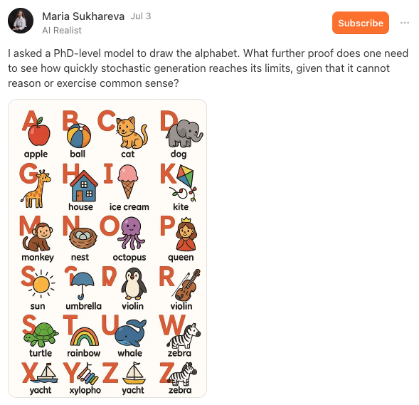
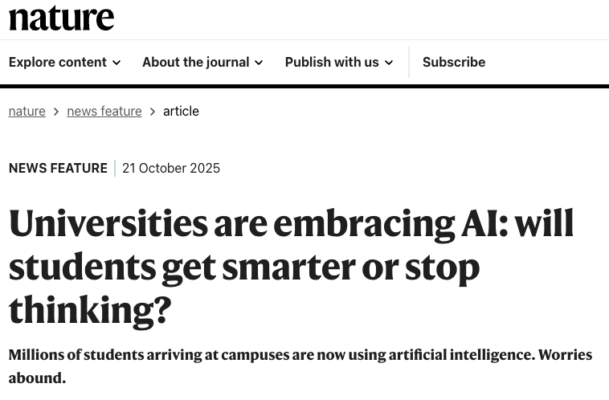
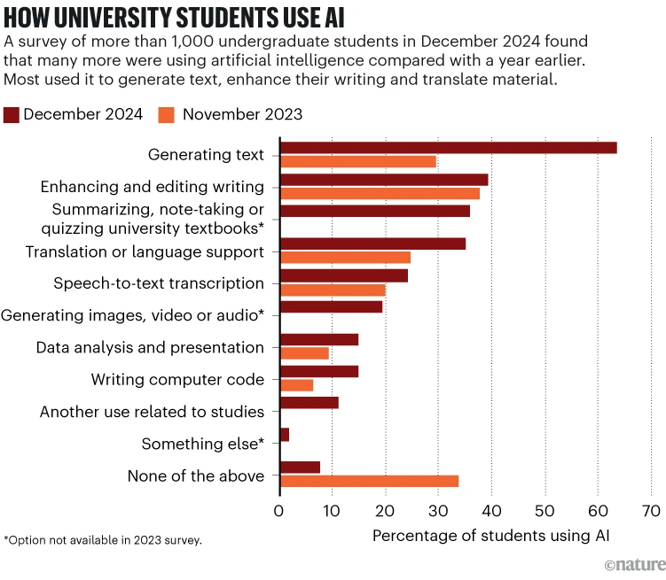
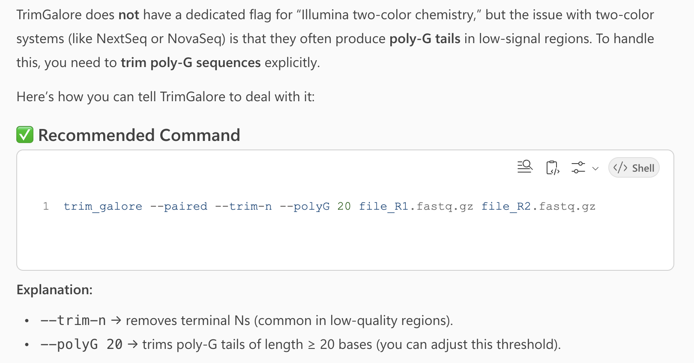
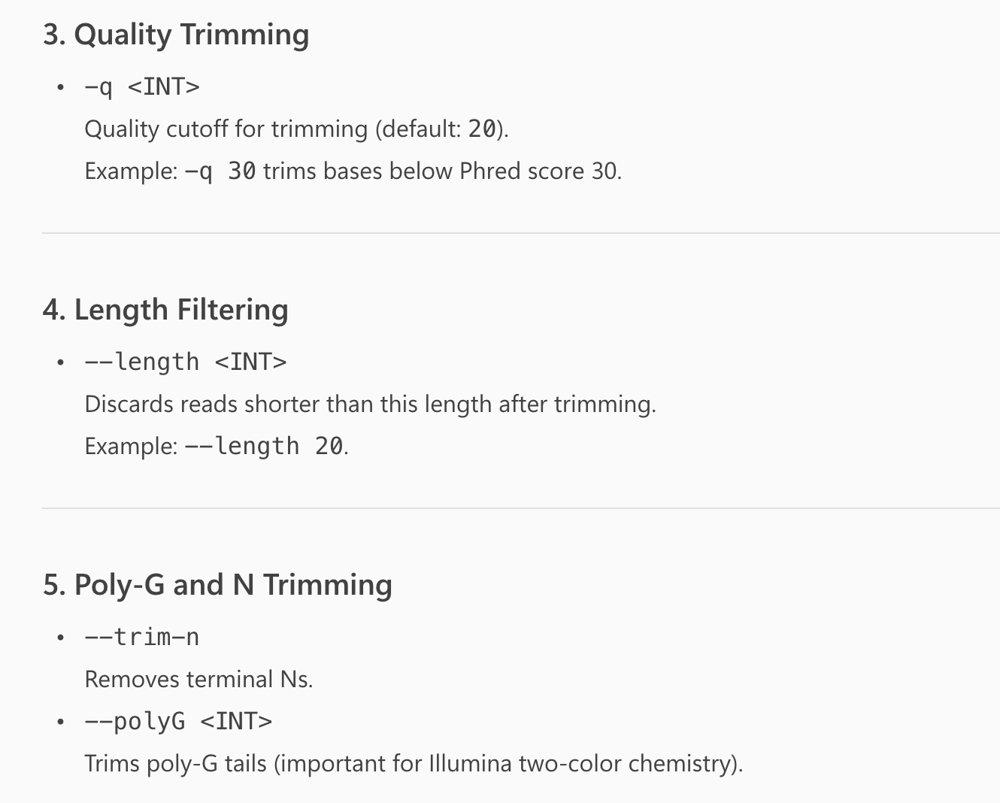
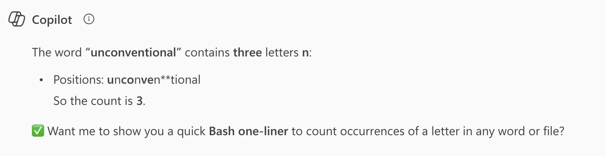
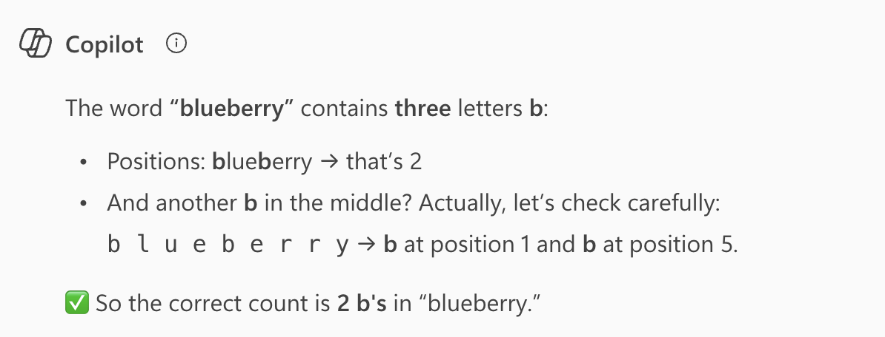

------------------------------------------------------------------------

 

## Introduction

### Learning goals

This week, you will learn about using generative AI (genAI) tools
to help you with tasks in omics data analysis, especially coding talks.

In this lecture, you wil learn:

- Basic background of generative AI (genAI) and large language models (LLMs)
- What GenAI applications exist in bioinformatics and omics data analysis
- About Ohio State's genAI adoption and approved tools
- What options you have for using genAI tools, including for coding
- Example prompts and outputs relevant to this course
- Tips and pitfalls when using genAI tools, especially for coding

And in this week's second lecture, you will learn how to:

- Use your local VS Code installation at OSC
- Enable and configure GitHub Copilot within VS Code
- Use GitHub Copilot within VS Code to help you with coding tasks

## Generative AI background

### AI in bioinformatics and biology

While conventional machine learning (ML) approaches have been used for decades
in bioinformatics and biology more broadly,
two kinds of more sophisticated AI have been developed and applied more recently:

1. **Deep learning / Neural nets** have become commonly used in the past decade, e.g.:
   - DeepMind's AlphaFold -- 3D protein structure prediction from sequence
   - DeepVariant -- variant calling from sequencing data

   ::: {.callout-tip appearance="simple"}
   These approaches also have numerous applications outside of bioinformatics.
   Many are related to classification problems and useful with images,
   such as microscopy or histology images.
   An example in plant pathology -- @zhang2022:
   _Assessing the efficacy of machine learning techniques to characterize soybean defoliation from unmanned aerial vehicles_
   :::

2. **Generative AI** -- which we'll focus on here!

### Generative AI

Generative AI refers to a class of artificial intelligence models designed to
create new content, such as text, images, or code.
These models have become extremely prominent since ChatGPT’s launch in 2022.
The "G" in ChatGPT stands for "generative".

**Large Language Models (LLMs)** are a subset of generative AI that try to understand
and can generate human language.
They are trained on vast amounts of text data and can perform a variety of
language-related tasks, including code writing.

The "P" in ChatGPT stands for "**pre-trained**",
meaning the model only knows about the data that it was trained on.
However, some genAI models are also able to search the web, like openAI's Deep Research.
The usage of information outside of the training data is called
"_Retrieval Augmented Generation_" (RAG),
which also includes simpler cases where you upload a file and ask questions about it.

> In simple terms, LLMs such as ChatGPT aim to predict the next part of a word or
> phrase based on a user-provided text prompt.
>
> --- @cooper2024: _Harnessing large language models for coding, teaching and inclusion to empower research in ecology and evolution_

**However**, it's important to realize that LLMs don't just go word-by-word:
those kinds of purely "sequential" models have been around for a longer time,
such as in Google when you type in your search phrase.
LLMs on the other hand use more complex architectures, such as **"transformers"**,
which allow them to consider the broader context of the input text
(the T in ChatGPT stands for "transformer").

::: callout-tip
### Want to learn a bit more background about genAI?

- [Large language models explained briefly (8 minute video)](https://www.youtube.com/watch?v=LPZh9BOjkQs)
- ["Learn to use AI" page by Ohio State University](https://ai.osu.edu/faculty-staff-students/learn-use-ai)
- [Overview of some free brief courses on AI by Google](https://blog.stephenturner.us/p/free-ai-courses-google)
:::

### PhD-level intelligence?

The latest models that have come out this year have been claimed to have 
"PhD-level intelligence".
However, even though these models are incredibly powerful and useful,
something to keep in mind when using them
(see also [Tips and pitfalls](#tips-and-pitfalls) below)
is that they can still fail spectacularly even on some "kindergarten-level" tasks:

{fig-align="center" width="75%" fig-alt="An AI-generated image illustrating the alphabet" .lightbox}

## Ohio State genAI adoption

Ohio State University is one of several universities that have gone all-in on
generative AI adoption in education.

> Ohio State is leading a bold, groundbreaking initiative to integrate artificial intelligence into the undergraduate educational experience. The initiative will ensure that every Ohio State student, beginning with the class of 2029, will graduate being AI fluent — fluent in their field of study, and fluent in the application of AI in that field.
>
> --- <https://oaa.osu.edu/ai-fluency>

This includes mandatory courses for first-year undergraduates in the use of genAI.

 [_What have you noticed of this?_]{style="color:purple"}

----

Last week, an interesting
[News Feature about genAI adoption at universities](https://www.nature.com/articles/d41586-025-03340-w>)
(@pearson2025) was published in Nature:

{fig-align="center" width="70%" fig-alt="A screenshot of a Nature article" .lightbox}

Some quotes and a graph from this article:

> At Ohio State University in Columbus, students this year will take compulsory AI classes as part of an initiative to ensure that all of them are ‘AI fluent’ by the time they graduate. 

> But many education specialists are deeply concerned about the explosion of AI on campuses: they fear that AI tools are impeding learning because they’re so new that teachers and students are struggling to use them well. Faculty members also worry that students are using AI to short-cut their way through assignments and tests, and some research hints that offloading mental work in this way can stifle independent, critical thought.

{fig-align="center" width="90%" fig-alt="A screenshot of a Nature article" .lightbox}

::: callout-important
#### Note everyone agrees this is a good thing
These kinds of initiatives are not without controversy,
as the second quote above illustrates.
For a comprehensive critique, see the following paper that was also mentioned in the Nature article:
@guest2025: _Against the Uncritical Adoption of 'AI' Technologies in Academia_

 [_What do you think?_]{style="color:purple"}
:::

## Where to ask questions to genAI

### Browser-based chat with Ohio State approved genAI tools

Ohio State currently has two main approved generative AI tools.
This is important to know and use for two reasons:

- You are able to use it e.g. with more advanced models without usage limits
- You are complying with Ohio State's data privacy and security policies.
  When you are logged using your OSU account, the data you provide to the AI
  tools is handled according to Ohio State's policies.
  Therefore, you are to provide it with research data that you otherwise
  would not be allowed to share with third-party services.

These two tools are:

- **Microsoft Copilot**
- **Google Gemini** (since August 2025)

 [_Do you use these or do you prefer ChatGPT or something else?_]{style="color:purple"}

### Inside IDEs

However, for coding tasks, it is often more convenient to use genAI
directly inside your IDE, such as VS Code or RStudio.
Within IDEs, there can be two main modes of interaction,
as we'll see in the next lecture:

- In-IDE chat
- In-line suggestions in the editor

Benefits of IDE-based assistance:

- Automatic context awareness of your files
- Less need to copy-paste code snippets as you can "accept" suggestions directly into
  your editor and/or terminal
- Easier to test and iterate

::: callout-tip
#### "Local" genAI models?

All the abovementioned options are cloud-based services that require an internet connection
and send each request to the AI service provider's servers.
Because these models aren't open source,
they can't be run "locally" on your own computer or on OSC.

However, open-source LLMs that you can run locally do exist,
such as DeepSeek (see @gibney2025) and Ollama,
but they are currently much less powerful than the big cloud-based models.
This may change in the future.
:::

## Applications in bioinformatics and omics data analysis

### Not coding

- Explain concepts and methods
- Searching for programs that can accomplish certain tasks
- Explain results/outputs that you got
-  [_Anything else?_]{style="color:purple"}

### Generating code

- We can ask it to write code for us when we don't know how to do something,
  as we'll practice with here

### Code-related

- Code explanation and documentation
- Debugging or optimising code
- Translating code between languages
- Explaining error messages
- Turning code into a piece of software or "package"
-  [_How have you been using genAI in this area?_]{style="color:purple"}

::: callout-tip
### More ideas and tips in this week's reading
@lubiana2023 -- _Ten quick tips for harnessing the power of ChatGPT in computational biology_
:::

::: {.callout-note collapse="true"}
#### Other relevant papers _(Click to expand)_

- @piccolo2023: [Many bioinformatics programming tasks can be automated with ChatGPT](https://arxiv.org/abs/2303.13528)
- @alam2025: [From Prompt to Pipeline: Large Language Models for Scientific Workflow Development in Bioinformatics](https://arxiv.org/abs/2507.20122)
- @awan2025: [Prompt-based bioinformatics: a new interface for multi-omics analysis](https://www.nature.com/articles/s41576-025-00889-0)
:::

## Initial examples with Microsoft Copilot

### Signing in

- Go to <https://m365.cloud.microsoft/chat> ^[
  You can also go to <https://copilot.microsoft.com> but the login process is a bit longer.]
- Click "Sign in" and sign in with your Ohio State account by using your
  Ohio State email address
- Click on the "Try GPT-5" button to switch from Quick Response mode to GPT-5 mode,
  which is more powerful and suitable for coding tasks

### Example prompts
  
> _"You're a quiz master who asks basic questions about the Unix shell._
>  _Make a fun game show and start asking questions!"_

> _"Explain the `grep` command by turning it into a song lyric (without using real copyrighted lyrics)._
>  _Make it fun and memorable."_

> _"Count the number of reads in a FASTQ file"_

> _"Write a Bash script that counts the number of lines in a FASTQ file"_

> _"How can I tell the program TrimGalore that my reads use Illumina two-color chemistry?"_

_Click to see the response I got_

This answer is incorrect, as it didn't find the option in question,
and instead **makes up** a `--polyG` option that doesn't exist:

{fig-align="center" width="80%" fig-alt="A screenshot of a ChatGPT response about TrimGalore" .lightbox}

  
> _"Explain the most important options to TrimGalore"_

_Click to see part of the response I got_

Overall, this was quite a useful summary of TrimGalore's many options,
focusing on the ones that are most relevant for typical use cases.
**But** it again listed the non-existant `--polyG` option:

{fig-align="center" width="65%" fig-alt="A screenshot of a ChatGPT response about TrimGalore" .lightbox}

> _"Explain how to write a `for` loop in the Unix shell and how it works"_

> _"What does the following command do?"_ `gunzip -v garrigos-data/ref/*`

> _"How many n's are in the word unconventional?"_ and
> _"How many b's are in the in blueberry?"_

_Click to see the responses I got_

Shockingly, this answer is wrong:

{fig-align="center" width="80%" fig-alt="A screenshot of a ChatGPT response about TrimGalore" .lightbox}

This answer is bizarre,
as it starts out with an incorrect answer and then sort of corrects itself:
      
{fig-align="center" width="65%" fig-alt="A screenshot of a ChatGPT response about TrimGalore" .lightbox}

  
### Example prompts with custom file uploads

- Upload a FastQC file and ask it to summarize the file
- Upload a Markdown document and ask it to convert it Word
- Upload a Word document and ask it to convert to Markdown

## Tips and pitfalls 

### Advice on writing effective prompts

Some general advice for writing effective prompts:

- Consider breaking bigger problems down into smaller ones
- Be specific and detailed, e.g. about formats and programs^[
  Though sometimes you may want to explore your options and be less specific.]

Especially for larger or more complex tasks,
you can get better results by including details on each of the following: 

1. Context -- Who you are (or "who the AI is supposed to be"),
   what you're working on, what the AI needs to know
2. Task -- What specifically you want the AI to do
3. Format -- How you want the output structured
4. Constraints -- Any limitations, requirements, or things to avoid
5. Examples -- Sample inputs/outputs

Here are some specific "prompt enhancer" phrases that can be quite useful:

- Additional explanation with:
  - _Explain with examples_
  - _Explain as if I'm a high school student_
- User clarification, which can make it less likely for the model to just make
  stuff up (see below), with:
  - _Ask me clarifying questions_
  - _Tell me when you’re unsure about something_
- Verification with:
  - _Show me the specific quotes from the papers that support each of these conclusions_

### Pitfalls

- **AI hallucinations** are a well-known problem and you've probably heard about
  models making things up like references that don't exist.
  This also happens in coding contexts, where it for example:
  - May come up with commands, options, functions or data columns that don't exist
  - It has example code _and_ its output -- but the code may not produce that
    output at all (keep in mind that the AI doesn't actually run the code)
  
- "**Jagged frontier**" is a term used to describe what we have also seen today:
  models being very good at some tasks but failing completely at others.
  This can make it hard to predict when the model will be useful.

- "**0-to-90% problem**" describes how generative AI can often get you most of the way
  to a solution, but not all the way.
  This means you still need to have the expertise to finish the task yourself.
  But also because it is much harder to finish the last 10% when you yourself
  haven't done the first 90%,
  this can be enormously challenging and sometimes undo any time savings.
  
 
