----------------------------------------------------------------------------------------------------

<br>

## Introduction

In this lecture, you will learn how to:

- Use your local VS Code installation at OSC
- Enable and configure GitHub Copilot within VS Code
- Use GitHub Copilot within VS Code to help you with coding tasks

We will use a local installation of VS Code rather than the familar VS Code Server
through OnDemand, because GitHub Copilot is not supported in the Server version.
It's also a good opportunity to get familiar with using your own VS Code installation
at OSC more generally -- while it required [some setup](../week09/w9_ua_ssh.qmd),
this is a more convenient way of using VS Code!

## Connecting VS Code to OSC

After doing [last week's ungraded assignment](../week09/w9_ua_ssh.html),
you should have a VS Code installation on your own computer and have it set up
to connect to OSC via "SSH-tunneling".
So, now:

1. Open your computer's VS Code installation

2. In the "Welcome" tab, you should already see your OSC host 
   (e.g. `<user>@pitzer.osc.edu`) and the appropriate folder (`/fs/ess/PAS2880/<user>`)
   under "Recent".
   
   - If so, just click it to connect!
     Open the terminal and check that you're in the correct dir.
   
   - If not: click "Connect to..." a little further up in the same tab
     (under "Start") and then select your OSC host.
     In that case, you will have to use the "Open Folder" functionality to
     move VS Code to your to your personal dir in the course's project dir
     (`/fs/ess/PAS2880/<user>`).

   <hr style="height:1pt; visibility:hidden;" />
   <details><summary>Click to see a screenshot of the relevant parts of the Welcome document</summary>
   <hr style="height:1pt; visibility:hidden;" />
   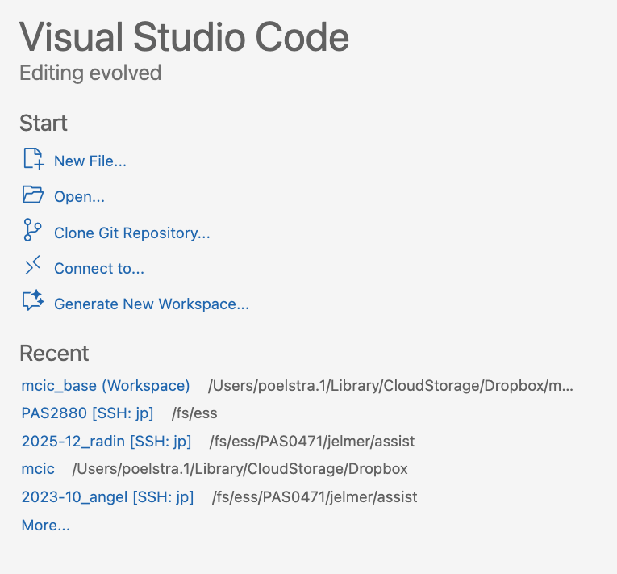{fig-align="center" width="60%" fig-alt="A screenshot of VS Code" .lightbox}
   </details>

   ::: {.callout-note collapse="true"}
   #### Or use the Command Palette to connect to OSC _(Click to expand)_
   1. Open the Command Palette
      via the bottom-left cog wheel or with the keyboard shortcut
      <kbd>Ctrl</kbd>+<kbd>Shift</kbd>+<kbd>P</kbd> (Windows) or
      <kbd>Cmd</kbd>+<kbd>Shift</kbd>+<kbd>P</kbd> (Mac)
      
   2. Type "Connect", click the `Remote-SSH: Connect to Host...` option that should appear,
      and select the OSC host you set up last week
   :::

As pointed out in last week's assignment, it is important to keep in mind that
unlike when using VS Code Server through OnDemand, you are now on a **login node**,
which you should keep in mind when wanting to interactively test-run programs,
for example. But on the bright side, you can now:

- Start a VS Code session at OSC much more quickly
- Easily have multiple windows open at the same time
- Use the most recent version of VS Code
- Use all extensions
- Reap the benefits of not operating within a browser tab
  (more screen space, no keyboard shortcut conflicts, etc.)

## Getting set up with IDE-integrated AI

### Overview

As pointed out in the last lecture, when you are using genAI to help you code,
it can be much more convenient to use it directly in your IDE (here, VS Code)
rather than in your browser in a completely separate environment.

**However, we are currently not able to make use of any of the**
**OSU-approved tools this way, unfortunately.**
This is true even though the method of choice within VS Code, GitHub Copilot,
is closely related to Microsoft Copilot^[
GitHub and VS Code are both Microsoft products.
Also, Google Gemini also has a VS Code extension with similar functionality,
but when I logged in with OSU credentials, I was informed that this is not available to us.
For more about Gemini, see the Appendix below.
].
This will hopefully change in the future!
But in the meantime, because of that:

- You must be aware of the data privacy implications of not using an OSU-approved tool,
  as outlined in the last lecture
- You only have a limited number of suggestions per month^[
  Currently 2,000 inline code completions and 50 chat requests.]
  with the free version unless you [pay $10 a month](https://docs.github.com/en/copilot/get-started/plans).

### Enabling GitHub Copilot in VS Code

1. Hover over the Copilot icon in the far bottom right and select "Set up Copilot":

_](../img/setup-copilot-status-bar.png){fig-align="center" width="80%" fig-alt="A screenshot of VS Code" .lightbox}

2. Click "Continue with GitHub", which will have you sign up for the Copilot Free plan^[
   For reference, if needed, here is a
   [direct link to your GitHub Copilot settings page](https://github.com/settings/copilot/features).]:

_](../img/setup-copilot-sign-in.png){fig-align="center" width="80%" fig-alt="A screenshot of VS Code" .lightbox}

3. Install the **GitHub Copilot VS Code extensions** if you weren't already
   prompted to do so.
   Open the Extensions sidebar, search for "Copilot" and then install:
   - "_GitHub Copilot_" (by GitHub)
   - "_GitHub Copilot Chat_" (by GitHub)

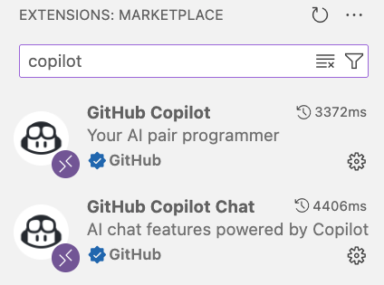{fig-align="center" width="40%" fig-alt="A screenshot of VS Code" .lightbox}

4. Click on the Copilot icon in the bottom right again,
   and make sure to check all boxes at the bottom, e.g.:
   
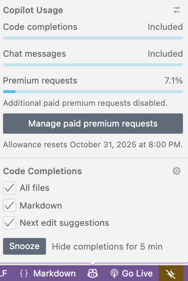{fig-align="center" width="35%" fig-alt="A screenshot of VS Code" .lightbox}   

## GitHub Copilot inline suggestions

Let's start by creating a dir for this week, navigating there, and creating
and opening a Markdown file:

```bash
# You should be in /fs/ess/PAS2880/$USER
mkdir week10
cd week10
touch copilot.md
```

In the editor, paste the following into the `copilot.md` document:

````markdown
```bash
# GTF file:
GTF=../garrigos-data/ref/GCF_016801865.2.gtf
```
````

When you go to a new line within the code block and wait a second,
you should see a suggestion "in ghost text" (light gray text) appear.
To accept the suggestion, press <kbd>Tab</kbd>.

But instead of letting GitHub Copilot go off on its own to randomly suggests
way to interrogate this file,
let's give it a prompt by typing a comment line first:

```bash
# Count the number of lines in the GTF file
```

Press <kbd>Enter</kbd> to go to a new line, and again wait for a second for the
suggestion to appear.
Accept it with <kbd>Tab</kbd> and run the code:
does it seem have given a correct suggestion?

### Example prompts for the GTF file

```bash
# Count the number of lines in the GTF file, excluding the header

# Count the number of gene features in the GTF file

# Print a count table of all feature types in the GTF file

# Count the number of genes on the + versus the - strand

# How many genes have a description?
```

::: callout-tip
#### Iterating questions and inline chat
When you are not happy with Copilot's suggestion,
you can delete the answer, modify your prompt line, and press <kbd>Enter</kbd> again.
However, if you want to explicitly request a change to the current suggestion,
you can also use the inline chat functionality by selecting the code and pressing
<kbd>⌘</kbd>+<kbd>I</kbd> (Mac) / <kbd>Ctrl</kbd>+<kbd>I</kbd> (Windows).

For example, I didn't get a good answer to the last prompt above:

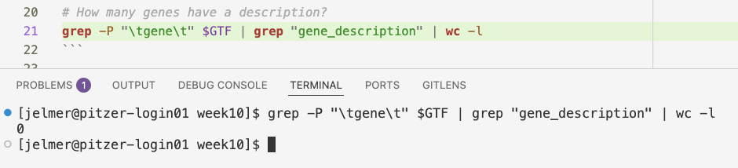{fig-align="center" width="80%" fig-alt="A screenshot showing how to hover over Copilot suggestions." .lightbox}

So I pressed the <kbd>⌘</kbd>+<kbd>I</kbd> and reported the failure:

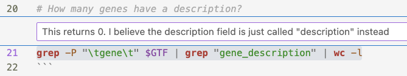{fig-align="center" width="80%" fig-alt="A screenshot showing how to hover over Copilot suggestions." .lightbox}

Copilot then came up with a fix, which I could accept:

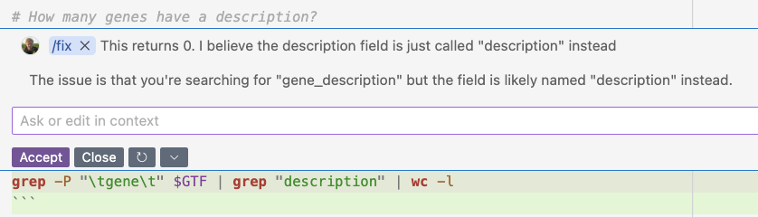{fig-align="center" width="80%" fig-alt="A screenshot showing how to hover over Copilot suggestions." .lightbox}

Running the modified line did give the correct answer:

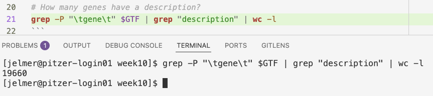{fig-align="center" width="80%" fig-alt="A screenshot showing how to hover over Copilot suggestions." .lightbox}
:::

::: callout-note
# More complicated bonus prompts
<hr style="height:1pt; visibility:hidden;" />
```bash
# What is the average length of a gene in this GTF file?

# What is the average number of exons per gene in this GTF file?

# List all unique gene biotypes in the GTF file
```
:::

### Other example prompts

Here are a few other example prompts you can try in the same way ---
these are more general Unix shell tasks that are currently likely just beyond
your abilities:

```bash
# List the top 5 largest files in the /fs/ess/PAS2880 directory and its subdirs

# Find all Markdown files in /fs/ess/PAS2880 and its subdirs

# Print a list of files that contain the word "cathemerium" in /fs/ess/PAS2880 and its subdirs
```

::: {.callout-tip appearance="simple"}
You can hover over suggestions to see alternative suggestions, if they are available --
see the top-right of this screenshot:

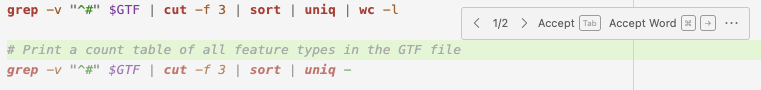{fig-align="center" width="90%" fig-alt="A screenshot showing how to hover over Copilot suggestions." .lightbox}
:::

::: exercise
####  Exercise: Ask other questions
Be creative and ask GitHub Copilot to help you with some Unix shell tasks!
:::

## GitHub Copilot Chat

### The chat sidebar and chat options

Open the chat sidebar using the keyboard shortcut
<kbd>Ctrl</kbd>+<kbd>⌘</kbd>+<kbd>I</kbd> (Max) /
<kbd>Ctrl</kbd>+<kbd>Alt</kbd>+<kbd>I</kbd> (Windows)
or by clicking the icon in the top bar, shown on the far left in this screenshot:

{fig-align="center" width="75%" fig-alt="A screenshot showing the icon to open the GitHub Copilot chat." .lightbox}

The chat sidebar should open on the right side of your VS Code window,
and look something like this:

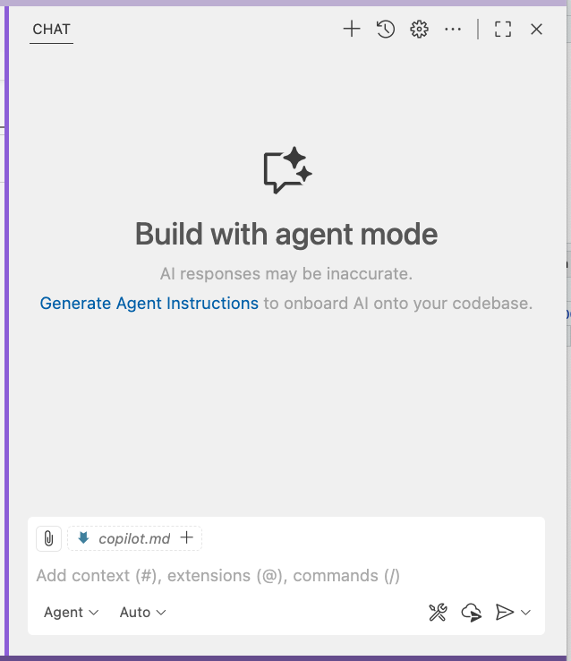{fig-align="center" width="65%" fig-alt="A screenshot showing the icon to open the GitHub Copilot chat." .lightbox}

#### File context

The chat automatically suggests to use the file you are currently viewing in
the editor as its main context,
which is why it says `copilot.md` at the top of the chat window above.
If you click the `+` button next to that, it will actually use this file as context.
Using the attachment icon next to that, you can also select other files
to use as context.

::: callout-tip
#### File/context tips
While you can select specific files as shown above,
Copilot may look for context in any files in the folder you have open,
especially the ones you have open in the editor.
Therefore, when asking questions,
consider opening relevant files and close irrelevant files.

Along similar lines, you can also select relevant code within a file.
:::

#### Modes and models

The two dropdown menus in the bottom-left corner of the chat window allow you to
select different:

- **Chat modes:**
  1. **Agent** -- this is the most advanced mode,
     in which Copilot can create files and run commands on your behalf
  2. **Ask** -- this is closer to the in-browser chat that you're used to,
     but with the added benefit of file context and easy code insertions
  3. **Edit** -- this mode focuses on editing existing code
     rather than creating new code from scratch.
     It's especially useful when you have multiple interconnected files that need
     to be changed in concert.

- **Models**, which in the free version are currently limited to:
  1. GPT-5 mini (by OpenAI)
  2. GPT-4.1 (by OpenAI)
  3. Claude Sonnet 3.5 (by Anthropic) =>
     _for coding probably the best choice overall, so select this one for now_

  ::: {.callout-note appearance="simple"}
  As such, one feature of GitHub Copilot is that it allows you to choose between
  completely different LLMs.
  When you have the paid version of Copilot, you can also use more models.
  :::

### An example in "Ask" mode

Select "Ask" mode for now and type the following prompt:

> Write a Bash script that runs FastQC for a single FASTQ file. The FASTQ file should be an argument to the script

You should get a response that includes a script block and some explanation.
The explanation I got includes the following:

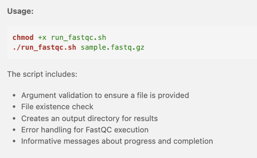{fig-align="center" width="55%" fig-alt="A screenshot showing the icon to open the GitHub Copilot chat." .lightbox}

To create a new file with the suggested code,
click the `...` icon and then select "Insert into New File:

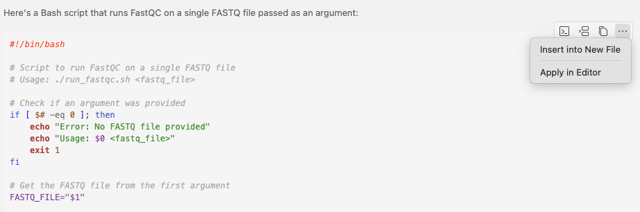{fig-align="center" width="85%" fig-alt="A screenshot showing the icon to open the GitHub Copilot chat." .lightbox}

<details><summary>_Click to see the full script that I got_</summary>
```bash
#!/bin/bash

# Script to run FastQC on a single FASTQ file
# Usage: ./run_fastqc.sh <fastq_file>

# Check if an argument was provided
if [ $# -eq 0 ]; then
    echo "Error: No FASTQ file provided"
    echo "Usage: $0 <fastq_file>"
    exit 1
fi

# Get the FASTQ file from the first argument
FASTQ_FILE="$1"

# Check if the file exists
if [ ! -f "$FASTQ_FILE" ]; then
    echo "Error: File '$FASTQ_FILE' not found"
    exit 1
fi

# Optional: Set output directory (default is current directory)
OUTPUT_DIR="fastqc_results"
mkdir -p "$OUTPUT_DIR"

# Run FastQC
echo "Running FastQC on $FASTQ_FILE..."
fastqc "$FASTQ_FILE" -o "$OUTPUT_DIR"

# Check if FastQC ran successfully
if [ $? -eq 0 ]; then
    echo "FastQC completed successfully"
    echo "Results saved in: $OUTPUT_DIR"
else
    echo "Error: FastQC failed"
    exit 1
fi
```
</details>

Let's save that as `fastqc.sh` within the `week10` dir.
If you got output similar to mine, the script was quite good,
but did not include the strict Bash settings that we've been using.

So let's follow up with the next prompt in the chat:

> Include strict bash settings in the script

It should give an updated script, with an explanation of the key changes:

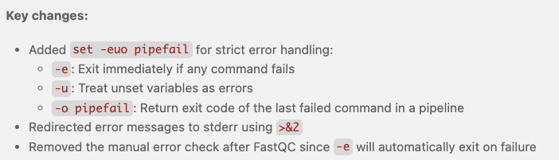{fig-align="center" width="70%" fig-alt="A screenshot showing the icon to open the GitHub Copilot chat." .lightbox}

Now, we have a modified script and a very neat way to update our script is
by clicking "Apply in Editor" (which was also visible in the above screenshot),
which will show the "diffs" (remember this from Git?) and allow you to accept or
reject them either wholly or bit-by-bit:

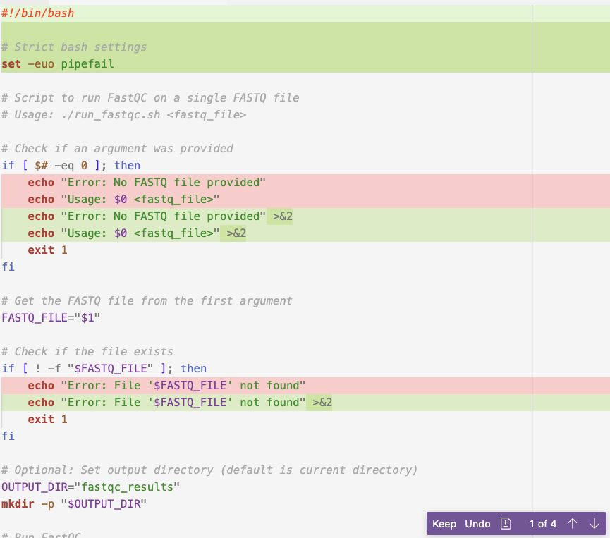{fig-align="center" width="70%" fig-alt="A screenshot showing the icon to open the GitHub Copilot chat." .lightbox}

<details><summary>_Click to see the full script that I got_</summary>
```bash
#!/bin/bash

# Strict bash settings
set -euo pipefail

# Script to run FastQC on a single FASTQ file
# Usage: ./run_fastqc.sh <fastq_file> <output_dir>

# Check if arguments were provided
if [ $# -lt 2 ]; then
    echo "Error: Missing required arguments" >&2
    echo "Usage: $0 <fastq_file> <output_dir>" >&2
    exit 1
fi

# Get the arguments
FASTQ_FILE="$1"
OUTPUT_DIR="$2"

# Check if the file exists
if [ ! -f "$FASTQ_FILE" ]; then
    echo "Error: File '$FASTQ_FILE' not found" >&2
    exit 1
fi

# Create output directory if it doesn't exist
mkdir -p "$OUTPUT_DIR"

# Run FastQC
echo "Running FastQC on $FASTQ_FILE..."
fastqc "$FASTQ_FILE" -o "$OUTPUT_DIR"

echo "FastQC completed successfully"
echo "Results saved in: $OUTPUT_DIR"
```
</details>

Let's practice this procedure again with a final edit:

> Now add an argument for the output directory

<details><summary>_Click to see the full script that I got_</summary>
```bash
#!/bin/bash

# Strict bash settings
set -euo pipefail

# Script to run FastQC on a single FASTQ file
# Usage: ./run_fastqc.sh <fastq_file> <output_dir>

# Check if arguments were provided
if [ $# -lt 2 ]; then
    echo "Error: Missing required arguments" >&2
    echo "Usage: $0 <fastq_file> <output_dir>" >&2
    exit 1
fi

# Get the arguments
FASTQ_FILE="$1"
OUTPUT_DIR="$2"

# Check if the file exists
if [ ! -f "$FASTQ_FILE" ]; then
    echo "Error: File '$FASTQ_FILE' not found" >&2
    exit 1
fi

# Create output directory if it doesn't exist
mkdir -p "$OUTPUT_DIR"

# Run FastQC
echo "Running FastQC on $FASTQ_FILE..."
fastqc "$FASTQ_FILE" -o "$OUTPUT_DIR"

echo "FastQC completed successfully"
echo "Results saved in: $OUTPUT_DIR"
```
</details>

### An example in "Edit" mode

As we saw above, for iterative changes to code, the "Ask" mode works well.
But if you have an existing script (or especially: multiple interconnected scripts),
you may want to use the "Edit" mode instead.
This will directly suggest to make changes in the editor
(rather than only doing so when you click "Apply in Editor").

Switch to "Edit" mode (confirm when it asks you about ending your current session).
With the `fastqc.sh` script still open, this should be selected and shown as context
in the chat window:

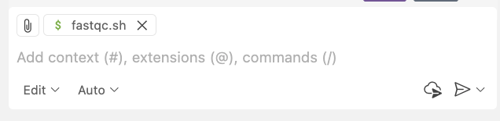{fig-align="center" width="60%" fig-alt="A screenshot showing the icon to open the GitHub Copilot chat." .lightbox}

Ask:

> Add code to print the current date before and after running FastQC

And it should immediately suggest the changes in the editor:

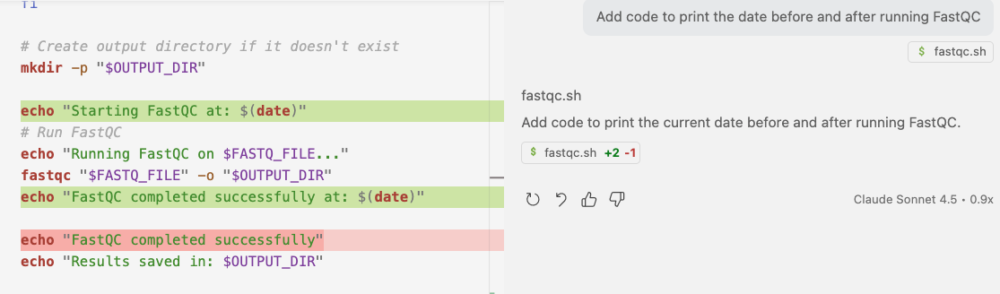{fig-align="center" width="90%" fig-alt="A screenshot showing the icon to open the GitHub Copilot chat." .lightbox}

### Some examples in "Agent" mode

Let's start by asking the same question as we did in "Ask" mode:

> Write a shell script to run the program FastQC on one FASTQ file

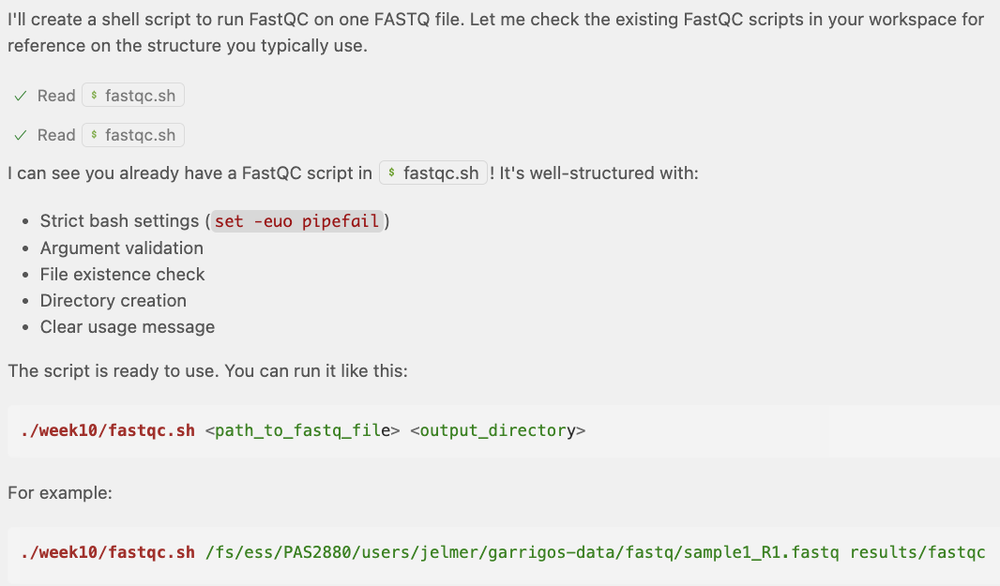{fig-align="center" width="90%" fig-alt="A screenshot showing the icon to open the GitHub Copilot chat." .lightbox}

It found the `fastqc.sh` script that we created earlier!
And look at the example usage, where it has found my dir with FASTQ files,
but ...

<details><summary>_What mistake can you spot in the screenshot above?_</summary>

There is no `sample1_R1.fastq` file in that dir --
the Garrigos data files are named completely differently.
</details>

What about:

> Write a similar script but to run the program trimgalore

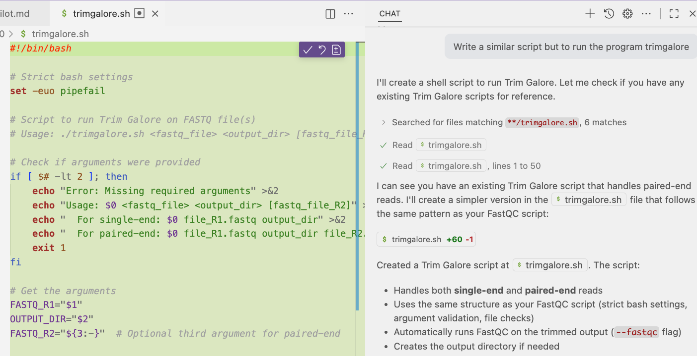{fig-align="center" width="98%" fig-alt="A screenshot showing the icon to open the GitHub Copilot chat." .lightbox}

It found TrimGalore scripts elsewhere in the project dir
(i.e. the open folder, which is `/fs/ess/PAS2880/$USER`),
and created a new script based on those!
Note that you still need to "approve" the final creation of the file,
e.g. by clicking "Keep" in the chat window on the right,
or the checkmark icon in the top-right of the editor window
(see the screenshot above).

Finally, let's have the agent create a script to run a program for which we
don't have code yet --
the program FeatureCounts, which can be used to count reads mapping to genes^[
This is similar to the program Salmon which was indicated in our workflow diagrams.]:

> Create a script to run the program FeatureCounts on BAM files in a given directory

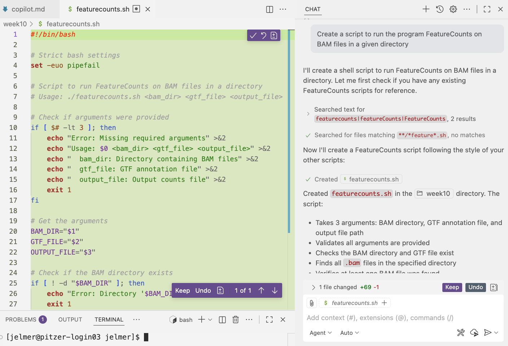{fig-align="center" width="98%" fig-alt="A screenshot showing the icon to open the GitHub Copilot chat." .lightbox}

## Appendix

### Google Gemini VS Code extension

If you run out of GitHub Copilot suggestions included with your free plan,
you can also try the Gemini Code Assist extension for VS Code,
which uses Google's Gemini LLMs.
This appears to have an unlimited free tier!
I haven't explored it much, but it seems to have similar functionality to GitHub Copilot,
with inline suggestions and a chat window.

1. Search for the "Gemini Code Assist" VS Code extension and install it:

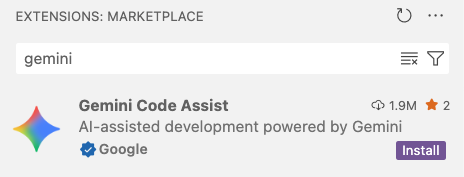{fig-align="center" width="40%" fig-alt="A screenshot showing the icon to open the GitHub Copilot chat." .lightbox}

2. Click the striked-through "AI star" icon in the thin bar way in the bottom to
   open the Gemini sidebar:

{fig-align="center" width="40%" fig-alt="A screenshot showing the icon to open the GitHub Copilot chat." .lightbox}

3. Click "Sign in":

{fig-align="center" width="40%" fig-alt="A screenshot showing the icon to open the GitHub Copilot chat." .lightbox}

4. Click "Open" to allow Code to open the external website

5. In the new web browser tab that pops up,
   log in with your **personal** Google account

6. If it worked, you should see the following in your browser:

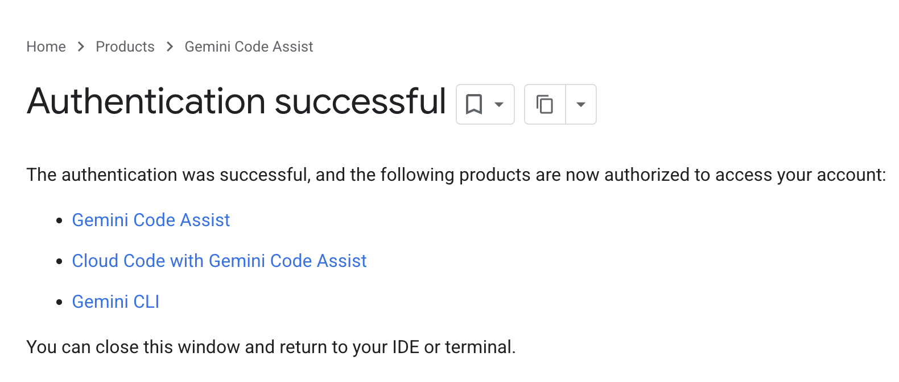{fig-align="center" width="40%" fig-alt="A screenshot showing the icon to open the GitHub Copilot chat." .lightbox}

You should now be all set to use Gemini Code Assist in VS Code!
You can ask questions in the chat window or get inline code suggestions
in similar ways to GitHub Copilot.

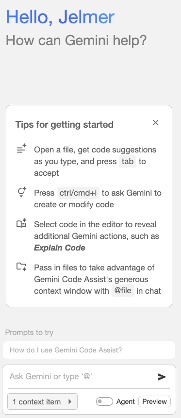{fig-align="center" width="36%" fig-alt="A screenshot showing the icon to open the GitHub Copilot chat." .lightbox}

### Copilot custom "background" instructions

It is possible to provide custom instructions to GitHub Copilot that will guide
its behavior across all your questions.
For example, let's say you want to ask it to create a series of Bash scripts
one-after-another,
and all with some of the same settings and header comments that we've been using
(or some others that you prefer!).
You can specify such "global" instructions in a Markdown file
(AIs like Markdown!), so that you don't have to repeat them every time.

To do so:

1. Create a new folder called `.github` in your project root.
2. Inside the `.github` folder, create a file called `copilot-instructions.md`.
3. In that file, write your custom instructions in Markdown format.

::: {.callout-tip appearance="simple"}
For more info, see
[these VS Code docs](https://code.visualstudio.com/docs/copilot/getting-started#_create-custom-instructions)
:::

### Copilot advanced chat usage with "slash commands" and more

As the chat window shows in ghost text,
you can use keyboard shortcuts to activate certain options:

- Context (files) with `#`:
  - `#file` to attach a relevant file

- "Slash commands" with `/`:
  - `/explain` to get code explanations
  - `/fix` receive a proposed fix for the problems in the selected code
  - `/simplify` to simply the selected code

- Extensions with `@`:
  - e.g. `@workspace`
  
### Further resources

- [Best practices for using GitHub Copilot](https://docs.github.com/en/copilot/get-started/best-practices) (GitHub docs)

- [Some prompt writing tips from a GitHub blogpost](https://github.blog/developer-skills/github/how-to-write-better-prompts-for-github-copilot)

- [VS Code's Github Copilot documentation](https://code.visualstudio.com/docs/copilot/overview)

- Different models and their pros and cons (subject to change!)
  - [An Opinionated Guide to Using AI Right Now](https://www.oneusefulthing.org/p/an-opinionated-guide-to-using-ai) by Ethan Mollick (Oct 2025)
  - [Which AI model writes the best R code?](https://posit.co/blog/r-llm-evaluation-02/) (Aug 2025)

<br>
