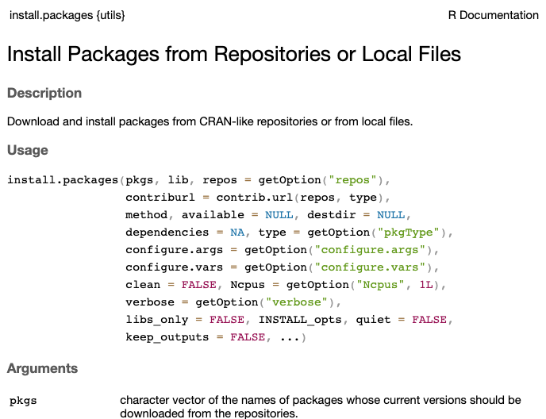

--------------------------------------------------------------------------------

## Introduction

### Overview and learning goals of the course's R material

This is the first of a series of four weeks that will focus on the R language.

Besides being a great all-round tool for data analysis and visualization,
the R language is probably the best environment for the "downstream" analysis
of omics data, with an excellent array of packages for e.g.:

- Metabarcoding analysis
- RNA-Seq analysis
- Lipidomics
- Proteomics and metabolomics

Specifically, you will learn:

- The basics of R (**this lecture**)
- How data is stored in R, using e.g. vectors and different data types (**next lecture**)
- How to use combine R and Markdown with Quarto to produce beautiful, reproducible documents (week 12)
- How to visualize data in R with the ggplot2 package (week 13)
- About the ecosystem of packages for omics data analysis (week 13/14)
- By means of example, how to analyze the RNA-Seq count data you have
  produced using the @garrigós2025 dataset.

### Lecture learning goals

In this lecture, you will learn:

- The RStudio layout and the functions of the different panes and tabs
- The basics of interacting with R by using R as a calculator
- Defining a variable/object in R, and assigning values/data to them
- Calling R functions
- Installing and loading R packages
- Getting help in R

## Starting an RStudio Server session at OSC

You can use R with a "console" that can simply be run inside the terminal.
And you can install it locally on your own computer.
At OSC, you can do so after loading the R module.
However, we'll use R with a fancy editor (or "IDE", Integrated Development Environment)
called [RStudio](https://www.rstudio.com/products/rstudio/download/#download),
which makes working with it much more pleasant!
You can download **RStudio** in your local computer.

Like with VS Code, we can run a version of RStudio ("RStudio Server") within our
browsers by starting an Interactive App through OSC OnDemand.

1. Log in to OSC’s OnDemand portal at <https://ondemand.osc.edu>
1. In the blue top bar, select **`Interactive Apps`** at the bottom,
   click **`RStudio Server`**
2. Fill out the form as follows:
   - Cluster: **`pitzer`**
   - R version: **`4.4.0`**
   - Project: **`PAS2880`**
   - Number of hours: **`2`**
   - Node type: **`any`**
   - Number of cores: **`1`**
4. Click **`Launch`**
5. Click the **`Connect to RStudio Server`** button once it appears

::: callout-tip
#### Number of cores
Note that unlike with Code Server,
we can choose how many cores we want when starting an RStudio server job.
Changing the number of cores is also the way to go if you need more than the
default 4 GB of memory (RAM):
recall that each core is associated with 4 GB of memory,
so asking for 4 cores will get you 16 GB RAM.
:::

## Orienting to RStudio (basic layout)

When you first open RStudio, you will be greeted by four panels,
each of which have multiple tabs:

- **Top left:** The pane where you write script and save for future use

- **Bottom left:** the default and most useful tab in this panel is your R 
"Console", where you can type and execute R code

- **Top right:** the default and most useful tab in this panel this is your
  "Environment",
  which shows you all the objects that are active in your R environment

- **Bottom right:** the default tab in this panel is "Files",
  which is a file explorer starting in your initial working directory
  (more about that next).
  The additional tabs are also commonly used, such as those to show plots and help.


{width="100%" fig-align="center"}

::: {.callout-tip appearance="simple"}
[Click here for a useful RStudio cheatsheet](https://rstudio.github.io/cheatsheets/html/rstudio-ide.html)
:::

## R basics
There are multiple things we can do in R: data manipulation, data visualization, 
statistical analysis, machine learning and many more. Here, we will first learn to use 
R as calculator.

### R as calculator

To get used to typing and executing R code,
we'll simply use R as a calculator --
type `5 + 5` in the console and press <kbd>Enter</kbd>:

```{r}
5 + 5
```

R will print the result of the calculation, `10`.
The result is prefaced by `[1]`, which is simply an index/count of outputs,
which can be helpful when multiple/many numbers or other elements are printed.

Some additional calculation examples:

- Multiplication and division:

  ```{r}
  6 * 8
  40 / 5
  ```

- Exponents:

  ```{r}
  3 ^ 4
  ```

- Parentheses can be used to change the default order of operations:

  ```{r}
  (5 + 3) * 2
  ```
  
  ```{r}
  # Without parentheses, multiplication happens first
  5 + 3 * 2
  ```
The spaces between numbers does not matter in R. However, in general, it is good practice to leave space between the number to improve the readability of codes.


::: {.callout-tip collapse="true"}
#### Order of operations is as you learned in school _(Click to expand)_
When using R as a calculator,
the order of operations is the same as you would have learned back in school.
From highest to lowest precedence:

-   Parentheses: `(`, `)`
-   Exponents: `^` or `**`
-   Multiply: `*`
-   Divide: `/`
-   Add: `+`
-   Subtract: `-`
:::

### The R prompt

The `>` sign in your console is the R prompt, which indicates that R is ready
for you to type something.
In other words, this is equivalent to the `$` Bash prompt that you're used to.

Also just like in the Unix shell, when you are not seeing the `>` prompt,
R is either **busy** (because you asked it to do a longer-running computation)
or **waiting** for you to complete an incomplete command.

If you notice that your prompt turned into a `+`,
you typed an incomplete command -- for example:

```{r, eval=FALSE}
10 /
```
```r-out
+
```

And once again like in the Unix shell,
you can either try to finish the command or abort it by pressing
<kbd>Ctrl</kbd>+<kbd>C</kbd>.
In R, <kbd>Esc</kbd> also works to cancel -- let's practice the latter here.

::: callout-note
#### Adding comments to your code

Comments in R are just like in the Unix shell:
you can use `#` signs to comment your code, both inline and on separate lines:

```{r}
# This line is entirely ignored by R
10 / 5  # This line contains code but everythig after the '#' is ignored
```
:::

### Comparing things

In R, you can use comparison operators to compare numbers.
When you do this, R will return a so-called `logical`
(one of R's "data types" -- more about these later):
either `FALSE` or `TRUE`. For example:

- Greater than and less than:
  
  ```{r}
  8 > 3
  2 < 1
  ```

- Equal to or not equal to --
  don't forget to use **two** equals signs `==` for the former:

  ```{r}
  7 == 7
  # The exclamation mark in general is a "negator"
  10 != 5
  ```

Here are the most common comparison operators in R:

| **Operator** | **Description**          | **Example**            |
|---------|--------------------|------------------------|
| `>`           | Greater than             | 5 \> 6 returns `FALSE`   |
| `<`           | Less than                | 5 \< 6 returns `TRUE`    |
| `==`           | Equal to                | 10 == 10 returns `TRUE`  |
| `!=`           | Not equal to             | 10 != 10 returns `FALSE` |
| `>=`          | Greater than or equal to | 5 \>= 6 returns `FALSE`  |
| `<=`          | Less than or equal to    | 6 \<= 6 returns `TRUE`   |

: {.striped .hover}

### Functions in R

To do almost anything in R, you will use "**functions**",
which are the equivalent of Unix commands.


```r
getwd()
```
```r-out
/fs/ess/PAS2880/users
```

```r
setwd("/fs/ess/PAS2880/users")
```
**we need to quote `/fs/ess/PAS2880/users` because anything that is not quoted in R has to be object**

```r
list.files()
```
```{r}
print("Hello world")
```
```r
dir.create("week11")
```

```{r}
head(iris)
```

You can recognize function calls by the parentheses.
Inside those parentheses, you can provide **arguments** to a function. Arguments are the actual
values you provided to run a function().

**Arguments that are not object has to be in quotes**

In R, you can choose to name the **arguments** in a function or just use their **position**, Named argument and positional argument.
You can assign the values to argument, using the equal to sign '='. When you assign values to the arguments, the the order does not matter, R will know exactly which value goes
where. For example, in `head(n = 6, x = iris)`, the argument ***x*** is explicitly named so the function will run successfully. However, you can also write `head(iris)`, and it gives the same output because R knows the first argument of
head() is ***x***.  `head(6, iris)` will not produce any output because the arguments are called by position but are in wrong order.

```{r}
head(n=6, x = iris)
```

```{r}
head(iris)
```

```{r, error=TRUE}
head(6, iris)
```

|**Concept** | **R/Rstudio** | **Shell** |
|-----------------|---------------------------------------|---------------------------------------|
| `Arguments` | Values passed to a function | Values passed to a command or script |
| `Options`   | Modify the function behavior | Modify command behavior, prefixed with hyphen or double hyphen |


R has over 3,000 functions that serve many different purposes,
and tens of thousands of additional functions are available in packages (add-ons).
Below are a couple of examples continuing along the theme of using R as a calculator:

| **Function** | **Description** |
|-----------------|---------------------------------------|
| `abs(x)` | Absolute value: e.g. `abs(-5)` returns 5 |
| `sqrt(x)` | Square root |
| `log(x)` | Natural logarithm |
| `log10(x)` | Common logarithm |
| `round(x, digits = n)` | Round: e.g `round(3.475, digits = 2)` returns 3.48 |

: {.striped .hover}

### R Help: `help()` and `?`

The `help()` function and `?` help operator in R offer access to documentation pages
for R functions, data sets, and other objects.
They provide access to both packages in the standard R distribution and contributed packages.

For example:

```r
?install.packages
```

The output should be shown in the Viewer tab of the bottom left RStudio panel,
and look something like this:

{width="75%" fig-align="center"}

## R objects

### Assigning stuff to objects

You can assign one or more values to a so-called "object"
with the **assignment operator** `<-`.
A few examples:

```{r}
# Assign the value 250 the object 'length_cm'
length_cm <- 250
length_cm
# Assign the value 2.54 to the object 'conversion'
conversion <- 2.54
conversion
```

In the shell, we've been calling these _variables_,
and that terminology is also used for R objects like the above ones.
However, R objects can take on many forms (we'll talk about _data structures_ in a bit),
including more complicated things like tables.
That's why the general term object is used here.

To see the contents of an object, you can use the `print()` function as the
equivaluent of `echo` in the Unix shell:

```{r}
print(length_cm)
```

However, in R you can actually also omit `print()` and simply type an object's name:

```{r}
length_cm
```

Importantly, you can use objects as if you had typed their values directly:

```{r}
length_cm / conversion
```

```{r}
length_in <- length_cm / conversion
length_in
```

### Object names

Some pointers on object names:

- Because R is case sensitive, `length_inch` is different from `Length_Inch`!

- An object name cannot contain spaces — so for readability, you should separate words using:

  - Underscores: `length_inch` (this is called “snake case”)
  - Periods: `wingspan.inch`
  - Capitalization: `wingspanInch` or `WingspanInch` (“camel case”)

- You will make things easier for yourself by naming objects in a consistent way,
  for instance by always sticking to your favorite case style like “snake case.”

- Object names can contain but cannot start with a number: `x2` is valid but `2x` is not.

- Make object names descriptive yet not too long — this is not always easy!

## R packages

R packages are basically add-ons or extensions to the functionality of the R language.

- The function `install.packages()` **installs** an R package.
  This is a one-time operation, also at OSC (see below).
  
- The function `library()` will **load** an R package in your current R session.
  Every time you want to use a package in R, you need to load it,
  just like everytime you want to use MS Word on your computer, you need to open it.

For example:

```{r eval=FALSE}
install.packages("stringr")
```

```{r}
library(stringr)
```

```{r eval=FALSE}
install.packages("tidyverse")
```

```{r}
# (Output like that shown below is expected if the package can be loaded:)
library(tidyverse)
```

In RStudio server at OSC,
packages will by default be installed into a standard location in your Home dir,
so they can be accessed through time and regardless of what your working dir is,
or what OSC project you are using^[And this works equivalently on your own computer.].

However, package installation is done separately for:

- Different major versions of R
  (e.g. 4.1 versus 4.2, but not R 4.1.1 versus 4.1.5).
  Therefore, when you switch to a different R version, you will start over with
  package installation^[This too, works the same with R on your own computer.].

- Each OSC cluster, like Pitzer versus Cardinal.
  
## Working directory and RStudio Projects

As shown earlier, you can figure out what your working directory is with `getwd()`,
and change it with `setwd()`.

However, there is a better way of dealing with working directories,
which is to avoid using `setwd()` altogether and to use RStudio Projects instead.
This is similar to the Open Folder functionality of VS Code,
but then a bit more formalized.

RSudio projects are useful for several reasons:

- Automatically manage your working directory : RStudio treats project folder as a working directory, thus there is no need of manually setting working directory

- Keep you work organized : Organize your project inside self-contained folders, which helps to
manage, share and reproduce results
- Ensure clean R sessions : Switching projects will restart R and remove all the objects and loaded packages
- Easy to collaborate : All the paths in the RSudio projects will be in relative to the project folder. So, your code will work without modification.

To create a new RStudio Project inside your personal dir in `/fs/ess/PAS2880`:

1.  Click **`File`** (top bar, below your browser's address bar) \> **`New Project`**
2.  In the popup window, click **`Existing Directory`**.

<details><summary>*Click to see a screenshot*</summary>
<hr style="height:1pt; visibility:hidden;" />

{fig-align="center" width="40%"}

</details>

3.  Click **`Browse...`** to select your personal dir.

<details><summary>*Click to see a screenshot*</summary>

{fig-align="center" width="40%"}

</details>

4.  In the next window, you should be in your Home directory (abbreviated as **`~`**),
    from which you can't click your way to `/fs/ess`! 
    Instead, you first have to click on the (very small!) **`...`**
    highlighted in the screenshot below:

{fig-align="center" width="50%"}

5.  Type at least part of the path to your dir in `/fs/ess/PAS2880`,
    e.g. as shown below, and click **`OK`**:

{fig-align="center" width="35%"}

6.  Now you should be able to browse/click the rest of the way to your dir
    (`/fs/ess/PAS2880/users/$USER`).
7.  Click **`Choose`** to pick your selected directory.
8.  Click **`Create Project`**.

This will make R restart, which is by design because to reset the workplace by removing objects, variables, packages from the previous session, to avoid conflicts, to set the working directory.

## R scripts

Once you open a file, a new RStudio panel will appear in the top-left,
where you can view and edit text files, most commonly R scripts (`.R`).
An R script is a text file that contains R code.

***Create and open a new R script by clicking File (top menu bar) \> New File \> R Script.***

{fig-align="center" width="180%"}

#### Why use a script?

It's a good idea to write and save most of your code in scripts,
instead of directly in the R console.
This helps to ***keep track of what you've been doing***, especially in the longer run,
and to re-run your code after modifying input data or one of the lines of code.

#### Sending code to the console

To send code from the editor to the console, where it will be executed by R,
press `Ctrl` + `Enter` (or, on a Mac: `Cmd` + `Enter`)
with the cursor anywhere in a line of code in the script.

Practice that after typing the following command in the script:

```{r}
5 + 5
```
