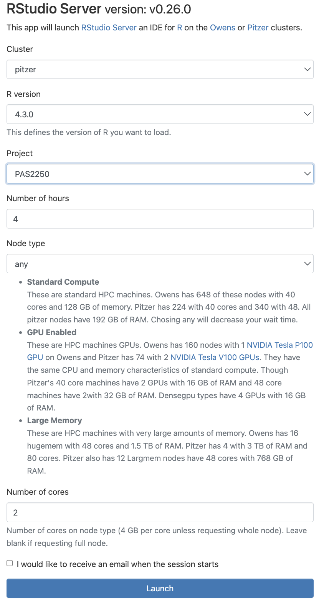
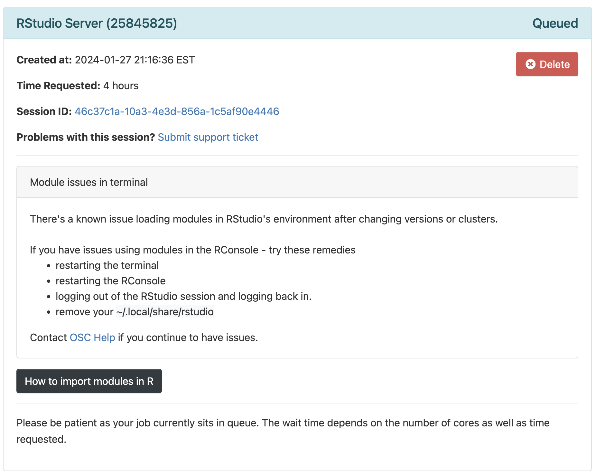
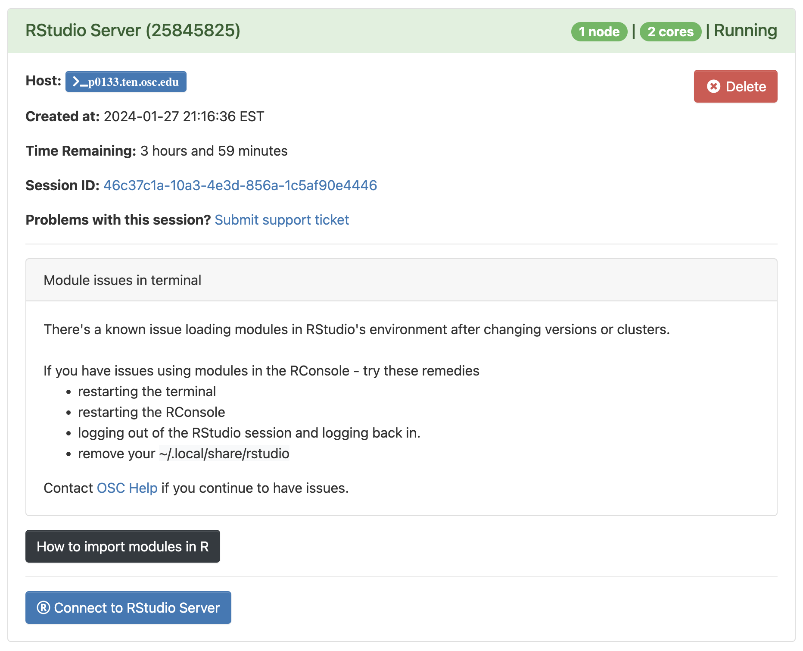
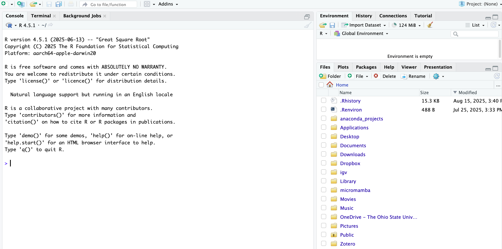
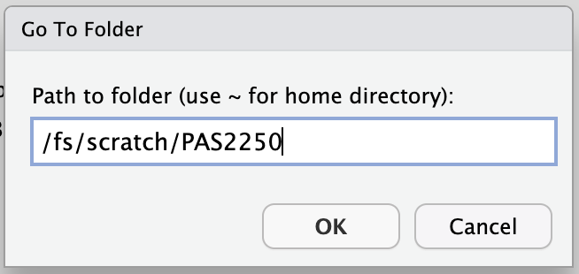

--------------------------------------------------------------------------------

<br>

## Introduction

### Overview and learning goals of the course's R material

This week is the first of a series of four that will focus on the R language.

Besides being a great all-round tool for data analysis and visualization,
the R language is probably the best environment for the "downstream" analysis
of omics data, with an excellent array of packages for e.g.:

- Metabarcoding analysis
- RNA-Seq analysis
- ....
- Proteomics and metabolomics (?)

_[TBA - Rationale for using R including in omics data context]_

Specifically, you will learn:

- The basics of R (**this lecture**)
- How data is stored in R, using e.g. vectors and different data types (**next lecture**)
- How to use combine R and Markdown with Quarto to produce beautiful, reproducible documents (week 12)
- How to visualize data in R with the ggplot2 package (week 13)
- About the ecosystem of packages for omics data analysis (week 13/14)
- By means of example, how to analyze the RNA-Seq count data that you have
  produced using the @garrigós2025 dataset.

### Lecture context & overview

In this lecture, you will learn:

- The RStudio layout and the functions of the different panes and tabs
- The basics of interacting with R by using R as a calculator
- Defining a variable/object in R, and assigning values/data to them
- Calling R functions
- Installing and loading R packages
- Getting help in R

## Starting an RStudio Server session at OSC

R can be run using a console that itself can simply be run in the terminal.
However, we will be running R inside a fancy editor (or "IDE", Integrated Development Environment)
called [RStudio](https://www.rstudio.com/products/rstudio/download/#download),
which makes working with R much more pleasant!

From within your browser,
you can access a version of RStudio ("RStudio Server") that will be running on
OSC's computers.

1. Click on **`Interactive Apps`** (top bar) and then
   **`RStudio Server`** (all the way at the bottom)

2. Fill out the form as follows:

  - Cluster: **`pitzer`**
  - R version: **`4.4.0`**
  - Project: **`PAS2880`**
  - Number of hours: **`2`**
  - Node type: **`any`**
  - Number of cores: **`1`**

<details><summary>*Click to see a screenshot*</summary>

***TBA - Update screenshot***

{fig-align="center" width="50%"}

</details>

4. Click the big blue **`Launch`** button at the bottom

5. Now, you should be sent to a new page with a box at the top for your RStudio Server "job",
   which should initially be "Queued" (waiting to start).

<details><summary>*Click to see a screenshot*</summary>

{fig-align="center" width="70%"}

</details>

6. Your job should start running very soon, with the top bar of the box turning green and saying "Running".

<details><summary>*Click to see a screenshot*</summary>

{fig-align="center" width="70%"}

</details>

7. Click **`Connect to RStudio Server`** at the bottom of the box,
   and an RStudio Server instance will open in a new browser tab. You're ready to go!

## Orienting to RStudio (basic layout)

When you first open RStudio, you will be greeted by three panels:

- **Left:** the default tab in this panel is your R "Console",
  where you can type and execute R code
  (if you’ve previously used standalone R without RStudio, all that would be shown
  is this type of console).

- **Top right:** the default tab in this panel this is your "Environment",
  which shows you all the objects that are active in your R environment.

- **Bottom right:** the default tab in this panel is "Files", showing the files
  in your working directory (more about that next).
  There are also additional tabs to e.g. show plots, packages, and help,
  some of which we'll see later today.

*[TBA - Use screenshot from OSC, and annotate in Powerpoint]*

{width="100%" fig-align="center"}

::: {.callout-tip appearance="simple"}
[Click here for a useful RStudio cheatsheet](https://rstudio.github.io/cheatsheets/html/rstudio-ide.html)
:::

## R basics

### R as calculator

To get used to typing and executing R code,
we'll simply use R as a calculator --
type `5 + 5` in the console and press <kbd>Enter</kbd>:

```{r}
5 + 5
```

R will print the result of the calculation, `10`.
The result is prefaced by `[1]`, which is simply an index/count of outputs,
because sometimes R can output hundreds of numbers or other elements.

Some additional examples:

```{r}
# Multiplication
6 * 8
```

```{r}
# Division
40 / 5
```

```{r}
# Exponents
3 ^ 4
```

```{r}
# Parentheses change order of operations
(5 + 3) * 2
```

```{r}
# Without parentheses, multiplication happens first
5 + 3 * 2
```

::: {.callout-tip collapse="true"}
#### Order of operations is as you learned in school _(Click to expand)_
When using R as a calculator,
the order of operations is the same as you would have learned back in school.
From highest to lowest precedence:

-   Parentheses: `(`, `)`
-   Exponents: `^` or `**`
-   Multiply: `*`
-   Divide: `/`
-   Add: `+`
-   Subtract: `-`
:::

### The R prompt

The `>` sign in your console is the R prompt, which indicates that R is ready
for you to type something.
In other words, this is equivalent to the `$` Bash prompt that you're used to.

Also just like in the Unix shell, when you are not seeing the `>` prompt,
R is either **busy** (because you asked it to do a longer-running computation)
or **waiting** for you to complete an incomplete command.

If you notice that your prompt turned into a `+`,
you typed an incomplete command -- for example:

```{r, eval=FALSE}
10 /
```
```r-out
+
```

Once again like in the Unix shell, you can either try to finish the command
or abort it by pressing <kbd>Ctrl</kbd>+<kbd>C</kbd>
(<kbd>Esc</kbd> also works in R) -- let's practice the latter here.

::: callout-note
#### Adding comments to your code

Comments in R are just like in the Unix shell:
you can use `#` signs to comment your code, both inline and on separate lines:

```{r}
# This line is entirely ignored by R
10 / 5  # This line contains code but everythig after the '#' is ignored
```
:::

### Comparing things

In R, you can use comparison operators to compare numbers.
When you do this, R will return a `logical`
(one of R's "data types" -- more about these later):
either `FALSE` or `TRUE`. For example:

```{r}
# Greater than
8 > 3
```

```{r}
# Less than
2 < 1
```

```{r}
# Equal to
7 == 7
```

```{r}
# Not equal to
10 != 5
```

```{r}
# Greater than or equal to
6 >= 6
```

Here are the most common comparison operators in R:

| **Operator** | **Description**          | **Example**            |
|--------------|--------------------------|------------------------|
| `>`           | Greater than             | 5 \> 6 returns `FALSE`   |
| `<`           | Less than                | 5 \< 6 returns `TRUE`    |
| `==`           | Equals to                | 10 == 10 returns `TRUE`  |
| `!=`           | Not equal to             | 10 != 10 returns `FALSE` |
| `>=`          | Greater than or equal to | 5 \>= 6 returns `FALSE`  |
| `<=`          | Less than or equal to    | 6 \<= 6 returns `TRUE`   |

: {.striped .hover}

### Functions in R

To do almost anything in R, you will use "**functions**",
which are the equivalent of Unix commands.

_TBA - A couple of equivalent shell <-> R functions, e.g:_

```{r}
print("Hello world")
```

```r
getwd()
```

```r
head(x)
```

You can recognize function calls by the parentheses.
Inside those parentheses, you can provide **arguments** to a function.

_TBA - compare with arguments and options in the shell_

Another important function is `c()`, which stands for **combine** or **concatenate**.
With `c()`, you can create _vectors_ that contain multiple elements, like multiple numbers.
You'll learn more about vectors in the next session, but here is a quick example:

```{r}
c(10, 15)
```

Below are examples of some other R functions:

| **Function** | **Description** |
|---------------------------------|---------------------------------------|
| `abs(x)` | Absolute value |
| `sqrt(x)` | Square root |
| `log(x)` | Natural logarithm |
| `log10(x)` | Common logarithm |
| `round(x, digits = n)` | E.g `round(3.475, digits = 2)` returns 3.48 |

: {.striped .hover}

### R Help: `help()` and `?`

The `help()` function and `?` help operator in R offer access to documentation pages
for R functions, data sets, and other objects.
They provide access to both packages in the standard R distribution and contributed packages.

For example:

```r
?install.packages
```

The output should be shown in the Viewer tab of the bottom left RStudio panel,
and look something like this:

{width="75%" fig-align="center"}

## R objects

### Assigning stuff to objects

We can assign one or more values to a so-called "object"
with the **assignment operator** `<-`.
A few examples:

```{r}
# Assign the value 250 the object 'length_cm'
length_cm <- 250

# Assign the value 2.54 to the object 'conversion'
conversion <- 2.54
```

In the shell, we've been calling these _variables_,
and that terminology is also used for R objects like the above ones.
However, R objects can take on many forms (we'll talk about _data structures_ in a bit),
including more complicated things like tables.
That's why the general term object is used here.

To see the contents of an object, you can use the `print()` function as the
equivaluent of `echo` in the Unix shell:

```{r}
print(length_cm)
```

However, in R you can simply type an object's name:

```{r}
length_cm
```

Importantly, you can use objects as if you had typed their values directly:

```{r}
length_cm / conversion
```

```{r}
length_in <- length_cm / conversion
length_in
```

### Object names

Some pointers on object names:

- Because R is case sensitive, `length_inch` is different from `Length_Inch`!

- An object name cannot contain spaces — so for readability, you should separate words using:

  - Underscores: `length_inch` (this is called “snake case”)
  - Periods: `wingspan.inch`
  - Capitalization: `wingspanInch` or `WingspanInch` (“camel case”)

- You will make things easier for yourself by naming objects in a consistent way,
  for instance by always sticking to your favorite case style like “snake case.”

- Object names can contain but cannot start with a number: `x2` is valid but `2x` is not.

- Make object names descriptive yet not too long — this is not always easy!

## R packages

For example, `install.packages()` is an important function you already used if you followed
the setup instructions for this workshop: it will **install** an R package.
R packages are basically add-ons or extensions to the functionality of the R language.
Inside the parenthese of `install.packages()`,
you should provide a package name as an argument, like `install.packages("tidyverse")`.

Another example of an R function is `library()`,
which will access your "library" of installed packages to **load** a package.
Every time you want to use a package in R, you need to load it, just like everytime
you want to use MS Word on your computer, you need to open it.

_TBA - Start with a simpler installation - then tidyverse_

```{r eval=FALSE}
install.packages("tidyverse")
```

```{r}
# (Output like that shown below is expected if the package can be loaded:)
library(tidyverse)
```

## Working directory and RStudio Projects

We can figure out where our working directory with `getwd()`:

```r
getwd()
```
```r-out
[1] "TBA"
```

You can change your working directory with the function `setwd()`:

```r
setwd("TBA")
```

However, there is a better way of dealing with working directories,
which is to avoid using `setwd()` altogether and to use RStudio Projects instead.

_[TBA - Explain Projects and create a Project]_

Using an "RStudio Project" will most of all help to make sure your working directory in R
is correct. To create a new RStudio Project inside your personal dir in
`TBA`:

1.  Click **`File`** (top bar, below your browser's address bar) \> **`New Project`**
2.  In the popup window, click **`Existing Directory`**.

<details><summary>*Click to see a screenshot*</summary>
<hr style="height:1pt; visibility:hidden;" />

{fig-align="center" width="40%"}

</details>

3.  Click **`Browse...`** to select your personal dir.

<details><summary>*Click to see a screenshot*</summary>

{fig-align="center" width="40%"}

</details>

4.  In the next window, you should be in your Home directory (abbreviated as **`~`**),
    from which you can't click your way to `/fs/scratch`! Instead, you'll first have to
    click on the (very small!) **`...`** highlighted in the screenshot below:

{fig-align="center" width="50%"}

5.  Type at least part of the path to your dir in `/fs/scratch/PAS2658`,
    e.g. as shown below, and click **`OK`**:

{fig-align="center" width="35%"}

6.  Now you should be able to browse/click the rest of the way to your `Lab9` dir.
7.  Click **`Choose`** to pick your selected directory.
8.  Click **`Create Project`**.

## R scripts

Once you open a file, a new RStudio panel will appear in the top-left,
where you can view and edit text files, most commonly R scripts (`.R`).
An R script is a text file that contains R code.

***Create and open a new R script by clicking File (top menu bar) \> New File \> R Script.***

#### Why use a script?

It's a good idea to write and save most of our code in scripts,
instead of directly in the R console.
This helps us ***keep track of what we’ve been doing***, especially in the longer run,
and to re-run our code after modifying input data or one of the lines of code.

#### Sending code to the console

To send code from the editor to the console, where it will be executed by R,
press `Ctrl` + `Enter` (or, on a Mac: `Cmd` + `Enter`)
with the cursor anywhere in a line of code in the script.

Practice that after typing the following command in the script:

```{r}
5 + 5
```

## R best practices

- Code line length
- Spaces around ...
- Script length
- TBA


