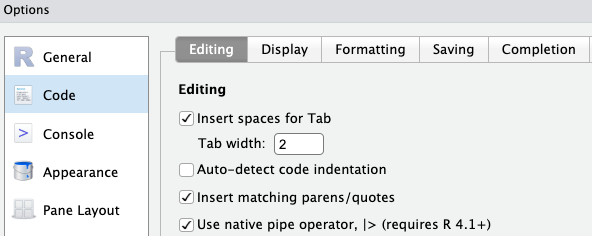

--------------------------------------------------------------------------------

<br>

## Introduction

### Overview & learning goals

One of R's most powerful features is its
**built-in ability to deal with tabular data** --
i.e., data with rows and columns like you are familiar with from Excel
spreadsheets and so on.
In R, tabular data is stored in a data structure called "**data frame**".

In this lecture, you will learn:

- Data frames and different functions to reorganize and modify data frames
- Briefly about the similar matrix data structure

### Setting up

1. At <https://ondemand.osc.edu>,
   start an RStudio session like in the previous lecture 
   ([Starting an RStudio Server session at OSC](../week11/w11a_r-basics.html#Working-directory-and-RStudio-Projects))
2. Switch to your `week11` RStudio Project created in previous lecture
  ([Working directory and RStudio Projects](../week11/w11a_r-basics.html#Working-directory-and-RStudio-Projects))
3. Open a new R Script and save it as `week11c.R` in your `week11` folder
   ([R scripts](../week11/w11a_r-basics.html#R-scripts))

## The tidyverse

We'll start working with a family of R packages designed for "dataframe-centric"
data science called the ["tidyverse"](https://www.tidyverse.org).
Dataframe-centric refers to doing most if not all data analysis while keeping
the data in R's data frame data structure.

All core tidyverse packages can be installed and loaded with a single command.
Since you should already have _installed_ the tidyverse^[
If not: run `install.packages("tidyverse")` now.
], you only need to _load_  it, which you do as follows:

```{r}
library(tidyverse)
```

The output tells you which packages have been loaded as part of the tidyverse.

One thing to note about the _tidyverse_ is that much of its functionality
is also covered by base R functions, but it is better suited for quick and 
easy data manipulation.

::: {.callout-tip collapse="true"}
### Function name conflicts _(Click to expand)_

When you loaded the tidyverse, the output included a  "Conflicts" section that
may have seemed ominous:

```r-out-solo
── Conflicts ────────────────────────────────────────── tidyverse_conflicts() ──
✖ dplyr::filter() masks stats::filter()
✖ dplyr::lag()    masks stats::lag()
ℹ Use the conflicted package (<http://conflicted.r-lib.org/>) to force all conflicts to become errors
```

What this means is that two tidyverse functions, `filter()` and `lag()`,
have the same names as two functions from the _stats_ package that were already
in your R environment.

Those stats package functions are part of what is often referred to as "base R":
core R functionality that is always available (loaded) when you start R.

Due to this function name conflict/collision,
the `filter()` function from _dplyr_ "masks" the `filter()` function from _stats_.
Therefore, if you write a command with `filter()`,
it will use the _dplyr_ function and not the _stats_ function.

You _can_ use a "masked" function,
by prefacing it with its package name as follows: `stats::filter()`.
:::

## Reading data

_readr_  is one of the packages that is loaded as part of the core tidyverse,
and has functions for reading and writing tabular data to and from plain-text
files like CSV and TSV files.

The `read_tsv()` function will read TSV (tab-delimited files) -- for example:

```{r eval= FALSE}
meta <- read_tsv(file = "garrigos-data/meta/metadata.tsv")
```

```{r echo= FALSE}
meta <- read_tsv(file = "../data/metadata.tsv")
```

Note that this function is rather chatty,
telling you how many rows and columns it read, and what their data types are.
Let's check the resulting object:

```{r}
meta
```

::: {.callout-tip appearance='minimal'}
To read and write CSV files instead, use `read_csv()` / `write_csv()` in the same way.
:::

You can also use the `View()` function to look at the data frame.
This will open a new tab in your editor pane with a spreadsheet-like look and feel:

```{r, eval=FALSE}
View(meta)
# (Should display the dataset in an editor pane tab)
```

## Data frame basics

Data frames are another R data structure, like vectors.

They contain tabular data and can be thought of a vectors pasted side-by-side:
each column is a vector.
This means that each column can only contain one data type.

It also implies that rows and columns aren't equivalent.
Specifically,
it is good practice to organize tabular data in the so-called
["tidy" data format](https://r4ds.hadley.nz/data-tidy.html)
like above, where:

- Each column contains a different **"variable"** (e.g. coat color, weight)
- Each row contains a different **"observation"** (data on e.g. one cat/person/sample)

... a so-called
**"tibble", which is the tidyverse variant of a data frame.**
The main difference is the nicer default printing behavior of tibbles:
e.g. the data types of columns are shown,
and only a limited number of rows are printed.

### Extracting columns from a data frame

You can extract individual columns from a data frame using the `$` operator:

```{r}
meta$treatment
```

This kind of operation will return a vector -- and can be indexed as well:

```{r}
meta$treatment[2]
```

## Matrices

The matrix data structure in R is similar to a data frame:
it is also rectangular with rows and columns.
But it differs in that all the elements in a matrix must of be same data type:
all numeric, character, or logical.
This restriction applies only to the contents of the matrix which is
the actual numbers inside the rectangular data area.
However, rownames and colnames are not part of the matrix’s main data content.
They are attributes attached to the matrix object.


Most commonly, matrices consist of only _numerical_ data.

Of course, column labels can then still be provided with column names,
but what about rows?

Rownames are typically used for **feature IDs (e.g., genes)** in Matrix and column names represent **sample_ID**.
These rownames are important for RNAseq data analysis package `DESeq2` because the 
software uses rownames to match genes across the count matrix and associated metadata.
While data frames in R also allow rownames, they are less commonly used for 
storing identifiers like gene names.
Instead, genes names are usually stored as a separate column for clarity in data frame.


Generally, matrices are not nearly as common as data frames,
but we are introducing them here because they are used in a number of omics-data
related packages.
For example, the package
[DESeq2](https://bioconductor.org/packages/devel/bioc/vignettes/DESeq2/inst/doc/DESeq2.html),
which we'll later use for differential expression analysis of our RNA-Seq count data. 

## The _dplyr_ package

The [_dplyr_](https://cran.r-project.org/package=dplyr) package provides very
useful functions for **manipulating data in data frames** ("data wrangling").
This type of data processing is often essential before you can move on to say,
data visualization (**week 13**) or statistical data analysis (**week 14**).

In this session, we'll cover the most commonly used _dplyr_ functions:

- `select()` to pick columns (variables)
- `filter()` to pick rows (observations)
- `rename()` to change column names
- `arrange()` to change the order of rows (i.e., to sort a data frame)
- `mutate()` to modify values in columns and create new columns
- `summarize()` to compute across-row summaries

All these functions take a
**data frame as the _input_, and output a new, modified data frame**.

## `select()` to pick columns (variables)

The first `dplyr` function you'll learn about is `select()`,
which subsets a data frame by including/excluding certain columns.
By default, it only **includes the columns you specify**:

```{r}
select(.data = meta, time, sample_id)
```

Above, the first argument was the data frame,
whereas the other arguments were the (unquoted!) names of columns to be included
in the output data frame^[
Based on what you learned in the previous session,
it may seem strange that the column names should not be quoted.
One way to make sense of this is that the columns can be thought of as (vector)
objects, whose names are the column names.].

The **order of the columns** in the output data frame is exactly as you list them in
`select()`, and doesn't need to be the same as in the input data frame.
In other words, `select()` is also one way to reorder columns:
in the example above, we made `year` appear before `country`.

You can also **specify columns that should be excluded**,
by prefacing their name with a `!` (or a `-`):

```{r}
# This will include all columns _except_ sample_id:
select(.data = meta, !sample_id)
```

::: {.callout-tip appearance='simple'}
There are also ways to e.g. select _ranges_ of columns:
check the `select()` help by typing `?select` to learn more.
:::

## `rename()` to change column names

The next _dplyr_ function is one of the simplest:
`rename()` to change column names.

The syntax to specify the new and old name within the function is `new_name = old_name`.
For example:

```{r}
rename(.data = meta, sample = sample_id)
```

## The pipe (`|>`)

Examples so far applied a single _dplyr_ function to a data frame,
simply printing the output (a new data frame) to screen.
But in practice, it's common to use several consecutive _dplyr_ functions to
wrangle a dataframe into the format you want.

For example, you may want to first `select()` one or more columns,
and _then_ `rename()` a column.
You could do that as follows:

```{r}
meta_sel <- select(.data = meta, sample_id, time)

rename(.data = meta_sel, sample = sample_id)
```

And you could go on along these lines,
successively creating new objects that you then use for the next step.

But there is a more elegant way of dong this,
directly sending ("piping") output from one function into the next function
with the **pipe operator** `|>`
(a vertical bar <kbd>|</kbd> followed by a greater-than sign <kbd>></kbd>).
Let's start by seeing a reformulation of the code above with pipes:

```{r}
meta |>
  select(sample_id, time) |>
  rename(sample = sample_id)
```

What happened here? We took the `meta` data frame,
sent ("piped") it into the `select()` function,
whose output in turn was piped into the `rename()` function.
You can think of the pipe as **"then"**:
take `meta`, _then_ select, _then_ rename.

When using the pipe,
you no longer specify the input data frame with the `.data` argument,
because the function now gets its input data via the pipe
(specifically, the input goes to the function's first argument by default).

::: {.callout-tip appearance='minimal'}
Using pipes involves less typing and is especially more readable than using
successive assignments^[
Using pipes is also faster and uses less computer memory.
].

For code readability, 
it is good practice to always start a new line after a pipe `|>`,
and to keep the subsequent line(s) _indented_ as RStudio will automatically do.
:::

::: callout-note
### Using the pipe keyboard shortcut

The following RStudio keyboard shortcut will insert a pipe symbol:
<kbd>Ctrl/Cmd</kbd> + <kbd>Shift</kbd> + <kbd>M</kbd>.

However, by default this (still) inserts an older pipe symbol, `%>%`.
As long as you've loaded the tidyverse^[
This symbol only works when you have one of the tidyverse packages loaded.
], it would not really be a problem to just use `%>%` instead of `|>`.
But it would be preferred to make RStudio insert the `|>` pipe symbol:

1. Click `Tools` > `Global Options` > `Code` tab on the right
2. Check the box "Use native pipe operator" as shown below
3. Click `OK` at the bottom of the options dialog box to apply the change and
   close the box.  

{fig-align="center"}
:::

## `filter()` to pick rows (observations)

### Introduction

The `filter()` function outputs only those rows that satisfy one or more conditions.
It is similar to Filter functionality in Excel --
except that those only change what you _display_,
while `filter()` will completely _exclude_ rows.

But if that sounds scary,
recall that _dplyr_ functions always output a ***new*** data frame.
Therefore, with any _dplyr_ function,
you'll only modify existing data when you assign the output back to the input object,
like in this example with the `select()` function:

```{r, eval=FALSE}
# [Don't run this - hypothetical example]
# After running this, the 'meta' dataframe would no longer contain the treatment column:
meta <- meta |> select(sample_id, time)
```

### Filter based on one condition

This first `filter()` example outputs only rows with the sampling time point 10dpi
(remember, each row of time variable represents a sample at a given time point):

```{r}
meta |>
  filter(time == "10dpi")
```

<details><summary> How many rows were output? _(Click to see the answer)_</summary>
<p>
21 rows were output, as shown in the first line above: `12 x 3` (rows x columns)
</p>
</details>

:::callout-warning
### Remember to use _two_ equals signs `==` to test for equality!
:::

### Filter based on multiple conditions

It's also possible to filter based on multiple conditions.
For example, you may want to see control samples collected at 10dpi excluding `ERR10802882`:

```{r}
meta |>
  filter(time == "10dpi", treatment == "control", sample_id != "ERR10802882")
```

Like above, by default, multiple conditions are combined using a Boolean ***AND***.
In other words, in a given row, _each_ condition must be met to output the row.

If you want to combine conditions using a Boolean ***OR***,
where only one of the conditions needs to be met,
use a `|` between the conditions:

```{r}
# Keep rows with a control samples collected at 10dpi:
meta |>
  filter(time == "10dpi" | treatment == "control")
```

### Pipeline practice

Finally, let's practice once more with "pipelines" that use multiple _dplyr_
functions: `filter` rows, then `select` columns,
and finally `rename` one of the remaining columns:

```{r}
meta |>
  filter(time == "10dpi") |>
  select(sample_id, treatment) |>
  rename(sample = sample_id)
```

::: exercise
####  Exercise: Pipes

Use a "pipeline" like above to output a data frame with two
columns (`sample_id` and `treatment`) only for the _cathemerium_ treatment.
How many rows does your output data frame have?

<details><summary>Click for the solution</summary>
```{r}
meta |>
  select(sample_id, treatment) |>
  filter(treatment == "cathemerium")
```

The output data frame has 7 rows and 2 columns.
</details>

:::

## `arrange()` to sort data frames

The `arrange()` function is like sorting functionality in Excel:
it changes the order of rows based on the values in one or more columns^[
It will always rearrange the order of rows as a whole,
never just of individual columns since that would scramble the data.
].
Among other things, sorting can help you find observations with the smallest or
largest values for a certain column.

The `meta` dataframe is currently first sorted by `time` and then by `treatment`,
whereas `sample_id`s within these groups are not sorted.
You may, for example, want to sort by `sample_id` instead:

```{r}
meta |>
  arrange(sample_id)
```

Default sorting is alphabetically and, for numbers, from small to large.
To sort in reverse order, use the `desc()` (descending) helper function:

```{r}
meta |>
  arrange(desc(sample_id))
```
 
Finally, you may want to sort by multiple columns,
where ties in the first column are broken by a second column (and so on).
Do this by simply listing the columns in the appropriate order:

```{r}
# Sort first by treatment, time, then by sample_id:
meta |>
  arrange(treatment, time, sample_id)
```

## `mutate()` to modify columns and create new ones

So far, we've focused on functions that subset and reorganize data frames
(and you've seen how to modify column names).
But you haven't seen how you can _change the data_ or _compute derived data_.

You can do this with the `mutate()` function.
For a first example, let's go back to the `iris` dataframe:

```{r}
head(iris)
```

Let's say you wanted to compute the ration of sepal length to with for each
observation -- you can do so as follows with `mutate()`:

```{r}
iris |>
  mutate(sepal_ratio = Sepal.Length / Sepal.Width) |>
  head()
```

::: callout-tip
#### Regular data frames vs. tibbles
Both data frames and tibbles are used in R to store tabular data containing rows and columns, 
often with mixed data types (character, integer, double etc).

Data frames : Introduced in base R, available without loading any package. Often convert character data into 
factors automatically (though this can be disabled with stringsAsFactors = FALSE). Print all rows and columns 
by default, which can be overwhelming for large datasets. When subsetting, R may simplify results unexpectedly 
(e.g., returning a vector instead of a data frame).


Tibbles : Tibbles are data frames, but they tweak some older behaviors to make life a little easier.
Introduced in the tidyverse (specifically, the tibble package), and are part of the tidyverse ecosystem.
Do not automatically convert strings to factors — everything stays as you enter it. Print in a more readable way, 
showing only the first 10 rows and all columns that fit on the screen.
When subsetting, tibbles always return another tibble, preserving the data frame structure 
(unless you explicitly ask   for it).

:::

For an example with our `meta` dataframe, we'll use the `sub()` function,
which can do a character-based search-and-replace.
It takes three arguments: the pattern to search for, what to replace the pattern
with, and the subject vector.
For example, to shorten sample IDs by removing the shared prefix:

```{r}
# Create a new column 'sample_id_short' by replacing the 'ERR10802' pattern of sample_id with nothing :
meta |>
  mutate(
    sample_id_short = sub(pattern = "ERR10802", replacement = "", x = sample_id)
    )
```

The above examples _added_ a new column to the dataframe.
To _modify_ an existing column rather than adding a new one,
simply "assign back to the same name":

```{r}
meta |>
  mutate(
    sample_id = sub(pattern = "ERR10802", replacement = "", x = sample_id)
  )
```

:::exercise
####  Exercise: `mutate()`

Another very useful function is `substr()`, short for _substring_,
which can extract parts of a character vector by position:
say, you can ask it to only keep the first three characters.
It includes arguments for the desired `start` and `end` positions of the substring:

```{r}
meta |>
  mutate(treatment_short = substr(x = treatment, start = 1, stop = 3))
```

Use `mutate()` with `substr()` to:

- Create a numeric `time_num` column, stripping the `hpi`/`dpi` suffix from `time`.
- Create a column `time_unit`, keeping only the `hpi`/`dpi` suffix from `time`.

Save the resulting data frame as `meta_time` (we will use it after this!).

<details><summary>Click for the solution</summary>

```{r}
meta_time <- meta |>
    mutate(
      time_num = as.numeric(substr(time, 1, 2)),
      time_unit = substr(time, 3, 5)
      )

meta_time
```
</details>
:::

## `summarize()` to compute summary stats

The final function _dplyr_ function we'll cover is `summarize()`,
which computes **summaries of your data across rows**.
For example, to calculate the mean time across the entire dataset (all rows):

```{r}
# The syntax is similar to 'mutate': <new-column> = <operation>
meta_time |>
  summarize(mean_time = mean(time_num))
```

The output is still a dataframe, but unlike with all previous _dplyr_ functions,
it is completely different from the input dataframe,
"collapsing" the data down to as little as a single number, like above. 

`summarize()` becomes really powerful in combination with the helper function
`group_by()` to compute **groupwise** stats.
For example, to get the mean time_num separately for each treatment:

```{r}
meta_time |>
  group_by(treatment) |>
  summarize(mean_time = mean(time_num))
```

`group_by()` implicitly splits a data frame into groups of rows:
here, one group for observations from each treatment.
After that, operations like in `summarize()` will happen separately for each group,
which is how we ended up with per-treatment means.

Before doing the exercise for `summarize()`, we will learn about the new function `str()` 
to understand the internal structure of your dataset/object. The argument for the `str()` is the name of the object you want to explore.


```{r}
str(iris)
```
For a output of iris dataset above shows:

- The object has a class of dataframe
- The total number of 150 observations and 5 variables
- A full list of the variables names (e.g. Sepal.Length, Sepal.Width, etc)
- The data type of each variable (e.g. num, factor)


:::exercise
####  Exercise: `summarize()`
1. Use the iris dataset to summarize the average petal length and width for each species.

<details><summary>*Click to see a solution*</summary>

```{r}
iris_summary <- iris %>%
  group_by(Species) %>%
  summarize(
    avg_petal_length = mean(Petal.Length),
    avg_petal_width = mean(Petal.Width)
  )
iris_summary
```

</details>

:::


## Writing to files

To write a data frame to a TSV file,
you can use the `write_tsv()` function,
with argument `x` for the R object and argument `file` for the file path:

```{r eval=FALSE}
# You can save in the present working directory 
write_tsv(x = meta_time, file = "metadata_ed.tsv")

# Change the path if you want to save it in different directory
write_tsv(x = meta_time, file = "results/metadata_ed.tsv")
```

Because we simply provided a file name, the file will have been written in your
R working directory^[
Recall that you can see where that is at the top of the Console tab, or by running `getwd()`.
].

If you want to take a look at the file you just created,
you can find it in RStudio's **Files** tab and click on it,
which will open it in the editor panel.
Of course, you could also find it in your computer's file browser and open it
in different ways.

## Recap and looking forward

- Different columns of Data frame can contain different types of data, but in a matrix all the 
  elements are of same data type.
- Several functions of dplyr package such as `filter()`, `select()`, `arrange()`, `mutate()` in R provides a powerful way to manipulate large datasets.


::: callout-note
### Learn more

Regarding data wrangling specifically,
here are two particularly useful additional skills to learn:

- Pivoting/reshaping --- moving between 'wide' and 'long' data formats
  with `pivot_wider()` and `pivot_longer()`. This is covered in
  [chapter 5 of R for Data Science](https://r4ds.hadley.nz/data-tidy.html#sec-pivoting).

- Joining/merging ---
  combining multiple dataframes based on one or more shared columns.
  This can be done with _dplyr_'s `join_*()` functions --
  see for example [chapter 19 of R for Data Science](https://r4ds.hadley.nz/joins.html).
:::
