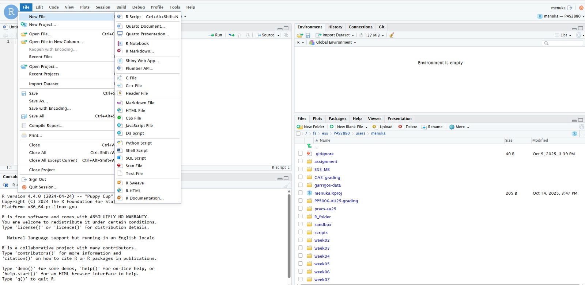
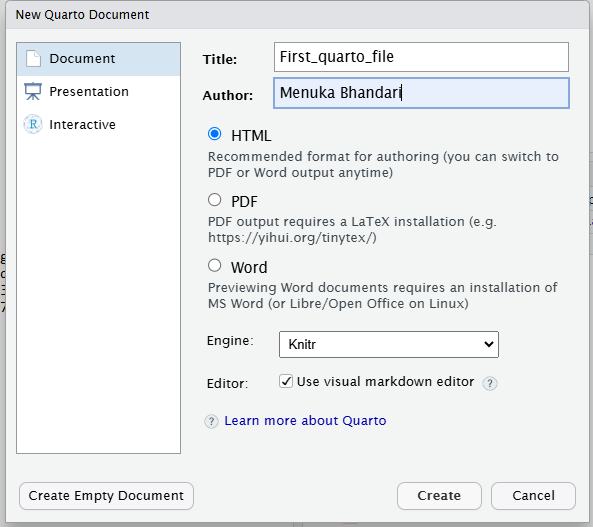
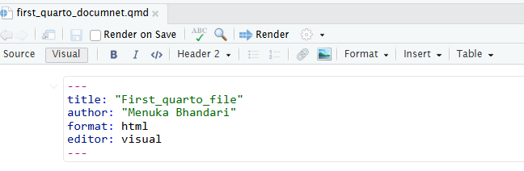
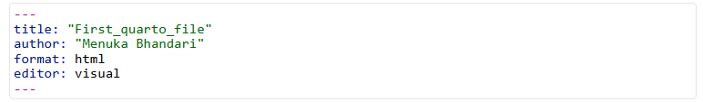
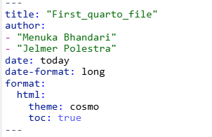
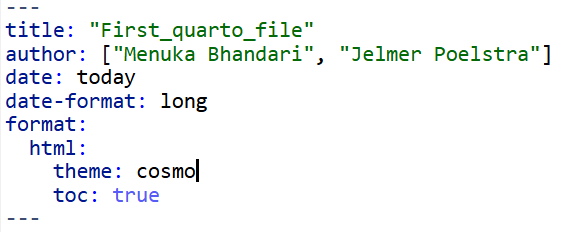
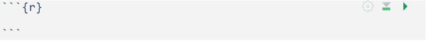
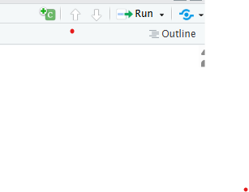
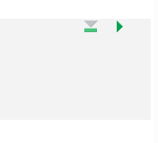
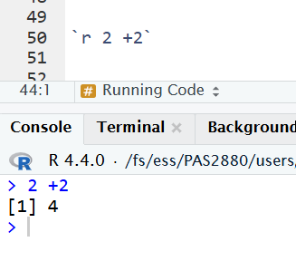

------------------------------------------------------------------------

<br>

## Introduction

### Overview

This session introduces the basics of [Quarto](https://quarto.org/) -
its three components **YAML header**, **code chunks** and **text**. You
will learn to create Quarto documents, use several options to
display/hide codes and figures, and render your Quarto source document
to an output HTML document.

### Learning goals

In this session, you will learn:

-   Basics of **Quarto (syntax and formats)**
-   How to create and render a Quarto document in RStudio
-   Understand three components of Quarto ; **YAML header, code chunks and text**

## Quarto

Quarto is an extension of Markdown that allows to combine prose, code,
and results[^1]. Quarto is not limited to a single programming language
but can run R, Python, Julia and Observable code. Here, we will focus on
using **Quarto in RStudio with R**.

[^1]: It is the next-generation version of R Markdown, in case you have
    heard of that.

Quarto documents are reproducible and support different output formats
such as PDFs, Microsoft Word files, slide decks (presentations) and many
more.

**Advantages of using Quarto:**

1.  Communicate with your collaborator: It includes code, results and
    steps/narrative in a single document
2.  Supports multi-format outputs such as HTML, PDF, Markdown, websites
    and more
3.  Reproducibility of research

::: {.callout-tip appearance="simple"}
Quarto is integrated into RStudio and you don't need to install a
package or anything else for basic usage.
:::

### Open a new Quarto document in Rstudio

Open a new folder for week12 by clicking the `New Folder` icon in the `Output` pane

A Quarto file is a plain text file with a `.qmd` extension. To create a
new Quarto document: `File` \> `New File` \> `Quarto Document`

{width="70%" fig-align="center"}

This will open a new window with several options. We can select the
Quarto outputs such as Documents, Presentation, interactive in different
formats. For example, for documents, we can pick HTML, PDF or Word
format. Here, we will select `Document` and `HTML` format. HTML is the most useful format in Quarto.

{width="50%" fig-align="center"}

This will create an new unamed `Untitled.qmd` file. Let's rename it, by
going to `File`, `Save As` and then save it as `quarto_intro.qmd` inside the `week12` directory.

## Rendering Quarto documents

Rendering a Quarto document converts the `.qmd` document to the
requested format **(html/pdf or any other format)**. During rendering,
Quarto document (`.qmd`) is first processed using **knitr**, which
executes code in the documents and produces a plain Markdown file, and
then convert to the final format using **pandoc**.

So, while rendering, all code chunks are executed and their output is
embedded in the final document along with the text. **However, if there
are any codes that produces error, your document will not be rendered.**

To render a Quarto document, click on the `Render` button:

{width="50%" fig-align="center"}

You can also use a keyboard shortcut to render: `Ctrl-Shift-K` (Windows)
or `Cmd-Shift-K` (Mac).

There is an option to render automatically when you save. I would not
personally prefer to click it because if you are doing some
computationally intensive task, it will keep rendering.

**View the output document:** You can view the output either in a
separate window, or in the Viewer pane. The gear icon next to the Render
button can be used to change output viewing settings.

## Components of Quarto documents

A Quarto document has the following three main components:

1.  The YAML header surrounded by (`---`)
2.  Code chunk surrounded by (\`\`\`{r})
3.  Regular text with Markdown formatting

We'll go over these one-by-one now.

### YAML header

The header for the Quarto document is written in **YAML language**. It
allows to specify themes, formats, executable options and many more.
Additionally, it consists of series of metadata such as title, author,
date etc. You can think of YAML header as the settings of the Quarto
document on how to process and present your document.

It is surrounded by (`---`), at the top of the Quarto document. A simple
example of YAML header is shown below:

{width="50%" fig-align="center"}

We can add some additional contents to the YAML header such as authors,
date, table of content and set the theme. Themes in Quarto are built on Bootstrap 5.
Theme changes the visual appearance of document such as font type, color, size, code block
style etc of the document.
There are [25](https://quarto.org/docs/output-formats/html-themes.html)
in-built themes available for HTML in Quarto. You can even customize existing themes or create 
entirely new theme through [**Sass**](https://quarto.org/docs/output-formats/html-themes-more.html)


{width="50%" fig-align="center"}

Some of the additional options for the YAML header can be found
[here](https://quarto.org/docs/output-formats/html-basics.html).

::: callout-tip
-   Project level YAML: YAML header can be specified at the project
    level in a file named. `_quarto.yml` in the root directory of your
    project. This file can be used to set default options for all Quarto
    documents in the project. More information about project level YAML
    can be found
    [here](https://quarto.org/docs/projects/project-configuration.html).

-   Document level YAML: YAML header can be specified at the document
    level at the top of each Quarto document. This file can be used to
    set options specific to that document.
    
There are different [date](https://quarto.org/docs/reference/dates.html) formats available in Quarto. 
:::

::: exercise
####  Exercise:

Change the YAML header of your Quarto document to include the following:

-   Title, subtitle, Author
-   Add `date`: use the format `YYYY-MM-DD`
-   Change the `theme` to `darkly`: Different themes are found
    [here](https://quarto.org/docs/output-formats/html-themes.html)


<details>

<summary>Click for the solution</summary>

```{r eval=FALSE}
---
title: " R : Quarto"
subtitle: "Week 12"
author: 
  - Menuka Bhandari
date: today
date-format: "YYYY-MM-DD"
format: 
   html:
     theme: darkly
---
```

</details>
:::

#### YAML mapping

The YAML header starts and ends with three hyphens (`---`). Each
key-value pair should be on a new line, with a colon (`:`) followed by a
space separating the key and value. If a value is a nested mapping,
indent the nested pairs typically using two spaces per level. Keys are
case-sensitive, and values can be strings, numbers, booleans, lists, or
nested lists. 

#### Self contained HTML file

HTML documents typically include a number of external dependencies (e.g., images, CSS stylesheets). 
By default, Quarto stores these dependencies in a separate folder within the same directory 
as your .qmd file. If you download or move only the rendered HTML file, the figures and 
other resources may not appear correctly. To generate a single, self-contained HTML file 
with all 
resources embedded, set **embed-resources: true in your YAML header**. This ensures that the 
final HTML output contains all necessary dependencies within the file itself.

#### YAML Sequences

A key sets of ordered variables can be specified in YAML sequences in
two different ways:

1.  Inline syntax: Comma-separated values enclosed in square brackets
    (`[ ]`).
2.  Block syntax: Each item on a new line, preceded by a hyphen (`-`).
    **We saw example of block syntax in the above fig**

{width="50%" fig-align="center"}

In the above figure, we can see that `html:`, `theme: cosmo` 
and `toc: true` are nested under `fotmat:` key. Nesting in Quarto denotes the hierarchical relationship
between options. You use nesting when you want to specify options that belong to a particular key. 
In this example, both theme and toc apply specifically to the HTML output.
**Different options are nested under their parent key using two spaces for indentation.**

##### Quotes

In YAML, strings without special characters do not require quotes. In
the above examples, **although I kept the quotes around the title and
author names, it is not necessary**. However, quotes are necessary when
string contains special characters (e.g. #, :, etc). In general, I prefer to use 
quotes even for strings with spaces to avoid potential errors.

::: callout-tip
The hash symbol (#) indicates the start of a comment, which is ended by
the end of the line. Colon is used in YAML headers to assign values to
keys.
:::

### Code chunks

**Code chunks** are where you write (R) code that can be executed. These
are very similar to the code blocks you are already used to in plain
Markdown files, except that to "enable executability", you enclose the
language indicator (`r`) in curly braces (`{r}`):

{width="80%" fig-align="center"}

::: {.callout-tip appearance="minimal"}
Without these curly braces, these blocks behave just like code block in
plain Markdown: they show code formatting, but are not executed.
:::

**Code chunks can be added in three different ways in RStudio:**

1.  Keyboard shortcuts: `Ctrl-Alt-I` (Windows) or `Cmd-Option-I` (Mac)

2.  Typing it manually \`\`\``{r}` followed by three back ticks \`\`\`
    at the end of the chunk

3.  Clicking the insert button in the toolbar and select R:

    {width="50%" fig-align="center"}

#### Chunk options

Several options can be added to your code chunk to customize the output
of code. Chunk options can be either written directly inside the
`curly braces` or by using `#| (YAML syntax)` before the code chunk
where each `#|` line sets one option. Some of the commonly used chunk
options are:

-   `echo: FALSE` runs your code chunk, displays output, but does not
    display code in your final doc (this is useful if you want to show a
    figure but not the code used to create it)

-   `eval: FALSE` does not run your code, but does display it in your
    final doc

-   `include: FALSE` runs your code but does not display the code or its
    output in your final doc

**Additional chunk options are shown below:**

-   `warning: FALSE` prevents warnings from showing up in your final doc

-   `fig.cap:` "Your figure caption" will allow you to set a figure
    caption

-   `fig-show=hide` to hide the figures

More chunk options can be found
[here](https://quarto.org/docs/computations/execution-options.html/).

```{r eval=TRUE}
#| echo: fenced
# Example code chunk
2 * 2
```

```{r}
#| eval: true
#| echo: fenced
2 * 3
```

#### Global vs. chunk-specific options

If the default code chunk settings don’t fit your needs, you can change
them for the whole document in the YAML section under `execute:`. For
example, if you don’t want to show your R code to your readers, you can
set `echo: false` which hides all code by default. If you later want to
show the code for a specific chunk, you can turn it back on just for
that chunk using `echo: true`.

::: callout-note
##### Chunk labels

Chunks can be labelled in Quarto using `#| label: chunk-name` before the
code chunk. The chunk name should be unique and cannot contain spaces.

**Advantages of labeling chunks:**

-   It helps to refer the chunk in other places such as
    cross-referencing.
-   You can set up a network of certain chunks not to rerun to avoid the
    computational time.

```{r}
#| label: my-first-chunk
#| echo: fenced
2 + 3
```

```{r}
#| label: my-second-chunk
#| echo: fenced
5 * 6
```
:::

#### Running the code chunk

There are several different options to run individual code chunks:

1.  Click the green play button
2.  Keyboard shortcut: `Ctrl-Shift-Enter` (Windows) or `Cmd-Shift-Enter`
    (Mac)
3.  Place the cursor inside the chunk and press `Ctrl-Enter` (Windows)
    or `Cmd-Enter` (Mac)

Additional notes:

-   Just like in regular R code, you can include comments inside the
    code chunk using the `#` symbol.
-   Triangle sign with a line below execute all the code chunks before
    the current chunk.
-   Triangle sign facing towards right (similar to play button) runs the
    current chunk.

{width="25%" fig-align="center"}

::: exercise
####  Exercise

Add the code chunks in the Quarto document to do the following:

1.  Load the `tidyverse` package. Use a chunk option to hide warnings and messages 
    while loading the package.
2.  Read the documentation of `dplyr` package of `tidyverse` using the `?` operator.
3.  Use the `diamonds` dataset for this exercise.
4.  View the `diamonds` dataset using `View` function. Check the number of rows and column in the    
    `diamonds` dataset. Select the first 5 columns, filter carat that is greater than 0.23 and change 
    the name of color variable to colors
5.  Create a scatter plot using the `ggplot2` package with carat in
    `x-axis` and depth in `y-axis`. Download the file after rendering and observe what 
    happens when your HTML document is not self-contained.
4.  Make your HTML document self-contained, render it, download and check the updated HTML file.

<details>

<summary>Click for the solution</summary>

```{r}
## Add this in YAML `embed-resources: true`
#| warning: false
library(tidyverse)


str(diamonds)
diamonds |> 
  select(1:4) |> 
  filter(carat > 0.23) |> 
  rename(colors = color)

diamonds  |> 
  ggplot(aes(carat, depth)) +
  geom_point()

```

</details>
:::

### Markdown text

The "default text" in Quarto documents is Markdown, unlike in R scripts,
where everything is considered code until commented out by `#`.
Therefore, you can directly write regular text outside the code chunks.
Quarto text syntax is based on Pandoc Markdown which is similar to
original Markdown syntax we discussed in
[Week02](https://mcic-osu.github.io/pracs-au25/week02/w2b_vscode-markdown.html)

#### Headings

Headings are created by using `#` followed by a space and the heading.
Quarto supports six levels of headings.

**Inline code- The R code can be directly added in the text using single back ticks followed by \`r\`**

{width="25%" fig-align="center"}


## Source editor vs. Visual editor

**Source editor** : The source editor in RStudio is is the default text
editor for editing Quarto documents (.qmd files). You type everything
yourself - the text, the code chunks, and the YAML settings. It gives
you full control but requires knowing some Markdown and Quarto syntax.
It’s good for users who like to see and control the exact code behind
the document.

**Visual Editor** : The Quarto visual editor within RStudio provides a
What You See Is What You Mean (WYSIWYM) interface for authoring Quarto
documents (.qmd files). The visual editor is easier to use for the users
with Microsoft Word or Google Docs background. You can format text, add
images, and see how your document will look as you write. It’s great for
beginners or anyone who prefers a simple, visual writing style.

You can switch between the visual editor and source editor by clicking
on the `Visual` and `Source` buttons at the top right corner of the
RStudio window.


