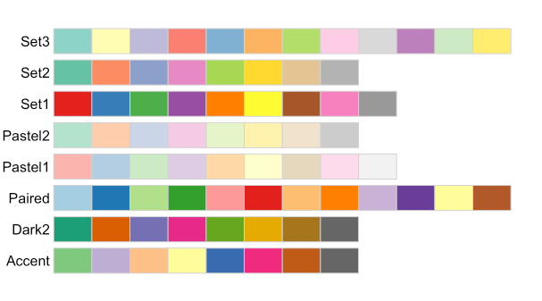

------------------------------------------------------------------------

<br>


## Introduction

“The greatest value of a picture is when it forces us to notice what we
never expected to see.” — John Tukey

Data visualization is a critical step in data analysis to communicate
our findings. Visual representation of data helps us to see
the hidden patterns, and trends that we cannot usually see easily in raw data . In this
lecture, we will learn how to create pretty, informative and publication
ready plots using the [ggplot2](https://ggplot2.tidyverse.org/) package
in R. `ggplot2` is a powerful and flexible package in R based on the
**Grammar of Graphics**. `ggplot2` aims to create grammatical rules for
the development of graphics. Learning graphics will help you to
create multi-layered graphics.

`ggplot2` creates plots layer by layer. You can keep on adding
annotations to graphs to build complex visualizations step by step. To
create a plot in `ggplot2`, you pass your data as first argument, add then add layer of
coordinates, and geometric objects (geoms) to
represent the data points and so on. You can add as many layers as you want in the
`ggplot` making the plot fully customizable.

### Overview & learning goals

In this lecture, you will learn : 

- Basic syntax of `ggplot` function in R
- How to create different types of plots using `ggplot2` package in R 
- How to add different layers of information to the plots 
- Export the plots in different formats

Specifically, you will learn:

- Learn about aesthetic mappings to the plots using `aes()`
- Learn about the themes of ggplot using `theme()`
- Add titles and labels using `labs()`
- Create scatter plot, bar graphs, box plot using `geom_point()`, `geom_col()`, `geom_bar()` and `geom_boxplot()`
- Facet the plots using `facet_wrap()` and `facet_grid()`

## Set up and Data preparation

### Open a new Quarto document in Rstudio

Open a new directory for `week13` by clicking the `New Folder` icon in
the `Output` pane. Create a new Quarto document by following exactly same steps
we learnt in `week12`: `File` \> `New File` \>
`Quarto Document` and save it inside the `week13` directory.

### Installing `tidyverse` and `palmerpenguins` packages

For this lecture, we will use two packages:
`Tidyverse and palmerpenguins`.
[Tidyverse](https://ggplot2.tidyverse.org/) is a larger collection of
packages including `ggplot2`. Some of the other useful packages in the
tidyverse for data manipulation and analysis includes `dplyr`for data
manipulation (**we learnt in week11**), `tidyr` for data tidying and more. By loading the
`tidyverse`, you gain access to all of those packages. Therefore, I
would recommend all of you to install the whole `tidyverse` package
instead of `ggplot2` alone. For the visualization, we will use
`palmerpenguins` data sets, which contains data on penguin species, their
physical measurements, and other attributes. 

::: {.callout-note}
It is good practice to always install package directly in R console. Otherwise, every time you render 
Quarto document, packages will be installed. Run the following code in
your R console to install the packages needed for data visualization
from Comprehensive R Archive Network (CRAN).
:::

```{r, eval=FALSE}
install.packages("tidyverse")
install.packages("palmerpenguins")
```

```{r}
library(tidyverse)
library(palmerpenguins)
```

::: callout-note
You only need to install a package once. However, you need to load the
package using **library()** every time you start a new R session.
:::

Let's load the penguin data set, look at the data and its structure.
`data` function loads the specified data sets and list of other available data sets.

```{r eval=FALSE}
data("penguins")
View(penguins)
str(penguins)
```

::: {.callout-note}
# Penguin data sets : It consists of body measurement data of 3 species of penguins collected from 3 islands 
in the Palmer, Archipelago, Antarctica. The data set contains 8 variables and 344 observations.
 
-   species (factor) : Species of penguin (Adelie, Chinstrap, Gentoo)
-   island (factor): Island where the penguin was found (Biscoe, Dream,
    Torg hensen)
-   bill_length_mm (num): Length of the penguin's bill in millimeters
-   bill_depth_mm (num): Depth of the penguin's bill in millimeters
-   flipper_length_mm (int): Length of the penguin's flipper in
    millimeters
-   body_mass_g (int): Body mass of the penguin in grams
-   sex (factor): Sex of penguins
-   year (int): Year of data collection

To find what data sets are available in a specific R package, you can use the function 
**data(package = "palmerpenguins")** in R.

:::

## Creating a ggplot

To create a plot using `ggplot2`, we will use the function `ggplot()`.
[ggplot2 cheat
sheet](https://rstudio.github.io/cheatsheets/data-visualization.pdf)
from RStudio provides an overview of the different types of plots that
can be created using the `ggplot2` package. Use the `help(?)` we learnt on
`week11` to read about `ggplot()` function.

::: {.callout-tip}
## `ggplot2 and ggplot` :
`ggplot2` is the package name that contains functions for data
visualization. `ggplot()` is the function to create plots in `ggplot2` package.
:::

Components of `ggplot()` : 

1. `Our data`: The data frame containing the
variables to be plotted. In this case, we will use the `penguins`
data set from the `palmerpenguins` package. 
2. `Mapping`: Aesthetic mapping defines how variables in the data are 
mapped to visual properties of the plot, such as x and y axes, 
colors, shapes, and sizes.
3. `Geometry (geom)`: It adds layers to represent our data such as
scatter plots, bar plots, box plots, etc.

#### A plotting framework

As mentioned above `ggplot` is composed of several layers. It might
not make sense right now but we will see couple of examples by adding
several layers to our plot and clarify it.

Your data frame is the first argument of `ggplot`. You can provide data in two ways: 
separately providing the data and piping it with the ggplot function `penguins |>  ggplot()` or inside the ggplot function `ggplot(data = penguins)` 

```{r}
## Two ways of passing first argument in ggplot
ggplot(data = penguins)
## We will use this style throughout the lecture
penguins |> 
  ggplot()
```

We have a blank plot because we have not provided any information on
what to plot. In the above code, we just specified the data frame we want to use.
This is a base layer or first layer. Next, we will specify the mapping of
variables in the x - axis and y - axis inside the aesthetics function `aes()`.

### Aesthetic mappings (aes)

**Aesthetics mappings** define how data variables are mapped to visual
properties of the plot. The variable mapped in aesthetics can be visualized.
The x and y argument of `aes()` function defines the variables to be plotted in
x - axis and y - axis respectively. Here, let's say we would like to create a scatter plot with 
**bill_length_mm** in x - axis and **bill_depth_mm** in y - axis.

```{r}
penguins |>  
  ggplot(aes(x =  bill_length_mm, 
                     y = bill_depth_mm))
```

Although we have defined x - axis and y - axis in this plot, we do not see the plot because we have not added
any geometric objects or we have not told how to represent the data frame to our plot.
Next, we will add geometric objects (**geoms**) to represent our data. There are multiple **geoms** available
such as `geom_point : scatter plot`, `geom_bar : bar graphs`, `geom_boxplot : box plots` and many more available [here](https://rstudio.github.io/cheatsheets/data-visualization.pdf).
Each geom function will have its own arguments to customize the plot. We have continuous values in both x and y axis. Therefore, we will create a scatter plot to visualize the relationship between `bill_length_mm` and `bill_depth_mm`. To create the scatter plot, we will add `geom_point()` layer to the plot using the `+` operator.

## Scatter plot

```{r}
penguins |>  
  ggplot(aes(x =  bill_length_mm, 
                     y = bill_depth_mm)) +
  geom_point()
```

Finally, we can see the scatter plot. But we want to add third layer to our plot.
For example, we would like to color the points by `species` of penguins. One way to do it would be
by coloring penguins by `species`. To change color by species, we need to map the `species` variable to color
inside the `aes()` function.
**When categorical variable is mapped to color, unique colors are assigned to each category automatically by ggplot2. And the legend will be added to show the category that corresponds to each color.**

```{r}
penguins |>  
  ggplot(aes(x =  bill_length_mm, 
                     y = bill_depth_mm, color = species)) +
  geom_point()
```

Now, we can see that each point is colored by the corresponding species of penguins. 
Again, we want to map the fourth variable `island`. Let's map `island` to different shapes
of the plot.

::: exercise
####  Exercise-1:
- What do you think will happen if you keep the `color = species` outside of `aes()`. 

<details>

<summary>Click for the solution</summary>

```{r}
penguins |>  
  ggplot(aes(x =  bill_length_mm, 
                     y = bill_depth_mm), color = species) +
  geom_point()
```

Anything outside `aes()` is considered as fixed setting. Therefore, all the points are colored black (default color). Legends will not be provided because we are not mapping variables to anything.

</details>

- Create a scatter plot with `bill_length_mm` in x-axis and `bill_depth_mm` in y-axis. Color the points by `species` and shape them by `island`.

<details>

<summary>Click for the solution</summary>

```{r}
penguins |>  
  ggplot(aes(x =  bill_length_mm, 
                     y = bill_depth_mm, color = species, shape = island)) +
  geom_point()
```

[Here](https://ggplot2.tidyverse.org/articles/ggplot2-specs.html) are several other aesthetic mappings 
options available  in `ggplot2`

</details>

:::

### Mapping vs settings

Sometimes we want to set a specific color or size to all the points in the graph. 
We can set the aesthetic outside the `aes()` function to do it. **To map variables, it needs to be inside `aes()`. However, it should be outside the `aes()` function to set a variable.**

::: exercise
####  Exercise-2:

1. Can you think how to color all the points red color in the above graph?

<details>

<summary>Click for the solution</summary>

```{r}
## you can set `color = "red" outside the `aes()` function inside the `geom_point()` function.
penguins |> 
  ggplot(aes(x =  bill_length_mm, 
                     y = bill_depth_mm )) +
  geom_point(color = "red")
```

</details>
:::

### Global mapping and local mapping
In the above examples, we mapped aesthetics to certain variable `color = species`, `shape = island` in 
`ggplot()` at the **global level**. Hence, the same mapping aesthetics will be passed down to other geom 
layers. However, each geom layer can have its own aesthetic mapping at **local level**.

```{r}
penguins |> 
  ggplot(aes(x =  bill_length_mm, 
                     y = bill_depth_mm, color = species)) +
  geom_point() +
  geom_smooth(method = "lm")
```

In the above code, we mapped `color = species` at the global level inside the `ggplot()` function, so
both `geom_point()` and `geom_smooth()` layers have the same mapping colors for the points and line.


```{r}
penguins |> 
  ggplot(aes(x =  bill_length_mm, 
                     y = bill_depth_mm)) +
  geom_point(aes(color = species)) +
  geom_smooth(method = "lm")
```
In the above code, we mapped `color = species` at the local level inside the `geom_point()` function.
Therefore, only the points are colored by species while the line is in default color (blue).

### Manually changing the colors
In the above codes, we used the default colors of ggplot. However, `ggplot` allows us to change the colors manually. We can set the exact colors of the plot using function `scale_color_manual`.

```{r}
penguins |> 
  ggplot(aes(x =  bill_length_mm, 
                     y = bill_depth_mm)) +
  geom_point(aes(color = species)) +
  scale_color_manual(values = c("grey55", "orange", "skyblue")) +
  geom_smooth(method = "lm")
```

The order of the color will correspond to the order of species in the legend. If you are unsure which color
to use for your plot, use the `colors()` to explore various available colors.

What if you have 10 treatments that you want to color? It requires lot of typing. R has several functions
with wide range of **color palettes**. Let's explore `RcolorBrewer` package that has several color palettes.
. To use the `RcolorBrewer` package, first install it and load the package.

{width="50%" fig-align="center"}

Let's pick `Pastel1` color palette for our scatter plot which needs to be used with the function `scale_color_brewer()`

```{r}
library(RColorBrewer)
penguins |> 
  ggplot(aes(x =  bill_length_mm, 
                     y = bill_depth_mm)) +
  geom_point(aes(color = species)) +
  scale_color_brewer(palette = "Pastel1") +
  geom_smooth(method = "lm")

```


### Adding titles and labels
Let's say we want to change the title and the axis labels of our plot. We can do it using the `labs()` function. Most of the arguments of `labs()` function are self-explanatory. For instance,
`title` adds title to the plot, `x` and `y` add labels to x - axis and y - axis respectively.
In the above plot if we want to add title **Scatter plot of bill length vs bill depth**  and change the axis labels of x-axis to **Bill length (mm)** and y-axis to **Bill depth (mm)**:
```{r}
penguins |>  
  ggplot(aes(x =  bill_length_mm, 
                     y = bill_depth_mm)) +
  geom_point(aes(color = species)) +
  geom_smooth(method = "lm")+
  labs(title = "Scatter plot of bill length vs bill depth",
       x = "Bill length (mm)",
       y = "Bill depth (mm)")
```

### Adjusting themes
There are two ways to adjust **themes** in ggplot2. You can either customize individual theme elements using the `theme()` function or apply a pre-defined theme to your plot using `theme_*()`.

We will first start by using preset theme. [There](https://ggplot2.tidyverse.org/reference/ggtheme.html) are several pre-defined themes available in ggplot2 such as `theme_minimal()`, `theme_classic()`, `theme_bw()`, `theme_light()` etc. Here we will apply the `theme_bw()` to our previous plot:
```{r}
penguins |>  
  ggplot(aes(x =  bill_length_mm, 
                     y = bill_depth_mm)) +
  geom_point(aes(color = species)) +
  geom_smooth(method = "lm") +
  labs(title = "Scatter plot of bill length vs bill depth",
       x = "Bill length (mm)",
       y = "Bill depth (mm)") +
  theme_bw()
```

Now, we can change the individual theme elements using the `theme()` function. For example, we will change
the text size of the plot title, axis and legend position using the command below:
```{r}
penguins |>  
  ggplot(aes(x =  bill_length_mm, 
                     y = bill_depth_mm)) +
  geom_point(aes(color = species)) +
  geom_smooth(method = "lm") +
  labs(title = "Scatter plot of bill length vs bill depth",
       x = "Bill length (mm)",
       y = "Bill depth (mm)") +
  theme_bw() +
  theme(plot.title = element_text(size = 16, face = "bold"),
    axis.title = element_text(size = 14),
    axis.text = element_text(size = 12),
    legend.position = "top")
```

We have tried to create `scatter plot` so far using `geom_point`. However, there are different `geoms` available to create different type of plot in `ggplot`

## Other Geometrical objects
### Bar plot 
It is one of the commonly used plot types.
It can be used to visualize relationship between the categorical variable and numerical variable such as mean  as well as counts per group. 
First, we will use bar graph to plot the mean of our data set. 
Let's compute the mean first manually to plot the data. In `week12` we learnt to group variable/s by `group_by` function. Use the same concept here to calculate the body mass of the penguins for each island.

```{r}
## Before plotting, compute the mean
mean <- penguins |> 
  group_by(island) |> 
  summarize(mean_body_mass = mean(body_mass_g, 
                                  na.rm = TRUE)) # remove missing values
    
```


```{r}
mean |> 
  ggplot(aes(x = island, y = mean_body_mass)) +
  geom_col()
```


We can also use the bar graph to plot the counts per group instead of mean.
```{r}
penguins |> 
  ggplot(aes(x = island)) +
  geom_bar()
```


### Box plot
We use box plot to visualize the relationship of numerical and categorical variables. We can 
see the distribution of data. Let's say we want to create a box plot to visualize the distribution of `body_mass_g` across different `island` of penguins.
```{r}
penguins |> 
  ggplot(aes(x =  island, 
             y = body_mass_g)) +
  geom_boxplot()
```

::: exercise
####  Exercise-3:

1. Can you add the jitter points in the boxplot above to see the individual data points? Hint use `geom_jitter()` function.

<details>

<summary>Click for the solution</summary>

```{r}
penguins |> 
  ggplot(aes(x =  island, 
             y = body_mass_g)) +
  geom_boxplot() +
  geom_jitter()
```

</details>

2. Can you color the jitter points with the species of penguins?

<details>

<summary>Click for the solution</summary>

```{r}
penguins |> 
  ggplot(aes(x =  island, 
             y = body_mass_g)) +
  geom_boxplot() +
  geom_jitter(aes(color = species))
```
</details>
:::

There are many other `geom` available in `ggplot` to construct the bar graph, histogram and more. 
[ggplot2 cheat
sheet](https://rstudio.github.io/cheatsheets/data-visualization.pdf) from RStudio provides a overview of the
different types of plots that can be created using the `ggplot2`. 


## Multi-panel figures-faceting
When you map too many variables in a single plot, your plot looks cluttered. One way to work around this 
problem is to facet the plot. Faceting allowing to create multiple panels based on the values of a 
categorical variable. It is useful to create separate sub-plots for each category of a variable to find the 
trends, patterns present in the data. You can use the `facet_wrap()` or `facet_grid()` functions to create faceted plots.

- `facet_wrap()`: Use this function to facet by single categorical variable. It allows to lay out
panels wrapped into a rectangular layout.

- `facet_grid()` : Use this function to facet by one or two categorical variables. It allows you to lay out your facets in a grid, one for rows and one for columns. 

Let's say, in the last box plot, we want to facet box plot by species:

```{r}
penguins |>  
  ggplot(aes(x =  island, 
             y = body_mass_g)) +
  geom_boxplot()+
  facet_wrap(vars(species))
```

If we want to facet by species and the sex of penguins, use the following code
```{r}
penguins |>  
  ggplot(aes(x =  island, 
             y = body_mass_g)) +
  geom_boxplot()+
  facet_grid(rows = vars(sex), cols = vars(species))
```

## Exporting the plots
You can save the plots in different formats such as PNG, JPEG, PDF, etc. either manually or by using the 
[ggsave](https://ggplot2.tidyverse.org/reference/ggsave.html) function. To export plot manually,
use the `Export` button in the `Plots` of the `output pane`. You can choose the file format, 
size, but you are limited in other parameters when you export file manually. `ggsave()` provides more flexibility to save the plots. 

```{r eval=FALSE}
ggsave(filename = "results/boxplot.png", # file path and name
       plot = box_plot_body_mass_and_island,  # what to save
       width = 18, 
       height = 12, 
       dpi = 300, # dots per inch,  ie resolution
       units = "cm") # units for width and height
```

## Recap and next steps
- Basic syntax of `ggplot2`
- Add layers in ggplot
- Aesthetic mappings using `aes()`
- Different types of plots using `geom_` functions
- Faceting the plots using `facet_wrap()` and `facet_grid()`