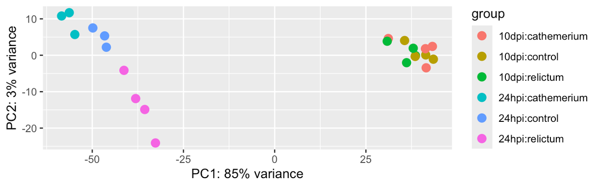
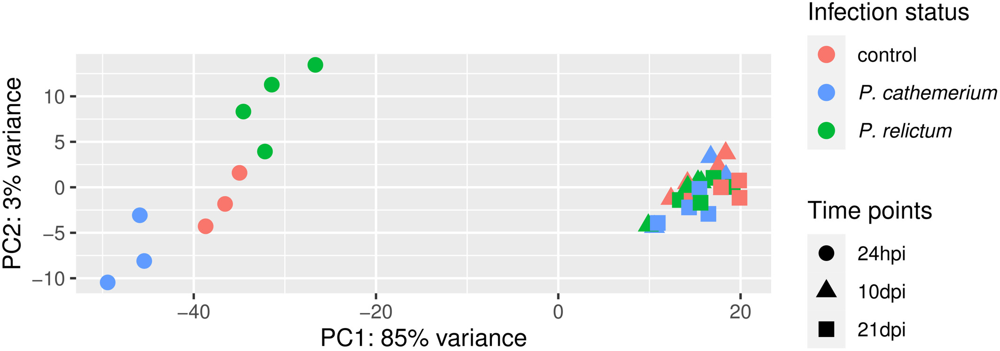
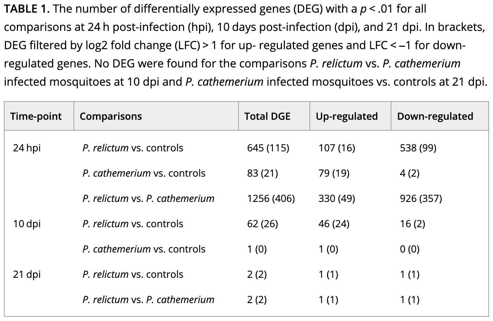

--------------------------------------------------------------------------------


<br>

## Introduction

### Overview & learning goals

After running steps like read pre-processing, alignment, and quantification using the separate programs (like 
Jelmer taught) or using a nf-core rnaseq workflow, you will have a **gene count table**.
Today, with that gene count table, you will:

- Create an R object that also incorporates the metadata
- Perform exploratory data analysis including a PCA
- Run a Differential Expression (DE) analysis
- Extract and visualize the DE results

### Setting up

1. At <https://ondemand.osc.edu>,
   start an RStudio session like in the previous lecture 
   ([Starting an RStudio Server session at OSC](../week11/w11a_r-basics.html#Working-directory-and-RStudio-Projects)) and open your RStudio Project
   
  2. Open a new folder for `week14` by clicking the `New Folder` icon in the `Output` pane
  3. Create a new Quarto document by  clicking `File` \> `New File` \>
`Quarto Document` and save it inside the `week14` directory.

## Install and load R packages

```{r, eval=FALSE}
if (!require("BiocManager")) install.packages("BiocManager")
if (!require("DESeq2")) BiocManager::install("DESeq2")
if (!require("EnhancedVolcano")) BiocManager::install("EnhancedVolcano")
if (!require("pheatmap")) install.packages("pheatmap")
```

```{r warning: FALSE}
library(tidyverse)          # Misc. data manipulation and plotting
library(pheatmap)           # Heatmap plot
library(EnhancedVolcano)    # Volcano plot
library(DESeq2)             # Differential expression analysis
library(here)               # File referencing
```


### Set the input file paths

For the differential expression analysis, we have the following input files:

- **Metadata table** ---
  Metadata for the study, linking sample IDs to treatments
- **Gene count table** ---
  Produced by the [nf-core rnaseq workflow](https://nf-co.re/rnaseq)

```{r, eval=FALSE}
# We'll save the paths to our input files for later use
count_table_file <- "/fs/ess/PAS2880/users/menuka/salmon.merged.gene_counts_length_scaled.tsv"
metadata_file <- "../garrigos-data/meta/metadata.tsv"
```

```{r, echo=FALSE}
count_table_file <- here::here("data/salmon.merged.gene_counts_length_scaled.tsv")
metadata_file <- here::here("data/metadata.tsv")
```

## Create a DESeq2 object

Like in the *Culex* [paper]([https://pmc.ncbi.nlm.nih.gov/articles/PMC12288828/) whose data we are working with,
we will perform a Principal
Component Analysis (PCA) and a Differential Expression (DE) analysis using the popular
**DESeq2** package
([paper](https://genomebiology.biomedcentral.com/articles/10.1186/s13059-014-0550-8),
[website](https://bioconductor.org/packages/release/bioc/html/DESeq2.html)).

The DESeq2 package has its own "object type" (a specific R format type) and before we can
do anything else, we need to create a DESeq2 object from three components:

1. **Metadata**\
   Independent variables should be in the metadata,
   allowing DESeq2 to compare groups of samples.
2. **Count table**\
   A matrix (table) with one row per gene, and one column per sample.
3. **A statistical design**\
   A statistical design formula (basically, which groups to compare) will tell DESEq2
   *how* to analyze the data.

### Metadata

First, we'll load the metadata file and take a look at the resulting data frame:

```{r}
# Read in the count table
meta_raw <- read_tsv(metadata_file, show_col_types = FALSE)
```

```{r}
# Take a look at the first 6 rows
head(meta_raw)
```

We'll make sure the data frame is sorted by sample ID, and that the sample IDs are
contained in "row names":

```{r}
# Prepare the metadata so it can be loaded into DESeq2
meta <- meta_raw |>
  # 1. Sort by the 'sample_id' column
  arrange(sample_id) |>
  # 2. Turn the 'sample_id' column into row names:
  column_to_rownames("sample_id") |>
  # 3. Turn the 'time' and 'treatment' columns into "factors":
  mutate(time = factor(time, levels = c("24hpi", "10dpi")),
         treatment = factor(treatment, levels = c("control", "cathemerium", "relictum")))
```

```{r}
# Take a look at the first 6 rows
head(meta)
```

::: {.callout-tip appearance="minimal"}
*In the two outputs above, note the difference between having the sample IDs as a separate
column versus as row names.*
:::

### Gene count table

Second, load the gene count table into R:

```{r}
# Read in the count table
count_df <- read_tsv(count_table_file, show_col_types = FALSE)
```

```{r}
# Take a look at the first 6 rows
head(count_df)
```

Again, we have to make several modifications before we can include it in the DESeq2 object.
DESeq2 expects with whole numbers (integers) and with gene IDs as row names:

```{r}
# Prepare the count table so it can be loaded into DESeq2
count_mat <- count_df |>
  # 1. Turn the 'gene_id' column into row names:
  column_to_rownames("gene_id") |>
  # 2. Remove a remaining non-numeric column (which has gene names):
  select(-gene_name) |>
  # 3. Round everything to whole numbers:
  round() |>
  # 4. Convert it to a formal 'matrix' format:
  as.matrix()
```

```{r}
# Take a look at the first 6 rows
head(count_mat)
```

#### Check that the sample IDs match

When creating the DESeq2 object, DESeq2 assumes that sample IDs in both tables match and
are provided in the same order. Let's make sure this is indeed the case:

```{r}
# Check that sample IDs in the metadata and the count table match
all(row.names(meta) == colnames(count_mat))
```

### Create the DESeq2 object

We will create the DESeq2 object using the function `DESeqDataSetFromMatrix()`, which we
will provide with three arguments corresponding to the components discussed above:

- The metadata with argument **`colData`**.
- The count data with argument **`countData`**.
- The statistical design for the DE analysis with argument **`design`**. For now, we
  will specify **`~1`**, which effectively means "no design" --- we will change this
  before the actual DE analysis.

```{r}
# Create the DESeq2 object
# (`dds` is a name commonly used for DESeq2 objects, short for "DESeq Data Set")
dds <- DESeqDataSetFromMatrix(
  colData = meta,
  countData = count_mat,
  design = ~ 1
  )
```

Before we will run the differential expression analysis, though,
we will do a bit of exploratory data analysis using our `dds` object.

## Exploratory Data Analysis

### The count matrix

What are the number of rows (=number of genes) and columns (=number of samples)
of our count matrix?

```{r}
dim(count_mat)
```

How many rows and columns are present in count_mat? What is the mean of rows in count_mat? Show the top six results.
```{r}
# sum of rows in matrix
head(rowSums(count_mat))
# sum of columns in matrix
head(colSums(count_mat))
# mean of rows in matrix
head(rowMeans(count_mat))
```

How many genes have total (= across all samples) counts that are non-zero?

```{r}
nrow(count_mat[rowSums(count_mat) > 0, ])
```

<hr style="height:1pt; visibility:hidden;" />

::: exercise
####  Exercise: gene counts

- How many genes have total counts of at least 10?

<details><summary>*Click to see the solution*</summary>

```{r}
nrow(count_mat[rowSums(count_mat) >= 10, ])
```
</details>

- *Bonus*: How many genes have *mean* counts of at least 10?

<details><summary>*Click to see the solution*</summary>
```{r}
# Now we need to divide by the number of samples, which is the number of columns,
# which we can get with 'ncol'
nrow(count_mat[rowSums(count_mat) / ncol(count_mat) >= 10, ])
```
</details>
:::

<hr style="height:1pt; visibility:hidden;" />

How do the "library sizes",
i.e. the summed per-sample gene counts, compare across samples?

```{r}
colSums(count_mat)
```

::: exercise
####  Bonus exercise: nicer counts

That's not so easy to read / interpret. Can you instead get these numbers in millions,
rounded to whole numbers, and sorted from low to high?

<details><summary>*Click to see the solution*</summary>

```{r}
sort(round(colSums(count_mat) / 1000000))
```

</details>
:::

### Principal Component Analysis (PCA)

We will run a PCA to examine overall patterns of (dis)similarity among samples,
helping us answer questions like:

- Do the samples cluster by treatment (infection status) and/or time point?
- Which of these two variables has a greater effect on overall patterns of gene expression?
- Is there an overall *interaction* between these two variables?

First, normalize the count data to account for differences in library size
among samples and "stabilize" the variance among genes[^4]:

[^4]: Specifically, the point is to remove the dependence of the variance in expression
      level on its mean, among genes

```{r}
dds_vst <- varianceStabilizingTransformation(dds)
```

::: callout-note
#### The authors of the study did this as well:

> *We carried out a Variance Stabilizing Transformation (VST) of the counts to represent
> the samples on a PCA plot.*
:::

Next, run and plot the PCA with a single function call, `plotPCA` from DESeq2:

```{r, eval=FALSE}
# With 'intgroup' we specify the variables (columns) to color samples by
plotPCA(dds_vst, intgroup = c("time", "treatment"))
```
```bash-out
using ntop=500 top features by variance
```

{fig-align="center" width="90%"}

<hr style="height:1pt; visibility:hidden;" />

::: exercise
####  Exercise: PCA

- Based on your PCA plot,
  try to answer the three questions asked at the beginning of this PCA section.

- How does our plot compare to the PCA plot in the paper (Figure 1),
  in terms of the conclusions you just drew in the previous exercise.

<details><summary>*Click to see the paper's Figure 1*</summary>



</details>

<hr style="height:1pt; visibility:hidden;" />

------------------------------------------------------------------------------------------

- *Bonus*: Compare the PCA plot with different numbers of included genes
  (Hint: figure out how to do so by looking at the help by running `?plotPCA`).

- *Bonus*: Customize the PCA plot --- e.g. can you "separate" treatment and time point
  (different shapes for one variable, and different colors for the other),
  like in Fig. 1 of the paper?

<details><summary>*Click to see some hints for PCA plot customization*</summary>

To expand on the point of the exercise: in the plot we made above, each combination of
time point and treatment has a distinct color --- it would be better to use **point
color** only to distinguish one of the variables, and **point shape** to distinguish the
other variable (as was also done in the paper's Fig. 1).

To be able to customize the plot properly, we best build it from scratch ourselves, rather
than using the `plotPCA` function. But then how do we get the input data in the right
shape?

A nice trick is that we can use `returnData = TRUE` in the `plotPCA` function, to get
plot-ready formatted data instead of an actual plot:

```{r}
pca_df <- plotPCA(
  dds_vst,
  ntop = 500,
  intgroup = c("time", "treatment"),
  returnData = TRUE
  )
```

With that `pca_df` dataframe in hand,
it will be relatively straightforward to customize the plot using your knowlegde
of ggplot2.

</details><details><summary>*Click to see a possible solution*</summary>

First, get the data in the right format, as explained in the hint:

```{r}
pca_df <- plotPCA(
  dds_vst,
  ntop = 500,
  intgroup = c("time", "treatment"),
  returnData = TRUE
  )
```

Second, extract and store the percentage of variance explained by different
principal components, so you can later add this information to the plot:

```{r}
pct_var <- round(100 * attr(pca_df, "percentVar"), 1)
pct_var
```

Now we can make the plot:

```{r}
pca_df |>
  ggplot(aes(x = PC1, y = PC2, color = treatment, shape = time)) +
  geom_point(size = 5) +
  labs(
    x = paste0("PC1 (", pct_var[1], "%)"),
    y = paste0("PC2 (", pct_var[2], "%)")
    ) +
  scale_color_brewer(palette = "Dark2", name = "Infection status") +
  scale_shape(name = "Time points") +
  theme_bw() +
  theme(panel.grid.minor = element_blank())
```

</details>
:::

## Differential Expression (DE) analysis

### Figuring out how to do the analysis

First, let's see how the DE analysis was done in the paper:

> *Then, we used the DESeq2 package (Love et al., 2014) to perform the differential gene
> expression analysis comparing: (i) P. relictum-infected mosquitoes vs. controls, (ii) P.
> cathemerium-infected mosquitoes vs. controls, and (iii) P. relictum-infected mosquitoes
> vs. P. cathemerium-infected mosquitoes.*

This is not terribly detailed and could be interpreted in a couple of different ways. For
example, they may have compared infection statuses by *ignoring* time points ***or*** by
*controlling for* time points (and there are different ways to do the latter).

_Ignoring time_ would mean analyzing the full dataset (all time points) while only using the
infection status as an independent variable, i.e. the design `~treatment`.

<details><summary> Given the PCA results, do you think that ignoring the `time` variable is a good idea? _(Click for the answer)_</summary>
No: the time variable clearly has a large effect on overall patterns of gene expression,
in fact more so than the treatment..
</details>

_Controlling for time_ can be done in two ways:

- A two-factor analysis: `~ time + treatment`.
- Pairwise comparisons between each combination of time and treatment
  (we'll see below *how* we can do that).

If we take a look at Table 1 with the DE results, it will become clearer how they did
their analysis:

{fig-align="center" width="80%"}

<details><summary> How do you interpret this: did they run pairwise comparisons or a two-factor model? _(Click for the answer)_</summary>
It looks like they performed pairwise comparisons between each combination of time
and treatment.
</details>

<hr style="height:1pt; visibility:hidden;" />

That brings us a step closer,
but pairwise comparisons with \>1 independent variable can (also!) be done in two ways:

- After **subsetting** the dataset to each combination of time and treatment.
- After creating a single, **combined independent variable** that is a combination of time and treatment.

The latter method is the more common one, and is what we will do below[^5].

[^5]: I can't tell from the paper which method they used.

### Setting the statistical design

We will now create a new variable that is a combination of `treatment` and `time`,
and call it `group`:

```{r}
# Create a combined variable called 'group':
dds$group <- factor(paste(dds$treatment, dds$time, sep = "_"))
```

```{r}
# Which unique values does 'group' have, and how many samples are in each?
table(dds$group)
```

Next, we set the analysis design:

```{r}
# Set the statistical design (Note: the symbol before 'group' is a tilde, ~ )
design(dds) <- ~ group
```

Now we're ready to run the DE analysis!

### Running the DE analysis

While we had to do a lot of prep to get to this stage,
actually running the DE analysis is very simple:

```{r}
# Run the DE analysis
# (We are assigning the output back to the same `dds` object - the DE results are added to it)
dds <- DESeq(dds)
```

The `DESeq()` function is a wrapper that performs three steps (functions) consecutively:

- `estimateSizeFactors()` --- "Normalization" by library size and composition.
- `estimateDispersions()` --- Estimate gene-wise dispersion (variance in counts).
- `nbinomWaldTest(ddsObj)` --- Fit the negative binomial GLM and calculate test statistics

A key thing to understand is that above, DESeq2 automatically performed **pairwise**
comparisons between **each of the (6) levels** of the `group` variable. This means that
for any individual gene, it tested whether the gene is differentially expressed
*separately for each of these pairwise comparisons*.

## Extracting the DE results

DESeq2 stores the results as a separate table for each pairwise comparison,
and now, we'll extract one of these.

### The results table

We can extract the results for one pairwise comparison (which DESeq2 refers to as a
**contrast**) at a time, by specifying it with the `contrast` argument as a vector of
length 3:

1. The focal independent variable (here, `group`)
2. The first (reference) level of the independent variable (in the example below,
   `relictum_24hpi`)
3. The second level of the independent variable (in the example below, `control_24hpi`)

```{r}
# Extract the DE results for one pairwise comparison
focal_contrast <- c("group", "relictum_24hpi", "control_24hpi")
res_rc24 <- results(dds, contrast = focal_contrast)

head(res_rc24)
```

What do the columns in this table contain?

- **`baseMean`**: Mean expression level across all samples.
- **`log2FoldChange`**: The "log2-fold change" of gene counts between the compared
  levels.
- **`lfcSE`**: The uncertainty in terms of the standard error (SE) of the log2-fold
  change estimate.
- **`stat`**: The value for the Wald test's test statistic.
- **`pvalue`**: The *uncorrected* p-value from the Wald test.
- **`padj`**: The multiple-testing corrected p-value (i.e., adjusted p-value).

::: {.callout-note collapse="true"}
### `NA` values in the DESeq2 results table _(Click to expand)_

Some values in the DESeq2 results table can be set to `NA` for one of the following reasons:

- If a gene contains a sample with a count **outlier**,
  both the p-value and adjusted p-value will be set to `NA`.
  (DESeq2 performs outlier detection using Cook's distance.)

- If all samples have **zero counts** for a given gene,
  the `baseMean` column will be zero, and the log2-fold change estimates,
  p-value and adjusted p-value will all be set to `NA`.

- DESeq2 also automatically filters genes with a **low mean count** in the sense that it
  does not include them in the multiple testing correction.
  Therefore, in such cases, the p-value will not be `NA`, but the *adjusted* p-value will be.

  Because we have very low power to detect differential expression for such low-count
  genes, it is beneficial to remove them prior to the multiple testing correction: that
  way, the correction becomes less severe for the remaining genes.

Let's see how many genes have `NA` p-values:

```{r}
# Number of genes with NA p-value:
sum(is.na(res_rc24$pvalue))

# As a proportion of the total number of genes in the test:
sum(is.na(res_rc24$pvalue)) / nrow(res_rc24)
```

And `NA` adjusted p-values:

```{r}
# Number of genes with NA p-value:
sum(is.na(res_rc24$padj))

# As a proportion of the total number of genes in the test:
sum(is.na(res_rc24$padj)) / nrow(res_rc24)
```
:::

::: callout-tip
#### Multiple testing correction
Because we are testing significance for *many* genes, we need to correct for multiple
testing. DESeq2 uses the Benjamini-Hochberg False Discovery Rate (FDR) correction. For
more info, see this [StatQuest video](https://www.youtube.com/watch?v=K8LQSvtjcEo).
:::

### Log2-fold changes

In RNA-seq, log2-fold changes (LFCs) are the standard way of representing the **magnitude
(*effect size*) of expression level differences** between two groups of interest. With A
and B being the compared sample groups, the LFC is calculated as:

``` bash-out-solo
log2(mean of A / mean of B)
```

Due the log-transformation, the LFC also increase more slowly than a raw fold-change:

- An LFC of **`1`** indicates a 2-fold difference
- An LFC of **`2`** indicates a 4-fold difference
- An LFC of **`3`** indicates a 8-fold difference

A nice property of LFC is that decreases and increases in expression are expressed
symmetrically:

- An LFC of **`1`** means that group A has a **two-fold higher** expression that group B
- An LFC of **`-1`** means that group A has a **two-fold lower** expression that group B

<hr style="height:1pt; visibility:hidden;" />

::: exercise
####  Exercise: Log-fold changes

Based on the above, or your knowledge of log-transformations,
what do you expect the following to return:

```{r, eval=FALSE}
# In the context of a LFC, these 2 numbers would be mean expression levels in 2 groups
log2(8 / 2)
log2(2 / 8)
```

<details><summary>*Click to see the solution*</summary>

- A fold-change of 4 (8/2) is a LFC of 2:

```{r}
log2(8 / 2)
```

- A fold-change of 0.25 (2/8) is a LFC of -2:

```{r}
log2(2 / 8)
```

</details>
:::

### Numbers of Differentially Expressed Genes (DEGs)

How many adjusted p-values were less than 0.05 (i.e., significant)?

```{r}
# (We need 'na.rm = TRUE' because some p-values are 'NA')
# (If we don't remove NAs from the calculation, sum() will just return NA)
sum(res_rc24$padj < 0.05, na.rm = TRUE)
```

So, we have `sum(res_rc24$padj < 0.05, na.rm = TRUE)` Differentially Expressed Genes
(**DEG**s) for this specific pairwise comparison.

<hr style="height:1pt; visibility:hidden;" />

::: exercise
####  Exercise: DEGs

The paper's Table 1 (which we saw above) reports the number of DEGs for a variety of
comparisons.

- How does the number of DEGs we just got compare to what they found in the paper for
  this comparison?

- The table also reports numbers of **up- and downregulated genes separately**. Can you
  find this out for our DEGs?

<details><summary>*Click to see the solution*</summary>

- **Solution using tidyverse/dplyr:**

```{r}
# First we need to convert the results table into a regular data frame
as.data.frame(res_rc24) |>
  # Then we only select the rows/genes that are significant
  filter(padj < 0.05) |>
  # If we run count() on a logical test, we get the nrs. that are FALSE v. TRUE
  dplyr::count(log2FoldChange > 0)
```

- **Solution using base R:**

```{r}
# Down-regulated (relictum < control):
sum(res_rc24$log2FoldChange < 0 & res_rc24$padj < 0.05, na.rm = TRUE)

# Up-regulated (relictum > control):
sum(res_rc24$log2FoldChange > 0 & res_rc24$padj < 0.05, na.rm = TRUE)
```

</details>

<hr style="height:1pt; visibility:hidden;" />

------------------------------------------------------------------------------------------

- *Bonus*: The table also reports the number of DEGs with an **absolute LFC \> 1**.
  Can you find this out for our DEGs?

<details><summary>*Click to see the solution*</summary>

- **Solution using tidyverse/dplyr:**

```{r}
# First we need to convert the results table into a regular data frame
as.data.frame(res_rc24) |>
  # Then we only select the rows/genes that are significant
  filter(padj < 0.05, abs(log2FoldChange) > 1) |>
  # If we run count() on a logical test, we get the nrs. that are FALSE v. TRUE
  dplyr::count(log2FoldChange > 0)
```

- **Solution using base R:**

```{r}
# Down-regulated (relictum < control):
sum(res_rc24$log2FoldChange < -1 & res_rc24$padj < 0.05, na.rm = TRUE)

# Up-regulated (relictum > control):
sum(res_rc24$log2FoldChange > 1 & res_rc24$padj < 0.05, na.rm = TRUE)
```

</details>

- *Bonus*: Extract the results for one or more **other contrasts** in the table,
  and compare the results.
:::

## Visualizing the DE results

To practice with visualization of the differential expression results,
we will create a few plots for the results for the `relictum_24hpi` vs. `control_24hpi`
comparison, which we extracted above.

### Volcano plot

For a nice overview of the results, we can create a so-called "volcano plot" using the
`EnhancedVolcano()` function from the package of the same name
([see here for a "vignette"/tutorial](https://bioconductor.org/packages/release/bioc/vignettes/EnhancedVolcano/inst/doc/EnhancedVolcano.html)):

```{r, fig.height=6.5}
EnhancedVolcano(
  toptable = res_rc24,      # DESeq2 results to plot   
  title = "relictum vs. control at 24 hpi",
  x = "log2FoldChange",     # Plot the log2-fold change along the x-axis
  y = "padj",               # Plot the p-value along the y-axis
  lab = rownames(res_rc24), # Use the rownames for the gene labels (though see below)
  labSize = 0               # Omit gene labels for now
  )
```

::: exercise
####  Bonus exercise: Volcano plots

The `EnhancedVolcano()` function by default adds gene IDs to highly significant genes,
but above, we turned off gene name labeling by setting `labSize = 0`.
I did this because the default p-value cut-off for point labeling is `1e-5` and in this case,
that would make the plot quite busy with gene labels.
We might want to try a plot with a stricter p-value cut-off that does show the gene labels.

- **Play around with the p-value cut-off and the labeling to create a plot you like.**\
  *Check [the vignette](https://bioconductor.org/packages/release/bioc/vignettes/EnhancedVolcano/inst/doc/EnhancedVolcano.html),*
  *or the help page (accessed by running `?EnhancedVolcano`) to see how you can do this.*

<details><summary>*Click for an example*</summary>

```{r, fig.height=6.5}
EnhancedVolcano(
  toptable = res_rc24,      
  title = "relictum vs. control at 24 hpi",
  x = "log2FoldChange",     
  y = "padj",             
  lab = rownames(res_rc24), 
  labSize = 4,               # Now we will show the gene labels
  pCutoff = 10e-10,          # Modify the p-value cut-off
  subtitle = NULL,           # I'll also remove the silly subtitle
  caption = NULL,            # ... and the caption
  )
```

</details>

- **Figure out the identity of the above-mentioned log2-fold change outlier.**\
  *(You can do so either by labeling it in the plot, or by filtering the `res_rc24` table.)*

<details><summary>*Click for the solution for how to lab it in the plot*</summary>
<hr style="height:1pt; visibility:hidden;" />

```{r}
#fig.height=6.5
EnhancedVolcano(
  toptable = res_rc24,      
  title = "relictum vs. control at 24 hpi",
  x = "log2FoldChange",     
  y = "padj",             
  lab = rownames(res_rc24), 
  labSize = 4,               
  pCutoff = 0.05,            # Modify the p-value cut-off
  FCcutoff = 20,             # Modify the LFC cut-off
  )
```
</details>

<details><summary>*Click for the solution for how to find it in the results table*</summary>
<hr style="height:1pt; visibility:hidden;" />

```{r}
as.data.frame(res_rc24) |> filter(log2FoldChange > 20)
```

(Interestingly, there's a second gene with a LFC \> 20 that we hadn't seen in the plot,
because it has `NA` as the `pvalue` and `padj`. See the
[section "Extra info: `NA` values in the results table" in the Appendix](#na-values-in-the-deseq2-results-table) 
for why p-values can be set to `NA`.)

</details>
:::

### Plot specific genes

We can also create plots of expression levels for individual genes. That is especially
interesting for genes with highly significant differential expression. So let's plot the
most highly significant DEG.

First, let's create a vector with most highly significant DEGs, which we'll use again for
the heatmap below.

```{r}
top25_DE <- row.names(res_rc24[order(res_rc24$padj)[1:25], ])

top25_DE
```

DESeq2 has a plotting function but the plot is not very good. We will still use that
function but just to quickly extract the counts for our gene of interest in the right
format for plotting, using `returnData = TRUE`:

```{r}
focal_gene_counts <- plotCounts(
  dds,
  gene = top25_DE[1],
  intgroup = c("time", "treatment"),
  returnData = TRUE
  )

head(focal_gene_counts)
```

Now, we can make the plot:

```{r, eval=FALSE}
focal_gene_counts |>
  # Treatment along the x-axis, gene counts along the y, color by treatment:
  ggplot(aes(x = treatment, y = count, fill = treatment)) +
  # Plot separate "facets" with the different time points
  facet_wrap(vars(time)) +
  # Add a boxplot with a partly transparent (alpha) color:
  geom_boxplot(alpha = 0.5, outlier.shape = NA) +
  # _And_ add individual points:
  geom_point(size = 4, shape = 21, position = position_jitter(w = 0.1, h = 0)) +
  # Plot styling (e.g., we don't need a legend)
  theme_bw() +
  theme(legend.position = "none")
```

```{r, echo=FALSE}
focal_gene_counts |>
  ggplot(aes(x = treatment, y = count, fill = treatment)) +
  facet_wrap(vars(time)) +
  geom_boxplot(alpha = 0.5, outlier.shape = NA) +
  geom_point(size = 4, shape = 21, position = position_jitter(w = 0.1, h = 0)) +
  theme_bw() +
  theme(legend.position = "none")
```

::: exercise
####  Exercise: Single-gene plots

- Plot one or a few more of the top-DE genes.
  Do they have similar expression patterns across treatment and time points as the first one?

------------------------------------------------------------------------------------------

- *Bonus*: Plot the gene with the very high LFC value that we saw when making the volcano plot.
  How would you interpret this?

<details><summary>*Click for the solution*</summary>

```{r}
focal_gene_counts <- plotCounts(
  dds,
  gene = "LOC120431476",
  intgroup = c("time", "treatment"),
  returnData = TRUE
  )

focal_gene_counts |>
  ggplot(aes(x = treatment, y = count, fill = treatment)) +
  geom_boxplot(alpha = 0.5, outlier.shape = NA) +
  geom_point(size = 4, shape = 21, position = position_jitter(w = 0.1, h = 0)) +
  facet_wrap(vars(time)) +
  theme_bw() +
  theme(legend.position = "none")
```

Wow! It looks like in every single time + treatment combinations, all but one (or in one
case, two) of the samples have zero expression, but there are several extreme outliers.

Our focal comparison at `24hpi` (left panel/facet), and comparing `control` vs `relictum`:
so it looks like the difference between these two groups is solely due to the one outlier
in `relictum`. Nevertheless, even the multiple-testing corrected p-value (`padj`) is
significant for this gene:

```{r}
as.data.frame(res_rc24) |>
  rownames_to_column("gene") |>
  filter(gene == "LOC120431476")
```

So, we have to be careful with talking our statistical results at face value, and need to
visualize important genes!

</details>

::: callout-important
#### Outliers!
You may want to check out the solution to the previous exercise, even if you don't get
around to doing it yourself.
:::
:::

### Exporting the results

To save the DE results tables, you can for example use the `write_tsv()` function.
You could open the resulting file in Excel for further exploration.

```{r, eval=FALSE}
# Create the output directory, if necessary:
dir.create("results/DE", recursive = TRUE, showWarnings = FALSE)

# Write the 
write_tsv(as.data.frame(res_rc24), "results/DE/resultsres_rc24.tsv")

dds_file <- "TBA"
saveRDS(dds, dds_file)
```

## In Closing
Today, you have performed several steps in the analysis of gene counts that result from a
typical RNA-seq workflow. Specifically, you have:

- Created a DESEq2 object from the gene count data and the experiment's metadata
- Performed exploratory data analysis including a PCA
- Ran a Differential Expression (DE) analysis with DESeq2
- Extracted, interpreted, and visualized the DE results

#### Next steps

Typical next steps in such an analysis include:

- Another very common type of plot used for gene expression data (and omics data
  more generally) is a heatmap.
  You'll create heatmaps in [this week's exercises](./w14_exercises.qmd).

- Extracting, comparing, and synthesizing DE results across **all pairwise comparisons**
  (this would for example allow us to make the upset plot in *Figure 2 of the paper*)

- **Functional enrichment analysis** with Gene Ontology (GO) terms,
   as done in the paper,
   and/or with KEGG pathways and other functional gene grouping systems.
