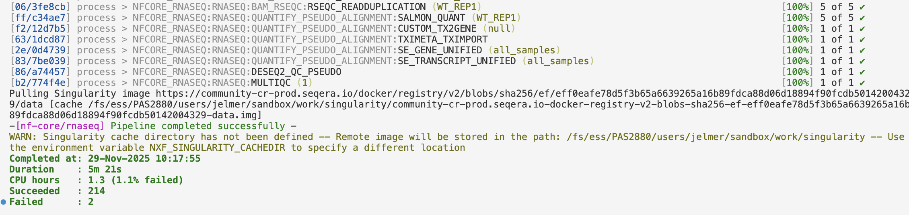
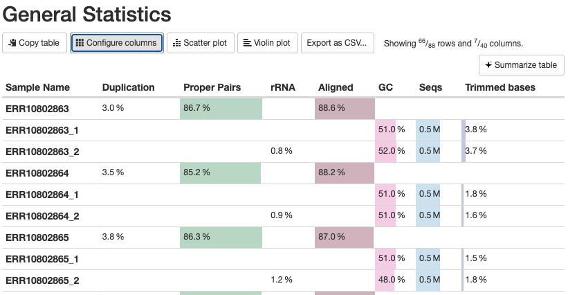
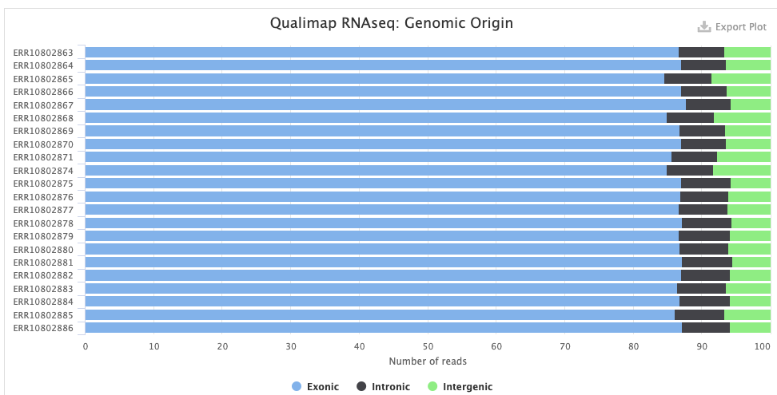
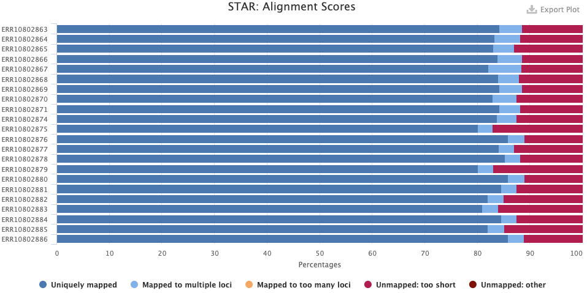
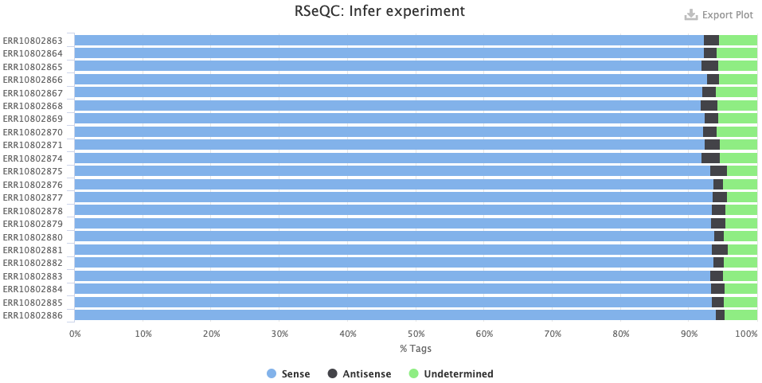
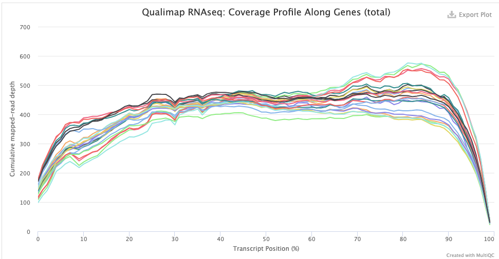
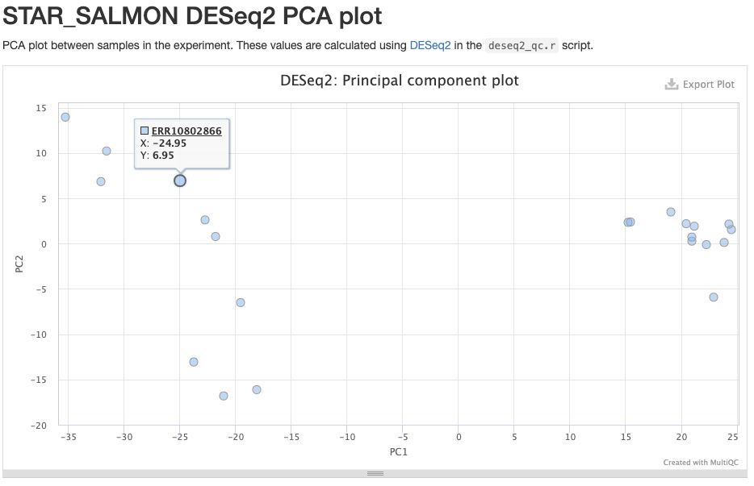

--------------------------------------------------------------------------------

<br>

## Before we get started

Today (and during part of Thursday's meeting),
we will cover how you can run a bioinformatics pipeline written in the Nextflow
language and developed as part of the nf-core initiative.

### Learning goals

Specifically, you will learn:

- Why you may want to use pipelines like those made by the nf-core initiative
- What the nf-core _rnaseq_ pipeline does, and when you would want to use it
- How these pipelines can be run with a single command,
  while they submit jobs to the Slurm scheduler at OSC.
- The difference between general Nextflow options and pipeline-specific options
- How to set up inputs and outputs,
  including the distinction between a final output dir and a "work dir"
- How to monitor pipeline progress
- How to restart a pipeline run using the `-resume` option
- How to find and interpret the output files produced by the pipeline

### Getting ready

1. Connect your **local VS Code installation** to OSC's Pitzer cluster.
   
2. In your VS Code terminal, create and enter a working dir for this week:
   
   ```bash
   mkdir week15
   cd week15
   ```
   
## Introduction

### Why run (nf-core) pipelines?

In [week 9](../week09/w9a_workflow.html),
we talked about managing complex bioinformatics workflows,
and the advantages that formal Workflow Management Systems like
[Nextflow](https://www.nextflow.io/) (@ditommaso2017)
have over DIY pipelines based on e.g. shell scripts.
While you can use Nextflow to build your own workflows from scratch,
we will here cover how to run an existing, community-developed Nextflow pipeline.

I think this is well worth covering for a few reasons:

- Pipelines are available for many types of omics data analysis,
  so you may well be able to use one for your own research
- Running such a pipeline is a bit different and more involved than running a
  typical piece of bioinformatics software.
  But when you know how to run one nf-core pipeline,
  it will be relatively straightforward to run others as well.

Recall from week 9 that the ["nf-core" initiative](https://nf-co.re/) (@ewels2020)
has many pipelines available for various omics data analysis types,
with the following most popular pipelines: 

{fig-align="center" width="95%" .lightbox}

Today, we will learn how to run a Nextflow/nf-core pipeline by running the
[nf-core _rnaseq_](https://nf-co.re/rnaseq) pipeline on the @garrigós2025 RNA-Seq
data set that we've been using throughout the course.

### The nf-core _rnaseq_ pipeline

The nf-core _rnaseq_ pipeline is meant for RNA-Seq datasets like @garrigós2025's,
where reads are aligned to a reference genome to produce gene-level counts^[
As opposed to transcript-level counts,
which are harder to accurately obtain with short-read data.
Additionally, the pipeline only works when a reference genome is available
as it cannot do _de novo_ transcriptome assembly.].

The inputs of this pipeline are FASTQ files with raw reads,
and reference genome files (assembly & annotation),
while the outputs include a gene count table and many "QC outputs".
The pipeline will perform all the steps from raw reads to gene counts,
but not the gene count analysis itself^[
That makes sense because the latter part is not nearly as "standardized" as the first.].
Let's take a closer look at the steps in the pipeline:

{fig-align="center" width="100%"}

**Stage 1: Read QC and pre-processing**

- Read QC (FastQC)
- Adapter and quality trimming (TrimGalore)
- Optional removal of rRNA (SortMeRNA) --- off by default, but we will include this

**Stage 2: Alignment & quantification**

- Alignment to the reference genome/transcriptome (STAR)
- Gene expression quantification (Salmon)

**Stages 3 and 4: Post-processing, QC, and reporting**

- Post-processing alignments: sort, index, mark duplicates (samtools, Picard)
- Alignment/count QC (RSeQC, Qualimap, dupRadar, Preseq, DESeq2)
- Create a QC/metrics report (MultiQC)

::: {.callout-tip collapse="true"}
#### Customizing what the pipeline does _(Click to expand)_

This pipeline is quite flexible and you can turn several steps off,
add optional steps, and change individual options for most tools that the pipeline runs.

- **Optional removal of contaminants** (BBSplit)\
  Map to 1 or more additional genomes whose sequences may be present as contamination,
  and remove reads that map better to contaminant genomes.
- **Alternative quantification routes**
  - Use RSEM instead of Salmon to quantify.
  - Skip STAR and perform direct pseudo-alignment & quantification with Salmon.
- **Transcript assembly and quantification (StringTie)**\
  While the pipeline is focused on gene-level quantification,
  it does produce transcript-level counts as well (this is run by default).
:::

### Overview of running an nf-core pipeline

Here are some key aspects of running the nf-core _rnaseq_ pipeline
(and other nf-core pipelines) at OSC:

- We only need access to an **installation** of Nextflow.
  The pipeline runs all its constituent tools (FastQC, STAR, Salmon, etc.)
  via separate Singularity containers that it will download for us.
  
- We can run the pipeline with a single command (`nextflow run [...]`).
  The resulting Nextflow process will **submit Slurm batch jobs for us**,
  trying to parallelize as much as possible, spawning _many_ jobs.
  The main Nextflow process functions to orchestrate these jobs
  and will keep running until the pipeline has finished or failed. 
  To tell the pipeline how to submit jobs, we will need a small "**config file**".

- The main Nextflow process does not need much computing power,
  e.g., a single core with the default 4 GB of RAM will be sufficient.
  But even though our VS Code shell already runs on a compute node,
  we are better off also **submitting the main process as a batch job**,
  because this process can run for many hours.

- Nextflow **distinguishes between a final output dir and a "work dir" (`work`)**.
  All jobs will run and produce outputs in various sub-dirs of the _work dir_.
  After each process, only a selection of output files are copied from the work dir
  to the final output dir^[
  Typically, not all outputs are copied, especially for intermediate steps like
  read trimming -- and pipelines have settings to determine what is copied.].
  This distinction is useful at OSC, where a Scratch dir (`/fs/scratch`) is most suitable
  as the work dir due to its fast I/O and ample storage space,
  while a Project dir (`/fs/ess/`) is most suitable as the final output dir. 

- When you run a pipeline, the relevant `nextflow` command distinguishes between:
  - **Pipeline-specific options** to e.g. set inputs and outputs and customize
    which steps will be run and how (there can be 100+ of these for larger pipelines).
    By convention, these have a double dash `--`, e.g. `--input`.
  - **General Nextflow options** to e.g. pass a configuration file for Slurm batch job
    submissions and determine resuming behavior (see below).
    These always have a single dash, e.g. `-resume`.
    
    ```bash
    # In this example, --input is a pipeline-specific option,
    # while -resume is a general Nextflow option:
    nextflow run nf-core/rnaseq --input samplesheet.csv -resume
    ```

- Nextflow pipelines can be **restarted** flexibly using the `-resume` option,
  which will make a pipeline:

  - Start where it left off if the previous run failed before finishing or timed out.
  - Check for changes in input files or pipeline settings,
    such that it will only rerun what is needed...
    - after adding or removing samples
    - after changing/replacing one or more input files
    - after changing specific settings --
      e.g., a setting only affecting the very last step will mean that only that 
      step will be rerun

## Testing and orientation
  
We'll use Nextflow via an OSC module, and will start with finding and loading
that module.
Then, we'll do a test run of the nf-core _rnaseq_ pipeline.

### Test the Nextflow installation

::: exercise
###  Exercise

Find the OSC Nextflow modules with a `module` command.
Then, load the most recent Nextflow module.
Finally, check that Nextflow can be run by printing the version with `nextflow -v`.

<details><summary>Solution _(Click to expand)_</summary>

- Find the available module(s):

  ```bash
  module avail nextflow
  ```
  ```bash-out
  --------------------------------------------------------------------------------
    nextflow:
  --------------------------------------------------------------------------------
       Versions:
          nextflow/24.10.4
          nextflow/25.04.6
  
  --------------------------------------------------------------------------------
    For detailed information about a specific "nextflow" package (including how to load the modules) use the module's full name.
    Note that names that have a trailing (E) are extensions provided by other modules.
    For example:
  
       $ module spider nextflow/25.04.6
  ------------------------------------------------------------------------------
  ```

- So, the most recent version is `nextflow/25.04.6` -- load it:

  ```bash
  module load nextflow/25.04.6
  ```
  
- Check that Nextflow works by printing its version:

  ```bash
  nextflow -v
  ```
  ```bash-out
  nextflow version 25.04.6.5954
  ```
</details>
:::

### Test-run the _rnaseq_ pipeline

All nf-core pipelines can be test-run with a small test data set that is included
with the pipeline.
Let's perform such a test-run to become familiar with the command syntax and
the pipeline's progress log and outputs.

```bash
mkdir testrun
cd testrun
```

```bash
nextflow run nf-core/rnaseq \
  -r 3.22.0 \
  -profile test,singularity \
  --outdir results/nfc-rnaseq
```

Explanation of the command above:

- The `nextflow` command has several subcommands,
  and we use the `run` subcommand to run a pipeline
- The pipeline to run is the argument to `nextflow run`, here:
  `nf-core/rnaseq`^[
  If we had wanted to run the _sarek_ pipeline, for example,
  we would use `nf-core/sarek` instead.]
- The `-r` option specifies the pipeline version to use
  (here, version `3.22.0`, the currently most recent one)
- The `-profile` option specifies which "profile(s)" to use:
  - `test` tells the pipeline to use its built-in test data set
  - `singularity` tells the pipeline to run software via Singularity containers
- The `--outdir` option specifies the final output dir for the pipeline.
  
<details><summary> In the above command, which are general Nextflow vs. pipeline-specific options? _(Click for the answer)_</summary>

Recall that general Nextflow options have a single dash (`-`),
while pipeline-specific options have a double dash (`--`).
As such, `--outdir` is the only pipeline-specific option in this command;
all others are general Nextflow options.
</details>

### The test-run's progress log

If you haven't done so already,
execute the above `nextflow run` command to start the test run.
Since you are running this directly in the terminal,
logging output (standard out and standard error) will be printed to the screen.
Here is the first bit of expected output
(as you can see, all the inputs from the test dataset will be downloaded from GitHub):

```bash-out-solo
Nextflow 25.10.2 is available - Please consider updating your version to it

 N E X T F L O W   ~  version 25.04.6

Launching `https://github.com/nf-core/rnaseq` [exotic_lavoisier] DSL2 - revision: c522f87e14 [3.22.0]


------------------------------------------------------
                                        ,--./,-.
        ___     __   __   __   ___     /,-._.--~'
  |\ | |__  __ /  ` /  \ |__) |__         }  {
  | \| |       \__, \__/ |  \ |___     \`-._,-`-,
                                        `._,._,'
  nf-core/rnaseq 3.22.0
------------------------------------------------------

Input/output options
  input                     : https://raw.githubusercontent.com/nf-core/test-datasets/626c8fab639062eade4b10747e919341cbf9b41a/samplesheet/v3.10/samplesheet_test.csv
  outdir                    : results/nfc-rnaseq

Reference genome options
  fasta                     : https://raw.githubusercontent.com/nf-core/test-datasets/626c8fab639062eade4b10747e919341cbf9b41a/reference/genome.fasta
  gtf                       : https://raw.githubusercontent.com/nf-core/test-datasets/626c8fab639062eade4b10747e919341cbf9b41a/reference/genes_with_empty_tid.gtf.gz
  gff                       : https://raw.githubusercontent.com/nf-core/test-datasets/626c8fab639062eade4b10747e919341cbf9b41a/reference/genes.gff.gz
  transcript_fasta          : https://raw.githubusercontent.com/nf-core/test-datasets/626c8fab639062eade4b10747e919341cbf9b41a/reference/transcriptome.fasta
  additional_fasta          : https://raw.githubusercontent.com/nf-core/test-datasets/626c8fab639062eade4b10747e919341cbf9b41a/reference/gfp.fa.gz
  hisat2_index              : https://raw.githubusercontent.com/nf-core/test-datasets/626c8fab639062eade4b10747e919341cbf9b41a/reference/hisat2.tar.gz
  salmon_index              : https://raw.githubusercontent.com/nf-core/test-datasets/626c8fab639062eade4b10747e919341cbf9b41a/reference/salmon.tar.gz
```

Below is some of the output regarding the processes that the pipeline spawns, where:

- The `executor > local` line indicates that the pipeline is running jobs "locally",
  i.e. on the same node as the main Nextflow process.
  (For the test run, this is just about fine,
  but when we run the pipeline on our real data,
  we will want to have these submitted as Slurm batch jobs instead.)

- Each `process >` line indicates a specific process (_step in the pipeline_) that is being run.
  - For some of these, it says `5 of 5` way on the right,
    which indicates that for this process,
    multiple jobs are being run in parallel
    (typically one per sample, and this is true for the majority of processes)
  - Other processes have `1 of 1`, indicating that only a single job is run
    (e.g., for preparing the reference genome)
  - In my example output below, one line says `retries: 2`,
    indicating that this job failed twice but was retried and eventually succeeded
  - The hexadecimal string at the start of each line (e.g., `[d2/97278b]`)
    is a unique identifier for (one of) that process' jobs.
    We'll get back to this later, as that string also identifies 
    the location where this job is run and its input and output files are stored
    within the `work` dir^[
    Note that when the same process is run multiple times in parallel,
    each instance will have a different hexadecimal code, but not all instances
    are shown -- this will be different when we run the pipeline on our data with
    a slightly different setting.].

```bash-out-solo
[d2/97278b] process > NFCORE_RNASEQ:RNASEQ:FASTQ_QC_TRIM_FILTER_SETSTRANDEDNESS:FQ_LINT_AFTER_TRIMMING (WT_REP1)                         [100%] 5 of 5 ✔
[9a/ce2657] process > NFCORE_RNASEQ:RNASEQ:FASTQ_QC_TRIM_FILTER_SETSTRANDEDNESS:BBMAP_BBSPLIT (WT_REP1)                                  [100%] 5 of 5, retries: 2 ✔
[40/ca9917] process > NFCORE_RNASEQ:RNASEQ:FASTQ_QC_TRIM_FILTER_SETSTRANDEDNESS:FQ_LINT_AFTER_BBSPLIT (WT_REP1)                          [100%] 5 of 5 ✔
[5d/75070a] process > NFCORE_RNASEQ:RNASEQ:FASTQ_QC_TRIM_FILTER_SETSTRANDEDNESS:FASTQ_SUBSAMPLE_FQ_SALMON:FQ_SUBSAMPLE (WT_REP1)         [100%] 1 of 1 ✔
[e2/e27cbb] process > NFCORE_RNASEQ:RNASEQ:FASTQ_QC_TRIM_FILTER_SETSTRANDEDNESS:FASTQ_SUBSAMPLE_FQ_SALMON:SALMON_QUANT (WT_REP1)         [100%] 1 of 1 ✔
[72/cb3999] process > NFCORE_RNASEQ:RNASEQ:ALIGN_STAR:STAR_ALIGN (WT_REP1)                                                               [100%] 5 of 5 ✔
[a4/e4a18e] process > NFCORE_RNASEQ:RNASEQ:ALIGN_STAR:BAM_SORT_STATS_SAMTOOLS:SAMTOOLS_SORT (WT_REP1)                                    [100%] 5 of 5 ✔
[66/ec2aab] process > NFCORE_RNASEQ:RNASEQ:ALIGN_STAR:BAM_SORT_STATS_SAMTOOLS:SAMTOOLS_INDEX (WT_REP1)                                   [100%] 5 of 5 ✔
executor >  local (216)
[6c/714522] process > NFCORE_RNASEQ:PREPARE_GENOME:GUNZIP_GTF (genes_with_empty_tid.gtf.gz)                                              [100%] 1 of 1 ✔
[07/5a941c] process > NFCORE_RNASEQ:PREPARE_GENOME:GTF_FILTER (genome.fasta)                                                             [100%] 1 of 1 ✔
```

Here is some output related to the downloading of Singularity containers
(by default these are downloaded to a `singularity` subdir of the `work` dir):

```bash-out-solo
Pulling Singularity image https://community-cr-prod.seqera.io/docker/registry/v2/blobs/sha256/52/52ccce28d2ab928ab862e25aae26314d69c8e38bd41ca9431c67ef05221348aa/data [cache /fs/ess/PAS2880/users/jelmer/week15/testrun/work/singularity/community-cr-prod.seqera.io-docker-registry-v2-blobs-sha256-52-52ccce28d2ab928ab862e25aae26314d69c8e38bd41ca9431c67ef05221348aa-data.img]
Pulling Singularity image https://depot.galaxyproject.org/singularity/fq:0.12.0--h9ee0642_0 [cache /fs/ess/PAS2880/users/jelmer/week15/testrun/work/singularity/depot.galaxyproject.org-singularity-fq-0.12.0--h9ee0642_0.img]
Pulling Singularity image https://community-cr-prod.seqera.io/docker/registry/v2/blobs/sha256/9b/9becad054093ad4083a961d12733f2a742e11728fe9aa815d678b882b3ede520/data [cache /fs/ess/PAS2880/users/jelmer/week15/testrun/work/singularity/community-cr-prod.seqera.io-docker-registry-v2-blobs-sha256-9b-9becad054093ad4083a961d12733f2a742e11728fe9aa815d678b882b3ede520-data.img]
Pulling Singularity image https://depot.galaxyproject.org/singularity/fastqc:0.12.1--hdfd78af_0 [cache /fs/ess/PAS2880/users/jelmer/week15/testrun/work/singularity/depot.galaxyproject.org-singularity-fastqc-0.12.1--hdfd78af_0.img]
Pulling Singularity image https://depot.galaxyproject.org/singularity/python:3.9--1 [cache /fs/ess/PAS2880/users/jelmer/week15/testrun/work/singularity/depot.galaxyproject.org-singularity-python-3.9--1.img]
```
After some time, the pipeline should finish, hopefully successfully:

```bash-out-solo
[fb/68d030] process > NFCORE_RNASEQ:RNASEQ:MULTIQC (1) [100%] 1 of 1 ✔
-[nf-core/rnaseq] Pipeline completed successfully -
Completed at: 29-Nov-2025 10:06:48
Duration    : 5m 23s
CPU hours   : 1.3
Succeeded   : 214
```

The output that you should see printed to your terminal should have colors
that are not displayed above -- for example:

{fig-align="center" width="95%"}

### Test-run output files

The final output files are in the dir we specified --
as you can see, there are several sub-dirs with outputs from various steps,
and these dirs are named after the tools that produced them:

```bash
ls results/nfc-rnaseq
```
```bash-out
bbsplit  custom  fastqc  fq_lint  multiqc  pipeline_info  salmon  star_salmon  trimgalore
```

We'll explore those outputs more for the run on the @garrigós2025 data.
The `work` dir is in this case in its default location, which is you current
working dir (i.e, the dir from which you execute the `nextflow` command) --
let's list its contents:

```bash
ls work
```
```bash-out
02  07  14  1e  23  2f  3b  47  51  5a  65  6e  78  81  8b  93  9e  a5  aa  b0  b7  c0  cf            d8  e6  ec  f7  singularity
03  08  15  1f  24  33  40  4b  52  5b  66  70  7a  82  8c  94  9f  a6  ab  b1  ba  c1  collect-file  d9  e8  ed  f8  stage-450f1767-7222-43e1-96cd-7d7b2a8a187c
04  0c  17  20  25  37  42  4c  55  5c  69  71  7b  83  8d  95  a1  a7  ad  b2  bc  c3  d2            db  e9  f1  fa  tmp
05  0f  1a  21  2c  38  43  4e  56  5d  6a  72  7c  86  90  9a  a3  a8  ae  b3  bd  c6  d3            e2  ea  f2  fb
06  11  1d  22  2e  3a  45  4f  59  63  6c  73  80  87  91  9d  a4  a9  af  b4  bf  ce  d7            e3  eb  f3  ff
```

As mentioned above, the hexadecimals between square brackets (e.g. `[62/4f8c0d]`)
that are printed before each job point to the sub-directory within this work-dir that
it ran in (every individual job runs in its own dir).
This can be handy for troubleshooting,
or even just to take a closer look at what exactly the pipeline is running.

Say we want to look at the files for the last process, MultiQC,
which had the following printed in the log:

```bash-out-solo
[fb/68d030] process > NFCORE_RNASEQ:RNASEQ:MULTIQC (1) [100%] 1 of 1 ✔
```

We can check the files in that dir as follows --
we'll use the `-a` option to `ls` so hidden files are also listed,
some of which are of interest:

```bash
# (The full name of the `68d030` dir is much longer,
#  but the first characters uniquely identify it, so you can tab-complete it)
ls -a work/fb/68d030ebc1e94a4f0c8efa189b6bc30
```
```bash-out
.    .command.err    .exitcode             versions.yml
..   .command.log    multiqc_config.yml
1    .command.out    multiqc_report_data
10   .command.run    multiqc_report.html
100  .command.sh     multiqc_report_plots
101  .command.begin  .command.trace  name_replacement.txt
# [...Not all files shown...]
```

The files in this `work` subdir include:

- Input files (as links/shortcuts, so the files don't have to be copied in full)
- Output files, such as `multiqc_report.html`
- Several hidden files starting with a dot (`.`), including:
  - `.command.sh`: the exact command that was run by this process
  - `.command.log`: logging information from the process run

To see exactly how MultiQC was run by the pipeline,
show the contents of the `.command.sh` file --
for now, the details of this command aren't important,
but it's good to know where to find it when you need to troubleshoot or for another
reason would like to know exactly how a program was run.

```bash
cat work/fb/68d030ebc1e94a4f0c8efa189b6bc30/.command.sh 
```
```bash-out
#!/usr/bin/env bash -C -e -u -o pipefail
multiqc \
    --force \
     \
    --config multiqc_config.yml \
    --filename multiqc_report.html \
     \
     \
    --replace-names name_replacement.txt \
     \
    .

cat <<-END_VERSIONS > versions.yml
"NFCORE_RNASEQ:RNASEQ:MULTIQC":
    multiqc: $( multiqc --version | sed -e "s/multiqc, version //g" )
END_VERSIONS
```

### Re-running the pipeline with `-resume`

Let's quickly explore how the `-resume` option works.
We can re-run the same command as above, but now adding `-resume`:

```bash
nextflow run nf-core/rnaseq \
  -r 3.22.0 \
  -profile test,singularity \
  --outdir results/nfc-rnaseq \
  -resume
```
This pipeline run should complete very quickly,
because all steps were already completed successfully in the previous run --
the process logging should look like this,
where `cached: 1 ✔` indicates that the outputs were already present from before,
and the job wasn't actually rerun:

```bash-out
[6c/714522] NFCORE_RNASEQ:PREPARE_GENOME:GUNZIP_GTF (genes_with_empty_tid.gtf.gz)                                                  [100%] 1 of 1, cached: 1 ✔
[6c/714522] NFCORE_RNASEQ:PREPARE_GENOME:GUNZIP_GTF (genes_with_empty_tid.gtf.gz)                                                  [100%] 1 of 1, cached: 1 ✔
[07/5a941c] NFCORE_RNASEQ:PREPARE_GENOME:GTF_FILTER (genome.fasta)                                                                 [100%] 1 of 1, cached: 1 ✔
[f7/32ee05] NFCORE_RNASEQ:PREPARE_GENOME:GUNZIP_ADDITIONAL_FASTA (gfp.fa.gz)                                                       [100%] 1 of 1, cached: 1 ✔
[80/4b8821] NFCORE_RNASEQ:PREPARE_GENOME:CUSTOM_CATADDITIONALFASTA (null)                                                          [100%] 1 of 1, cached: 1 ✔
[59/1f5b09] NFCORE_RNASEQ:PREPARE_GENOME:GTF2BED (genome_gfp.gtf)                                                                  [100%] 1 of 1, cached: 1 ✔
[66/33bfeb] NFCORE_RNASEQ:PREPARE_GENOME:CUSTOM_GETCHROMSIZES (genome_gfp.fasta)                                                   [100%] 1 of 1, cached: 1 ✔
[40/af63a5] NFCORE_RNASEQ:PREPARE_GENOME:BBMAP_BBSPLIT (null)                                                                      [100%] 1 of 1, cached: 1 ✔
```

```bash-out-solo
-[nf-core/rnaseq] Pipeline completed successfully -
Completed at: 29-Nov-2025 10:58:12
Duration    : 1m 11s
CPU hours   : 1.3 (99.2% cached)
Succeeded   : 1
Cached      : 213
```

If some processes had failed in the previous run, only those processes
(and any downstream processes that depend on them) would be rerun now.
If we'd changed an input file, only the processes affected by that change
(and their downstream processes) would be rerun.

## Preparation for the run

For the pipeline run with the @garrigós2025 data, we need to start with some prep:

1. Create a "**sample sheet**" to tell the pipeline about our input FASTQ files
2. Create a small "**config file**" so Nextflow knows how to submit Slurm batch
   jobs at OSC.

First, we will move out of the `testrun` dir,
make some dirs we'll need, and create a README file:

```bash
# Go back to /fs/ess/PAS2880/users/$USER/week15
cd ..

# Create several dirs
mkdir scripts software metadata

# Create a README file (then open it):
touch README.md
```

### Create a sample sheet

This pipeline requires a "sample sheet" as one of its inputs.
In the sample sheet, you should provide the paths to your FASTQ files
and specity the so-called "strandedness" of your RNA-Seq library.

::: {.callout-note collapse="true"}
#### RNA-Seq library strandedness _(Click to expand)_
During RNA-Seq library prep, information about the directionality of the original
RNA transcripts can be retained (resulting in a "stranded" library) or lost
(resulting in an "unstranded" library: specify `unstranded` in the sample sheet).

In turn, stranded libraries can prepared either in
reverse-stranded (`reverse`, by far the most common) or
forward-stranded (`forward`) fashion.
For more information about library strandedness,
see [this page](https://www.azenta.com/blog/stranded-versus-non-stranded-rna-seq).

The pipeline also allows for a fourth option: `auto`,
in which case the strandedness is automatically determined at the start of the pipeline
by pseudo-mapping a small proportion of the data with Salmon.
:::

The sample sheet should be a plain-text comma-separated values (CSV) file.
Here is the example file from the
[pipeline's documentation](https://nf-co.re/rnaseq/3.22.0/docs/usage#samplesheet-input):

```bash-out-solo
sample,fastq_1,fastq_2,strandedness
CONTROL_REP1,AEG588A1_S1_L002_R1_001.fastq.gz,AEG588A1_S1_L002_R2_001.fastq.gz,auto
CONTROL_REP1,AEG588A1_S1_L003_R1_001.fastq.gz,AEG588A1_S1_L003_R2_001.fastq.gz,auto
CONTROL_REP1,AEG588A1_S1_L004_R1_001.fastq.gz,AEG588A1_S1_L004_R2_001.fastq.gz,auto
```

So, we need a header row with column names, and then one row per sample.
The file should have the following columns:

- `sample`: Sample ID (we will simply use the part of the file name shared by R1 and R2)
- `fastq_1`: R1 FASTQ file path (including the dir, unless these files are in your working dir)
- `fastq_2`: R2 FASTQ file path (idem)
- `strandedness`: The library's strandedness,
  `unstranded`, `reverse`, `forward`, or `auto`.
  This data is forward-stranded, so we'll use `forward`^[
  If you have your own RNA-Seq data, whoever did the library prep should know
  what the strandedness is.
  If you really don't know, use `auto` to let the pipeline figure it out.].

We will create this file with a helper script that comes with the pipeline,
and tell the script about the strandedness of the reads,
the R1 and R2 FASTQ file suffices, the input FASTQ dir (`data/fastq`),
and the output file (`$samplesheet`):

```bash
# [Paste this into README.md and then run it in the terminal]

# Download the pipeline's helper script
URL=https://raw.githubusercontent.com/nf-core/rnaseq/refs/tags/3.22.0/bin/fastq_dir_to_samplesheet.py
wget -P software "$URL"

# Create the sample sheet for the nf-core pipeline
python3 software/fastq_dir_to_samplesheet.py \
    --strandedness forward \
    --read1_extension "_R1.fastq.gz" \
    --read2_extension "_R2.fastq.gz" \
    ../garrigos-data/fastq \
    metadata/nfc-samplesheet.csv
```

Check the contents of your newly created sample sheet file:

```bash
# [Run this directly in the terminal]
head -n 5 metadata/nfc-samplesheet.csv
```
```bash-out
sample,fastq_1,fastq_2,strandedness
ERR10802863,../garrigos-data/fastq/ERR10802863_R1.fastq.gz,../garrigos-data/fastq/ERR10802863_R2.fastq.gz,forward
ERR10802864,../garrigos-data/fastq/ERR10802864_R1.fastq.gz,../garrigos-data/fastq/ERR10802864_R2.fastq.gz,forward
ERR10802865,../garrigos-data/fastq/ERR10802865_R1.fastq.gz,../garrigos-data/fastq/ERR10802865_R2.fastq.gz,forward
ERR10802866,../garrigos-data/fastq/ERR10802866_R1.fastq.gz,../garrigos-data/fastq/ERR10802866_R2.fastq.gz,forward
```

::: {.callout-note collapse="true"}
#### Creating the sample sheet with shell commands instead _(Click to expand)_

Many nf-core pipelines require similar sample sheets,
and there isn't always a helper script available.
While you could also fairly easily create such a file manually in a text editor,
that would be tedious and error-prone for many samples.

Therefore, it may also be useful to know how to create such a file with shell commands.
While this goes some way beyond the shell commands we have previously covered
in this course, here is one way to do that:

```bash
# A) Define the file name and create the header line
echo "sample,fastq_1,fastq_2,strandedness" > metadata/nfc-samplesheet.csv
  
# B) Add a row for each sample based on the file names
ls ../garrigos-data/fastq/*fastq.gz |
    paste -d, - - |
    sed -E 's/$/,forward/' |
    sed -E 's@.*/(.*)_R1@\1,&@' >> metadata/nfc-samplesheet.csv
```

Here is an explanation of the last command:

- The `ls` command will spit out a list of all FASTQ files that includes the dir name.

- `paste - -` will paste that FASTQ files side-by-side in two columns ---
  because there are 2 FASTQ files per sample, and they are automatically correctly
  ordered due to their file names, this will create one row per sample with the
  R1 and R2 FASTQ files next to each other.
  The `-d,` option to `paste` will use a comma instead of a Tab to delimit columns.

- The first `sed` command `'s/$/,forward/'` will simply add `,forward`
  at the end (`$`) of each line to indicate the strandedness.

- The second `sed` command, `'s@.*/(.*)_R1@\1,&@'`:
  - Adds the sample ID column by copying that part from the R1 FASTQ file name
  - Requires `E` because it uses "extended" regular expressions
  - This uses `s@<search>@replace@` with `@` instead of `/`, because there is a `/` in our search pattern
  - In the search pattern (`.*/(.*)_R1`), the sample ID is captured with `(.*)`
  - In the replace section (`\1,&`), the captured sample ID is "recalled" with `\1`,
    then a comma is added, and finally the _full_ matched search pattern
    (i.e., the path to the R1 file) with `&`.

- The output is _appended_ (`>>`) to the samplesheet because we need to keep the
  header line that was already in it.
:::

### Create a configuration file

One of the strengths of Nextflow/nf-core pipelines is that they can be run
on a wide variety of compute infrastructures,
from a laptop to HPC clusters and cloud computing.
Our test-run used the simplest scenario, running everything "locally" on a single node.
However, for our real data run,
we want to have the pipeline submit Slurm batch jobs so it will effciently
run in parallel across multiple nodes.

To tell the pipeline to submit Slurm batch jobs for us,
we have to use a [configuration (config) file](https://www.nextflow.io/docs/latest/config.html).
There are multiple ways of storing this file and telling Nextflow about it,
but we'll simply create a file `nextflow.config` in the dir from which we submit the
`nextflow run` command:
Nextflow will automatically detect and process such a file.

- Create the config file:

  ```bash
  touch nextflow.config
  ```

- Since the pipeline has many good default settings for (Slurm) batch jobs,
  we can keep this config file very simple,
  specifying only our "executor" program (Slurm)
  and the OSC project to be used for Slurm job submissions.
  Open the newly created `nextflow.config` file in the VS Code editor
  and paste the following into it:

  ```bash-out-solo
  process.executor='slurm'
  process.clusterOptions='--account=PAS2880'
  ```

## Write a shell script to run the pipeline

As mentioned above, for this larger pipeline run,
we will also submit the `nextflow run` command _itself_ as a Slurm batch job via
a shell script.
(So, there are two "layers" of batch jobs: the main pipeline process for which
we submit a batch job ourself, and the individual jobs that Nextflow spawns.)
Let's go through the key parts of this shell script.

### Processing arguments passed to the script

As we've often done with shell scripts to run bioinformatics tools,
we'll keep the shell script flexible by having it accepts arguments that represent
the inputs and outputs of the pipeline:

- Input 1: The sample sheet
- Input 2: The FASTA reference genome assembly file
- Input 3: The GTF reference genome annotation file
- Output 1: The desired output dir for the final pipeline output
- Output 2: The desired Nextflow "workdir" for the initial pipeline output

```bash
# [Partial shell script code, don't copy or run]
# Process command-line arguments
samplesheet=$1
fasta=$2
gtf=$3
outdir=$4
workdir=$5
```

When building the command below,
we'll use these variables to refer to the input/output paths.

### Writing the `nextflow run` command

Here is the part of the command that includes **general Nextflow options**:

```bash
# [Partial shell script code, don't copy or run]
nextflow run nf-core/rnaseq \
    -r 3.22.0 \
    -profile singularity \
    -resume \
    -ansi-log false \
    -work-dir "$workdir" \
```

- Like in the test run above, our command starts with `nextflow run` followed
  by the pipeline name and version
- The `-profile` will now simply be `singularity` (i.e. omitting `test`)
- It's a good idea to by default use the `-resume` option,
  even if this option won't make any difference when we run the pipeline for the first time^[
  Nextflow will even give a warning along these lines, but this is not a problem.]
- We set the `-work-dir` to a dir within our project's scratch space
- The `-ansi-log false` option changes the logging format from what we
  saw in the test-run to a more basic format that works much better with Slurm log files^[
  In this format, there is a separate line for each job rather than grouping jobs
  by process.].
  
Next, we'll add the **pipeline-specific options**,
starting with several _required_ options
(see the [pipeline's documentation](https://nf-co.re/rnaseq/3.14.0/docs/usage)),
which represent the inputs and outputs discussed above -- the paths to:

- **`--input`**: the "sample sheet"
- **`--fasta`**: the reference genome assembly FASTA file
- **`--gtf`**: the reference genome annotation GTF file
- **`--outdir`**: the output dir

This pipeline has different options for e.g. alignment and quantification.
We will stick close to the defaults,
which includes read alignment with `STAR` and gene-level quantification with `Salmon`,
with one exception:
we want to remove reads that originate from ribosomal RNA
(this removal step is skipped by default).

::: exercise
####  Exercise: Find the option to remove rRNA
Take a look at the
["Parameters" tab on the pipeline's documentation website](https://nf-co.re/rnaseq/parameters):

1. Browse through the options for a bit to get a feel for the extent to which you
   can customize the pipeline.
2. Try to find the option to turn on removal of rRNA with SortMeRNA.

<details><summary> _Click for the solution_ </summary>

The option you want is **`--remove_ribo_rna`**.

</details>
:::

#### The final command

With all above-mentioned options, the final `nextflow run` command is:

```bash
# [Partial shell script code, don't copy or run]
nextflow run nf-core/rnaseq \
    -r 3.22.0 \
    -profile singularity \
    -resume \
    -ansi-log false \
    -work-dir "$workdir" \
    --input "$samplesheet" \
    --fasta "$fasta" \
    --gtf "$gtf" \
    --outdir "$outdir" \
    --remove_ribo_rna
```

### The final script

Now, we're read to create the full shell script.

```bash
touch scripts/nfc-rnaseq.sh
# Then open the newly created script in the VS Code editor
```

Paste the following code into the script --
this contains the discussed command and variables, as well as:

- The "standard shell" script header lines we've been using
- `#SBATCH` options: note that these are *only* for the "main" Nextflow process,
  not for the jobs that Nextflow itself will submit!
  Therefore, we'll ask for quite a bit of time
  while we only need the default 1 core and 4 GB RAM.
  It's possible to change the resource requests for the Nextflow-submitted jobs
  via `nextflow.config` file if needed, but we won't do that here.
  We ask for 12 hours mostly because the resource requests are rather large by
  default, such that jobs may be queued for substantial amounts of time
  (without queueing time, the pipeline would finish in well under an hour).
- Some `echo` reporting of arguments/variables, printing the date, etc.

```bash
#!/bin/bash
#SBATCH --account=PAS2880
#SBATCH --time=12:00:00
#SBATCH --mail-type=END,FAIL
#SBATCH --output=slurm-nfc-rnaseq-%j.out
set -euo pipefail

# Load the Nextflow Conda environment
module load nextflow/25.04.6

# Copy command-line arguments
samplesheet=$1
fasta=$2
gtf=$3
outdir=$4
workdir=$5

# Report
echo "Starting script nfc-rnaseq.sh"
date
echo "Samplesheet:          $samplesheet"
echo "Reference FASTA:      $fasta"
echo "Reference GTF:        $gtf"
echo "Output dir:           $outdir"
echo "Nextflow work dir:    $workdir"
echo

# Create the output dirs
mkdir -p "$outdir" "$workdir"

# Run the workflow
nextflow run nf-core/rnaseq \
    -r 3.22.0 \
    -profile singularity \
    -resume \
    -work-dir "$workdir" \
    -ansi-log false \
    --input "$samplesheet" \
    --fasta "$fasta" \
    --gtf "$gtf" \
    --outdir "$outdir" \
    --remove_ribo_rna

# Report
echo
echo "Successfully finished script nfc-rnaseq.sh"
date
```

::: {.callout-tip collapse="true"}
#### Want to use a different dir for Singularity containers? _(Click to expand)_

By default, Nextflow will download Singularity containers to a `singularity` subdir
within the specified Nextflow work dir.
However, these containers can take up quite some space (several GBs),
and when running multiple pipelines,
you might want to share a single dir for all Singularity containers.

To specify a dir for Nextflow to store containers,
set the environment variable `NXF_SINGULARITY_CACHEDIR`^[
There is no command-line option available for this:
we have to use this environment variable, also when running the pipeline.].
For example:

```bash
# Create an environment variable for the container dir
export NXF_SINGULARITY_CACHEDIR=/fs/scratch/PAS2880/containers
```
:::

## Run the pipeline

Now that the shell script is ready,
you can run the pipeline on the @garrigós2025 data!
You will add the code to do so the `README.md` file we created above.

### Define variables to pass the the shell script

First, define variables with the arguments needed to run the script:

```bash
# [Paste this into README.md and then run it in the terminal]
# Defining the pipeline outputs
outdir=results/nfc-rnaseq
workdir=/fs/scratch/PAS2880/$USER/week15/nfc-rnaseq-work

# Defining the pipeline inputs
samplesheet=metadata/nfc-samplesheet.csv
fasta=../garrigos-data/ref/GCF_016801865.2_TS_CPP_V2_genomic.fna
gtf=../garrigos-data/ref/GCF_016801865.2.gtf
```

Run the above lines in your terminal,
then check that the input files are present at the specified paths:

```bash
ls -lh "$samplesheet" "$fasta" "$gtf"
```
```bash-out
-rw-rw----+ 1 jelmer PAS0471 123M Oct 23 12:27 ../garrigos-data/ref/GCF_016801865.2.gtf
-rw-rw----+ 1 jelmer PAS0471 547M Dec 22  2022 ../garrigos-data/ref/GCF_016801865.2_TS_CPP_V2_genomic.fna
-rw-rw----+ 1 jelmer PAS0471 2.5K Nov 30 08:39 metadata/nfc-samplesheet.csv
```

### Submit your shell script

Make sure you've run the above lines to define the variables,
and then submit the shell script as a Slurm batch job:

```bash
# [Paste this into README.md and then run it in the terminal]
# Submit the script to run the pipeline as a batch job
sbatch scripts/nfc-rnaseq.sh "$samplesheet" "$fasta" "$gtf" "$outdir" "$workdir"
```
```bash-out
Submitted batch job 42175708
```

### Check the pipeline's progress

Let's check whether your job has started running,
and if so, whether Nextflow has already spawned jobs:

```bash
# [Run this directly in the terminal]
squeue -u $USER -l
```
```bash-out
Sun Nov 30 08:45:15 2025
      JOBID PARTITION     NAME     USER    STATE       TIME TIME_LIMI  NODES NODELIST(REASON)
    42175708       cpu nfc-rnas   jelmer  RUNNING       0:23  12:00:00      1 p0222
```

In the example output above, the only running job is the one we directly submitted,
i.e. the main Nextflow process.

If you try `squeue` again later, you should see Nextflow-submitted jobs --
below, all the jobs with (partial) name `nf-NFCOR` are jobs submitted by Nextflow:

```bash
squeue -u $USER -l
```
```bash-out
Sun Nov 30 08:46:39 2025
      JOBID PARTITION     NAME     USER    STATE       TIME TIME_LIMI  NODES NODELIST(REASON)
    42175726       cpu nf-NFCOR   jelmer  RUNNING       0:01   4:00:00      1 p0095
    42175727       cpu nf-NFCOR   jelmer  RUNNING       0:01   4:00:00      1 p0080
    42175728       cpu nf-NFCOR   jelmer  RUNNING       0:01   4:00:00      1 p0080
    42175729       cpu nf-NFCOR   jelmer  RUNNING       0:01   4:00:00      1 p0078
    42175730       cpu nf-NFCOR   jelmer  RUNNING       0:01   4:00:00      1 p0078
    42175731       cpu nf-NFCOR   jelmer  RUNNING       0:01   4:00:00      1 p0078
    42175732       cpu nf-NFCOR   jelmer  RUNNING       0:01   4:00:00      1 p0078
    42175711       cpu nf-NFCOR   jelmer  RUNNING       0:01   4:00:00      1 p0098
    42175712       cpu nf-NFCOR   jelmer  RUNNING       0:01   4:00:00      1 p0099
    42175708       cpu nfc-rnas   jelmer  RUNNING       1:26  12:00:00      1 p0222
```

::: {.callout-tip collapse="true"}
#### How to see the full names of jobs with long names _(Click to expand)_

Unfortunately, the columns in the output above are quite narrow,
so it's **not possible to see which step of the pipeline is being run by that job**.
The following (awful-looking!) code can be used to make that column much wider,
so you can see the jobs' full names which makes clear which steps are being run:

```bash
# (The '%.100j' makes the NAME colum 100 characters wide)
squeue -u $USER --format="%.9i %.9P %.100j %.8T %.10M %.10l %.4C %R %.16V"
```
```bash-out
    JOBID PARTITION                                                                                                 NAME    STATE       TIME TIME_LIMIT CPUS NODELIST(REASON)      SUBMIT_TIME
 42175824       cpu                 nf-NFCORE_RNASEQ_RNASEQ_FASTQ_QC_TRIM_FILTER_SETSTRANDEDNESS_SORTMERNA_(ERR10802879)  RUNNING       0:53   16:00:00   17 p0111 2025-11-30T08:49
 42175825       cpu                 nf-NFCORE_RNASEQ_RNASEQ_FASTQ_QC_TRIM_FILTER_SETSTRANDEDNESS_SORTMERNA_(ERR10802880)  RUNNING       0:53   16:00:00   17 p0116 2025-11-30T08:49
 42175826       cpu                 nf-NFCORE_RNASEQ_RNASEQ_FASTQ_QC_TRIM_FILTER_SETSTRANDEDNESS_SORTMERNA_(ERR10802883)  RUNNING       0:53   16:00:00   17 p0121 2025-11-30T08:49
 42175827       cpu                 nf-NFCORE_RNASEQ_RNASEQ_FASTQ_QC_TRIM_FILTER_SETSTRANDEDNESS_SORTMERNA_(ERR10802885)  RUNNING       0:53   16:00:00   17 p0122 2025-11-30T08:49
 42175780       cpu          nf-NFCORE_RNASEQ_PREPARE_GENOME_STAR_GENOMEGENERATE_(GCF_016801865.2_TS_CPP_V2_genomic.fna)  RUNNING       3:19   16:00:00   17 p0116 2025-11-30T08:46
 42175708       cpu                                                                                        nfc-rnaseq.sh  RUNNING       5:19   12:00:00    1 p0222 2025-11-30T08:44
```
:::

You can also keep an eye on the pipeline's progress, and see if there are any errors,
by checking the Slurm log file -- the top of the file should look like this:

```bash
# (We need the -R option to 'less' to display colors properly)
less -R slurm-nfc_rnaseq*
```
```bash-out
Starting script nfc-rnaseq.sh
Sun Nov 30 08:45:14 AM EST 2025
Samplesheet:          metadata/nfc-samplesheet.csv
Reference FASTA:      ../garrigos-data/ref/GCF_016801865.2_TS_CPP_V2_genomic.fna
Reference GTF:        ../garrigos-data/ref/GCF_016801865.2.gtf
Output dir:           results/nfc-rnaseq
Nextflow work dir:    /fs/scratch/PAS2880/jelmer/week15/nfc-rnaseq-work

Nextflow 25.10.2 is available - Please consider updating your version to it
N E X T F L O W  ~  version 25.04.6
WARN: It appears you have never run this project before -- Option `-resume` is ignored
Launching `https://github.com/nf-core/rnaseq` [festering_ritchie] DSL2 - revision: c522f87e14 [3.22.0]

------------------------------------------------------
                                        ,--./,-.
        ___     __   __   __   ___     /,-._.--~'
  |\ | |__  __ /  ` /  \ |__) |__         }  {
  | \| |       \__, \__/ |  \ |___     \`-._,-`-,
                                        `._,._,'
  nf-core/rnaseq 3.22.0
------------------------------------------------------

Input/output options
  input              : metadata/nfc-samplesheet.csv
  outdir             : results/nfc-rnaseq

Reference genome options
  fasta              : ../garrigos-data/ref/GCF_016801865.2_TS_CPP_V2_genomic.fna
  gtf                : ../garrigos-data/ref/GCF_016801865.2.gtf

Read filtering options
  remove_ribo_rna    : true
```

In the Slurm log file, pipeline progress is shown in the following way --
unfortunately, with `-ansi-log false`,
you can only see when jobs are being submitted, not when they finish^[
But without this option, the output would be very messy in a Slurm log file.].

```bash-out-solo
[62/846bb5] Submitted process > NFCORE_RNASEQ:RNASEQ:FASTQ_QC_TRIM_FILTER_SETSTRANDEDNESS:FQ_LINT (ERR10802863)
[a1/e6ec8f] Submitted process > NFCORE_RNASEQ:RNASEQ:FASTQ_QC_TRIM_FILTER_SETSTRANDEDNESS:FQ_LINT (ERR10802864)
[09/0a2331] Submitted process > NFCORE_RNASEQ:PREPARE_GENOME:GTF_FILTER (GCF_016801865.2_TS_CPP_V2_genomic.fna)
[bf/a96cb8] Submitted process > NFCORE_RNASEQ:PREPARE_GENOME:CUSTOM_GETCHROMSIZES (GCF_016801865.2_TS_CPP_V2_genomic.fna)
[23/92e452] Submitted process > NFCORE_RNASEQ:RNASEQ:FASTQ_QC_TRIM_FILTER_SETSTRANDEDNESS:FQ_LINT (ERR10802865)
[ca/1cbfe9] Submitted process > NFCORE_RNASEQ:RNASEQ:FASTQ_QC_TRIM_FILTER_SETSTRANDEDNESS:FQ_LINT (ERR10802866)
[34/054d8c] Submitted process > NFCORE_RNASEQ:RNASEQ:FASTQ_QC_TRIM_FILTER_SETSTRANDEDNESS:FQ_LINT (ERR10802867)
[32/08014c] Submitted process > NFCORE_RNASEQ:RNASEQ:FASTQ_QC_TRIM_FILTER_SETSTRANDEDNESS:FQ_LINT (ERR10802868)
[4e/fe7605] Submitted process > NFCORE_RNASEQ:RNASEQ:FASTQ_QC_TRIM_FILTER_SETSTRANDEDNESS:FQ_LINT (ERR10802870)
[46/448512] Submitted process > NFCORE_RNASEQ:RNASEQ:FASTQ_QC_TRIM_FILTER_SETSTRANDEDNESS:FQ_LINT (ERR10802871)
```

::: {.callout-note collapse="true"}
#### You should also see the following warnings among the job submissions _(Click to expand)_

Both of these warnings can be ignored:

- "Biotype QC" is not important and this information
  is indeed simply missing from our GTF file;
  there is nothing we can do about that.

  ```bash-out-solo
  WARN: ~~~~~~~~~~~~~~~~~~~~~~~~~~~~~~~~~~~~~~~~~~~~~~~~~~~~~~~~~~~~~~~~~~~~~~
    Biotype attribute 'gene_biotype' not found in the last column of the GTF file!
  
    Biotype QC will be skipped to circumvent the issue below:
    https://github.com/nf-core/rnaseq/issues/460
  
    Amend '--featurecounts_group_type' to change this behaviour.
  ~~~~~~~~~~~~~~~~~~~~~~~~~~~~~~~~~~~~~~~~~~~~~~~~~~~~~~~~~~~~~~~~~~~~~~~~~~~~
  ```

- This warning appears to be related to a small bug in the pipeline code that
  should not affect the results:

  ```bash-out-solo
  WARN: The operator `first` is useless when applied to a value channel which returns a single value by definition
  ```
:::

If any errors occur, they are reported in this file.
Nextflow will retry failed jobs up to two times by default,
which can help in case of things like random node failures or when a job initially
had insufficient resources
(the reruns will automatically have increased resource requests!).
If there is something wrong with your input files or with the pipeline code,
though, the jobs will naturally keep failing and you will have to investigate the problem.

Your pipeline run may finish in as little as 15-30 minutes with our small data set,
but this can vary substantially due to variation in Slurm queue times.
When the pipeline has finished,
make sure to pay attention to the message that is printed at the end of the log file --
in the example below, the pipeline finished successfully:

```bash-out-solo
[ca/b7b202] Submitted process > NFCORE_RNASEQ:RNASEQ:BEDGRAPH_BEDCLIP_BEDGRAPHTOBIGWIG_REVERSE:UCSC_BEDGRAPHTOBIGWIG (ERR10802879)
[86/67dd0a] Submitted process > NFCORE_RNASEQ:RNASEQ:BEDGRAPH_BEDCLIP_BEDGRAPHTOBIGWIG_FORWARD:UCSC_BEDGRAPHTOBIGWIG (ERR10802864)
-[nf-core/rnaseq] Pipeline completed successfully -

Successfully finished script nfc-rnaseq.sh
Sun Nov 30 08:57:49 AM EST 2025
```

::: exercise
####  Exercise: check the contents of a `work` dir
Let's practice checking out a Nextflow `work` dir.
As mentioned before, this can be useful for debugging failed jobs,
or simply to better understand what the pipeline is running.

First, move into the `work` dir for the `SALMON_QUANT` job for sample `ERR10802867`.

<details><summary> _Click for the solution_ </summary>
  
- Go through the lines for `SALMON_QUANT` jobs in the pipeline's Slurm log file
  to find the one with sample `ERR10802867`.
  You can do by search e.g. with <kbd>Ctrl+F</kbd> in the editor,
  or with `grep` in the terminal:
    
  ```bash
  grep "SALMON_QUANT" slurm-nfc-rnaseq-*.out | grep "ERR10802867"
  ```
  ```bash-out-solo
  [ba/268636] Submitted process > NFCORE_RNASEQ:RNASEQ:QUANTIFY_STAR_SALMON:SALMON_QUANT (ERR10802867)
  ```
  
- From this line, we see that the job was run in `ba/268636*` within our `work` dir.
  Our base `work` dir is `/fs/scratch/PAS2880/$USER/week15/nfc-rnaseq-work`,
  so the full path to the job's `work` dir can be found with:
    
  ```bash
  # (Note the trailing asterisk to match the full dir name)
  cd /fs/scratch/PAS2880/$USER/week15/nfc-rnaseq-work/ba/268636*
  ```
</details>
  
Then, take a look at the files in this dir,
and open and skim through Salmon's log in the `.command.log` file.
   
<details><summary> _Click for the solution_ </summary>
  
- List the files in this dir --
  note that the input files are the ones that are links
  (recognizable by the `l` at the start of the permissions string,
  and the `->` showing where they point to):
    
  ```bash
  ls -lh
  ```
  ```bash-out
  total 3.5K
  lrwxrwxrwx 1 jelmer PAS0471  107 Nov 30 08:53 deseq2_pca_header.txt -> /users/PAS0471/jelmer/.nextflow/assets/nf-core/rnaseq/workflows/rnaseq/assets/multiqc/deseq2_pca_header.txt
  drwxr-xr-x 5 jelmer PAS0471 4.0K Nov 30 08:53 ERR10802867
  lrwxrwxrwx 1 jelmer PAS0471  127 Nov 30 08:53 ERR10802867.Aligned.toTranscriptome.out.bam -> /fs/scratch/PAS2880/jelmer/week15/nfc-rnaseq-work/b9/40ec61ed2b7b9bc2a7d4ee4fb15948/ERR10802867.Aligned.toTranscriptome.out.bam
  -rw-r--r-- 1 jelmer PAS0471 1.3K Nov 30 08:53 ERR10802867_meta_info.json
  lrwxrwxrwx 1 jelmer PAS0471  112 Nov 30 08:53 GCF_016801865.2.filtered.gtf -> /fs/scratch/PAS2880/jelmer/week15/nfc-rnaseq-work/09/0a23314e90aa3ad81d29341c86e333/GCF_016801865.2.filtered.gtf
  lrwxrwxrwx 1 jelmer PAS0471  105 Nov 30 08:53 genome.transcripts.fa -> /fs/scratch/PAS2880/jelmer/week15/nfc-rnaseq-work/ce/bca98f4ea57de4e83c87d76db88b3c/genome.transcripts.fa
  -rw-r--r-- 1 jelmer PAS0471   77 Nov 30 08:53 versions.yml
  ```
  
- Open and skim through the `.command.log` file:
    
  ```bash
  less .command.log
  ```
  ```bash-out
  INFO:    Environment variable SINGULARITYENV_TMPDIR is set, but APPTAINERENV_TMPDIR is preferred
  INFO:    Environment variable SINGULARITYENV_NXF_TASK_WORKDIR is set, but APPTAINERENV_NXF_TASK_WORKDIR is preferred
  INFO:    Environment variable SINGULARITYENV_NXF_DEBUG is set, but APPTAINERENV_NXF_DEBUG is preferred
  INFO:    gocryptfs not found, will not be able to use gocryptfs
  Version Server Response: Not Found
  # salmon (alignment-based) v1.10.3
  # [ program ] => salmon 
  # [ command ] => quant 
  # [ geneMap ] => { GCF_016801865.2.filtered.gtf }
  # [ threads ] => { 6 }
  # [ libType ] => { ISF }
  # [ targets ] => { genome.transcripts.fa }
  # [ alignments ] => { ERR10802867.Aligned.toTranscriptome.out.bam }
  # [ output ] => { ERR10802867 }
  Logs will be written to ERR10802867/logs
  Library format { type:paired end, relative orientation:inward, strandedness:(sense, antisense) }
  # [...output truncated...]
  ```
</details>

:::

::: exercise
####  Exercise: rerun the pipeline
Remove the entire folder with the final outputs and resubmit the script.
What do you expect to happen?

<details><summary> _Click for the solution_ </summary>

```bash
# Remove the folder
rm -r results/nfc-rnaseq

# Resubmit the script in the same way as before
sbatch scripts/nfc-rnaseq.sh "$samplesheet" "$fasta" "$gtf" "$outdir" "$workdir"
```

First off, recall that we used the `-resume` option when running the pipeline.
This means that Nextflow will check which processes have already been run
(by checking the contents of the `work` dir),
and will only rerun those processes for which the outputs are missing.

In this case, since we only removed the final output dir,
the only potential reason that any processes need to be rerun is that
the outputs have been removed.
Luckily, because all the outputs are also present in the `work` dir
(which wasn't removed), all that Nextflow needs to do is (re)copy the final outputs
from the `work` dir to the final output dir.

Therefore, the pipeline should finish very quickly this time,
and you should see lots of `cached` messages in the Slurm log file,
indicating that the outputs were already present in the `work` dir.

</details>
:::

## The pipeline's outputs

### Overview

Once the pipeline run has finished,
take a look at the files and dirs in the specified output dir:

```bash
ls -lh results/nfc-rnaseq
```
```bash-out
total 19K
drwxrwx---+  4 jelmer PAS0471 4.0K Nov 30 08:47 fastqc
drwxrwx---+  4 jelmer PAS0471 4.0K Nov 30 08:47 fq_lint
drwxrwx---+  3 jelmer PAS0471 4.0K Nov 30 08:57 multiqc
drwxrwx---+  2 jelmer PAS0471 4.0K Nov 30 08:57 pipeline_info
drwxrwx---+  2 jelmer PAS0471 4.0K Nov 30 08:51 sortmerna
drwxrwx---+ 33 jelmer PAS0471  16K Nov 30 08:55 star_salmon
drwxrwx---+  2 jelmer PAS0471 4.0K Nov 30 08:47 trimgalore
```

The two most important outputs are:

- The **MultiQC report** (`<outdir>/multiqc/star_salmon/multiqc_report.html`):
  this has lots of QC summaries of the data, both the raw data and the alignments,
  and even a gene expression PCA plot.
  Importantly, this file also lists the **_versions_** of each piece of software
  that was used by the pipeline.
  
- The **gene count table**
  (`<outdir>/star_salmon/salmon.merged.gene_counts_length_scaled.tsv`):
  This is used for downstream analysis such as differential expression analysis --
  which you already did last week!

### The MultiQC report

Open the MultiQC report like we've done with other HTML files:
download the file
(find it in the VS Code file browser on the left,
right-click on it, and select `Download...`) and then open it on your own computer
(alternatively, open the
**[copy of the MultiQC report on this website](../img/multiqc_report_nfc-rnaseq.html)**).
There's a lot of information in the report, so we'll just highlight a few things here.

The **General Statistics** table (the first section) is useful but also a bit tricky --
some notes:

- Most of the table's content is also present in later graphs,
  but the table allows for comparisons across metrics.
- The `%rRNA` (% of reads identified as rRNA and removed by SortMeRNA)
  can only be found in this table.
- Many columns are shown and it can be useful to click **"Configure Columns"**
  and subset the table to only the columns you care about.
  In particular, it's best to _hide the columns with statistics from Samtools_,
  which can be confusing if not downright misleading: in the "Configure Columns"
  dialog box, uncheck all boxes for stats with Samtools in their name.
- Unfortunately, there are multiple rows per sample
  (4 when the default columns are shown), in part because some stats are
  for R1 and R2 files separately, while others are for each sample as a whole.
  
{fig-align="center" width="90%"}

<hr style="height:1pt; visibility:hidden;" />

The **Qualimap** > **Genomic origin of reads** plot shows, for each sample,
the proportion of reads mapping to exonic vs. intronic vs. intergenic regions.
This is an important QC plot: the vast majority of your reads should be exonic^[
A lot of intronic content may indicate that you have a lot of pre-mRNA in your data;
this is more common when your library prep used rRNA depletion instead of poly-A selection.
A lot of intergenic content may indicate DNA contamination.
Poor genome annotation quality may also contribute to a low percentage of exonic reads.
The _RSeQC_ > _Read Distribution_ plot will show this with even more categories,
e.g. separately showing UTRs.].

{fig-align="center" width="90%"}

<hr style="height:1pt; visibility:hidden;" />

The **STAR** > **Alignment Scores** plot shows, for each sample,
the percentage of reads that was mapped.
Note that "Mapped to multiple loci" reads _are_ also included in the final counts,
and that "Unmapped: too short" really means unmapped rather than that the reads
were too short^[It says "too short" because the aligned part of the read was too short].

{fig-align="center" width="90%"}

<hr style="height:1pt; visibility:hidden;" />

The **RSeqQC** > **Infer experiment** (library strandedness) plot. 
If your library is:

- Unstranded, there should be similar percentages of Sense and Antisense reads.
- Forward-stranded, the vast majority of reads should be Sense.
- Reverse-stranded, the vast majority of reads should be Antisense.

{fig-align="center" width="85%"}

Finally, the section **nf-core/rnaseq Software Versions** way at the bottom
lists the version of all programs used by the pipeline!

::: {.callout-tip collapse="true"}
#### Two more plots from the MultiQC report _(Click to expand)_

The **Qualimap** > **Gene Coverage Profile** plot shows average read-depth across
the length of genes/transcripts (averaged across all genes),
which helps to assess the amount of RNA degradation.
For poly-A selected libraries, RNA molecules "begin" at the 3' end
(right-hand side of the graph), so the more degradation there is,
the more you expect a higher read-depth towards the 3' end relative to that at the 5' end.

{fig-align="center" width="85%"}

The **STAR_SALMON DESeq2 PCA** plot is from a Principal Component Analysis (PCA)
run on the final gene count table,
showing overall patterns of gene expression similarity among samples.

{fig-align="center" width="80%"}
:::
